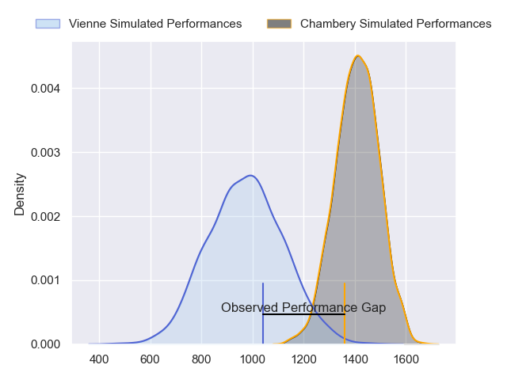
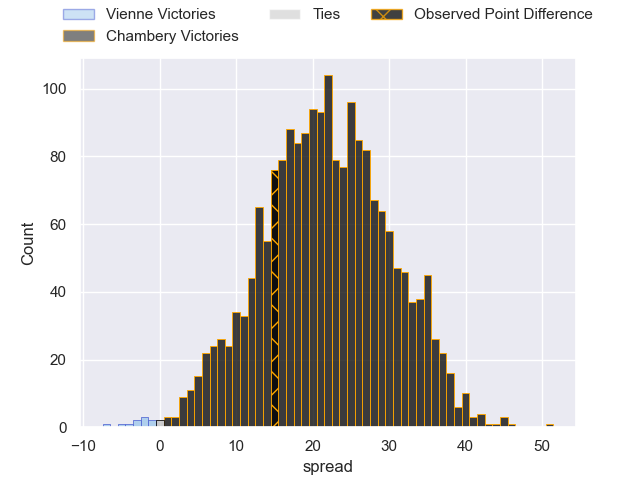
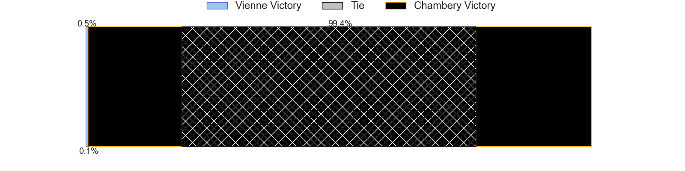
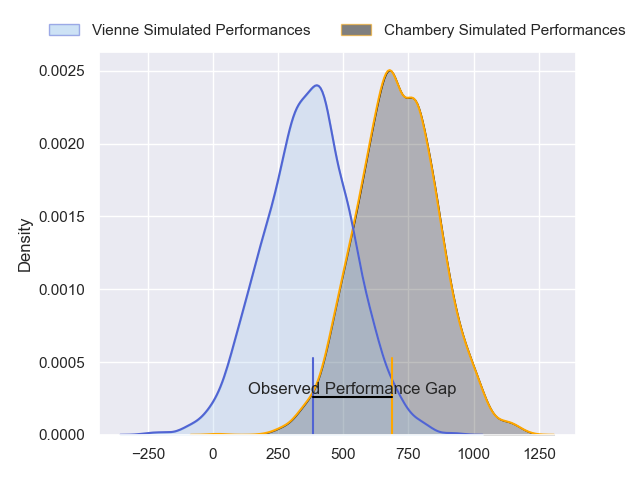
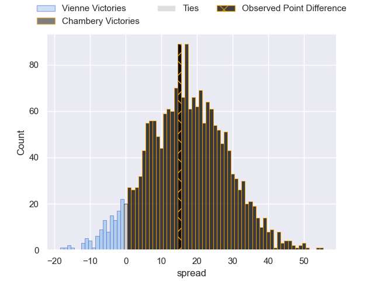
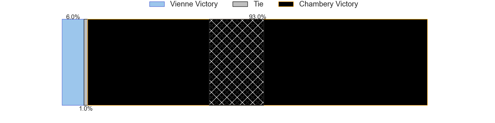
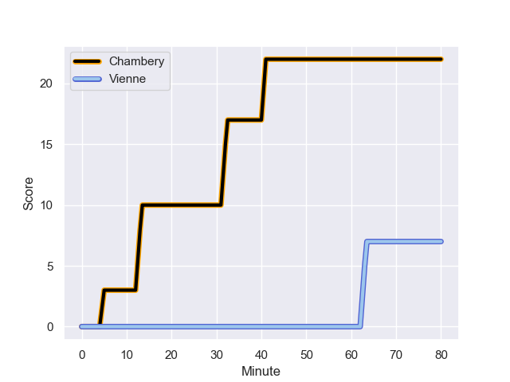
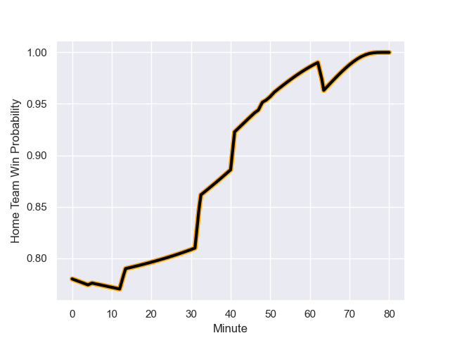

---  
layout: page  
title: Vienne at Chambery; 7-22  
date: 2023-12-01 18:00:00 -0500  
categories: "Nationale 2023" match review  
---
# Vienne at Chambery; 7-22

# Club Level Predictions

The first set of predictions treats a club as the smallest object, as the club develops its members, organizes a gameplan, and deploys its players as needed for each match. This club model has a prediction of 0.907, which translates to predicting Chambery to win by 21.7.

Each club has a rating and a rating deviation (similar to a Glicko rating), and expected performances can be generated. This allows for simulated matches and spreads like the ones below.
## Projected Performances - Club Model

## Projected Spreads - Club Model

## Projected Results - Club Model

# Player Level Predictions - Version 2

Treating teams instead as an entity made up of the currently active players, I have ratings for each player in an altogether different system. These can be combined to form team ratings once teamsheets are announced, weighting starters a bit higher than the reserves. After the match is played, players can be weighted by their minutes on the field, allowing for an accurate measure of the team's composition. With these compiled team ratings, we can make predictions, measure inaccuracy, and update the individual player ratings.
## Prediction with Player Minutes: Chambery by 14.0

Chambery by 10.8 on a neutral field
## Prediction without Player Minutes: Chambery by 13.6

Chambery by 10.3 on a neutral pitch

## Projected Performances - Player Model

## Projected Spreads - Player Model

## Projected Results - Player Model

## Scores over Time

## Win Probability over Time

There were 2 large changes in win probability in this match

|   Away Minutes | Away Player              |   Away elo |   Number |   Home elo | Home Player                  |   Home Minutes |
|---------------:|:-------------------------|-----------:|---------:|-----------:|:-----------------------------|---------------:|
|             49 | Romain Eliot             |      30.96 |        1 |      44.5  | Enzo Segui                   |             51 |
|             49 | Yanis Gimenez            |      44.14 |        2 |      42.91 | Julien Primault              |             57 |
|             80 | Pierre-Mathieu Fernandes |      26.54 |        3 |      45.38 | Nail Audoire                 |             57 |
|             80 | Ciaran O'Flynn           |      16.59 |        4 |      40.29 | Fabien Witz                  |             51 |
|             64 | Geoffrey Nouhaillaguet   |       2.31 |        5 |      45.17 | Steyl Barnard                |             80 |
|             80 | Léon Peyrat              |      24.61 |        6 |      34.87 | Colin Lebian                 |             80 |
|             80 | Charles Massot           |      21.17 |        7 |      49.21 | Ahmed Tidiane Kane           |             80 |
|             80 | Guillaume Moroldo        |      23.78 |        8 |      52.01 | Tui Uru                      |             57 |
|             80 | Malory Piet              |      13.29 |        9 |      28.46 | Thibault Dufau               |             80 |
|             80 | Julien Hervouet          |      31.53 |       10 |      38.51 | Jean-Luc Alewyn Cilliers     |             51 |
|             80 | Antoine Grange           |      22.75 |       11 |      26.92 | Paul Baptiste Florent Altier |             80 |
|             60 | Anzize Said Omar         |      24.8  |       12 |      48.18 | Bastien Reymond              |             80 |
|             80 | Pierre Mollard           |      13.54 |       13 |      45.57 | Emmanuel Vaitulukina         |             80 |
|             80 | Martin Arfi              |      33.21 |       14 |      41.06 | Va'aufauese Apelu Maliko     |             47 |
|             48 | Matteo Genin             |      39.63 |       15 |      43.38 | Thomas Hecquet               |             80 |
|             32 | Tom Richard              |      14.12 |       16 |      36.46 | Maewen Sao                   |             33 |
|             31 | Pierre Bourquin          |      36.95 |       17 |      36.51 | Samuel Boissinot             |             29 |
|             31 | Loïc Reynaud             |      45.38 |       18 |      52.61 | Nugzar Somkhishvili          |             29 |
|             20 | Matthias Giovale         |      22.47 |       19 |      49.86 | Corentin Astier              |             29 |
|             16 | Antoine Frambourg        |      38.9  |       20 |      47.75 | Giorgi Pertaia               |             23 |
|            nan | nan                      |     nan    |       21 |      48.63 | Gauthier Brute de Remur      |             23 |
|            nan | nan                      |     nan    |       22 |      40.58 | Thomas Coignat               |             23 |

