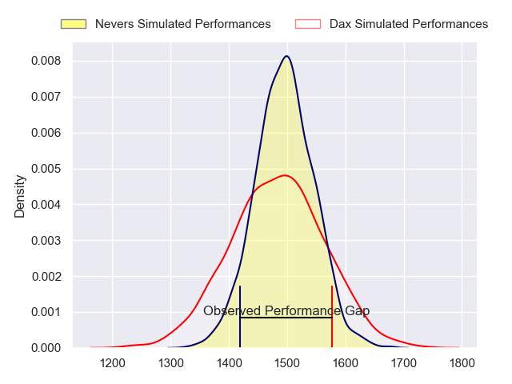
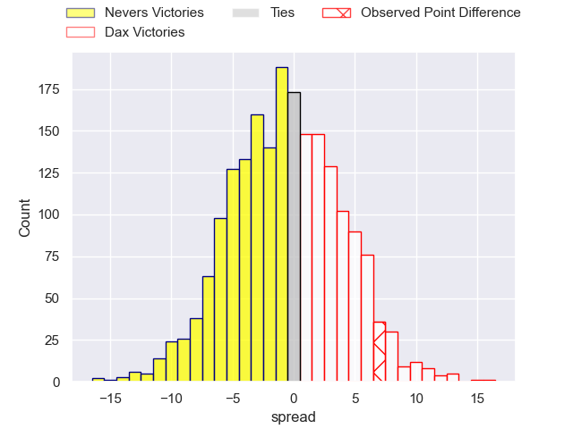
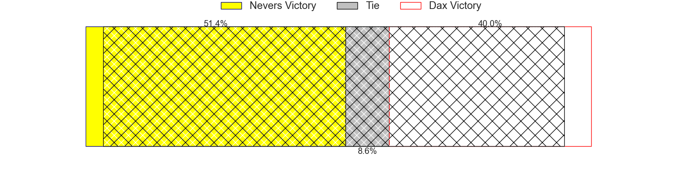
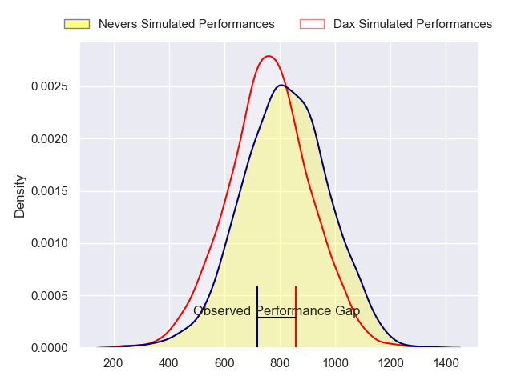
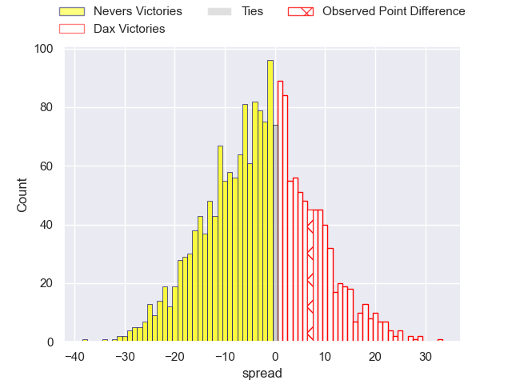
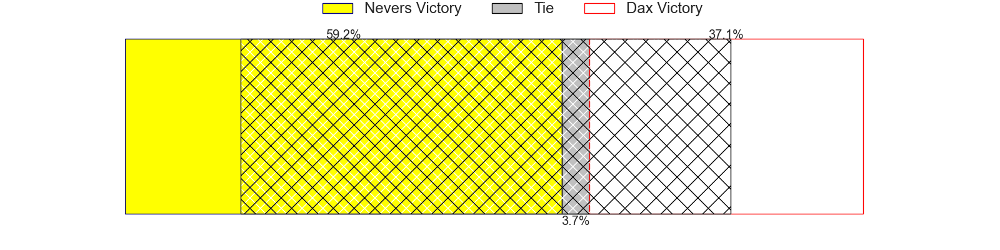
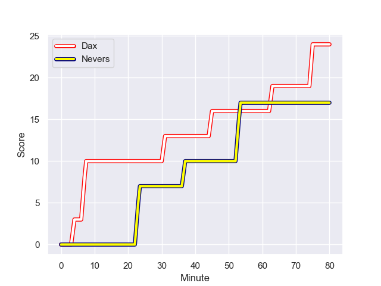
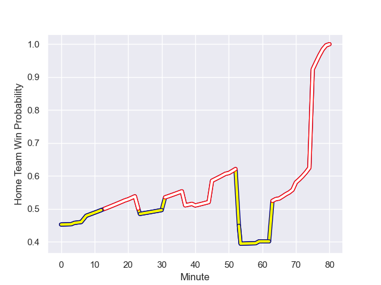

---  
layout: page  
title: Nevers at Dax; 17-24  
date: 2023-12-01 18:00:00 -0500  
categories: "Pro D2 2023" match review  
---
# Nevers at Dax; 17-24

# Club Level Predictions

The first set of predictions treats a club as the smallest object, as the club develops its members, organizes a gameplan, and deploys its players as needed for each match. This club model has a prediction of 0.481, which translates to predicting Nevers to win by 0.7.

Each club has a rating and a rating deviation (similar to a Glicko rating), and expected performances can be generated. This allows for simulated matches and spreads like the ones below.
## Projected Performances - Club Model

## Projected Spreads - Club Model

## Projected Results - Club Model

# Player Level Predictions - Version 2

Treating teams instead as an entity made up of the currently active players, I have ratings for each player in an altogether different system. These can be combined to form team ratings once teamsheets are announced, weighting starters a bit higher than the reserves. After the match is played, players can be weighted by their minutes on the field, allowing for an accurate measure of the team's composition. With these compiled team ratings, we can make predictions, measure inaccuracy, and update the individual player ratings.
## Prediction with Player Minutes: Nevers by 2.1

Nevers by 6.6 on a neutral field
## Prediction without Player Minutes: Nevers by 1.7

Nevers by 6.2 on a neutral pitch

## Projected Performances - Player Model

## Projected Spreads - Player Model

## Projected Results - Player Model

## Scores over Time

## Win Probability over Time

There were 8 large changes in win probability in this match

|   Away Minutes | Away Player              |   Away elo |   Number |   Home elo | Home Player           |   Home Minutes |
|---------------:|:-------------------------|-----------:|---------:|-----------:|:----------------------|---------------:|
|             53 | Tornike Mataradze        |      58.6  |        1 |      55.67 | Louis Mary            |             50 |
|             68 | Elia Elia                |      47.12 |        2 |      48.2  | Maxime Delonca        |             50 |
|             53 | Cleopas Kundiona         |      42.72 |        3 |      31.04 | Nephi Leatigaga       |             50 |
|             80 | Christiaan van der Merwe |       7.31 |        4 |      20.9  | Josh Furno            |             80 |
|             57 | Makatuki Polutele        |      34.83 |        5 |      17.25 | Jean-Baptiste Singer  |             50 |
|             59 | Hugues Bastide           |      75.77 |        6 |      53.84 | Arnaud Aletti         |             80 |
|             53 | Steven David             |      50.87 |        7 |      44.89 | Théo Tremeau          |             40 |
|             80 | Jason-Colin Fraser       |      86.55 |        8 |      46.65 | Sam Wasley            |             80 |
|             65 | Guillaume Manevy         |      34.61 |        9 |      50.25 | Sylvère Reteau        |             20 |
|             80 | Yohan Le Bourhis         |      51.67 |       10 |      40.19 | Romuald Séguy         |             80 |
|             80 | Arthur Mathiron          |      54.02 |       11 |      46.46 | Jope Naceava          |             80 |
|             70 | Rudy Derrieux            |      60.22 |       12 |      46.25 | Ilikena Bolakoro      |             65 |
|             80 | Leonard Paris            |      67.79 |       13 |      70.61 | Hugo Fourquet         |             80 |
|             80 | Christian Ambadiang      |      58.89 |       14 |      21.35 | Maxime Oltmann        |             80 |
|             80 | Kylian Jaminet           |      70.61 |       15 |      52.38 | Théo Duprat           |             65 |
|             27 | Aitor Kitutu             |      56.08 |       16 |      49.03 | Paul Ravier           |             60 |
|             27 | Luka Plataret            |      49.4  |       17 |      35.09 | Jean-Baptiste Barrère |             40 |
|             27 | Farai Mudariki           |      38.5  |       18 |      49.25 | Iban Hiriart-Urruty   |             30 |
|             23 | Will Skelton             |      93.44 |       19 |      53.25 | Thibaud Dréan         |             30 |
|             21 | Julien Kazubek           |      65.52 |       20 |      49.77 | Mat Luamanu           |             30 |
|             15 | Tanguy Ménoret           |      55.51 |       21 |      26.82 | David Lolohea         |             30 |
|             12 | Quentin Beaudaux         |      51.46 |       22 |      53.21 | Hugo Cerisier         |             15 |
|             10 | Thomas Zenon             |      23.63 |       23 |      57.48 | Bastien Daguerre      |             15 |

