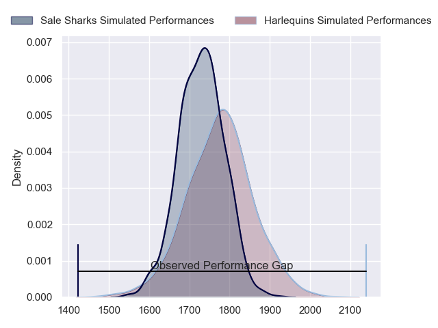
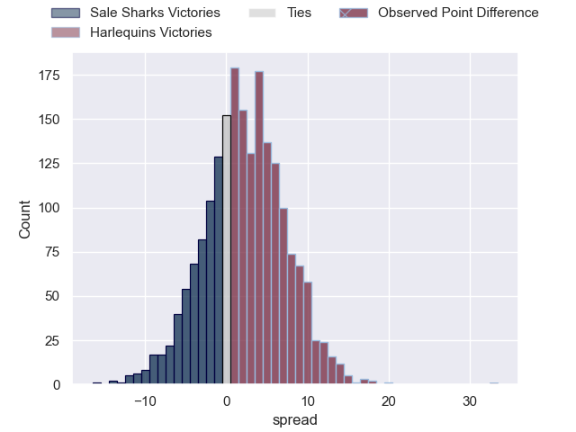
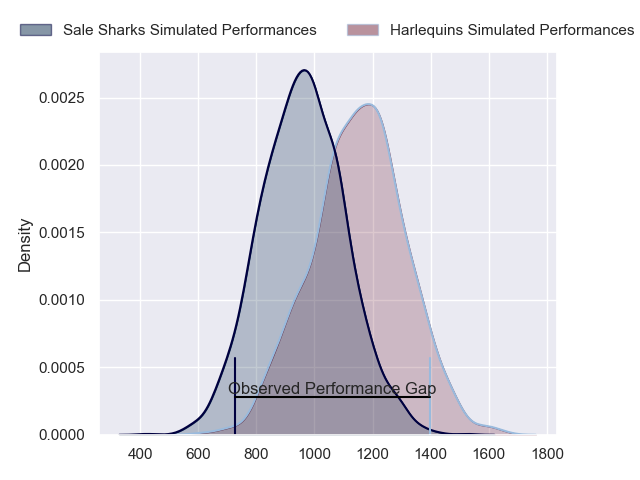
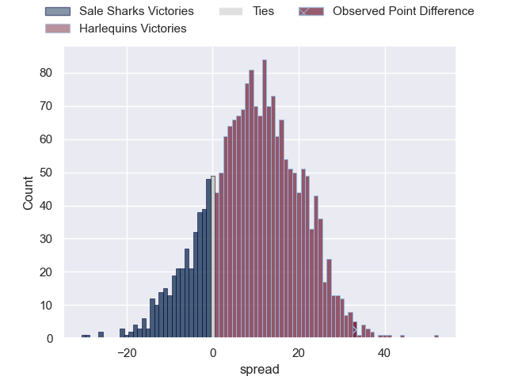
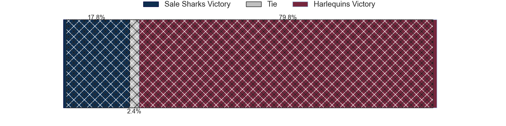
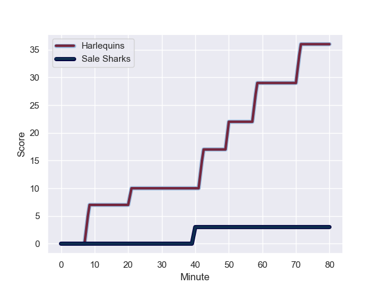
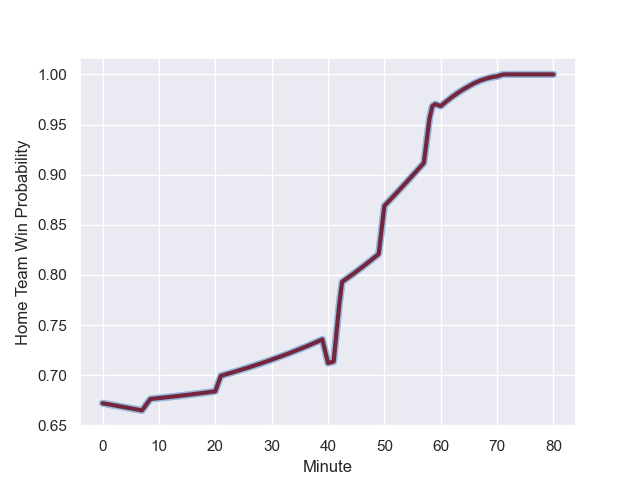

---  
layout: page  
title: Sale Sharks at Harlequins; 3-36  
date: 2023-12-01 18:00:00 -0500  
categories: "Gallagher Premiership 2023" match review  
---
# Sale Sharks at Harlequins; 3-36

# Club Level Predictions

The first set of predictions treats a club as the smallest object, as the club develops its members, organizes a gameplan, and deploys its players as needed for each match. This club model has a prediction of 0.561, which translates to predicting Harlequins to win by 2.2.

Each club has a rating and a rating deviation (similar to a Glicko rating), and expected performances can be generated. This allows for simulated matches and spreads like the ones below.
## Projected Performances - Club Model

## Projected Spreads - Club Model

## Projected Results - Club Model

# Player Level Predictions - Version 2

Treating teams instead as an entity made up of the currently active players, I have ratings for each player in an altogether different system. These can be combined to form team ratings once teamsheets are announced, weighting starters a bit higher than the reserves. After the match is played, players can be weighted by their minutes on the field, allowing for an accurate measure of the team's composition. With these compiled team ratings, we can make predictions, measure inaccuracy, and update the individual player ratings.
## Prediction with Player Minutes: Harlequins by 7.9

Harlequins by 3.1 on a neutral field
## Prediction without Player Minutes: Harlequins by 7.9

Harlequins by 3.1 on a neutral pitch

## Projected Performances - Player Model

## Projected Spreads - Player Model

## Projected Results - Player Model

## Scores over Time

## Win Probability over Time

There were 3 large changes in win probability in this match

|   Away Minutes | Away Player       |   Away elo |   Number |   Home elo | Home Player               |   Home Minutes |
|---------------:|:------------------|-----------:|---------:|-----------:|:--------------------------|---------------:|
|             50 | Simon McIntyre    |      77    |        1 |      98.23 | Joe Marler                |             60 |
|             50 | Luke Cowan-Dickie |      75.19 |        2 |      48.52 | Sam Riley                 |             66 |
|             50 | Nic Schonert      |      29.59 |        3 |      80.55 | Dillon Lewis              |             60 |
|             80 | Cobus Wiese       |      73.55 |        4 |     101.74 | Joe Launchbury            |             72 |
|             80 | Jonny Hill        |      44.18 |        5 |      73.96 | Dino Lamb                 |             80 |
|             80 | Ernst van Rhyn    |      84.24 |        6 |      50.01 | Chandler Cunningham-South |             60 |
|             40 | Ben Curry         |      53.08 |        7 |      51.86 | Will Evans                |             80 |
|             66 | Daniel du Preez   |      87.32 |        8 |      68.18 | Alex Dombrandt            |             80 |
|             50 | Gus Warr          |      44.73 |        9 |     133.74 | Danny Care                |             70 |
|             67 | George Ford       |     103.06 |       10 |      72.99 | Marcus Smith              |             70 |
|             60 | Arron Reed        |      68.13 |       11 |      38.73 | Cadan Murley              |             80 |
|             80 | Sam Bedlow        |      69.05 |       12 |     102.29 | Andre Esterhuizen         |             80 |
|             80 | Robert du Preez   |      57.24 |       13 |      57.52 | Will Joseph               |             80 |
|             80 | Tom Roebuck       |      57.38 |       14 |      36.04 | Nick David                |             80 |
|             80 | Joe Carpenter     |      36.01 |       15 |      62.94 | Tyrone Green              |             66 |
|             30 | Ross Harrison     |      72.93 |       16 |      32.86 | Fin Baxter                |             20 |
|             30 | Agustin Creevy    |      96.03 |       17 |      52.74 | Nathan Jibulu             |             14 |
|             30 | Asher Opoku       |      46.9  |       18 |      33.32 | Lovejoy Chawatama         |             20 |
|             40 | Sam Dugdale       |      40.02 |       19 |      57.77 | Irne Herbst               |              8 |
|             14 | Josh Beaumont     |      62.91 |       20 |      75.64 | James Chisholm            |             20 |
|             30 | Raffi Quirke      |      50.32 |       21 |      36.48 | Will Porter               |             10 |
|             13 | Sam James         |      91.06 |       22 |      82.91 | Jarrod Evans              |             10 |
|             20 | Tom O'Flaherty    |      76.8  |       23 |      50.73 | Oscar Beard               |             14 |

