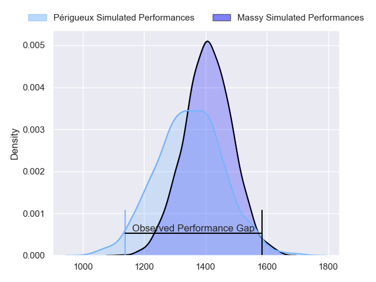
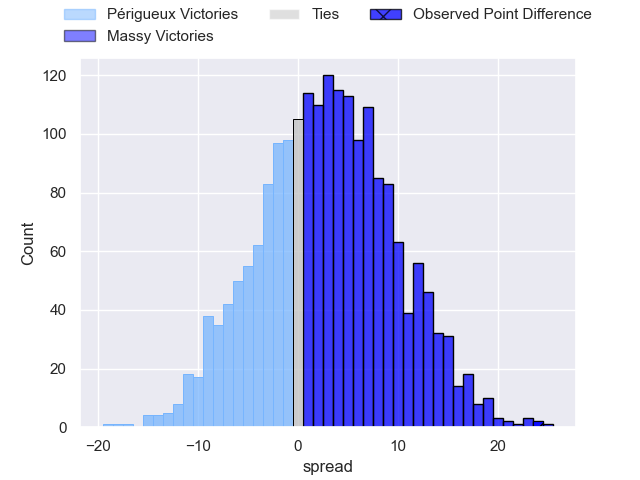
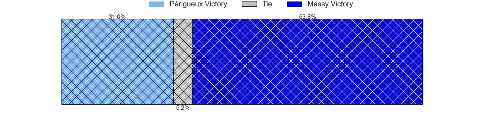
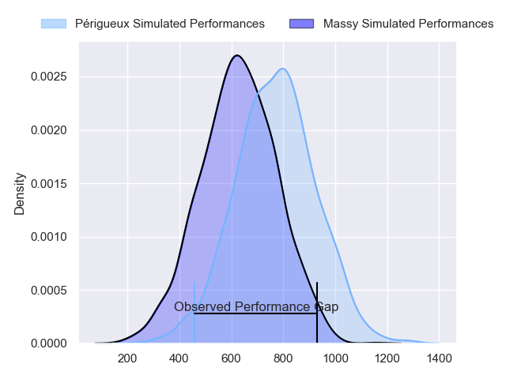
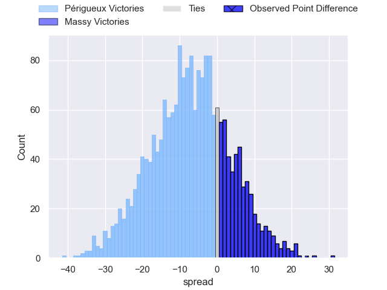
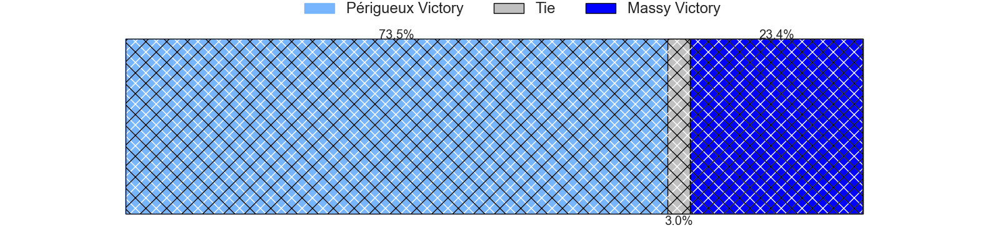
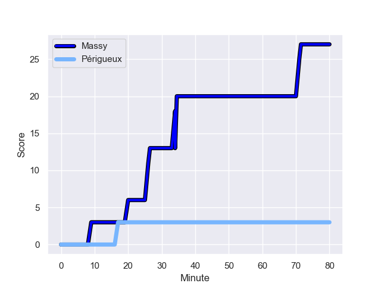
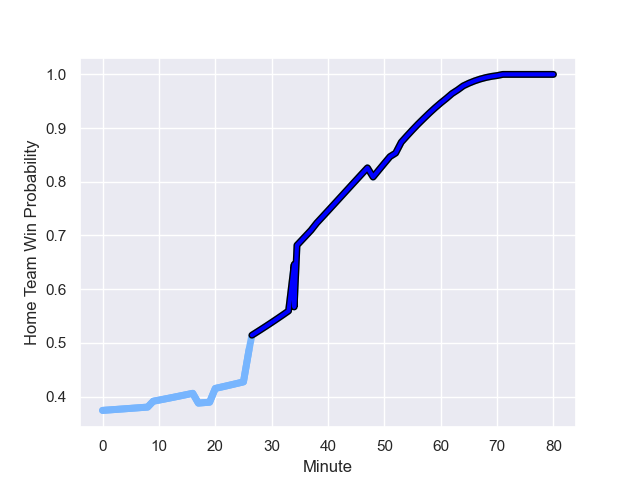

---  
layout: page  
title: Perigueux at Massy; 3-27  
date: 2023-12-01 18:00:00 -0500  
categories: "Nationale 2023" match review  
---
# Perigueux at Massy; 3-27

# Club Level Predictions

The first set of predictions treats a club as the smallest object, as the club develops its members, organizes a gameplan, and deploys its players as needed for each match. This club model has a prediction of 0.579, which translates to predicting Massy to win by 2.9.

Each club has a rating and a rating deviation (similar to a Glicko rating), and expected performances can be generated. This allows for simulated matches and spreads like the ones below.
## Projected Performances - Club Model

## Projected Spreads - Club Model

## Projected Results - Club Model

# Player Level Predictions - Version 2

Treating teams instead as an entity made up of the currently active players, I have ratings for each player in an altogether different system. These can be combined to form team ratings once teamsheets are announced, weighting starters a bit higher than the reserves. After the match is played, players can be weighted by their minutes on the field, allowing for an accurate measure of the team's composition. With these compiled team ratings, we can make predictions, measure inaccuracy, and update the individual player ratings.
## Prediction with Player Minutes: Périgueux by 5.7

Périgueux by 9.3 on a neutral field
## Prediction without Player Minutes: Périgueux by 4.4

Périgueux by 8.1 on a neutral pitch

## Projected Performances - Player Model

## Projected Spreads - Player Model

## Projected Results - Player Model

## Scores over Time

## Win Probability over Time

There were 6 large changes in win probability in this match

|   Away Minutes | Away Player      |   Away elo |   Number |   Home elo | Home Player          |   Home Minutes |
|---------------:|:-----------------|-----------:|---------:|-----------:|:---------------------|---------------:|
|             53 | Thomas Vidal     |      54.69 |        1 |       4.31 | Fernandez Correa     |             52 |
|             62 | Lucas Marijon    |      54.9  |        2 |      69.88 | Pierre Trassoudaine  |             52 |
|             53 | Anthony Pelmard  |      48.39 |        3 |      44.21 | Tijde Visser         |             52 |
|             80 | Madioke Konate   |      34.2  |        4 |      58.75 | Saba Pesvianidze     |             48 |
|             53 | Jaco Willemse    |      35.52 |        5 |       5.22 | Andrei Mahu          |             80 |
|             80 | Marius Vialle    |      30.84 |        6 |      41.38 | Hugo Boutin          |             38 |
|             80 | Afaesetiti Amosa |      75.45 |        7 |      54.32 | Alexandre Loubiere   |             80 |
|             64 | Richard Fourcade |      37.02 |        8 |      26.98 | Samuel Nollet        |             80 |
|             64 | Enzo Hardy       |      43.26 |        9 |      32.98 | Benjamin Prier       |             57 |
|             62 | Greg Hutley      |      52.57 |       10 |      22.37 | Hugo Verdu           |             80 |
|             80 | Axel Muller      |      67.87 |       11 |      59.54 | Martin Carre         |             57 |
|             80 | Fred Hickes      |      72.23 |       12 |      55.72 | Victorien Jacomme    |             80 |
|             80 | Cyril Couturier  |      62.25 |       13 |      50.56 | Arthur Seigneuret    |             80 |
|             80 | Paul Piveteau    |      49.13 |       14 |      25.23 | Yanis Dit Robaglia   |             57 |
|             80 | Rory Scholes     |      63.01 |       15 |      38.19 | Giorgi Gogoladze     |             80 |
|             27 | Jason Tindiliere |      42.75 |       16 |      46.13 | Nicolas Ferrer       |             28 |
|             18 | Louis Martin     |      56.37 |       17 |      46.65 | Charif Mansour       |             28 |
|             27 | Matias Dittus    |      27.44 |       18 |      11.82 | Mike Tadjer          |             28 |
|             27 | Damien Lavergne  |      48.44 |       19 |       3.34 | Abongile Nonkontwana |             32 |
|             16 | Karl Lambert     |      45.13 |       20 |      44.07 | Clément Vidoni       |             42 |
|             18 | Yann Caillat     |      40.74 |       21 |      21.25 | Lucas Rubio          |             23 |
|             16 | Nicolas Faltrept |      14.65 |       22 |     -13.24 | Kimami Sitauti       |             23 |
|            nan | nan              |     nan    |       23 |      36.01 | Tom Deleuze          |             23 |

