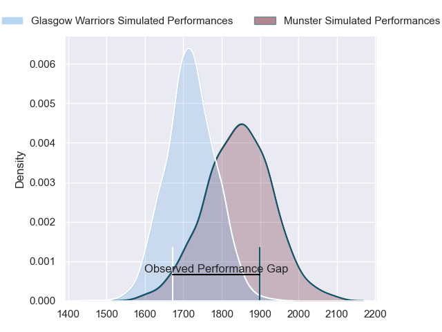
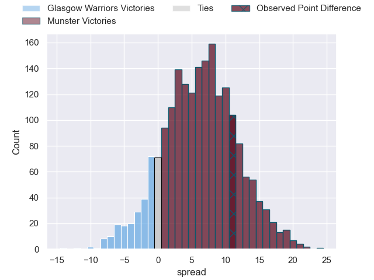
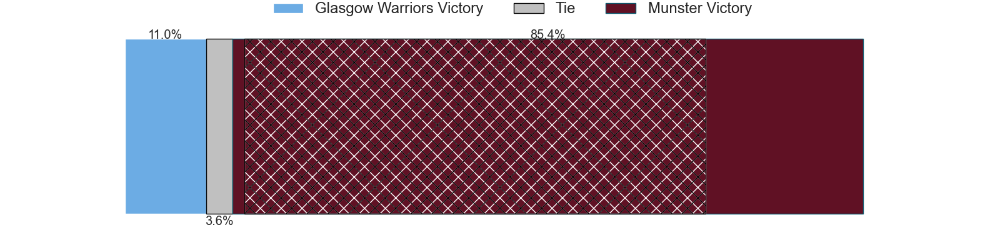
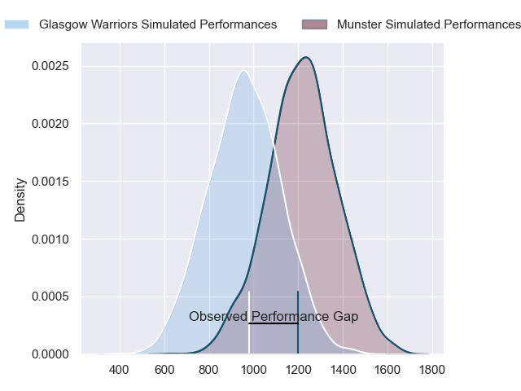
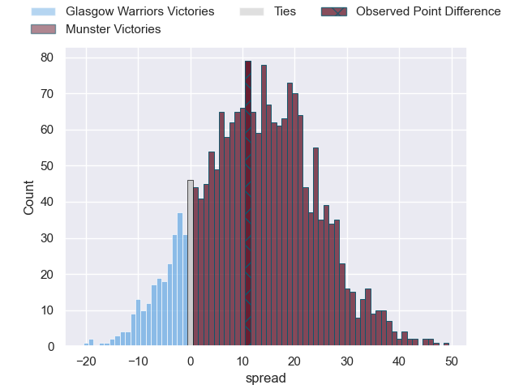
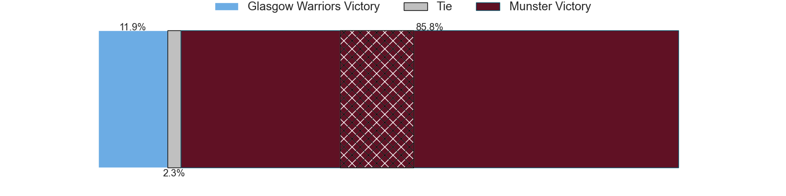
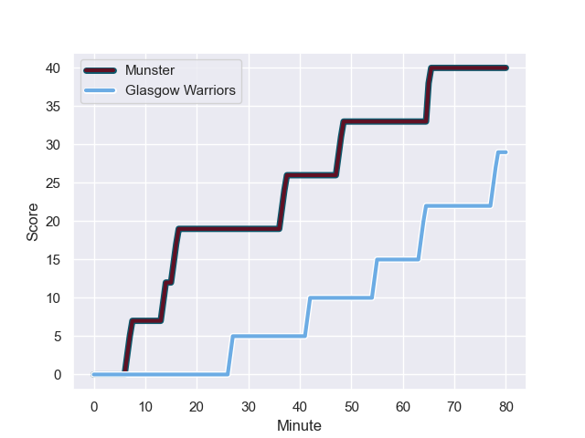
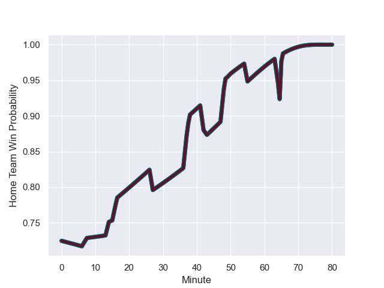

---  
layout: page  
title: Glasgow Warriors at Munster; 29-40  
date: 2023-12-01 18:00:00 -0500  
categories: "United Rugby Championship 2023" match review  
---
# Glasgow Warriors at Munster; 29-40

# Club Level Predictions

The first set of predictions treats a club as the smallest object, as the club develops its members, organizes a gameplan, and deploys its players as needed for each match. This club model has a prediction of 0.675, which translates to predicting Munster to win by 6.5.

Each club has a rating and a rating deviation (similar to a Glicko rating), and expected performances can be generated. This allows for simulated matches and spreads like the ones below.
## Projected Performances - Club Model

## Projected Spreads - Club Model

## Projected Results - Club Model

# Player Level Predictions - Version 2

Treating teams instead as an entity made up of the currently active players, I have ratings for each player in an altogether different system. These can be combined to form team ratings once teamsheets are announced, weighting starters a bit higher than the reserves. After the match is played, players can be weighted by their minutes on the field, allowing for an accurate measure of the team's composition. With these compiled team ratings, we can make predictions, measure inaccuracy, and update the individual player ratings.
## Prediction with Player Minutes: Munster by 10.7

Munster by 6.4 on a neutral field
## Prediction without Player Minutes: Munster by 10.3

Munster by 6.0 on a neutral pitch

## Projected Performances - Player Model

## Projected Spreads - Player Model

## Projected Results - Player Model

## Scores over Time

## Win Probability over Time

There were 6 large changes in win probability in this match

|   Away Minutes | Away Player       |   Away elo |   Number |   Home elo | Home Player      |   Home Minutes |
|---------------:|:------------------|-----------:|---------:|-----------:|:-----------------|---------------:|
|             50 | Nathan McBeth     |      47.92 |        1 |      81.39 | Jeremy Loughman  |             52 |
|             71 | Johnny Matthews   |      41.4  |        2 |      78.49 | Diarmuid Barron  |             43 |
|             61 | Lucio Sordoni     |      73.11 |        3 |     100.78 | Stephen Archer   |             52 |
|             50 | Sintu Manjezi     |      52.02 |        4 |      44.74 | Edwin Edogbo     |             61 |
|             80 | Scott Cummings    |     110.62 |        5 |     134.21 | Tadhg Beirne     |             80 |
|             75 | Sione Vailanu     |      47.62 |        6 |      58.78 | Thomas Ahern     |             56 |
|             80 | Rory Darge        |      68.9  |        7 |      68.8  | John Hodnett     |             80 |
|             50 | Henco Venter      |      98.69 |        8 |      73.3  | Gavin Coombes    |             80 |
|             71 | Sean Kennedy      |      55.32 |        9 |      67.12 | Craig Casey      |             60 |
|             80 | Duncan Weir       |      64.11 |       10 |      53.77 | Jack Crowley     |             69 |
|             38 | Ollie Smith       |      79.6  |       11 |      31.45 | Sean O'Brien     |             80 |
|             80 | Stafford McDowall |      81.27 |       12 |      84.49 | Alex Nankivell   |             80 |
|             80 | Sione Tuipulotu   |      53.77 |       13 |      64.66 | Antoine Frisch   |             80 |
|             80 | Kyle Rowe         |      60.42 |       14 |      85.01 | Calvin Nash      |             80 |
|             80 | Josh McKay        |      45.79 |       15 |      92.3  | Shane Daly       |             80 |
|             42 | Tom Jordan        |      50.46 |       16 |      47.13 | Scott Buckley    |             37 |
|             30 | Oli Kebble        |      89.71 |       17 |      82.3  | Dave Kilcoyne    |             28 |
|             30 | Max Williamson    |      40.63 |       18 |      76    | Oli Jager        |             28 |
|             30 | Greg Peterson     |      20.56 |       19 |      56.59 | Alex Kendellen   |             24 |
|             19 | Zander Fagerson   |     113.07 |       20 |     112.24 | Conor Murray     |             20 |
|              9 | Ben Afshar        |      46.73 |       21 |      40.66 | Fineen Wycherley |             19 |
|              9 | Angus Fraser      |      45.98 |       22 |     103.74 | Rory Scannell    |             11 |
|              5 | Tom Gordon        |      87.34 |       23 |     nan    | nan              |            nan |

