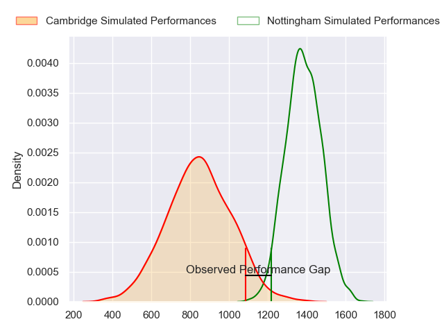
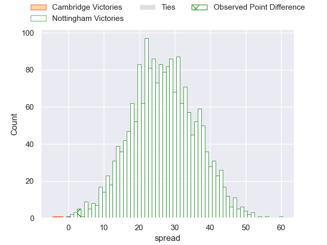
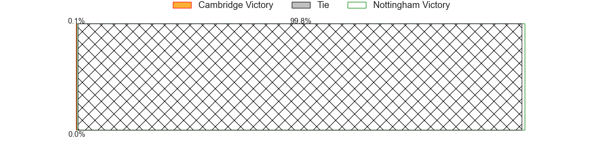
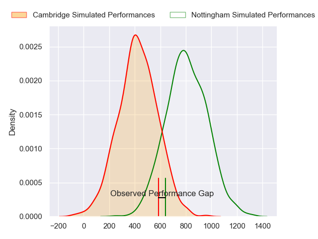
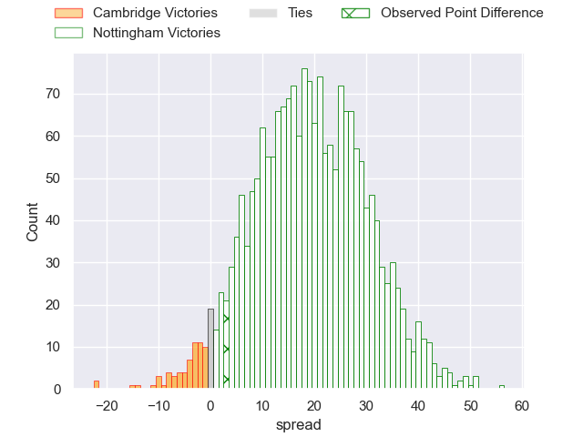
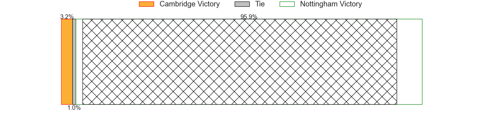
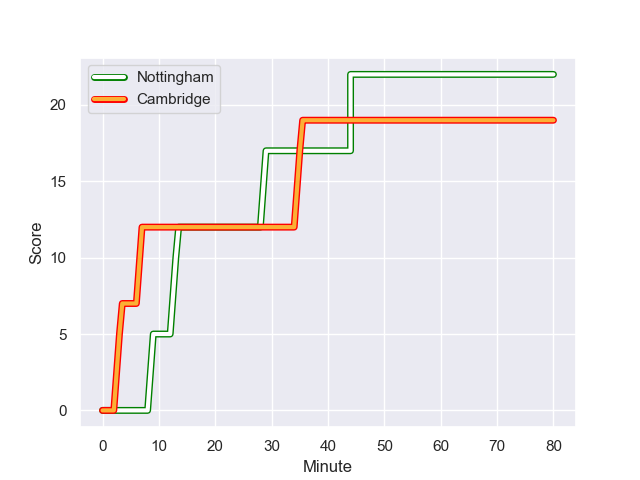
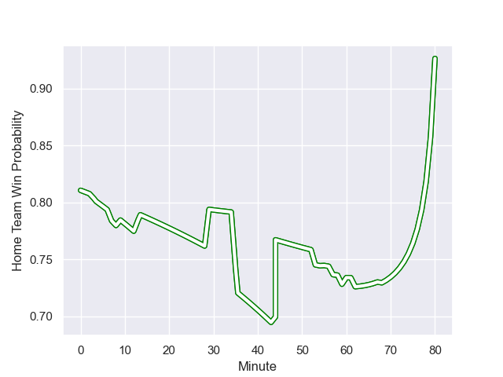

---  
layout: page  
title: Cambridge at Nottingham; 19-22  
date: 2023-12-01 18:00:00 -0500  
categories: "RFU Championship 2023" match review  
---
# Cambridge at Nottingham; 19-22

# Club Level Predictions

The first set of predictions treats a club as the smallest object, as the club develops its members, organizes a gameplan, and deploys its players as needed for each match. This club model has a prediction of 0.939, which translates to predicting Nottingham to win by 26.6.

Each club has a rating and a rating deviation (similar to a Glicko rating), and expected performances can be generated. This allows for simulated matches and spreads like the ones below.
## Projected Performances - Club Model

## Projected Spreads - Club Model

## Projected Results - Club Model

# Player Level Predictions - Version 2

Treating teams instead as an entity made up of the currently active players, I have ratings for each player in an altogether different system. These can be combined to form team ratings once teamsheets are announced, weighting starters a bit higher than the reserves. After the match is played, players can be weighted by their minutes on the field, allowing for an accurate measure of the team's composition. With these compiled team ratings, we can make predictions, measure inaccuracy, and update the individual player ratings.
## Prediction with Player Minutes: Nottingham by 16.0

Nottingham by 12.6 on a neutral field
## Prediction without Player Minutes: Nottingham by 15.7

Nottingham by 12.3 on a neutral pitch

## Projected Performances - Player Model

## Projected Spreads - Player Model

## Projected Results - Player Model

## Scores over Time

## Win Probability over Time

There were 5 large changes in win probability in this match

|   Away Minutes | Away Player          |   Away elo |   Number |   Home elo | Home Player               |   Home Minutes |
|---------------:|:---------------------|-----------:|---------:|-----------:|:--------------------------|---------------:|
|             44 | Huw Owen             |      48.15 |        1 |      54.35 | Kai Owen                  |             55 |
|             59 | Morgan Veness        |      23.45 |        2 |      45.77 | Jack Dickinson            |             60 |
|             62 | Billy Walker         |      26.47 |        3 |      53.24 | Dan Richardson            |             55 |
|             80 | Kieran Frost         |      26.58 |        4 |     -10.83 | Sebastien Ferreira        |             70 |
|             55 | Gareth Baxter        |      39.76 |        5 |      51.41 | Come Clayver Joussain     |             80 |
|             57 | Ben Adams            |       3.34 |        6 |      59.67 | Iosefa Danny Wayne Fiaola |             80 |
|             80 | Matthew Dawson       |      35.16 |        7 |      60.16 | Nathan Tweedy             |             80 |
|             80 | Geordie Irvine       |      31.09 |        8 |      53.49 | James Cherry              |             53 |
|             68 | Sam Edwards          |      29.82 |        9 |      35.28 | Micheal Stronge           |             60 |
|             80 | Jamie Benson         |      20.78 |       10 |      65.14 | Sam Hollingsworth         |             80 |
|             80 | Matthew Hema         |      26.42 |       11 |      59.12 | Jordan Olowofela          |             66 |
|             68 | Sam Hanks            |       3.72 |       12 |      61.38 | Joe Woodward              |             80 |
|             80 | Tom Hoppe            |      40.75 |       13 |      43.17 | Marcus Alexander Ramage   |             80 |
|             80 | Kwaku Asiedu         |      27.22 |       14 |      46.61 | David Williams            |             80 |
|             35 | Elias Caven          |      23.52 |       15 |      61.38 | Ellis Mee                 |             80 |
|             45 | Josef Green          |      32.98 |       16 |      22.32 | Scott Hall                |             27 |
|             36 | Jake Elwood          |      31    |       17 |      53.27 | Archie Van der Flier      |             25 |
|             25 | George Bretag-Norris |      36.24 |       18 |      53.13 | Xavier Valentine          |             25 |
|             23 | Jared Cardew         |      21.35 |       19 |      40.11 | Will Yarnell              |             20 |
|             21 | William Priestley    |      44.35 |       20 |      57.43 | Antonio TJ Harris         |             20 |
|             18 | Harry Morley         |      49.76 |       21 |      -5    | Jack Stapley              |             14 |
|             12 | Steffan James        |      36.92 |       22 |      53.53 | Jack Shine                |             10 |
|             12 | Kieran Duffin        |      34.72 |       23 |     nan    | nan                       |            nan |

