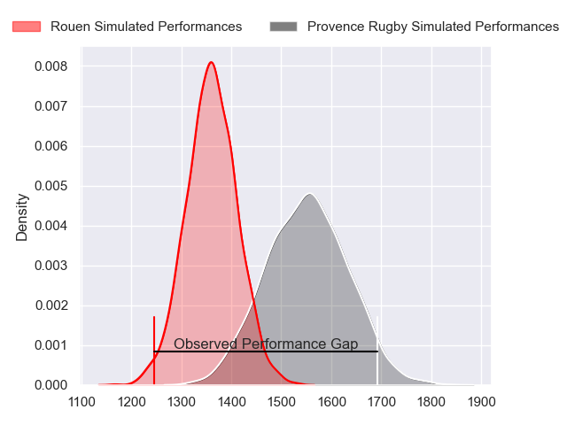
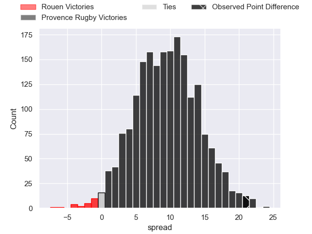
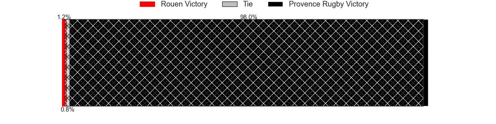
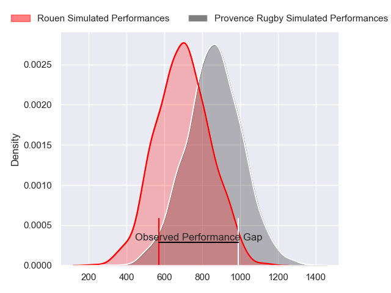
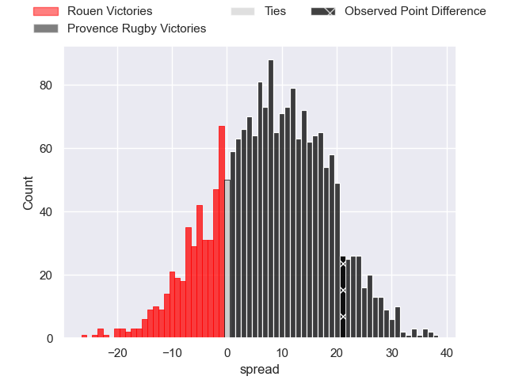
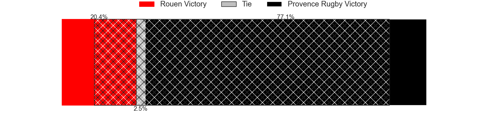
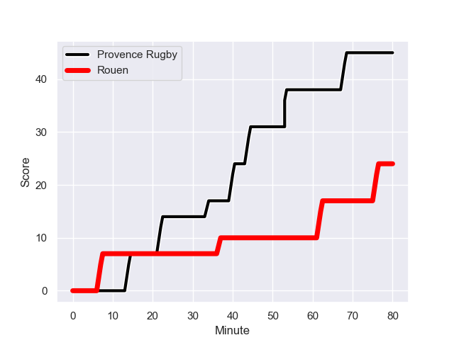
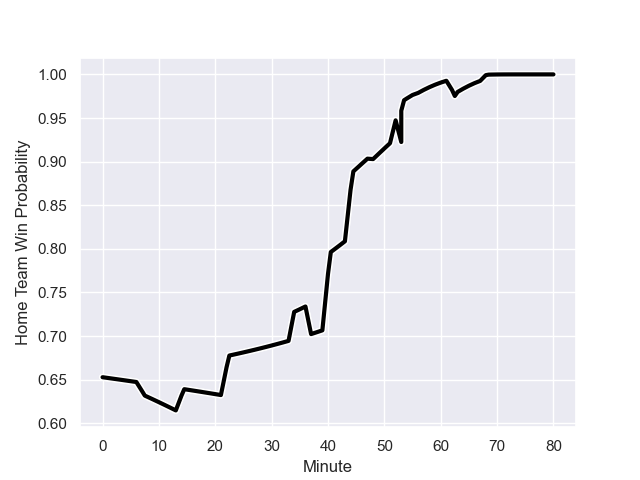

---  
layout: page  
title: Rouen at Provence Rugby; 24-45  
date: 2023-12-01 18:00:00 -0500  
categories: "Pro D2 2023" match review  
---
# Rouen at Provence Rugby; 24-45

# Club Level Predictions

The first set of predictions treats a club as the smallest object, as the club develops its members, organizes a gameplan, and deploys its players as needed for each match. This club model has a prediction of 0.748, which translates to predicting Provence Rugby to win by 9.6.

Each club has a rating and a rating deviation (similar to a Glicko rating), and expected performances can be generated. This allows for simulated matches and spreads like the ones below.
## Projected Performances - Club Model

## Projected Spreads - Club Model

## Projected Results - Club Model

# Player Level Predictions - Version 2

Treating teams instead as an entity made up of the currently active players, I have ratings for each player in an altogether different system. These can be combined to form team ratings once teamsheets are announced, weighting starters a bit higher than the reserves. After the match is played, players can be weighted by their minutes on the field, allowing for an accurate measure of the team's composition. With these compiled team ratings, we can make predictions, measure inaccuracy, and update the individual player ratings.
## Prediction with Player Minutes: Provence Rugby by 6.9

Provence Rugby by 2.9 on a neutral field
## Prediction without Player Minutes: Provence Rugby by 7.5

Provence Rugby by 3.5 on a neutral pitch

## Projected Performances - Player Model

## Projected Spreads - Player Model

## Projected Results - Player Model

## Scores over Time

## Win Probability over Time

There were 8 large changes in win probability in this match

|   Away Minutes | Away Player         |   Away elo |   Number |   Home elo | Home Player           |   Home Minutes |
|---------------:|:--------------------|-----------:|---------:|-----------:|:----------------------|---------------:|
|             52 | Antoine Fournier    |      30.97 |        1 |      47.41 | Federico Wegrzyn      |             53 |
|             57 | Jeremie Maurouard   |       3.1  |        2 |      65.7  | Lucas Martin          |             53 |
|             52 | Cody Thomas         |      39.19 |        3 |     105.19 | Tomas Francis         |             53 |
|             50 | Raphaël Vieilledent |      50.01 |        4 |      15.82 | Theo Hannoyer         |             51 |
|             80 | Jimi Maximin        |      35.02 |        5 |      52.46 | Josh Tyrell           |             80 |
|             48 | Tienie Burger       |      46.66 |        6 |      64.76 | Teimana Harrison      |             80 |
|             80 | Lucas Costa         |      55.63 |        7 |      47.08 | Charly Gambini        |             80 |
|             80 | Julien Ruaud        |      67.76 |        8 |      44.43 | Malohi Suta           |             51 |
|             48 | Florent Campeggia   |      33.12 |        9 |      38.99 | Joris Cazenave        |             56 |
|             80 | Baptiste Mouchous   |      53.36 |       10 |      50.1  | Enzo Selponi          |             56 |
|             80 | Paul Vallee         |      45.48 |       11 |      45.53 | Eto Bainivalu         |             80 |
|             80 | Taylor Gontineac    |      63.9  |       12 |      64.69 | Jimmy Gopperth        |             80 |
|             80 | Pablo Patilla       |      48.08 |       13 |      48.36 | Louis Marrou          |             56 |
|             63 | Kevin Bly           |      80.85 |       14 |      29.78 | Adrien Lapegue-Lafaye |             80 |
|             40 | Pete Lydon          |      47.72 |       15 |      53.51 | Mathias Colombet      |             80 |
|             40 | Franck Pourteau     |      58.57 |       16 |      54.83 | Clément Chartier      |             29 |
|             32 | Maxime Sidobre      |      58.8  |       17 |      74.39 | Bilel Taieb           |             29 |
|             32 | Samuel Maximin      |      25.8  |       18 |      43.91 | Jean Charles Orioli   |             27 |
|             30 | John-Charles Astle  |      17.31 |       19 |      50.42 | Paul Mallez           |             27 |
|             28 | Elias El Ansari     |      27.91 |       20 |      49.92 | Nicolas Toth          |             27 |
|             28 | Soso Bekoshvili     |      57.83 |       21 |      48.66 | Arthur Coville        |             24 |
|             23 | Lucas Malbert       |      37.43 |       22 |      28.11 | Dorian Lavernhe       |             24 |
|             17 | JT Jackson          |      21.8  |       23 |      41.47 | Léo Drouet            |             24 |

