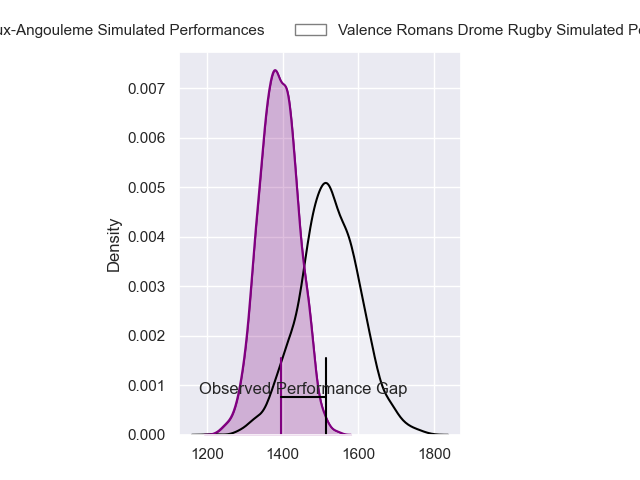
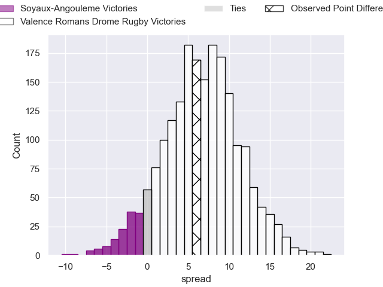
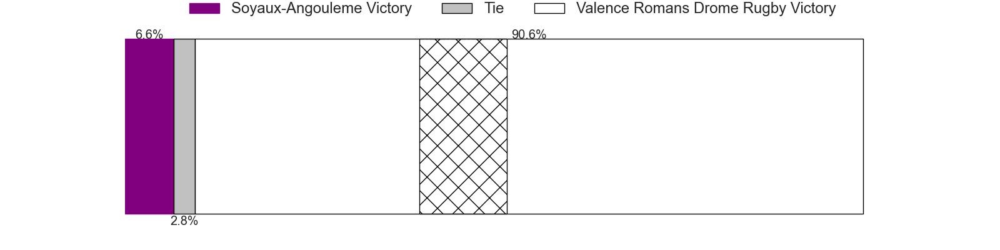
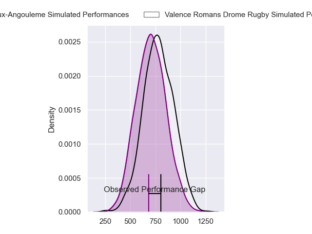
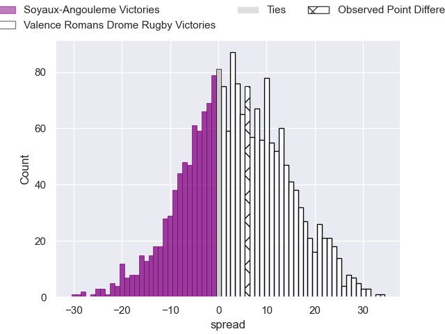
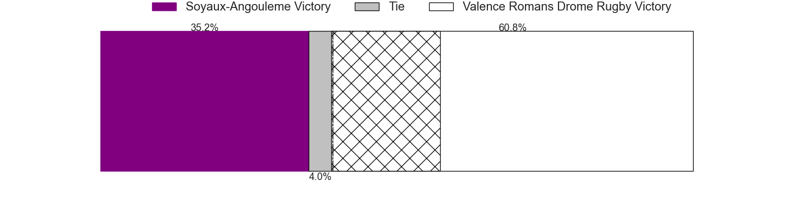
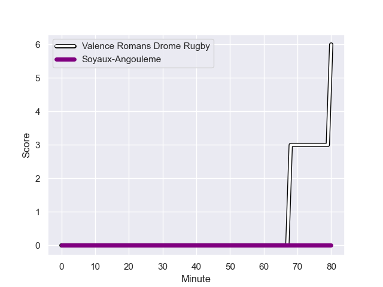
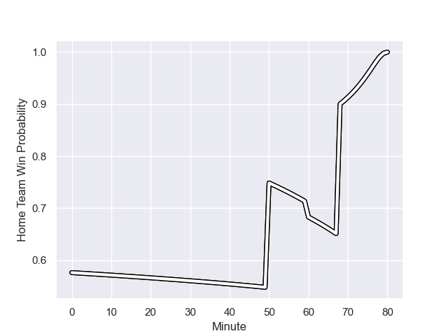

---  
layout: page  
title: Soyaux-Angouleme at Valence Romans Drome Rugby; 0-6  
date: 2023-12-01 18:00:00 -0500  
categories: "Pro D2 2023" match review  
---
# Soyaux-Angouleme at Valence Romans Drome Rugby; 0-6

# Club Level Predictions

The first set of predictions treats a club as the smallest object, as the club develops its members, organizes a gameplan, and deploys its players as needed for each match. This club model has a prediction of 0.677, which translates to predicting Valence Romans Drome Rugby to win by 6.5.

Each club has a rating and a rating deviation (similar to a Glicko rating), and expected performances can be generated. This allows for simulated matches and spreads like the ones below.
## Projected Performances - Club Model

## Projected Spreads - Club Model

## Projected Results - Club Model

# Player Level Predictions - Version 2

Treating teams instead as an entity made up of the currently active players, I have ratings for each player in an altogether different system. These can be combined to form team ratings once teamsheets are announced, weighting starters a bit higher than the reserves. After the match is played, players can be weighted by their minutes on the field, allowing for an accurate measure of the team's composition. With these compiled team ratings, we can make predictions, measure inaccuracy, and update the individual player ratings.
## Prediction with Player Minutes: Valence Romans Drome Rugby by 3.4

Soyaux-Angouleme by 0.1 on a neutral field
## Prediction without Player Minutes: Valence Romans Drome Rugby by 2.2

Soyaux-Angouleme by 1.1 on a neutral pitch

## Projected Performances - Player Model

## Projected Spreads - Player Model

## Projected Results - Player Model

## Scores over Time

## Win Probability over Time

There were 3 large changes in win probability in this match

|   Away Minutes | Away Player            |   Away elo |   Number |   Home elo | Home Player         |   Home Minutes |
|---------------:|:-----------------------|-----------:|---------:|-----------:|:--------------------|---------------:|
|             50 | Sami Zouhair           |      81.58 |        1 |       1.84 | Julien Royer        |             50 |
|             58 | Patxi Bidart           |      45    |        2 |      52.68 | Dorian Marco Pena   |             50 |
|             58 | Yassine Boutemane      |      19.94 |        3 |      57.03 | Kevin Goze          |             50 |
|             80 | Ian Kitwanga           |      46.04 |        4 |      24.32 | Ryan McCauley       |             80 |
|             68 | Sikeli Nabou           |      51.97 |        5 |      49.91 | Florian Goumat      |             60 |
|             80 | Germain Burgaud        |      56.97 |        6 |      23.62 | Axel Bruchet        |             57 |
|             50 | Nicolas Martins        |      58.94 |        7 |      48.43 | Thembelani Bholi    |             80 |
|             80 | Alexander Masibaka     |      42.68 |        8 |      64.59 | Ioane Iashagashvili |             68 |
|             40 | Manu Saubusse          |      53.53 |        9 |      63.51 | Thomas Lhusero      |             76 |
|             52 | Corentin Glenat        |      34.94 |       10 |      20.86 | Lucas Meret         |             80 |
|             80 | Matthys Gratien        |      52.18 |       11 |      59.86 | Mosese Mawalu       |             80 |
|             60 | Nasoni Naqiri Kunavore |      58.79 |       12 |      55.15 | Ben Neiceru         |             80 |
|             80 | Akuila Joeli Tabualevu |      60.99 |       13 |      59.77 | Anatole Pauvert     |             50 |
|             80 | Pierre Lafitte         |      34.51 |       14 |      87.96 | Adam Vargas         |             80 |
|             80 | Rémi Brosset           |      44.93 |       15 |      26.11 | George Worth        |             80 |
|             40 | Adrien Bau             |      11.45 |       16 |      47.25 | Brice Humbert       |             30 |
|             30 | Khatchik Vartanov      |      27.25 |       17 |      51.56 | Andrea Pontanier    |             30 |
|             30 | Hubert Texier          |      48.24 |       18 |      83.8  | Charles Bouldoire   |             30 |
|             28 | Ben Botica             |      56.01 |       19 |      38.11 | Chris Talakai       |             30 |
|             22 | German Kessler         |      48.07 |       20 |      12.08 | Éloi Massot         |             23 |
|             22 | Seydou Diakité         |      36.38 |       21 |      48.3  | Charles Brayer      |             20 |
|             20 | Matt Beukeboom         |      31.99 |       22 |      13.15 | Dylan Hayes         |             12 |
|             12 | Mathis Lafon           |      32.85 |       23 |      65.47 | Tim Menzel          |              4 |

