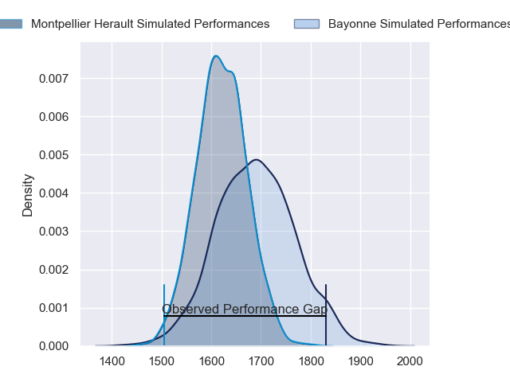
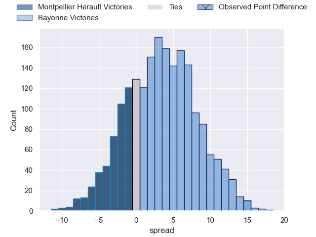
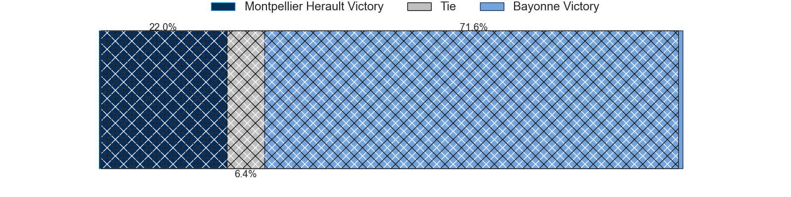
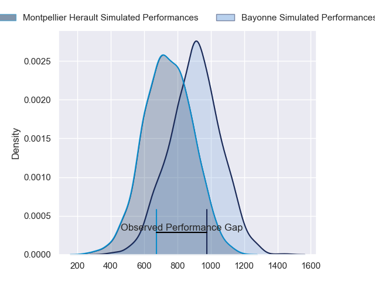
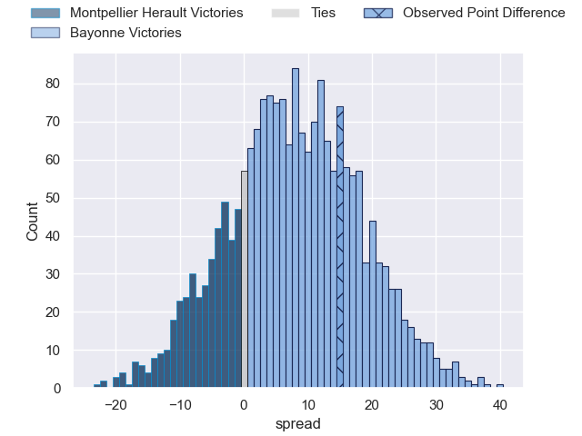
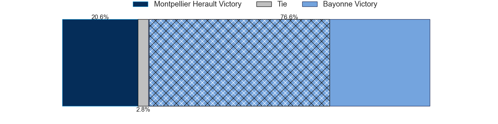
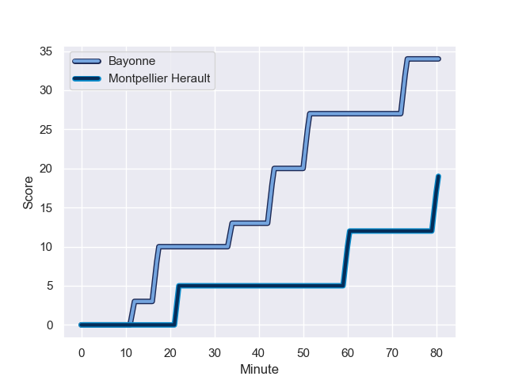
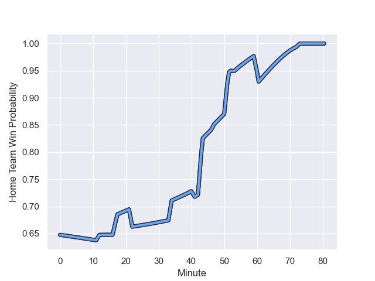

---  
layout: page  
title: Montpellier Herault at Bayonne; 19-34  
date: 2023-12-02 18:00:00 -0500  
categories: "Top 14 Orange 2023" match review  
---
# Montpellier Herault at Bayonne; 19-34

# Club Level Predictions

The first set of predictions treats a club as the smallest object, as the club develops its members, organizes a gameplan, and deploys its players as needed for each match. This club model has a prediction of 0.595, which translates to predicting Bayonne to win by 3.4.

Each club has a rating and a rating deviation (similar to a Glicko rating), and expected performances can be generated. This allows for simulated matches and spreads like the ones below.
## Projected Performances - Club Model

## Projected Spreads - Club Model

## Projected Results - Club Model

# Player Level Predictions - Version 2

Treating teams instead as an entity made up of the currently active players, I have ratings for each player in an altogether different system. These can be combined to form team ratings once teamsheets are announced, weighting starters a bit higher than the reserves. After the match is played, players can be weighted by their minutes on the field, allowing for an accurate measure of the team's composition. With these compiled team ratings, we can make predictions, measure inaccuracy, and update the individual player ratings.
## Prediction with Player Minutes: Bayonne by 6.7

Bayonne by 1.8 on a neutral field
## Prediction without Player Minutes: Bayonne by 5.5

Bayonne by 0.7 on a neutral pitch

## Projected Performances - Player Model

## Projected Spreads - Player Model

## Projected Results - Player Model

## Scores over Time

## Win Probability over Time

There were 7 large changes in win probability in this match

|   Away Minutes | Away Player                 |   Away elo |   Number |   Home elo | Home Player             |   Home Minutes |
|---------------:|:----------------------------|-----------:|---------:|-----------:|:------------------------|---------------:|
|             53 | Baptiste Erdocio            |      14.7  |        1 |      38.96 | Matis Perchaud          |             53 |
|             53 | Brandon Paenga-Amosa        |      48.75 |        2 |      29.94 | Vincent Giudicelli      |             47 |
|             53 | Titi Lamositele             |      46.58 |        3 |      42.11 | Tevita Tatafu           |             53 |
|             53 | Bastien Chalureau           |      62.36 |        4 |      40.52 | Thomas Ceyte            |             80 |
|             80 | Paul Willemse               |      65.24 |        5 |      67.38 | Lucas Paulos            |             47 |
|             60 | Nicolaas Janse van Rensburg |      62.07 |        6 |      28.87 | Pierre Huguet           |             47 |
|             41 | Masivesi Dakuwaqa           |      59.74 |        7 |      84.51 | Arthur Iturria          |             80 |
|             80 | Alexandre Becognee          |      30.11 |        8 |      73.42 | Uzair Cassiem           |             80 |
|             60 | Cobus Reinach               |      80.87 |        9 |      67.34 | Guillaume Rouet Piffard |             63 |
|             80 | Louis Carbonel              |      36.79 |       10 |     101.44 | Camille Lopez           |             75 |
|             80 | Julien Tisseron             |      44.08 |       11 |      68.77 | Nadir Megdoud           |             80 |
|             56 | Jan Serfontein              |      74.43 |       12 |      47.05 | Federico Mori           |             80 |
|             80 | Thomas Darmon               |      16.63 |       13 |      28.5  | Guillaume Martocq       |             68 |
|             80 | Alexandre de Nardi          |      54.29 |       14 |      10.33 | Bastien Pourailly       |             80 |
|             80 | Anthony Bouthier            |      56.4  |       15 |      58.26 | Aurelien Callandret     |             80 |
|             39 | Yacouba Camara              |      82.19 |       16 |      69.3  | Facundo Bosch           |             33 |
|             27 | Vano Karkadze               |      34.11 |       17 |      84    | Remi Bourdeau           |             33 |
|             27 | Harry Williams              |      87.74 |       18 |       2.29 | Konstantin Mikautadze   |             33 |
|             27 | Gregory Fichten             |      27.94 |       19 |      29.31 | Pascal Cotet            |             27 |
|             27 | Lenni Nouchi                |      36.4  |       20 |      46.68 | Swan Cormenier          |             27 |
|             24 | Paolo Garbisi               |      52.59 |       21 |      49.59 | Gela Aprasidze          |             17 |
|             20 | Léo Coly                    |      30.02 |       22 |       9.64 | Eneriko Buliruarua      |             12 |
|             20 | Tyler Duguid                |      33.69 |       23 |      32.98 | Thomas Dolhagaray       |              5 |

