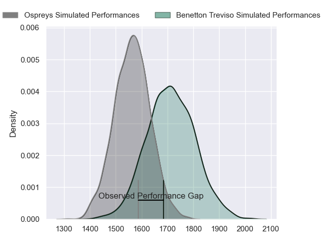
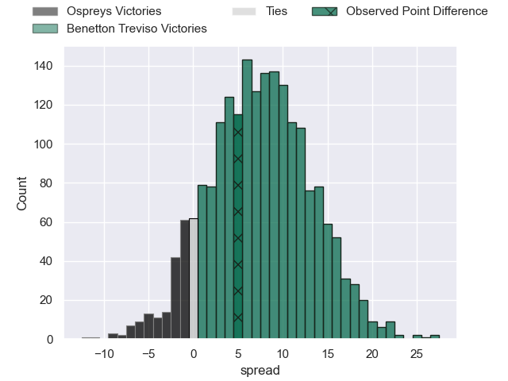
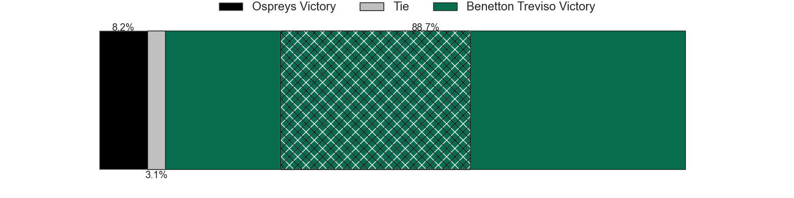
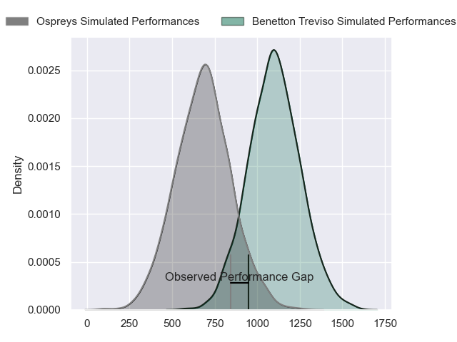
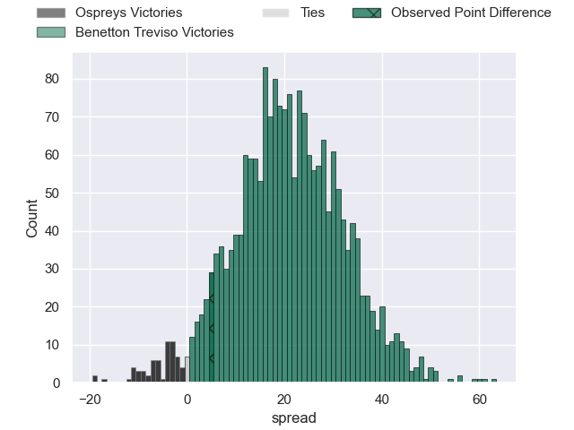
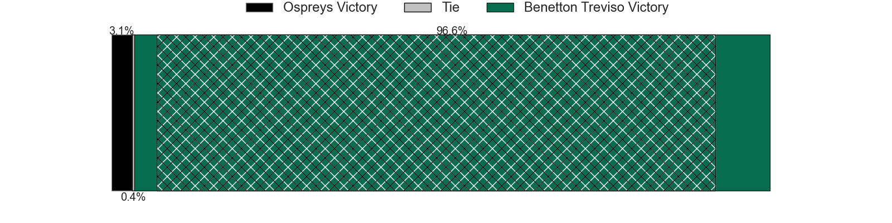
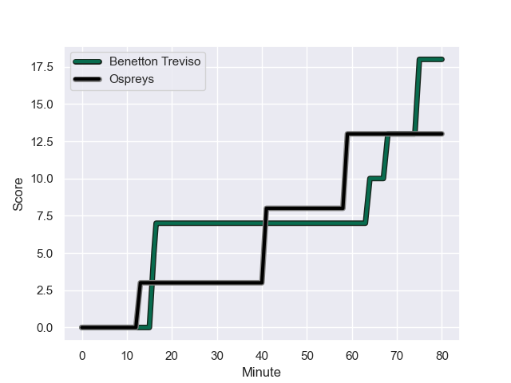
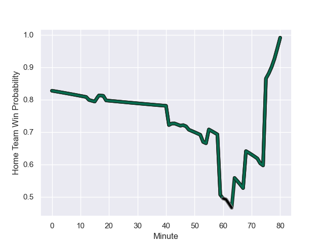

---  
layout: page  
title: Ospreys at Benetton Treviso; 13-18  
date: 2023-12-02 18:00:00 -0500  
categories: "United Rugby Championship 2023" match review  
---
# Ospreys at Benetton Treviso; 13-18

# Club Level Predictions

The first set of predictions treats a club as the smallest object, as the club develops its members, organizes a gameplan, and deploys its players as needed for each match. This club model has a prediction of 0.697, which translates to predicting Benetton Treviso to win by 7.4.

Each club has a rating and a rating deviation (similar to a Glicko rating), and expected performances can be generated. This allows for simulated matches and spreads like the ones below.
## Projected Performances - Club Model

## Projected Spreads - Club Model

## Projected Results - Club Model

# Player Level Predictions - Version 2

Treating teams instead as an entity made up of the currently active players, I have ratings for each player in an altogether different system. These can be combined to form team ratings once teamsheets are announced, weighting starters a bit higher than the reserves. After the match is played, players can be weighted by their minutes on the field, allowing for an accurate measure of the team's composition. With these compiled team ratings, we can make predictions, measure inaccuracy, and update the individual player ratings.
## Prediction with Player Minutes: Benetton Treviso by 17.4

Benetton Treviso by 13.4 on a neutral field
## Prediction without Player Minutes: Benetton Treviso by 17.0

Benetton Treviso by 13.0 on a neutral pitch

## Projected Performances - Player Model

## Projected Spreads - Player Model

## Projected Results - Player Model

## Scores over Time

## Win Probability over Time

There were 9 large changes in win probability in this match

|   Away Minutes | Away Player          |   Away elo |   Number |   Home elo | Home Player         |   Home Minutes |
|---------------:|:---------------------|-----------:|---------:|-----------:|:--------------------|---------------:|
|             55 | Gareth Thomas        |      35.89 |        1 |      71.45 | Thomas Gallo        |             48 |
|             55 | Marnus van der Merwe |      69.13 |        2 |      42.72 | Bautista Bernasconi |             42 |
|             55 | Rhys Henry           |      55.85 |        3 |      53.14 | Giosue Zilocchi     |             59 |
|             80 | Rhys Davies          |      59.34 |        4 |      62.71 | Edoardo Iachizzi    |             80 |
|             80 | James Fender         |      47.24 |        5 |      97.08 | Federico Ruzza      |             80 |
|             69 | Tristan Davies       |      47.28 |        6 |      56.87 | Alessandro Izekor   |             80 |
|             80 | Harri Deaves         |      48.39 |        7 |      97.15 | Michele Lamaro      |             53 |
|             80 | Morgan Morris        |       2.85 |        8 |      77.62 | Toa Halafihi        |             43 |
|             80 | Luke Davies          |      44.5  |        9 |      40.22 | Andy Uren           |             61 |
|             19 | Dan Edwards          |      48.79 |       10 |      77.03 | Jacob Umaga         |             80 |
|             80 | Luke Morgan          |       7.24 |       11 |      52.51 | Edoardo Padovani    |             80 |
|             80 | Keiran Williams      |      61.88 |       12 |      62.17 | Marco Zanon         |             80 |
|             80 | Luke Scully          |      49.51 |       13 |      81.06 | Malakai Fekitoa     |             80 |
|             80 | Iestyn Hopkins       |      36.53 |       14 |      70.6  | Paolo Odogwu        |             80 |
|             46 | Max Nagy             |      57.39 |       15 |      76.82 | Rhyno Smith         |             53 |
|             61 | Owen Williams        |      74.87 |       16 |      58.29 | Gianmarco Lucchesi  |             38 |
|             27 | Harri Houston        |      46.65 |       17 |      84.82 | Lorenzo Cannone     |             37 |
|             25 | Garyn Phillips       |      53.81 |       18 |      56.54 | Mirco Spagnolo      |             32 |
|             25 | Ethan Lewis          |      26.82 |       19 |      28.75 | Giacomo Da Re       |             27 |
|             25 | Ben Warren           |      48.48 |       20 |      56.88 | Manuel Zuliani      |             27 |
|             11 | Morgan Morse         |      46.95 |       21 |      60.66 | Tiziano Pasquali    |             21 |
|              7 | Rewan Kruger         |      79    |       22 |      73.31 | Dewaldt Duvenage    |             19 |

