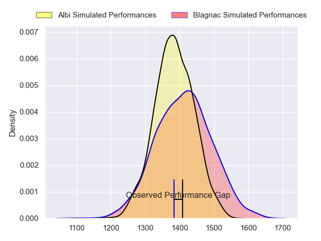
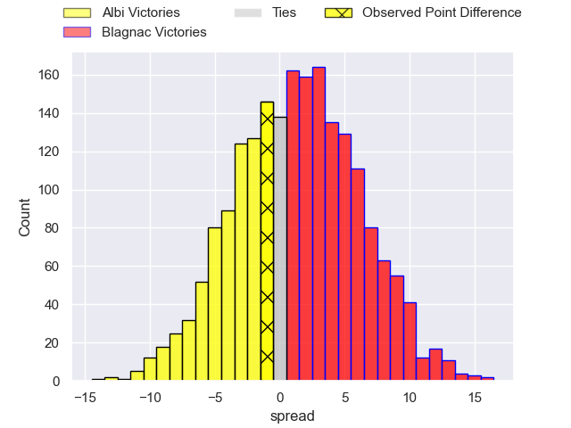
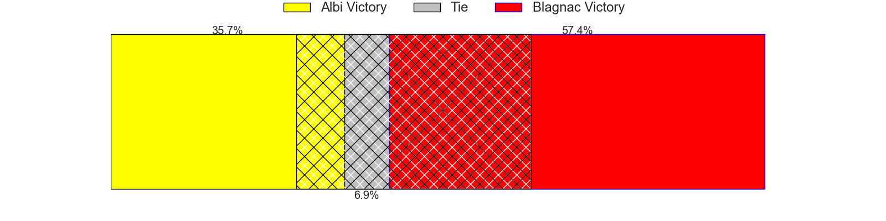
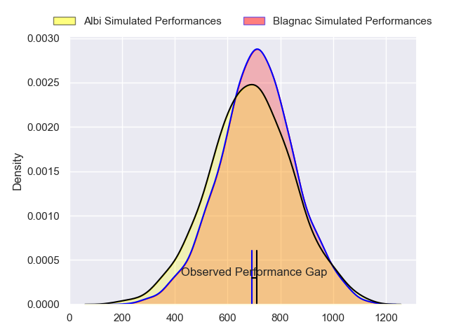
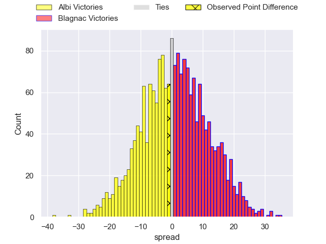
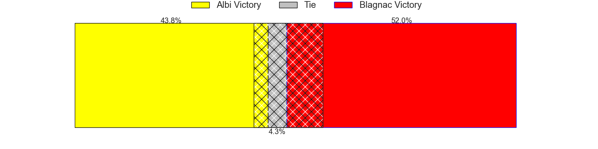
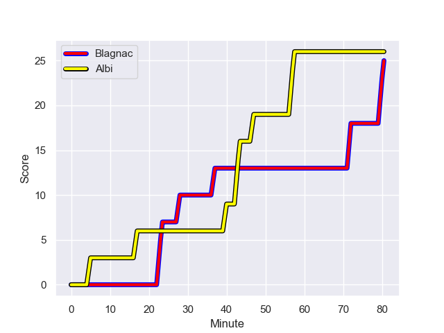
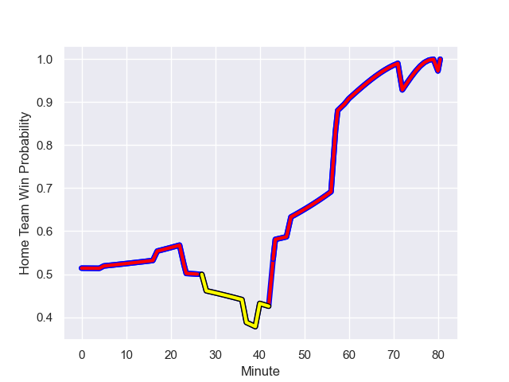

---  
layout: page  
title: Albi at Blagnac; 26-25  
date: 2023-12-02 18:00:00 -0500  
categories: "Nationale 2023" match review  
---
# Albi at Blagnac; 26-25

# Club Level Predictions

The first set of predictions treats a club as the smallest object, as the club develops its members, organizes a gameplan, and deploys its players as needed for each match. This club model has a prediction of 0.535, which translates to predicting Blagnac to win by 1.2.

Each club has a rating and a rating deviation (similar to a Glicko rating), and expected performances can be generated. This allows for simulated matches and spreads like the ones below.
## Projected Performances - Club Model

## Projected Spreads - Club Model

## Projected Results - Club Model

# Player Level Predictions - Version 2

Treating teams instead as an entity made up of the currently active players, I have ratings for each player in an altogether different system. These can be combined to form team ratings once teamsheets are announced, weighting starters a bit higher than the reserves. After the match is played, players can be weighted by their minutes on the field, allowing for an accurate measure of the team's composition. With these compiled team ratings, we can make predictions, measure inaccuracy, and update the individual player ratings.
## Prediction with Player Minutes: Blagnac by 0.6

Albi by 2.7 on a neutral field
## Prediction without Player Minutes: Blagnac by 0.0

Albi by 3.3 on a neutral pitch

## Projected Performances - Player Model

## Projected Spreads - Player Model

## Projected Results - Player Model

## Scores over Time

## Win Probability over Time

There were 12 large changes in win probability in this match

|   Away Minutes | Away Player             |   Away elo |   Number |   Home elo | Home Player         |   Home Minutes |
|---------------:|:------------------------|-----------:|---------:|-----------:|:--------------------|---------------:|
|             57 | Antoine Soave           |      49.45 |        1 |      52.64 | Alexis Decaux       |             47 |
|             57 | Arthur Castant          |      54.92 |        2 |      41.51 | Gabin Villerouge    |             57 |
|             57 | Jean Baptiste De Clercq |      49.45 |        3 |      47.32 | Victor Delmas       |             47 |
|             80 | Pierre Roussel          |      15.89 |        4 |      63.79 | Nikita Bekov        |             80 |
|             60 | Jacques Engelbrecht     |       7.38 |        5 |      39.17 | Vincent Mutel       |             80 |
|             60 | Mattéo Coustalat        |      36.48 |        6 |      50.48 | Simon Veyrac        |             80 |
|             80 | Simon Meka              |      56.56 |        7 |      34.12 | Lucas Lecomte       |             47 |
|             80 | Camille Jarreau         |      55.99 |        8 |      17.54 | Matthieu Thomas     |             57 |
|             72 | Gilen Queheille         |      62.01 |        9 |      36.08 | Bernard Reggiardo   |             37 |
|             80 | Théo Vidal              |      79.14 |       10 |      55.47 | Ugo Seunes          |             80 |
|             80 | Tim Giresse             |      66.51 |       11 |      40.5  | Lukas Doyhenard     |             80 |
|             80 | Jarrod Poi              |      23.83 |       12 |      54.36 | Aurelien Labau      |             80 |
|             60 | Baptiste Couchinave     |      67.07 |       13 |      23.42 | Clément Vareilles   |             57 |
|             80 | Sean Robinson           |      18.38 |       14 |      31.37 | Dorian Terrou       |             80 |
|             72 | Enzo Marzocca           |      50.82 |       15 |      14.12 | Antoine Renaud      |             47 |
|             23 | Lucas Pindor            |      46.65 |       16 |      39.45 | Benjamin Bertrand   |             33 |
|             23 | Romain Maurice          |      56.64 |       17 |      42.65 | Antoine Marty-Rybak |             23 |
|             23 | Dimitri Tchapnga        |      63.11 |       18 |      50.67 | Baptiste Collet     |             33 |
|             20 | Dion Evrard Oulai       |      17.42 |       19 |      37.24 | Nekolo Tolofua      |             23 |
|             20 | Mohsen Essid            |      65.34 |       20 |      39.82 | Lucas Tolofua       |             33 |
|              8 | Titouan Pouzoullic      |      49.34 |       21 |      32.78 | William Beaudon     |             43 |
|             20 | Francois Fontaine       |      32.39 |       22 |      60.76 | Valentin Delpy      |             33 |
|              8 | Téo Dospital            |       3.2  |       23 |      35.29 | Thibault Moleana    |             23 |

