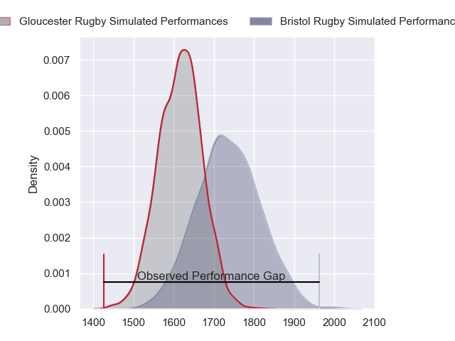
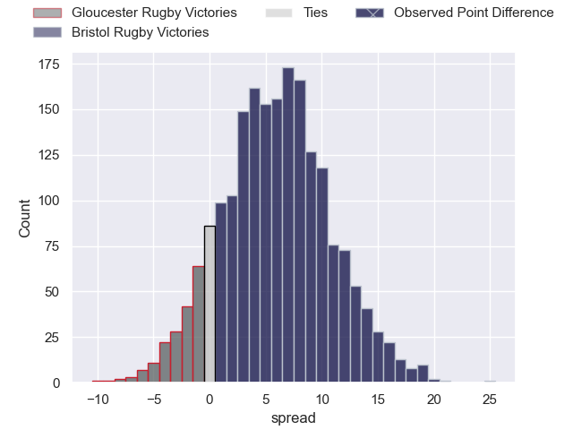
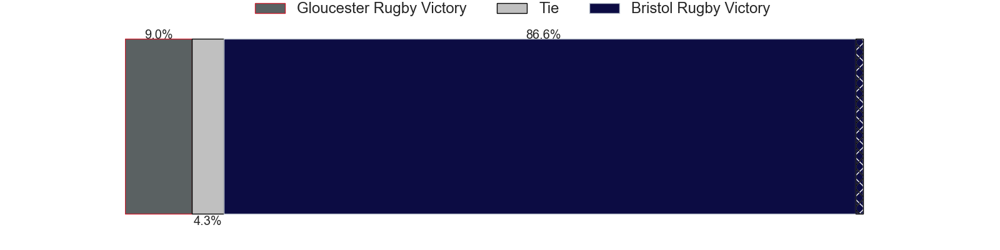
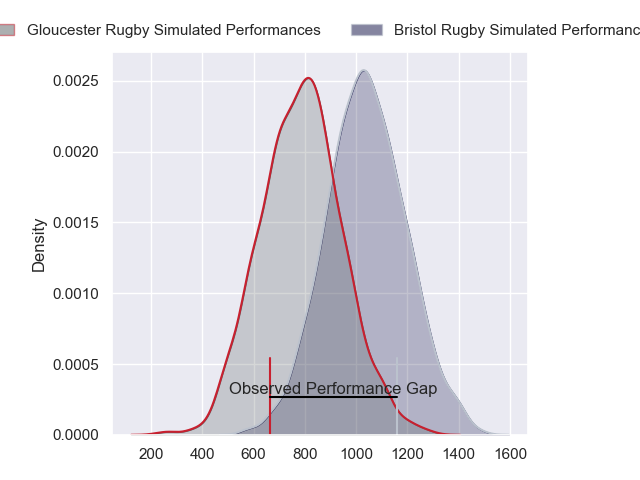
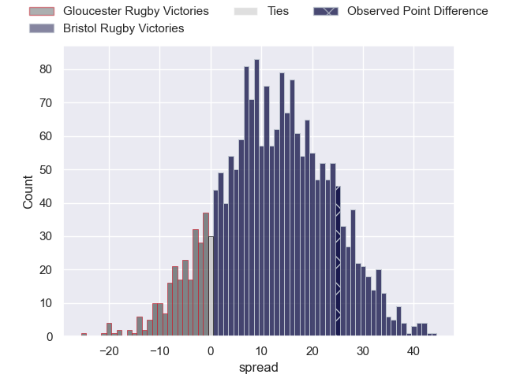
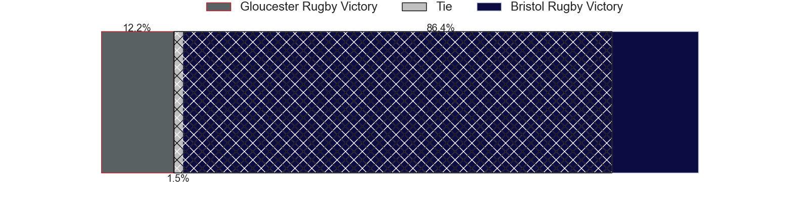
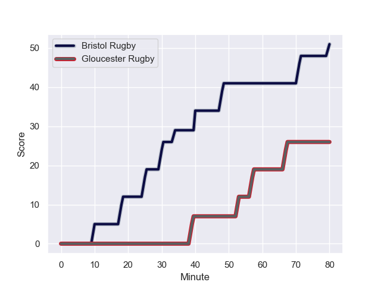
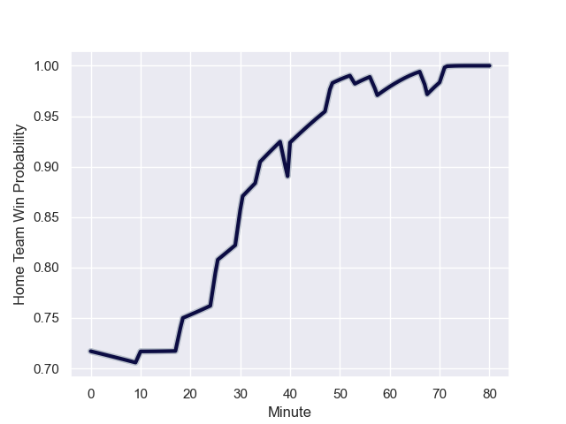

---  
layout: page  
title: Gloucester Rugby at Bristol Rugby; 26-51  
date: 2023-12-02 18:00:00 -0500  
categories: "Gallagher Premiership 2023" match review  
---
# Gloucester Rugby at Bristol Rugby; 26-51

# Club Level Predictions

The first set of predictions treats a club as the smallest object, as the club develops its members, organizes a gameplan, and deploys its players as needed for each match. This club model has a prediction of 0.659, which translates to predicting Bristol Rugby to win by 5.8.

Each club has a rating and a rating deviation (similar to a Glicko rating), and expected performances can be generated. This allows for simulated matches and spreads like the ones below.
## Projected Performances - Club Model

## Projected Spreads - Club Model

## Projected Results - Club Model

# Player Level Predictions - Version 2

Treating teams instead as an entity made up of the currently active players, I have ratings for each player in an altogether different system. These can be combined to form team ratings once teamsheets are announced, weighting starters a bit higher than the reserves. After the match is played, players can be weighted by their minutes on the field, allowing for an accurate measure of the team's composition. With these compiled team ratings, we can make predictions, measure inaccuracy, and update the individual player ratings.
## Prediction with Player Minutes: Bristol Rugby by 10.3

Bristol Rugby by 6.4 on a neutral field
## Prediction without Player Minutes: Bristol Rugby by 11.9

Bristol Rugby by 8.1 on a neutral pitch

## Projected Performances - Player Model

## Projected Spreads - Player Model

## Projected Results - Player Model

## Scores over Time

## Win Probability over Time

There were 3 large changes in win probability in this match

|   Away Minutes | Away Player          |   Away elo |   Number |   Home elo | Home Player                |   Home Minutes |
|---------------:|:---------------------|-----------:|---------:|-----------:|:---------------------------|---------------:|
|             25 | Mayco Vivas          |      28.62 |        1 |      36.9  | Ellis Genge                |             66 |
|             49 | Santiago Socino      |      45.51 |        2 |      63.69 | Harry Thacker              |             80 |
|             49 | Fraser Balmain       |      37.48 |        3 |      59.79 | Kyle Sinckler              |             66 |
|             49 | Freddie Clarke       |      24.62 |        4 |      59.51 | James Dun                  |             80 |
|             49 | Freddie Clarke       |      24.62 |        4 |      59.51 | James Dun                  |             80 |
|             80 | Matias Alemanno      |      52.72 |        5 |      52.62 | Joe Batley                 |             80 |
|             80 | Ruan Ackermann       |      81.33 |        6 |      99.41 | Steven Luatua              |             72 |
|             80 | Lewis Ludlow         |      33.76 |        7 |      51.07 | Daniel Thomas              |             72 |
|             65 | Jack Clement         |      32.46 |        8 |      58    | Fitz Harding               |             40 |
|             80 | Stephen Varney       |      23.45 |        9 |      70.07 | Harry Randall              |             52 |
|             80 | Santiago Carreras    |      71.92 |       10 |      69.61 | Callum Sheedy              |             49 |
|             80 | Ollie Thorley        |      68.03 |       11 |      61.87 | Richard Lane               |             80 |
|             75 | Mark Atkinson        |      61.58 |       12 |      66.23 | Benhard Janse van Rensburg |             80 |
|             80 | Max Llewellyn        |      73.48 |       13 |      93.8  | Virimi Vakatawa            |             80 |
|             80 | Louis Rees-Zammit    |      81.35 |       14 |      69.59 | Gabriel Ibitoye            |             80 |
|             65 | Lloyd Evans          |      57.03 |       15 |      47.53 | Max Malins                 |             66 |
|             55 | Harry Elrington      |      34.04 |       16 |      54.68 | Jake Woolmore              |             14 |
|             31 | George McGuigan      |      47.98 |       17 |      51.12 | George Kloska              |             14 |
|             31 | Jamal Ford-Robinson  |      11.08 |       18 |      44.2  | Gabriel Oghre              |              8 |
|             31 | Freddie Clarke       |      24.62 |       19 |      48.47 | Jake Heenan                |              8 |
|             31 | Freddie Clarke       |      24.62 |       19 |      48.47 | Jake Heenan                |              8 |
|             15 | Ben Donnell          |      48.52 |       20 |      59.39 | Josh Caulfield             |             40 |
|              5 | Louis Hillman-Cooper |      44.75 |       21 |      75.42 | Kieran Marmion             |             28 |
|             15 | Josh Hathaway        |      40.52 |       22 |      35.01 | James Williams             |             31 |
|            nan | nan                  |     nan    |       23 |      59.24 | Kalaveti Ravouvou          |             14 |

