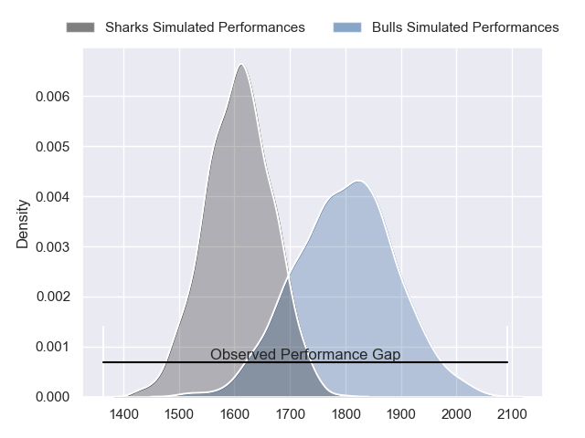
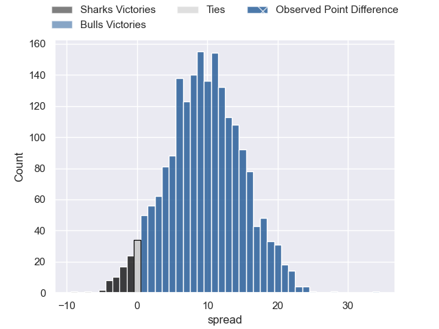
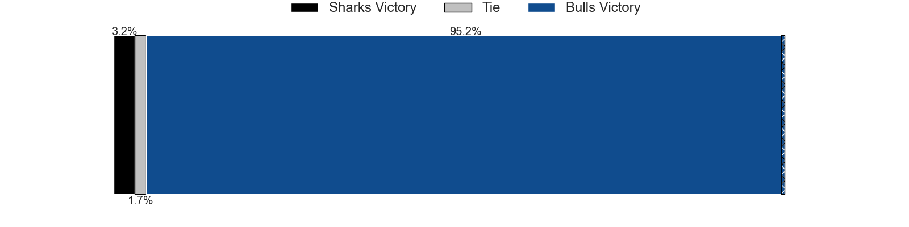
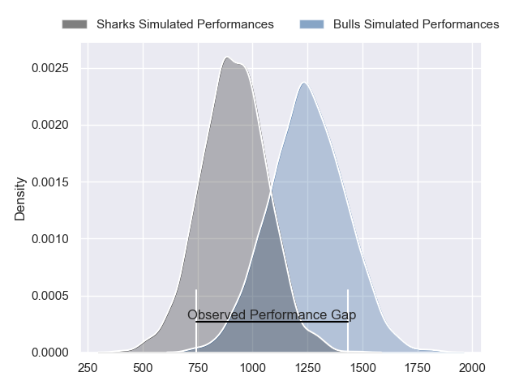
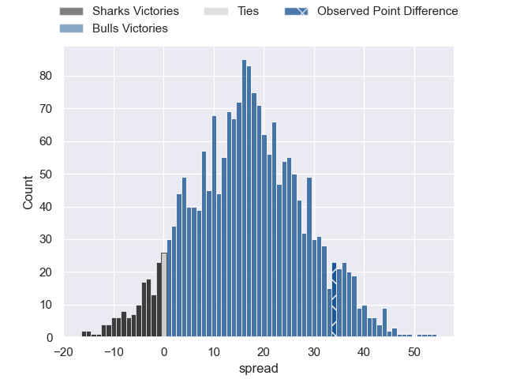
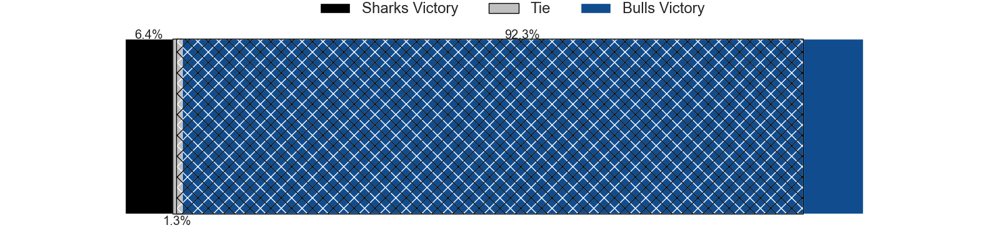
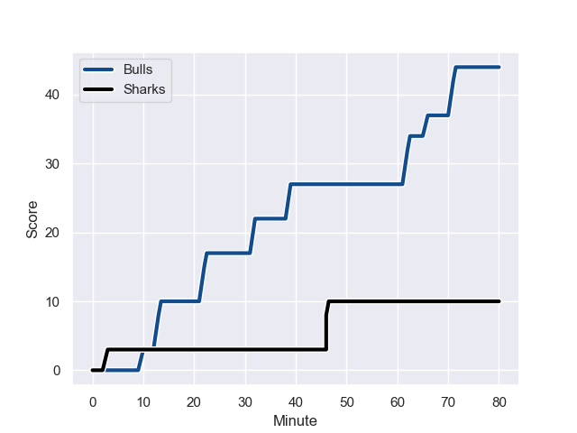
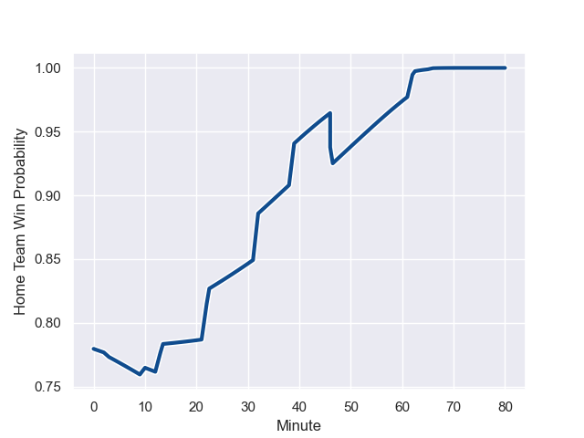

---  
layout: page  
title: Sharks at Bulls; 10-44  
date: 2023-12-02 18:00:00 -0500  
categories: "United Rugby Championship 2023" match review  
---
# Sharks at Bulls; 10-44

# Club Level Predictions

The first set of predictions treats a club as the smallest object, as the club develops its members, organizes a gameplan, and deploys its players as needed for each match. This club model has a prediction of 0.75, which translates to predicting Bulls to win by 9.7.

Each club has a rating and a rating deviation (similar to a Glicko rating), and expected performances can be generated. This allows for simulated matches and spreads like the ones below.
## Projected Performances - Club Model

## Projected Spreads - Club Model

## Projected Results - Club Model

# Player Level Predictions - Version 2

Treating teams instead as an entity made up of the currently active players, I have ratings for each player in an altogether different system. These can be combined to form team ratings once teamsheets are announced, weighting starters a bit higher than the reserves. After the match is played, players can be weighted by their minutes on the field, allowing for an accurate measure of the team's composition. With these compiled team ratings, we can make predictions, measure inaccuracy, and update the individual player ratings.
## Prediction with Player Minutes: Bulls by 13.8

Bulls by 10.0 on a neutral field
## Prediction without Player Minutes: Bulls by 12.2

Bulls by 8.4 on a neutral pitch

## Projected Performances - Player Model

## Projected Spreads - Player Model

## Projected Results - Player Model

## Scores over Time

## Win Probability over Time

There were 4 large changes in win probability in this match

|   Away Minutes | Away Player              |   Away elo |   Number |   Home elo | Home Player             |   Home Minutes |
|---------------:|:-------------------------|-----------:|---------:|-----------:|:------------------------|---------------:|
|             40 | Ntuthuko Mchunu          |      33.86 |        1 |      64.53 | Gerhard Steenekamp      |             71 |
|             30 | Fez Mbatha               |      70.19 |        2 |     101.31 | Akker van der Merwe     |             72 |
|             40 | Coenie Oosthuizen        |     118.29 |        3 |     108.8  | Wilco Louw              |             64 |
|             61 | Eben Etzebeth            |     110.98 |        4 |      61.34 | Janko Swanepoel         |             64 |
|             80 | Jeandre Labuschagne      |      42.39 |        5 |      38.38 | Reinhardt Ludwig        |             80 |
|             68 | James Venter             |      42.35 |        6 |      73.76 | Marco van Staden        |             80 |
|             80 | Phepsi Buthelezi         |      36.26 |        7 |      68.33 | Elrigh Louw             |             80 |
|             80 | Sikhumbuzo Notshe        |      72.92 |        8 |      50.65 | Cameron Hanekom         |             64 |
|             40 | Jaden Hendrikse          |      69.1  |        9 |      79.83 | Embrose Papier          |             64 |
|             64 | Curwin Bosch             |      62.7  |       10 |      54.16 | Johan Goosen            |             73 |
|             80 | Makazole Mapimpi         |     110.01 |       11 |     122.75 | Canan Moodie            |             80 |
|             40 | Francois Venter          |      46.83 |       12 |      67.85 | David Kriel             |             80 |
|             80 | Lukhanyo Am              |      59.13 |       13 |      59.59 | Stedman-Gee Rivett Gans |             72 |
|             80 | Aphiwe Dyantyi           |      15.42 |       14 |     104.11 | Kurt-Lee Arendse        |             80 |
|             80 | Aphelele Fassi           |      69.15 |       15 |     109.21 | Willie le Roux          |             80 |
|             50 | Daniel Viljoen Jooste    |      45.65 |       16 |      85.5  | Nizaam Carr             |             16 |
|             40 | Rohan Janse van Rensburg |      54.28 |       17 |      73.52 | Zak Burger              |             16 |
|             40 | Ox Nche                  |     106.74 |       18 |      53.44 | Mornay Smith            |             16 |
|             40 | Hanro Jacobs             |      44.5  |       19 |      58.73 | Simphiwe Matanzima      |              9 |
|             40 | Grant Williams           |      46.47 |       20 |      68.51 | Deon Slabbert           |             16 |
|             19 | Corne Rahl               |      27.44 |       21 |      27.44 | Jan Hendrik Wessels     |              8 |
|             16 | Boeta Chamberlain        |      44.6  |       22 |     102.02 | Sebastian de Klerk      |              8 |
|             12 | Marco De Witt            |      52.77 |       23 |      53.86 | Jaco van der Walt       |              7 |

