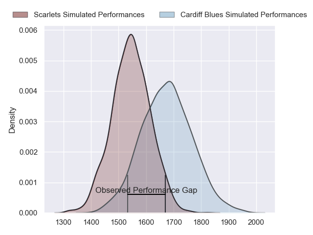
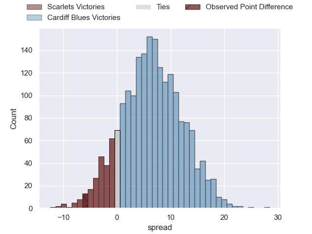
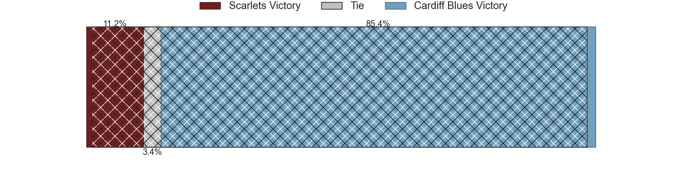
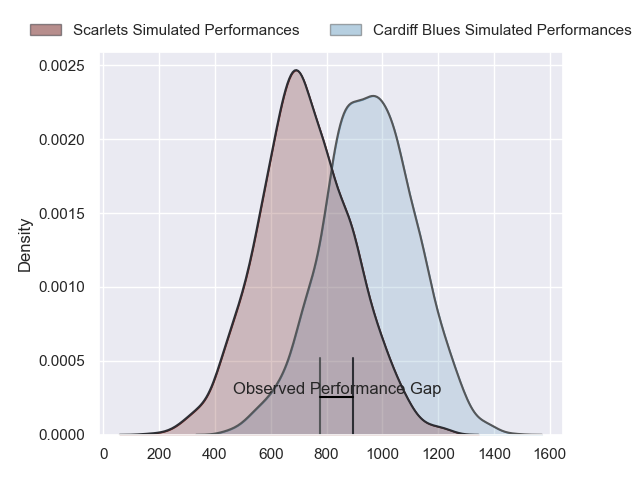
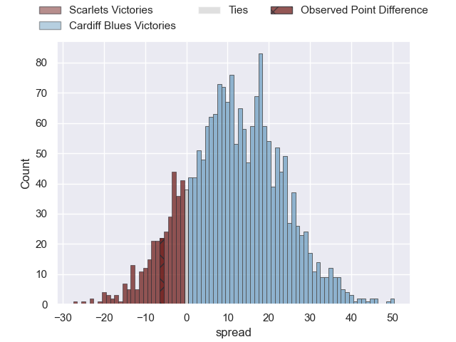
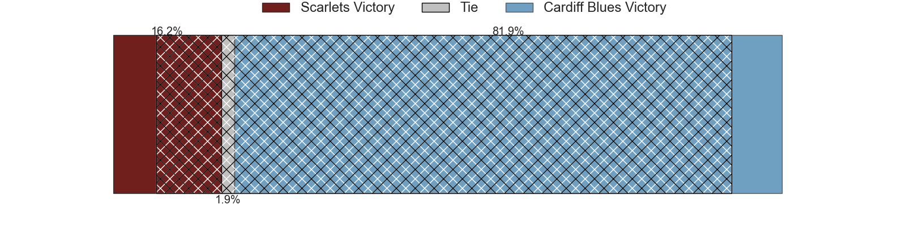
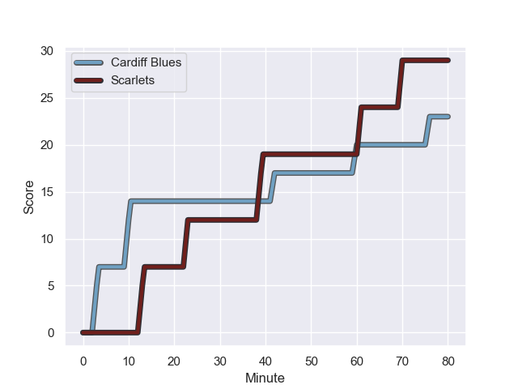
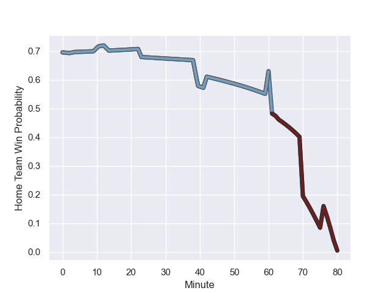

---  
layout: page  
title: Scarlets at Cardiff Blues; 29-23  
date: 2023-12-02 18:00:00 -0500  
categories: "United Rugby Championship 2023" match review  
---
# Scarlets at Cardiff Blues; 29-23

# Club Level Predictions

The first set of predictions treats a club as the smallest object, as the club develops its members, organizes a gameplan, and deploys its players as needed for each match. This club model has a prediction of 0.678, which translates to predicting Cardiff Blues to win by 6.6.

Each club has a rating and a rating deviation (similar to a Glicko rating), and expected performances can be generated. This allows for simulated matches and spreads like the ones below.
## Projected Performances - Club Model

## Projected Spreads - Club Model

## Projected Results - Club Model

# Player Level Predictions - Version 2

Treating teams instead as an entity made up of the currently active players, I have ratings for each player in an altogether different system. These can be combined to form team ratings once teamsheets are announced, weighting starters a bit higher than the reserves. After the match is played, players can be weighted by their minutes on the field, allowing for an accurate measure of the team's composition. With these compiled team ratings, we can make predictions, measure inaccuracy, and update the individual player ratings.
## Prediction with Player Minutes: Cardiff Blues by 9.2

Cardiff Blues by 4.8 on a neutral field
## Prediction without Player Minutes: Cardiff Blues by 10.2

Cardiff Blues by 5.8 on a neutral pitch

## Projected Performances - Player Model

## Projected Spreads - Player Model

## Projected Results - Player Model

## Scores over Time

## Win Probability over Time

There were 12 large changes in win probability in this match

|   Away Minutes | Away Player         |   Away elo |   Number |   Home elo | Home Player        |   Home Minutes |
|---------------:|:--------------------|-----------:|---------:|-----------:|:-------------------|---------------:|
|             51 | Wyn Jones           |      47.16 |        1 |      58.24 | Corey Domachowski  |             51 |
|             80 | Ryan Elias          |      74.97 |        2 |      53.08 | Liam Belcher       |             72 |
|             51 | Harri O'Connor      |      27.56 |        3 |      41.34 | Keiron Assiratti   |             51 |
|             80 | Alex Craig          |      31.79 |        4 |      39.24 | Seb Davies         |             80 |
|             60 | Jac Price           |      19.21 |        5 |      48.51 | Teddy Williams     |             65 |
|             80 | Vaea Fifita         |     105.04 |        6 |      40.44 | Alex Mann          |             80 |
|             80 | Dan Davis           |      59.64 |        7 |      46.38 | Ellis Jenkins      |             80 |
|             73 | Carwyn Tuipulotu    |      37.21 |        8 |      48.64 | Mackenzie Martin   |             63 |
|             80 | Gareth Davies       |      34.66 |        9 |      72.57 | Tomos Williams     |             65 |
|             80 | Ioan Lloyd          |      19.89 |       10 |      69.54 | Tinus de Beer      |             80 |
|             80 | Steffan Evans       |      65.55 |       11 |      72.28 | Mason Grady        |             80 |
|             74 | Eddie James         |      50.25 |       12 |      97.02 | Uilisi Halaholo    |             80 |
|             80 | Johnny Williams     |      65.33 |       13 |      99.95 | Rey Lee-Lo         |             63 |
|             80 | Tom Rogers          |      35.11 |       14 |      58.95 | Josh Adams         |             80 |
|             80 | Johnny McNicholl    |      59.18 |       15 |      30.33 | Cam Winnett        |             80 |
|             29 | Steffan Thomas      |      37.12 |       16 |      30.4  | Rhys Carré         |             29 |
|             29 | Joe Jones           |      34.78 |       17 |      43.87 | Rhys Litterick     |             29 |
|             20 | Morgan Jones        |       9.88 |       18 |      18.66 | Shane Lewis-Hughes |             17 |
|              7 | Teddy Leatherbarrow |      38.27 |       19 |      31.97 | Jacob Beetham      |             17 |
|              6 | Ioan Nicholas       |      45.92 |       20 |      44.45 | Ellis Bevan        |             15 |
|            nan | nan                 |     nan    |       21 |      66.76 | Josh Turnbull      |             15 |
|            nan | nan                 |     nan    |       22 |      47.07 | Evan Lloyd         |              8 |

