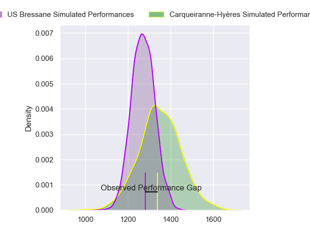
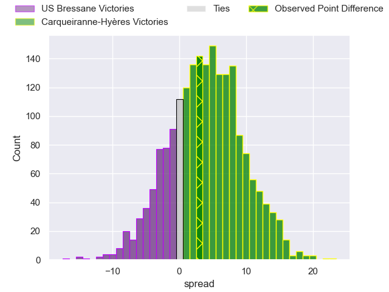
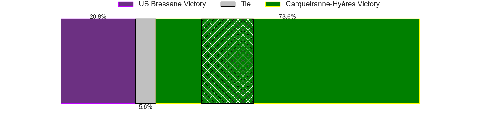
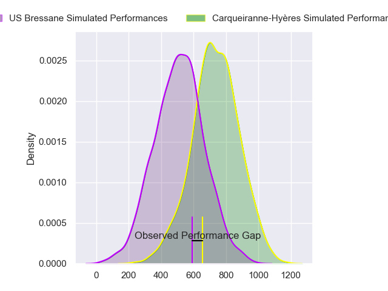
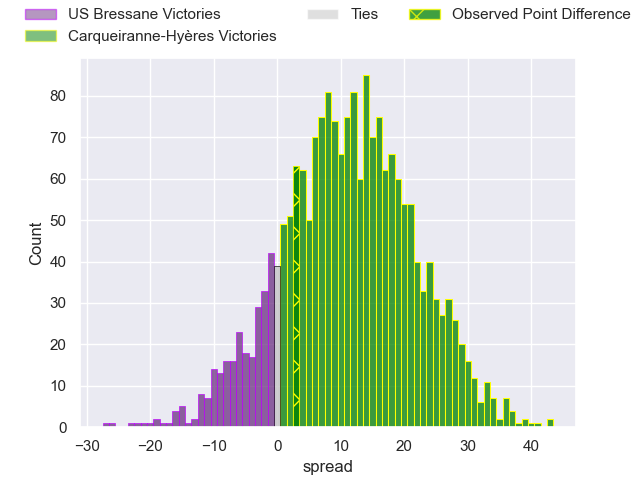
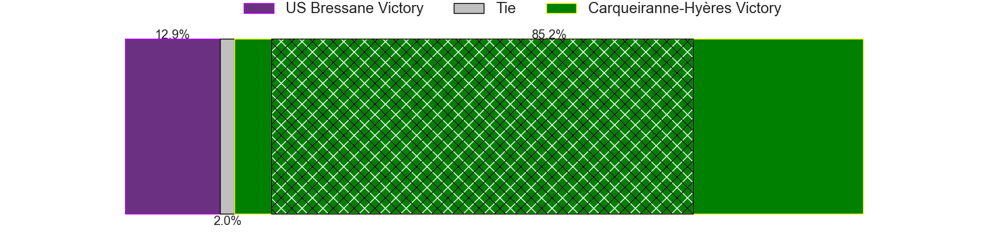
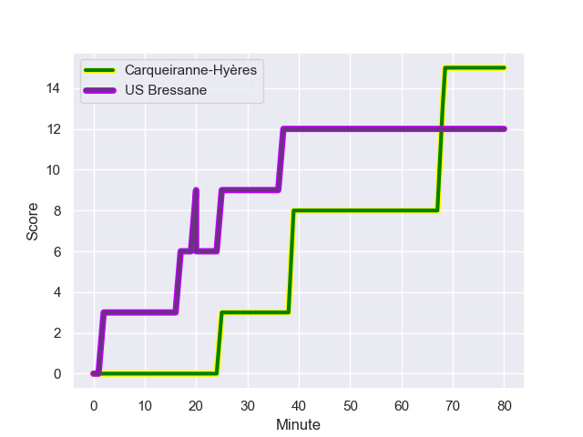
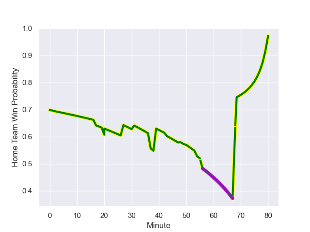

---  
layout: page  
title: US Bressane at Carqueiranne-Hyeres; 12-15  
date: 2023-12-02 18:00:00 -0500  
categories: "Nationale 2023" match review  
---
# US Bressane at Carqueiranne-Hyeres; 12-15

# Club Level Predictions

The first set of predictions treats a club as the smallest object, as the club develops its members, organizes a gameplan, and deploys its players as needed for each match. This club model has a prediction of 0.608, which translates to predicting Carqueiranne-Hyères to win by 3.9.

Each club has a rating and a rating deviation (similar to a Glicko rating), and expected performances can be generated. This allows for simulated matches and spreads like the ones below.
## Projected Performances - Club Model

## Projected Spreads - Club Model

## Projected Results - Club Model

# Player Level Predictions - Version 2

Treating teams instead as an entity made up of the currently active players, I have ratings for each player in an altogether different system. These can be combined to form team ratings once teamsheets are announced, weighting starters a bit higher than the reserves. After the match is played, players can be weighted by their minutes on the field, allowing for an accurate measure of the team's composition. With these compiled team ratings, we can make predictions, measure inaccuracy, and update the individual player ratings.
## Prediction with Player Minutes: Carqueiranne-Hyères by 9.2

Carqueiranne-Hyères by 6.1 on a neutral field
## Prediction without Player Minutes: Carqueiranne-Hyères by 7.6

Carqueiranne-Hyères by 4.5 on a neutral pitch

## Projected Performances - Player Model

## Projected Spreads - Player Model

## Projected Results - Player Model

## Scores over Time

## Win Probability over Time

There were 10 large changes in win probability in this match

|   Away Minutes | Away Player        |   Away elo |   Number |   Home elo | Home Player         |   Home Minutes |
|---------------:|:-------------------|-----------:|---------:|-----------:|:--------------------|---------------:|
|             50 | Vazha Kapanadze    |      43.22 |        1 |      51.52 | Costel Burtila      |             48 |
|             56 | Clement Jullien    |      47.76 |        2 |      36.73 | Theo Lachaud        |             48 |
|             31 | Ma'afu Fia         |      54.65 |        3 |      45.4  | Eli Serra-Miglietti |             48 |
|             80 | Louis Bruinsma     |      27.69 |        4 |       7.56 | Cesar Damiani       |             41 |
|             27 | Josh Peters        |      37.26 |        5 |      24.44 | Lucas Cazac         |             80 |
|             63 | Loic Baradel       |      41.6  |        6 |      36.49 | Nicolas Baquer      |             80 |
|             54 | Joseph Penitito    |      53.79 |        7 |      55.18 | Andre Gorin         |             60 |
|             80 | Pierre Reynaud     |      41.92 |        8 |      58.68 | Joachim Beaumont    |             80 |
|             80 | Jeremy Valencot    |      40.53 |        9 |      60.55 | Thomas Sonetti      |             54 |
|             56 | Nicolas Faure      |      -5.77 |       10 |      48.07 | Juan Kotze          |             80 |
|             80 | Élie De Fleurian   |      37.11 |       11 |      51.28 | Quentin Bourdieu    |             68 |
|             80 | Alexandre Badet    |      24.83 |       12 |      41.55 | Charles Brousse     |             80 |
|             80 | Maile Mamao        |      27.44 |       13 |      42.76 | Dylan Sage          |             80 |
|             80 | Thibaut Perrette   |      28.57 |       14 |      55.33 | Paul Gadea          |             80 |
|             80 | Florent Massip     |      50.74 |       15 |      40.83 | Adrien Amans        |             43 |
|             53 | Maselino Paulino   |     -10.84 |       16 |      53.88 | Lasha Mchelidze     |             32 |
|             49 | Erich de Jager     |      33.29 |       17 |      46.24 | Yan Tabarot         |             32 |
|             24 | Louis Dasalmartini |      40.51 |       18 |      50.67 | Sti Sithole         |             32 |
|             26 | Nicolas Tachat     |      49.08 |       19 |      31.39 | Nathan Gendre       |             39 |
|             24 | Christian Lacombe  |      29.94 |       20 |      30.84 | Adam Peters         |             20 |
|             17 | Lucas Lyons        |      56.24 |       21 |      36.29 | Rémi Dubié          |             26 |
|             30 | Quentin Drancourt  |      38.4  |       22 |      51.08 | Theo Moitrier       |             12 |
|            nan | nan                |     nan    |       23 |      42.92 | Enzo Miot           |             37 |

