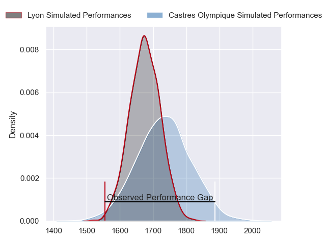
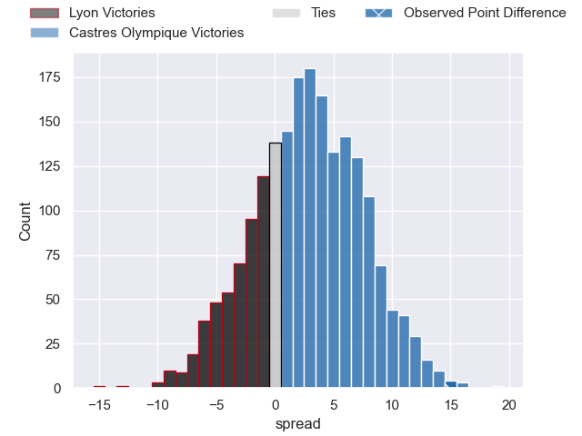
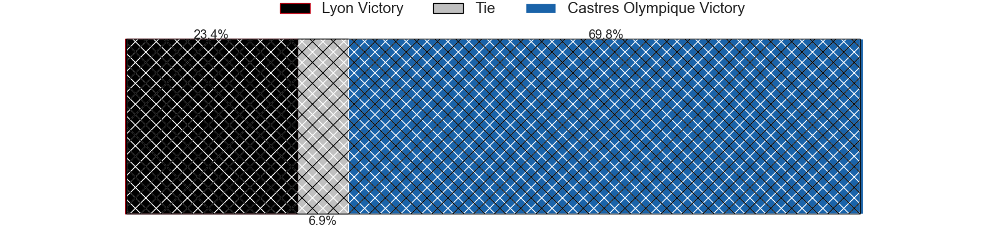
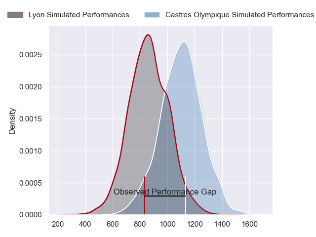
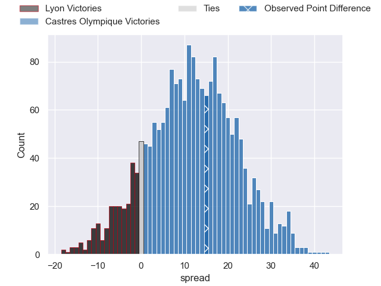
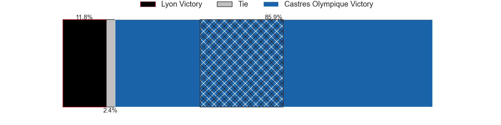
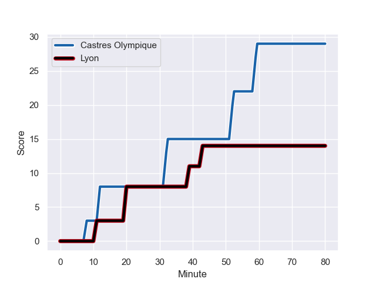
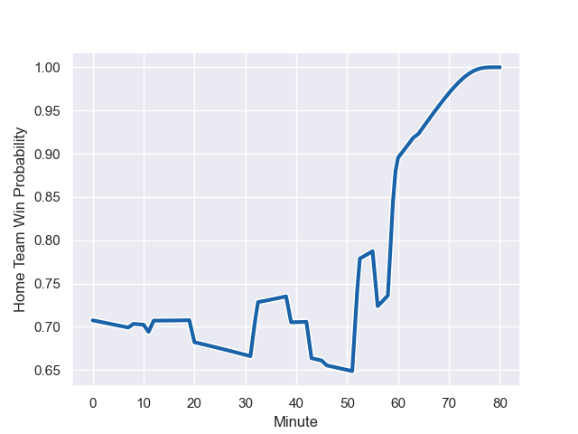

---  
layout: page  
title: Lyon at Castres Olympique; 14-29  
date: 2023-12-02 18:00:00 -0500  
categories: "Top 14 Orange 2023" match review  
---
# Lyon at Castres Olympique; 14-29

# Club Level Predictions

The first set of predictions treats a club as the smallest object, as the club develops its members, organizes a gameplan, and deploys its players as needed for each match. This club model has a prediction of 0.582, which translates to predicting Castres Olympique to win by 2.9.

Each club has a rating and a rating deviation (similar to a Glicko rating), and expected performances can be generated. This allows for simulated matches and spreads like the ones below.
## Projected Performances - Club Model

## Projected Spreads - Club Model

## Projected Results - Club Model

# Player Level Predictions - Version 2

Treating teams instead as an entity made up of the currently active players, I have ratings for each player in an altogether different system. These can be combined to form team ratings once teamsheets are announced, weighting starters a bit higher than the reserves. After the match is played, players can be weighted by their minutes on the field, allowing for an accurate measure of the team's composition. With these compiled team ratings, we can make predictions, measure inaccuracy, and update the individual player ratings.
## Prediction with Player Minutes: Castres Olympique by 9.7

Castres Olympique by 4.7 on a neutral field
## Prediction without Player Minutes: Castres Olympique by 9.5

Castres Olympique by 4.6 on a neutral pitch

## Projected Performances - Player Model

## Projected Spreads - Player Model

## Projected Results - Player Model

## Scores over Time

## Win Probability over Time

There were 9 large changes in win probability in this match

|   Away Minutes | Away Player                  |   Away elo |   Number |   Home elo | Home Player          |   Home Minutes |
|---------------:|:-----------------------------|-----------:|---------:|-----------:|:---------------------|---------------:|
|             49 | Sebastien Taofifenua         |      36.66 |        1 |      82.01 | Antoine Tichit       |             56 |
|             46 | Guillaume Marchand           |      37.84 |        2 |      81.17 | Gaetan Barlot        |             63 |
|             39 | Valentin Simutoga            |      41.7  |        3 |      62.71 | Levan Chilachava     |             53 |
|             46 | Felix Lambey                 |      63.82 |        4 |      78.83 | Leone Nakarawa       |             53 |
|             80 | Romain Taofifenua            |      48.88 |        5 |      72.92 | Tom Staniforth       |             80 |
|             80 | Liam Allen                   |      47.47 |        6 |      66.56 | Mathieu Babillot     |             64 |
|             80 | Mickael Guillard             |      46.76 |        7 |      53.28 | Baptiste Delaporte   |             53 |
|             49 | Jordan Taufua                |      95.54 |        8 |      94.14 | Tyler Ardron         |             80 |
|             56 | Baptiste Couilloud           |      88.38 |        9 |      54.41 | Santiago Arata       |             64 |
|             80 | Paddy Jackson                |      79.02 |       10 |      61.39 | Pierre Popelin       |             80 |
|             80 | Vincent Rattez               |     103.19 |       11 |      75.83 | Nathanael Hulleu     |             80 |
|             80 | Thibault Regard              |      76.73 |       12 |      71.37 | Adrea Cocagi         |             80 |
|             60 | Josiah Maraku                |      24.48 |       13 |      53.54 | Vilimoni Botitu      |             60 |
|             80 | Xavier Mignot                |      54.2  |       14 |      48.74 | Josaia Raisuqe       |             80 |
|             64 | Alexandre Tchaptchet Noutcha |      45.34 |       15 |      71.69 | Julien Dumora        |             80 |
|             41 | Paulo Tafili                 |      35.6  |       16 |      52.3  | Abraham Papali'i     |             27 |
|             34 | Yanis Charcosset             |      46.37 |       17 |      58.33 | Wilfrid Hounkpatin   |             27 |
|             34 | Killian Geraci               |      35.18 |       18 |      48.13 | Florent Vanverberghe |             27 |
|             31 | Vivien Devisme               |      56.26 |       19 |      42.5  | Loïs Guerois         |             24 |
|             31 | Pierre-Samuel Pacheco        |      43.58 |       20 |      42.79 | Adrien Seguret       |             20 |
|             24 | Martin Page-Relo             |      56.23 |       21 |      42.7  | Loris Zarantonello   |             17 |
|             20 | Alfred Parisien              |      45.65 |       22 |      41.88 | Baptiste Cope        |             16 |
|             16 | Davit Niniashvili            |      70.62 |       23 |      16.43 | Jeremy Fernandez     |             16 |

