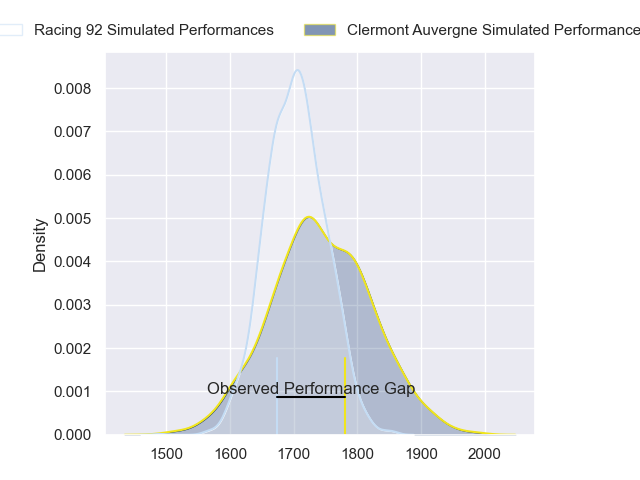
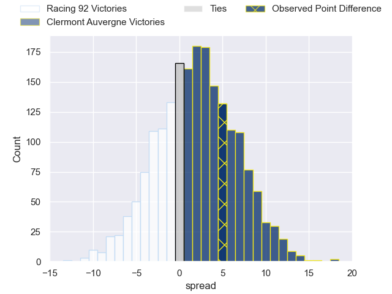
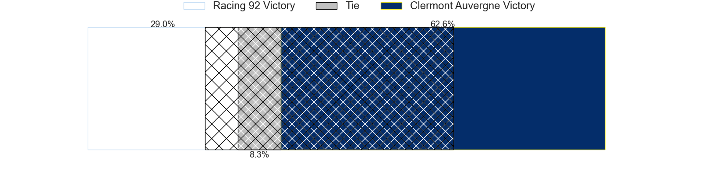
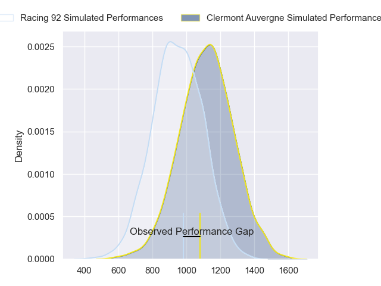
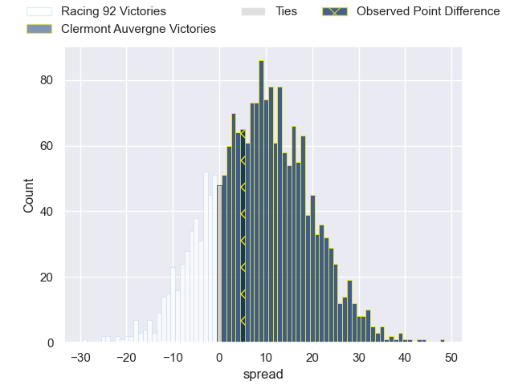
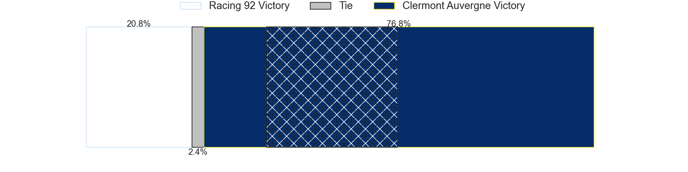
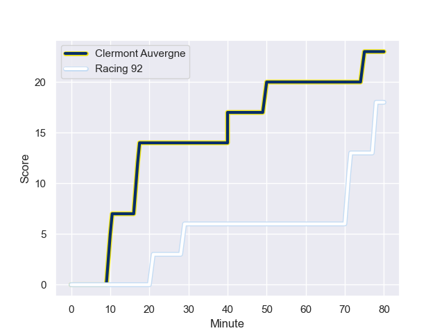
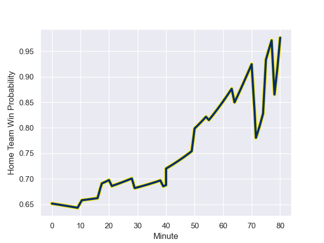

---  
layout: page  
title: Racing 92 at Clermont Auvergne; 18-23  
date: 2023-12-02 18:00:00 -0500  
categories: "Top 14 Orange 2023" match review  
---
# Racing 92 at Clermont Auvergne; 18-23

# Club Level Predictions

The first set of predictions treats a club as the smallest object, as the club develops its members, organizes a gameplan, and deploys its players as needed for each match. This club model has a prediction of 0.56, which translates to predicting Clermont Auvergne to win by 2.1.

Each club has a rating and a rating deviation (similar to a Glicko rating), and expected performances can be generated. This allows for simulated matches and spreads like the ones below.
## Projected Performances - Club Model

## Projected Spreads - Club Model

## Projected Results - Club Model

# Player Level Predictions - Version 2

Treating teams instead as an entity made up of the currently active players, I have ratings for each player in an altogether different system. These can be combined to form team ratings once teamsheets are announced, weighting starters a bit higher than the reserves. After the match is played, players can be weighted by their minutes on the field, allowing for an accurate measure of the team's composition. With these compiled team ratings, we can make predictions, measure inaccuracy, and update the individual player ratings.
## Prediction with Player Minutes: Clermont Auvergne by 6.9

Clermont Auvergne by 2.0 on a neutral field
## Prediction without Player Minutes: Clermont Auvergne by 7.9

Clermont Auvergne by 3.0 on a neutral pitch

## Projected Performances - Player Model

## Projected Spreads - Player Model

## Projected Results - Player Model

## Scores over Time

## Win Probability over Time

There were 9 large changes in win probability in this match

|   Away Minutes | Away Player         |   Away elo |   Number |   Home elo | Home Player          |   Home Minutes |
|---------------:|:--------------------|-----------:|---------:|-----------:|:---------------------|---------------:|
|             54 | Trevor Nyakane      |      56.98 |        1 |      59.2  | Etienne Falgoux      |             57 |
|             61 | Janick Tarrit       |      57.1  |        2 |      79.22 | Folau Fainga'a       |             64 |
|             61 | Thomas Laclayat     |      64.68 |        3 |      57.41 | Cristian Ojovan      |             57 |
|             80 | Cameron Woki        |      70.78 |        4 |      56.07 | Thibaud Lanen        |             57 |
|             39 | Veikoso Poloniati   |      20.45 |        5 |      90.69 | Rob Simmons          |             80 |
|             80 | Ibrahim Diallo      |      38.02 |        6 |      46.6  | Killian Tixeront     |             71 |
|             55 | Maxime Baudonne     |      43.05 |        7 |      50.42 | Marcos Kremer        |             80 |
|             80 | Wenceslas Lauret    |     111.31 |        8 |      82.34 | Fritz Lee            |             64 |
|             50 | Clovis Le bail      |      57.92 |        9 |      79.42 | Sebastien Bezy       |             71 |
|             80 | Tristan Tedder      |      74.82 |       10 |      86.45 | Benjamin Urdapilleta |             80 |
|             80 | Vinaya Habosi       |      54.22 |       11 |      31.67 | Thomas Roziere       |             80 |
|             80 | Henry Chavancy      |     118.1  |       12 |      93.53 | George Moala         |             80 |
|             55 | Olivier Klemenczak  |      32.92 |       13 |      42.36 | Irae Simone          |             39 |
|             80 | Donovan Taofifenua  |      46.73 |       14 |      70.91 | Bautista Delguy      |             80 |
|             64 | Max Spring          |      55.04 |       15 |      66.95 | Alex Newsome         |             80 |
|             26 | Guram Gogichashvili |      51.85 |       16 |      45.35 | Daniel Bibi Biziwu   |             23 |
|             19 | Eddy Ben Arous      |     100.06 |       17 |      44.81 | Yohan Beheregaray    |             16 |
|             19 | Gia Kharaishvili    |      54.67 |       18 |      63.54 | Rabah Slimani        |             23 |
|             41 | Boris Palu          |      74.95 |       19 |      69.36 | Tomas Lavanini       |             23 |
|             25 | Kitione Kamikamica  |      75.83 |       20 |      63.62 | Lucas Dessaigne      |              9 |
|             30 | Nolann Le Garrec    |      69.93 |       21 |      87.78 | Peceli Yato Senibitu |             16 |
|             25 | Inia Tabuavou       |      50.06 |       22 |      47.84 | Enzo Sanga           |              9 |
|             16 | Martin Méliande     |      40.47 |       23 |      68.5  | Anthony Belleau      |             41 |

