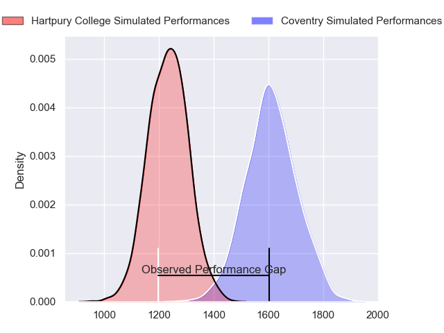
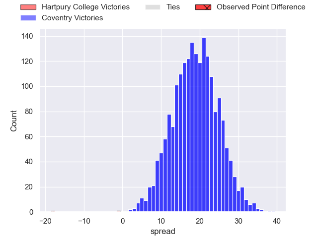
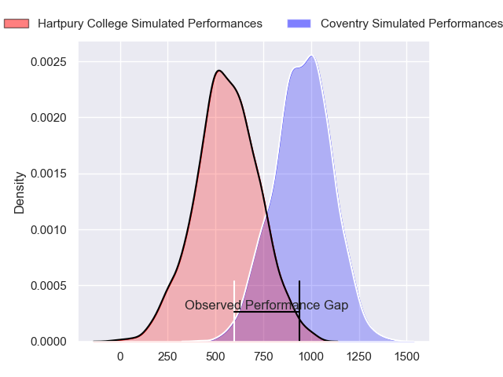
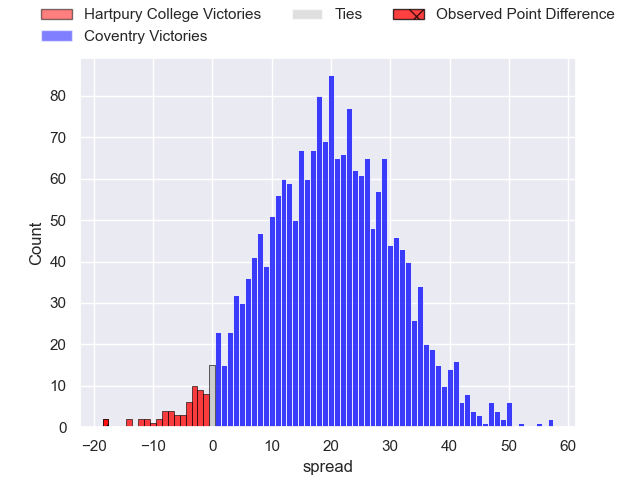
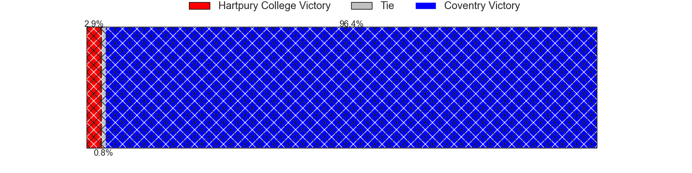
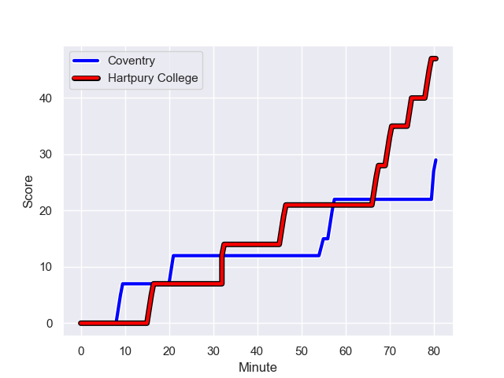
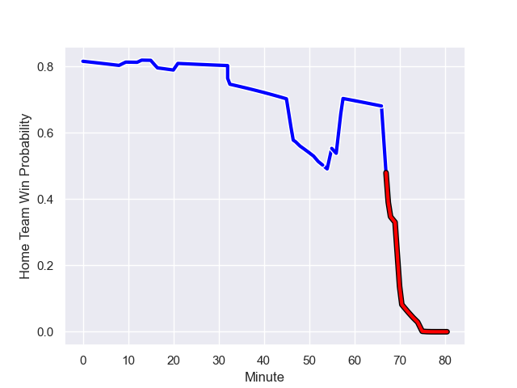

---  
layout: page  
title: Hartpury College at Coventry; 47-29  
date: 2023-12-02 18:00:00 -0500  
categories: "RFU Championship 2023" match review  
---
# Hartpury College at Coventry; 47-29

# Club Level Predictions

The first set of predictions treats a club as the smallest object, as the club develops its members, organizes a gameplan, and deploys its players as needed for each match. This club model has a prediction of 0.893, which translates to predicting Coventry to win by 18.9.

Each club has a rating and a rating deviation (similar to a Glicko rating), and expected performances can be generated. This allows for simulated matches and spreads like the ones below.
## Projected Performances - Club Model

## Projected Spreads - Club Model

## Projected Results - Club Model

# Player Level Predictions - Version 2

Treating teams instead as an entity made up of the currently active players, I have ratings for each player in an altogether different system. These can be combined to form team ratings once teamsheets are announced, weighting starters a bit higher than the reserves. After the match is played, players can be weighted by their minutes on the field, allowing for an accurate measure of the team's composition. With these compiled team ratings, we can make predictions, measure inaccuracy, and update the individual player ratings.
## Prediction with Player Minutes: Coventry by 16.5

Coventry by 13.3 on a neutral field
## Prediction without Player Minutes: Coventry by 16.3

Coventry by 13.0 on a neutral pitch

## Projected Performances - Player Model

## Projected Spreads - Player Model

## Projected Results - Player Model

## Scores over Time

## Win Probability over Time

There were 12 large changes in win probability in this match

|   Away Minutes | Away Player           |   Away elo |   Number |   Home elo | Home Player          |   Home Minutes |
|---------------:|:----------------------|-----------:|---------:|-----------:|:---------------------|---------------:|
|             63 | Aristot Benz-Salomon  |      45.09 |        1 |      45.15 | Elliott Chilvers     |             48 |
|             60 | William Crane         |      34.86 |        2 |      64.27 | Jordon Poole         |             59 |
|             74 | Jonathan Benz-Salomon |      40.89 |        3 |      46.25 | Eliot Salt           |             52 |
|             74 | Joe Owen              |      43.74 |        4 |      45.5  | James Tyas           |             80 |
|             80 | Jack Davies           |      41.74 |        5 |      45.86 | Rhys Anstey          |             52 |
|             80 | Samuel Lewis          |      12.35 |        6 |      76.41 | Tom Ball             |             80 |
|             80 | Jarrad Hayler         |      45.44 |        7 |      31.94 | Matt Kvesic          |             80 |
|             78 | Josh Gray             |      54.02 |        8 |      50.51 | Jack Bartlett        |             56 |
|             74 | Michael Austin        |      41.35 |        9 |     135.92 | Will Chudley         |             63 |
|             80 | Harry Bazalgette      |      56.45 |       10 |      81.48 | Patrick Pellegrini   |             80 |
|             80 | Jake Morris           |       7.84 |       11 |      46.65 | David Opoku-Fordjour |             68 |
|             80 | Tommy Mathews         |      30.79 |       12 |      61.13 | Fred Betteridge      |             52 |
|             13 | Jack Reeves           |      21.9  |       13 |      95.13 | Will Rigg            |             80 |
|             80 | Jack Johnson          |      46.52 |       14 |      42.47 | Ryan Hutler          |             80 |
|             48 | Ioan Jones            |      42.95 |       15 |      40.98 | Evan Mitchell        |             80 |
|             67 | Robbie Smith          |       9.02 |       16 |      42.23 | Arthur Cordwell      |             32 |
|             32 | Morgan Adderly-Jones  |      47.01 |       17 |      56.76 | Will Wand            |             28 |
|             20 | Andrew Davies         |      37.79 |       18 |      39.62 | Obinna Nkwocha       |             28 |
|             17 | Mikey Summerfield     |      50.99 |       19 |      46.65 | Vilikesa Nairau      |             28 |
|              6 | Alex Gibson           |      28.48 |       20 |      39.31 | Paddy Ryan           |             24 |
|              6 | Matty Jones           |      43.82 |       21 |      44.82 | Johnny Stewart       |             21 |
|              6 | Danny Eite            |      45.84 |       22 |      60.52 | Will Lane            |             17 |
|              2 | Cameron Cobbett       |      46.65 |       23 |      41.5  | Louis James          |             12 |

