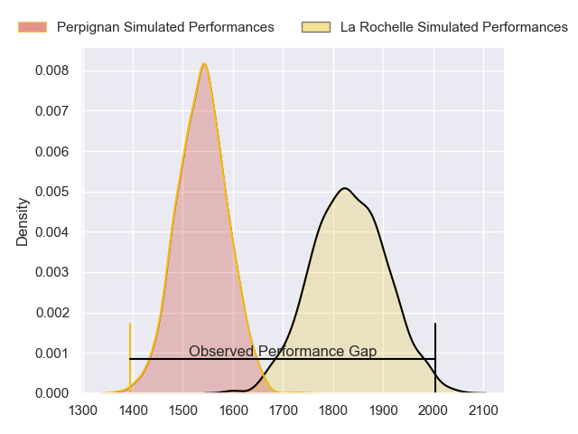
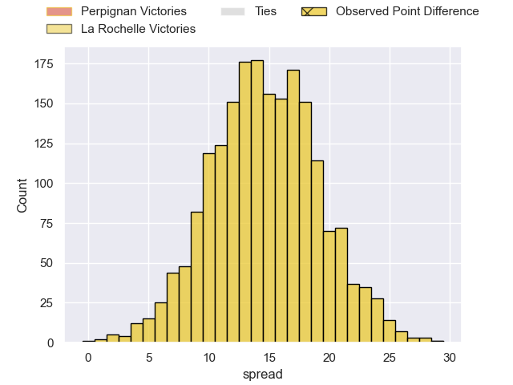
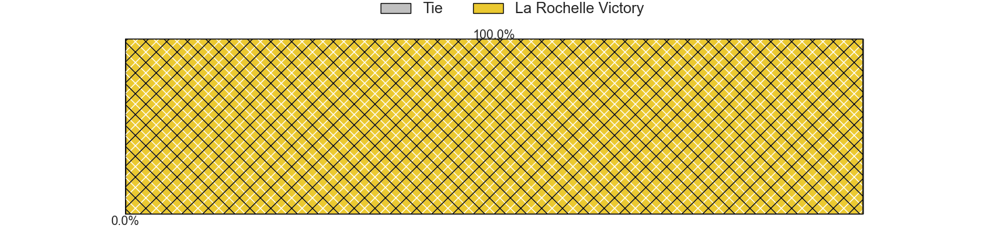
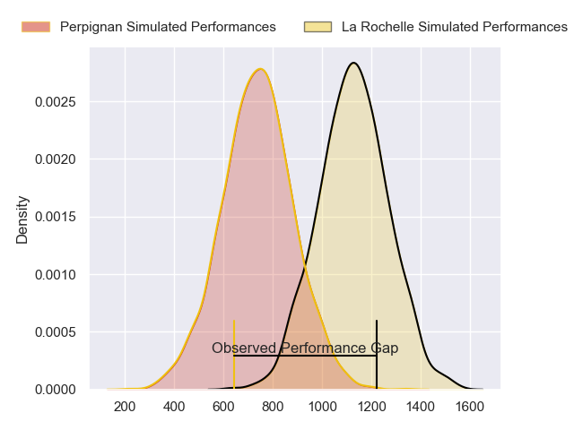
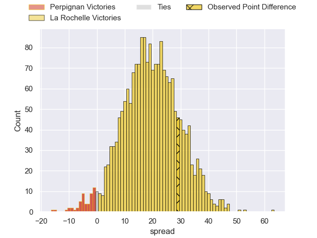
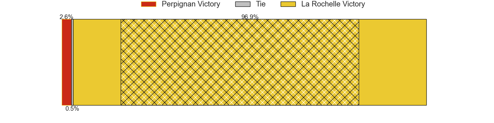
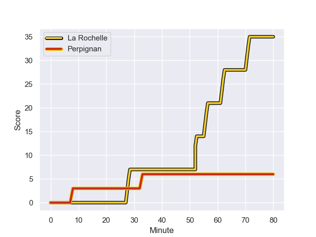
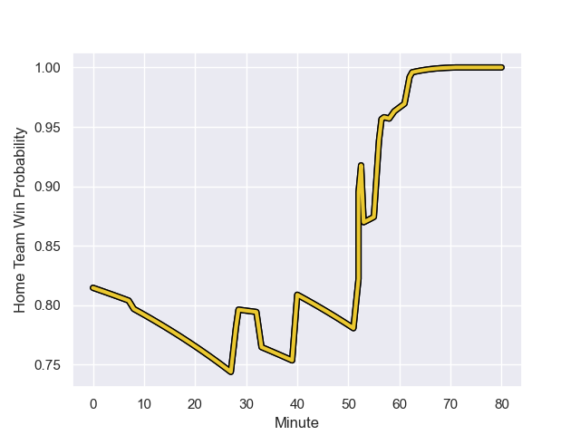

---  
layout: page  
title: Perpignan at La Rochelle; 6-35  
date: 2023-12-02 18:00:00 -0500  
categories: "Top 14 Orange 2023" match review  
---
# Perpignan at La Rochelle; 6-35

# Club Level Predictions

The first set of predictions treats a club as the smallest object, as the club develops its members, organizes a gameplan, and deploys its players as needed for each match. This club model has a prediction of 0.842, which translates to predicting La Rochelle to win by 14.7.

Each club has a rating and a rating deviation (similar to a Glicko rating), and expected performances can be generated. This allows for simulated matches and spreads like the ones below.
## Projected Performances - Club Model

## Projected Spreads - Club Model

## Projected Results - Club Model

# Player Level Predictions - Version 2

Treating teams instead as an entity made up of the currently active players, I have ratings for each player in an altogether different system. These can be combined to form team ratings once teamsheets are announced, weighting starters a bit higher than the reserves. After the match is played, players can be weighted by their minutes on the field, allowing for an accurate measure of the team's composition. With these compiled team ratings, we can make predictions, measure inaccuracy, and update the individual player ratings.
## Prediction with Player Minutes: La Rochelle by 16.2

La Rochelle by 11.4 on a neutral field
## Prediction without Player Minutes: La Rochelle by 14.4

La Rochelle by 9.6 on a neutral pitch

## Projected Performances - Player Model

## Projected Spreads - Player Model

## Projected Results - Player Model

## Scores over Time

## Win Probability over Time

There were 7 large changes in win probability in this match

|   Away Minutes | Away Player           |   Away elo |   Number |   Home elo | Home Player           |   Home Minutes |
|---------------:|:----------------------|-----------:|---------:|-----------:|:----------------------|---------------:|
|             47 | Sacha Lotrian         |      55.16 |        1 |      59.98 | Joel Sclavi           |             40 |
|             47 | Ignacio Ruiz          |      56.36 |        2 |      50.4  | Sacha Idoumi          |             40 |
|             59 | Pietro Ceccarelli     |      49.64 |        3 |     119.95 | Uini Atonio           |             53 |
|             59 | Jacobus van Tonder    |      53.51 |        4 |      42.67 | Remi Picquette        |             40 |
|             59 | Posolo Tuilagi        |      44.12 |        5 |      93.44 | Will Skelton          |             80 |
|             80 | Patrick Sobela        |      67.73 |        6 |      29.7  | Judicael Cancoriet    |             80 |
|             80 | Kelian Galletier      |      42.05 |        7 |      51.54 | Ultan Dillane         |             58 |
|             40 | Joaquin Oviedo        |      56.57 |        8 |      27.12 | Paul Boudehent        |             80 |
|             52 | Sadek Deghmache       |      31.06 |        9 |      61.56 | Teddy Iribaren        |             40 |
|             80 | Jake McIntyre         |      64.26 |       10 |      42.25 | Hugo Reus             |             40 |
|             80 | Ali Crossdale         |      44.79 |       11 |      98.83 | Dillyn Leyds          |             80 |
|             59 | Jeronimo de la Fuente |     112.13 |       12 |      63.59 | Jules Favre           |             40 |
|             80 | Edward Sawailau       |     -22.74 |       13 |      33.31 | Ihaia West            |             80 |
|             80 | Tavite Veredamu       |      38.33 |       14 |      95.74 | Jack Nowell           |             80 |
|             80 | Tommaso Allan         |      52.85 |       15 |     111.89 | Brice Dulin           |             80 |
|             33 | Giorgi Tetrashvili    |      19.28 |       16 |      77.22 | Reda Wardi            |             40 |
|             33 | Seilala Lam           |      61    |       17 |      68.54 | Pierre Bourgarit      |             40 |
|             28 | Tom Ecochard          |      57.98 |       18 |      56.24 | Thomas Lavault        |             40 |
|             21 | Nemo Roelofse         |      40.88 |       19 |     103.87 | Tawera Kerr-Barlow    |             40 |
|             21 | Afusipa Taumoepeau    |      69.45 |       20 |      42.22 | Antoine Hastoy        |             40 |
|             21 | Tristan Labouteley    |      44.13 |       21 |     106.99 | Jonathan Danty        |             40 |
|             21 | Lucas Velarte         |      29.75 |       22 |      15.88 | Georges-Henri Colombe |             27 |
|             40 | So'otala Fa'aso'o     |      84.66 |       23 |      49.96 | Yoan Tanga            |             22 |

