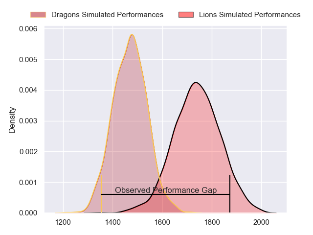
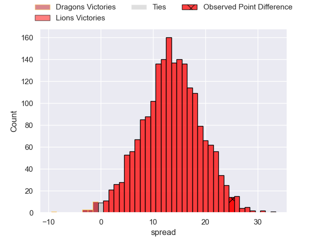
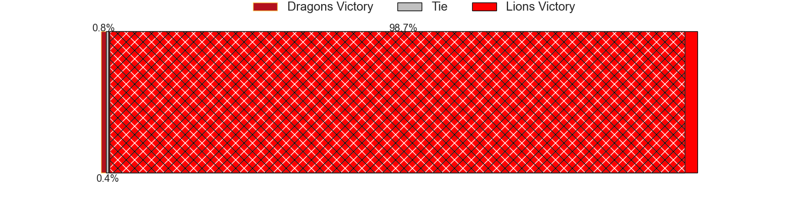
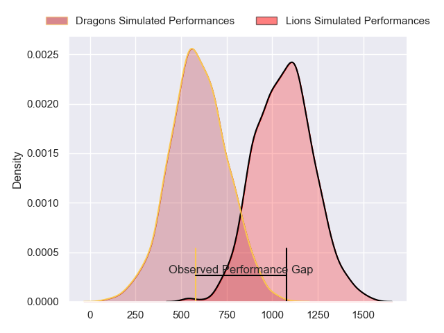
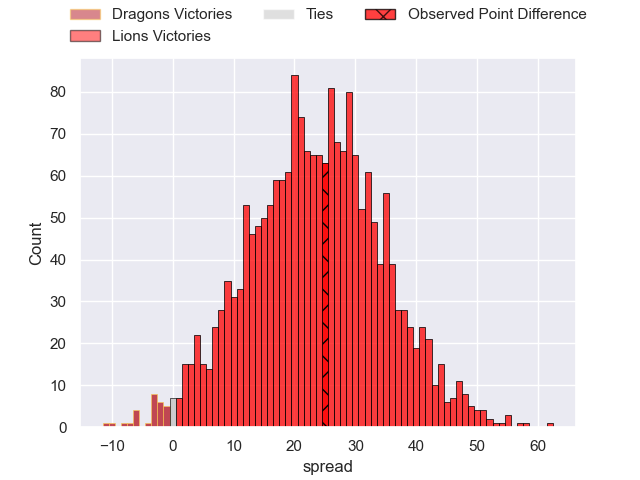
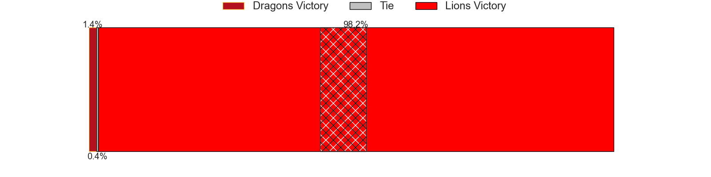
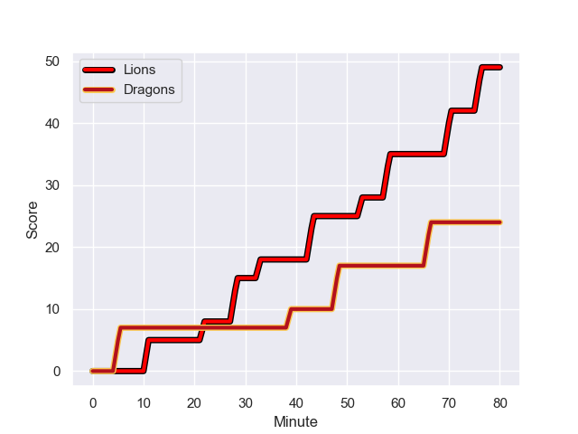
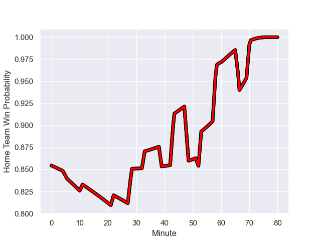

---  
layout: page  
title: Dragons at Lions; 24-49  
date: 2023-12-02 18:00:00 -0500  
categories: "United Rugby Championship 2023" match review  
---
# Dragons at Lions; 24-49

# Club Level Predictions

The first set of predictions treats a club as the smallest object, as the club develops its members, organizes a gameplan, and deploys its players as needed for each match. This club model has a prediction of 0.822, which translates to predicting Lions to win by 13.6.

Each club has a rating and a rating deviation (similar to a Glicko rating), and expected performances can be generated. This allows for simulated matches and spreads like the ones below.
## Projected Performances - Club Model

## Projected Spreads - Club Model

## Projected Results - Club Model

# Player Level Predictions - Version 2

Treating teams instead as an entity made up of the currently active players, I have ratings for each player in an altogether different system. These can be combined to form team ratings once teamsheets are announced, weighting starters a bit higher than the reserves. After the match is played, players can be weighted by their minutes on the field, allowing for an accurate measure of the team's composition. With these compiled team ratings, we can make predictions, measure inaccuracy, and update the individual player ratings.
## Prediction with Player Minutes: Lions by 19.5

Lions by 15.9 on a neutral field
## Prediction without Player Minutes: Lions by 19.6

Lions by 15.9 on a neutral pitch

## Projected Performances - Player Model

## Projected Spreads - Player Model

## Projected Results - Player Model

## Scores over Time

## Win Probability over Time

There were 7 large changes in win probability in this match

|   Away Minutes | Away Player       |   Away elo |   Number |   Home elo | Home Player           |   Home Minutes |
|---------------:|:------------------|-----------:|---------:|-----------:|:----------------------|---------------:|
|             61 | Rhodri Jones      |      23.06 |        1 |      56.96 | Jean-Pierre Smith     |             54 |
|             80 | Bradley Roberts   |      41.23 |        2 |      45.61 | PJ Botha              |             54 |
|             65 | Lloyd Fairbrother |      25.99 |        3 |      31.45 | Asenathi Ntlabakanye  |             62 |
|             66 | Matthew Screech   |      -2.25 |        4 |      81.9  | Ruben Schoeman        |             80 |
|             80 | George Nott       |      34.74 |        5 |      43.93 | Ruan Delport          |             80 |
|             60 | Sean Lonsdale     |      33.92 |        6 |      50.62 | Emmanuel Tshituka     |             57 |
|             60 | Harrison Keddie   |     -10.59 |        7 |      78.63 | Ruan Venter           |             52 |
|             80 | Aaron Wainwright  |      67.78 |        8 |     108.68 | Francke Horn          |             73 |
|             62 | Rhodri Williams   |      70.81 |        9 |      42.54 | Morne Van den Berg    |             80 |
|             80 | Will Reed         |      41.34 |       10 |      94.61 | Sanele Nohamba        |             80 |
|             80 | Ashton Hewitt     |      63.58 |       11 |      74.58 | Edwill van der Merwe  |             80 |
|             73 | Aneurin Owen      |      48.15 |       12 |      82.86 | Marius Louw           |             80 |
|             80 | Steffan Hughes    |      67.2  |       13 |      61.17 | Henco van Wyk         |             80 |
|             80 | Rio Dyer          |      26.62 |       14 |      36.54 | Richard Kriel         |             68 |
|             60 | Jordan Williams   |      54.99 |       15 |      78.06 | Quan Horn             |             73 |
|             20 | Ewan Rosser       |      47.47 |       16 |      45.65 | Willem Alberts        |             28 |
|             20 | James Benjamin    |      31    |       17 |      51.45 | Jaco Visagie          |             26 |
|             20 | Ryan Woodman      |      42.45 |       18 |      82.58 | Corne Fourie          |             26 |
|             19 | Aki Seiuli        |      28.42 |       19 |      86.42 | Hanru Sirgel          |             23 |
|             18 | Dane Blacker      |      27.23 |       20 |      62.39 | Ruan Smith            |             18 |
|             15 | Luke Yendle       |      47.99 |       21 |      53.32 | Rabz Maxwane          |             12 |
|             14 | Joseph Davies     |      27.82 |       22 |      60.49 | Johannes JC Pretorius |              7 |
|              7 | Corey Baldwin     |      10.41 |       23 |      40.81 | Jordan Hendrikse      |              7 |

