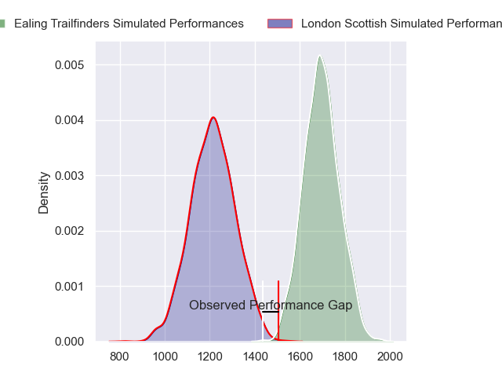
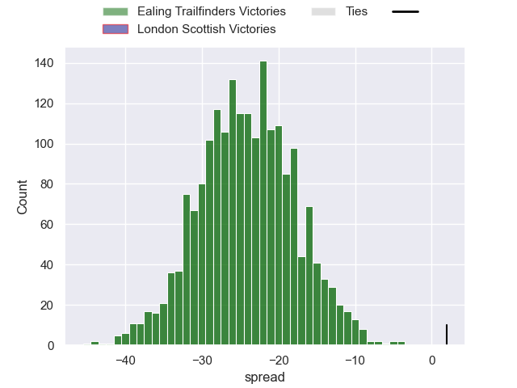
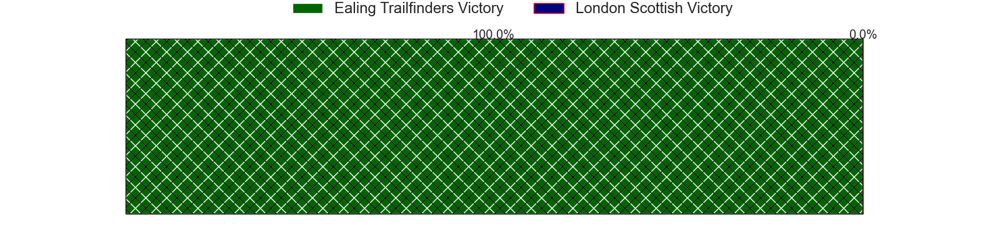
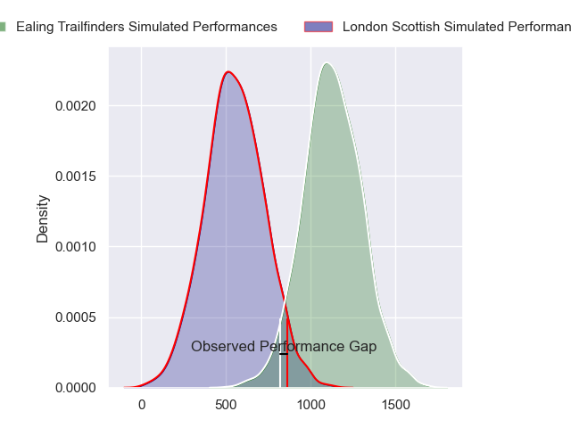
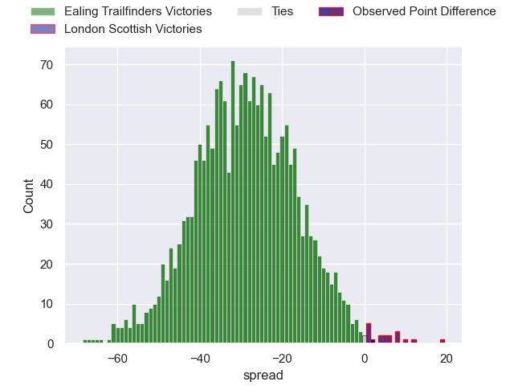
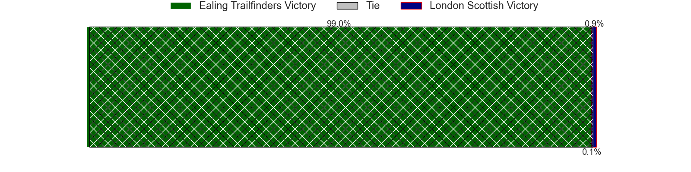
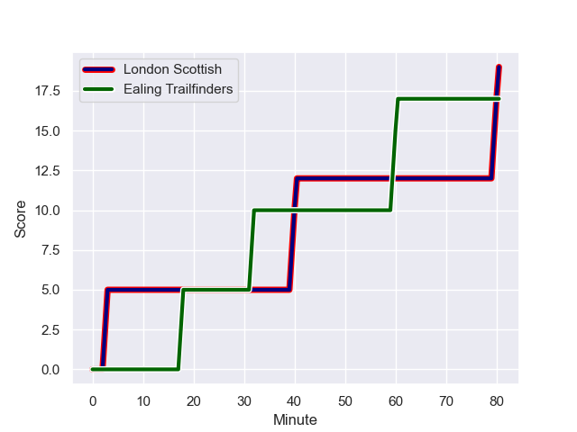
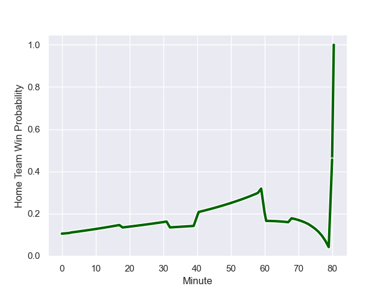

---  
layout: page  
title: Ealing Trailfinders at London Scottish; 17-19  
date: 2023-12-02 18:00:00 -0500  
categories: "RFU Championship 2023" match review  
---
# Ealing Trailfinders at London Scottish; 17-19

# Club Level Predictions

The first set of predictions treats a club as the smallest object, as the club develops its members, organizes a gameplan, and deploys its players as needed for each match. This club model has a prediction of 0.063, which translates to predicting Ealing Trailfinders to win by 24.2.

Each club has a rating and a rating deviation (similar to a Glicko rating), and expected performances can be generated. This allows for simulated matches and spreads like the ones below.
## Projected Performances - Club Model

## Projected Spreads - Club Model

## Projected Results - Club Model

# Player Level Predictions - Version 2

Treating teams instead as an entity made up of the currently active players, I have ratings for each player in an altogether different system. These can be combined to form team ratings once teamsheets are announced, weighting starters a bit higher than the reserves. After the match is played, players can be weighted by their minutes on the field, allowing for an accurate measure of the team's composition. With these compiled team ratings, we can make predictions, measure inaccuracy, and update the individual player ratings.
## Prediction with Player Minutes: Ealing Trailfinders by 23.8

Ealing Trailfinders by 27.1 on a neutral field
## Prediction without Player Minutes: Ealing Trailfinders by 23.1

Ealing Trailfinders by 26.5 on a neutral pitch

## Projected Performances - Player Model

## Projected Spreads - Player Model

## Projected Results - Player Model

## Scores over Time

## Win Probability over Time

There were 7 large changes in win probability in this match

|   Away Minutes | Away Player          |   Away elo |   Number |   Home elo | Home Player          |   Home Minutes |
|---------------:|:---------------------|-----------:|---------:|-----------:|:---------------------|---------------:|
|             68 | Will Goodrick-Clarke |      37.4  |        1 |      48.4  | Will Prior           |             51 |
|             46 | Mike Willemse        |      56.15 |        2 |      40.94 | Jack Musk            |             80 |
|             68 | Biyi Alo             |      80.53 |        3 |      32.62 | Ashley Challenger    |             51 |
|             80 | Barney Maddison      |      90.11 |        4 |      23.58 | Matas Jurevicius     |             80 |
|             46 | Daniel Cutmore       |      70.92 |        5 |      44.13 | Harry Browne         |             74 |
|             80 | Ollie Newman         |      57.64 |        6 |      22.68 | Will Trenholm        |             80 |
|             51 | Simon Uzokwe         |      86.96 |        7 |      16.28 | Jack Ingall          |             80 |
|             80 | Callum Chick         |      31.27 |        8 |      30.32 | Tom Marshall         |             59 |
|             59 | Craig Hampson        |      77.32 |        9 |      28.09 | Stephen Kerins       |             80 |
|             80 | Craig Willis         |     121.41 |       10 |      45.53 | Alexander Lloyd-Seed |             80 |
|             80 | Tom Collins          |     101.24 |       11 |     -19.14 | Noah Ferdinand       |             66 |
|             80 | Billy Twelvetrees    |      81.3  |       12 |      42.35 | Bryn Bradley         |             80 |
|             80 | Reuben Bird-Tulloch  |      64.14 |       13 |      27.01 | Hayden Hyde          |             80 |
|             80 | Jonah Holmes         |      74.47 |       14 |      63.54 | Will Brown           |             80 |
|             80 | Cian Kelleher        |     106.89 |       15 |      15.12 | Cameron Anderson     |             80 |
|             34 | Bobby de Wee         |      87.36 |       16 |      45.25 | William Hobson       |             29 |
|             34 | Matthew Cornish      |      51.79 |       17 |      36.77 | Jordan Els           |             29 |
|             29 | Richard Hardwick     |      47.95 |       18 |      36.69 | Zach Carr            |             21 |
|             21 | Jordan Burns         |      75.51 |       19 |      33.9  | Edward Coulson       |             14 |
|             12 | Kyle John Whyte      |      66.91 |       20 |      35.44 | Lewis Barrett        |              6 |
|             12 | Ross Kane            |      51.12 |       21 |     nan    | nan                  |            nan |

