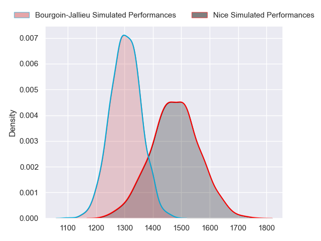
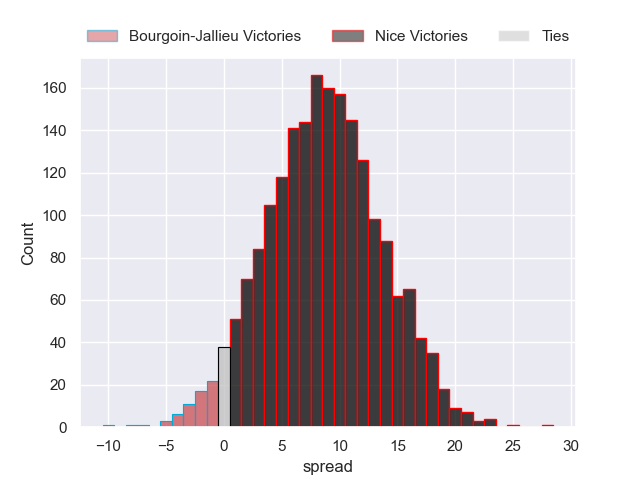
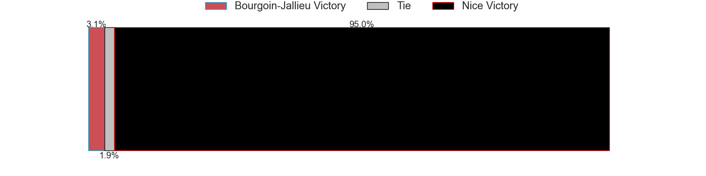
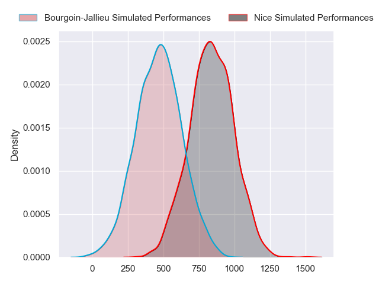
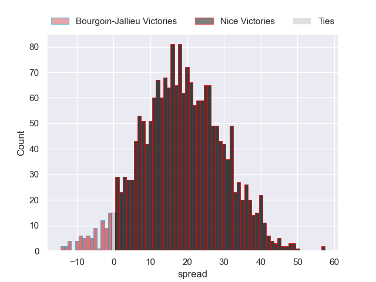
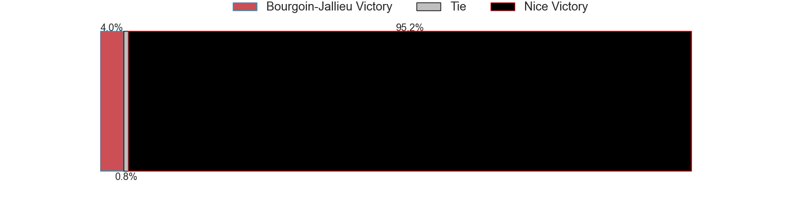
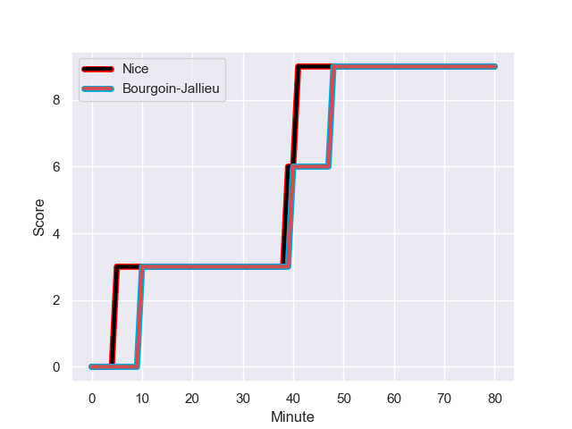
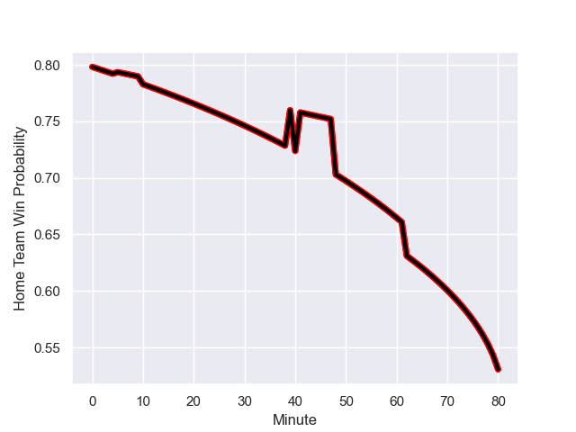

---  
layout: page  
title: Bourgoin-Jallieu at Nice; 9-9  
date: 2023-12-02 18:00:00 -0500  
categories: "Nationale 2023" match review  
---
# Bourgoin-Jallieu at Nice; 9-9

# Club Level Predictions

The first set of predictions treats a club as the smallest object, as the club develops its members, organizes a gameplan, and deploys its players as needed for each match. This club model has a prediction of 0.729, which translates to predicting Nice to win by 8.7.

Each club has a rating and a rating deviation (similar to a Glicko rating), and expected performances can be generated. This allows for simulated matches and spreads like the ones below.
## Projected Performances - Club Model

## Projected Spreads - Club Model

## Projected Results - Club Model

# Player Level Predictions - Version 2

Treating teams instead as an entity made up of the currently active players, I have ratings for each player in an altogether different system. These can be combined to form team ratings once teamsheets are announced, weighting starters a bit higher than the reserves. After the match is played, players can be weighted by their minutes on the field, allowing for an accurate measure of the team's composition. With these compiled team ratings, we can make predictions, measure inaccuracy, and update the individual player ratings.
## Prediction with Player Minutes: Nice by 15.2

Nice by 12.0 on a neutral field
## Prediction without Player Minutes: Nice by 14.8

Nice by 11.6 on a neutral pitch

## Projected Performances - Player Model

## Projected Spreads - Player Model

## Projected Results - Player Model

## Scores over Time

## Win Probability over Time

There were 5 large changes in win probability in this match

|   Away Minutes | Away Player              |   Away elo |   Number |   Home elo | Home Player              |   Home Minutes |
|---------------:|:-------------------------|-----------:|---------:|-----------:|:-------------------------|---------------:|
|             55 | Romain Favaretto         |      38.03 |        1 |      60.39 | Sunia Vola               |             65 |
|             63 | Killian Tripier          |      51.73 |        2 |      58.38 | Sione Anga'aelangi       |             65 |
|             63 | Osman Dimen              |      37.58 |        3 |      33.09 | Luvuyo Pupuma            |             49 |
|             80 | Robin Gascou             |      38.82 |        4 |      62.32 | Yann Tivoli              |             34 |
|             80 | Morgan Eames             |     -19.03 |        5 |      56.79 | Martin Freytes           |             55 |
|             40 | Kevin Chaudouard         |      37.35 |        6 |      58.51 | Arthur Vignolles         |             80 |
|             63 | Kevin Rivoire            |      57.71 |        7 |      17.43 | Bastien Berenguel        |             80 |
|             80 | Poutasi Luafutu          |      33.81 |        8 |      74.53 | Laijiasa Bolenaivalu     |             49 |
|             80 | Jeremy Gondrand          |      52.68 |        9 |      55.49 | Jules Solinas            |             75 |
|             62 | Nicolas Vuillemin        |      49.55 |       10 |      53.28 | Romain Riguet            |             80 |
|             80 | Quentin Lefort           |      18.38 |       11 |      53.52 | Simon Delas              |             80 |
|             80 | Aviata Silago            |      26.76 |       12 |      58.19 | Nathan Courtade          |             80 |
|             80 | Brieuc Plessis-Couillaud |      23.77 |       13 |      49.67 | Luca Cutayar             |             65 |
|             80 | Paul-Hugo Champ          |      33.84 |       14 |      73.66 | Andrzej Charlat          |             80 |
|             80 | Remi Bouet               |      17.59 |       15 |      42.68 | Pierre Le Huby           |             80 |
|             25 | Zhorzhi (Jorji) Saldadze |      31.47 |       16 |      31.22 | Jules Martinez           |             15 |
|             17 | Mohamed Khribache        |      21.88 |       17 |      41.17 | Pierre Strippoli         |             15 |
|             17 | Oktay Yilmaz             |      47.56 |       18 |      47.86 | Nicolas Ciancio          |             31 |
|             40 | Léandre Cotte            |       3.67 |       19 |       3.54 | Thibault Rey             |             46 |
|             17 | Bynjamin Rabatel         |      58.89 |       20 |      66.24 | Adrien Vigne             |             25 |
|             18 | Pieter Morton            |      47.22 |       21 |      52.46 | Ramiha Tarrel Tia Smiler |             31 |
|            nan | nan                      |     nan    |       22 |      23.03 | Matéo Jeune-Joly         |              5 |
|            nan | nan                      |     nan    |       23 |      56.48 | Mathis Viard             |             15 |

