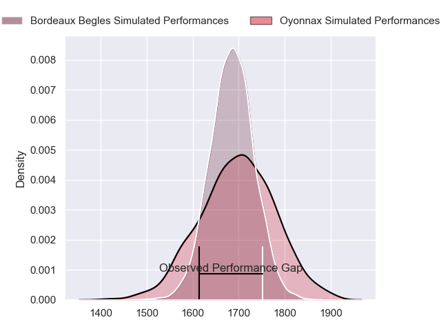
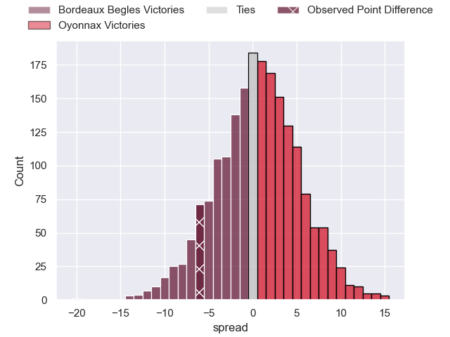
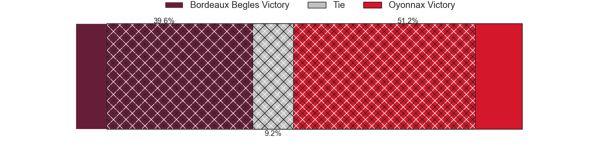
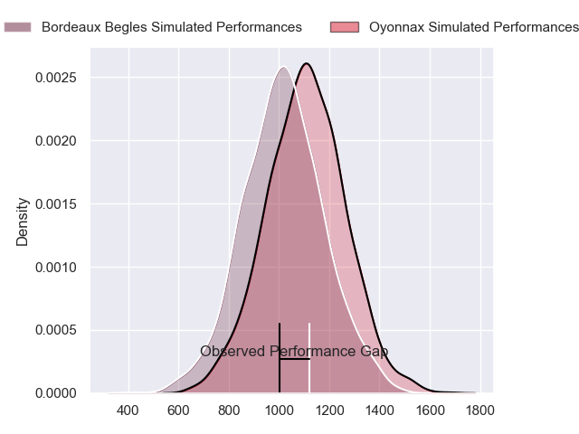
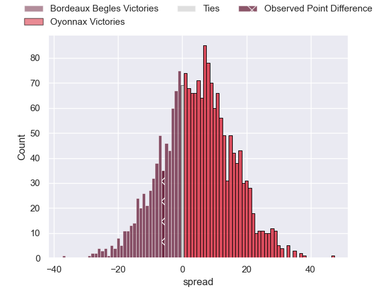
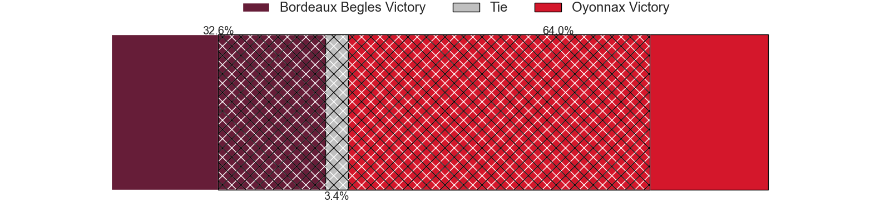
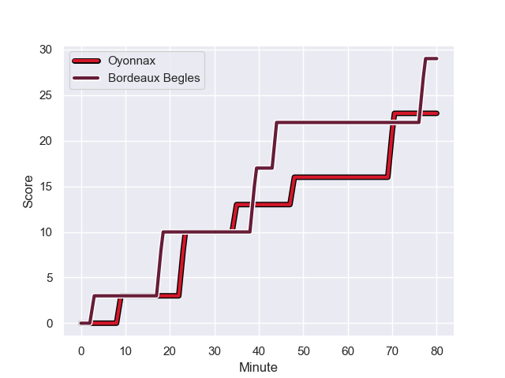
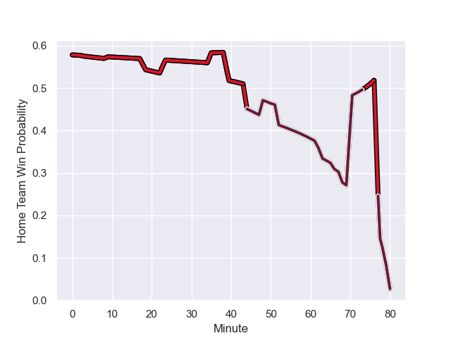

---  
layout: page  
title: Bordeaux Begles at Oyonnax; 29-23  
date: 2023-12-02 18:00:00 -0500  
categories: "Top 14 Orange 2023" match review  
---
# Bordeaux Begles at Oyonnax; 29-23

# Club Level Predictions

The first set of predictions treats a club as the smallest object, as the club develops its members, organizes a gameplan, and deploys its players as needed for each match. This club model has a prediction of 0.521, which translates to predicting Oyonnax to win by 0.7.

Each club has a rating and a rating deviation (similar to a Glicko rating), and expected performances can be generated. This allows for simulated matches and spreads like the ones below.
## Projected Performances - Club Model

## Projected Spreads - Club Model

## Projected Results - Club Model

# Player Level Predictions - Version 2

Treating teams instead as an entity made up of the currently active players, I have ratings for each player in an altogether different system. These can be combined to form team ratings once teamsheets are announced, weighting starters a bit higher than the reserves. After the match is played, players can be weighted by their minutes on the field, allowing for an accurate measure of the team's composition. With these compiled team ratings, we can make predictions, measure inaccuracy, and update the individual player ratings.
## Prediction with Player Minutes: Oyonnax by 3.5

Bordeaux Begles by 1.3 on a neutral field
## Prediction without Player Minutes: Oyonnax by 4.1

Bordeaux Begles by 0.6 on a neutral pitch

## Projected Performances - Player Model

## Projected Spreads - Player Model

## Projected Results - Player Model

## Scores over Time

## Win Probability over Time

There were 11 large changes in win probability in this match

|   Away Minutes | Away Player          |   Away elo |   Number |   Home elo | Home Player        |   Home Minutes |
|---------------:|:---------------------|-----------:|---------:|-----------:|:-------------------|---------------:|
|             51 | Ugo Boniface         |      63.76 |        1 |      66.03 | Tommy Raynaud      |             62 |
|             66 | Maxime Lamothe       |      52.07 |        2 |      45.41 | Teddy Durand       |             79 |
|             51 | Carlu Sadie          |      33.1  |        3 |      41.25 | Christopher Vaotoa |             52 |
|             62 | Guido Petti          |      68.87 |        4 |     104.32 | Phoenix Battye     |             62 |
|             80 | Kane Douglas         |      52.65 |        5 |      57.26 | Hugo Fabregue      |             80 |
|             80 | Pierre Bochaton      |      66.07 |        6 |      45.98 | Wandrille Picault  |             41 |
|             51 | Marko Gazzotti       |      54.08 |        7 |      57.56 | Loïc Credoz        |             80 |
|             80 | Tevita Tatafu        |      63.02 |        8 |      67.99 | Rory Grice         |             62 |
|             80 | Maxime Lucu          |     112.81 |        9 |      91.66 | Jonathan Ruru      |             62 |
|             80 | Matthieu Jalibert    |     102.41 |       10 |      93.02 | Domingo Miotti     |             80 |
|             80 | Louis Bielle-Biarrey |      61.77 |       11 |      65.15 | Daniel Ikpefan     |             68 |
|             80 | Yoram Moefana        |      59.11 |       12 |      79.4  | Lucas Mensa        |             80 |
|             80 | Nicolas Depoortere   |      57.26 |       13 |      77.8  | Theo Millet        |             80 |
|             80 | Damian Penaud        |      90.32 |       14 |      86.25 | Darren Sweetnam    |             80 |
|             63 | Nans Ducuing         |      68.38 |       15 |      45.18 | Justin Bouraux     |             80 |
|             29 | Mahamadou Diaby      |      59.82 |       16 |      46.41 | Kevin Lebreton     |             39 |
|             29 | Jefferson Poirot     |      55.4  |       17 |      39.8  | Ali Oz             |             28 |
|             29 | Ben Tameifuna        |      85.81 |       18 |      74.93 | Charlie Cassang    |             18 |
|             18 | Alexandre Ricard     |      44.2  |       19 |      30.53 | Loic Godener       |             18 |
|             17 | Romain Buros         |      91.02 |       20 |      48.64 | Rory Sutherland    |             18 |
|             14 | Romain Laterrade     |      27.62 |       21 |      22.21 | Victor Lebas       |             18 |
|            nan | nan                  |     nan    |       22 |      54.84 | Maxime Salles      |             12 |
|            nan | nan                  |     nan    |       23 |      32.54 | Benjamin Geledan   |              1 |

