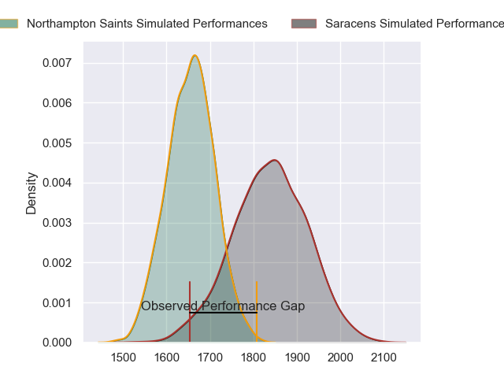
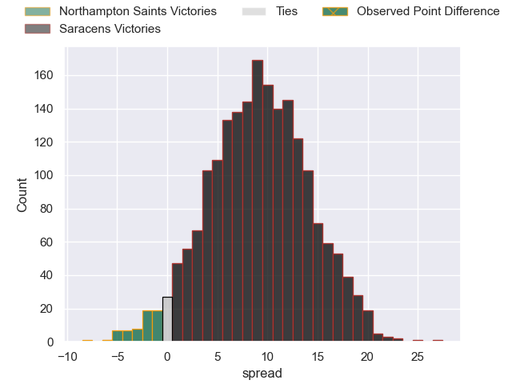
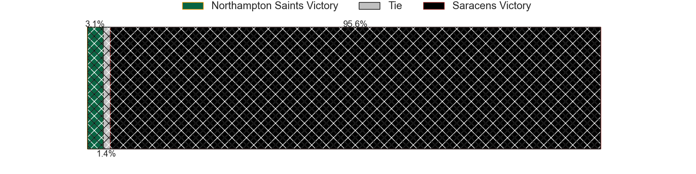
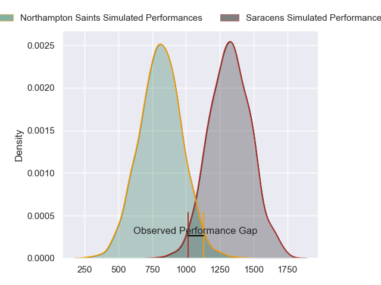
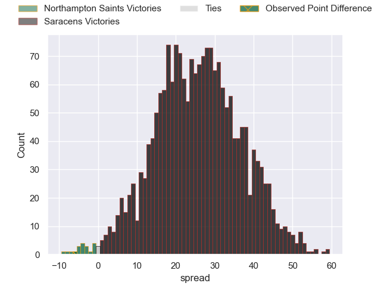
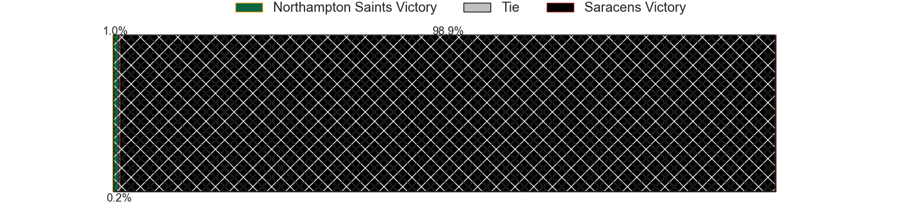
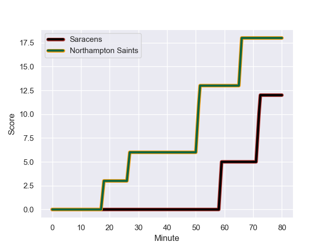
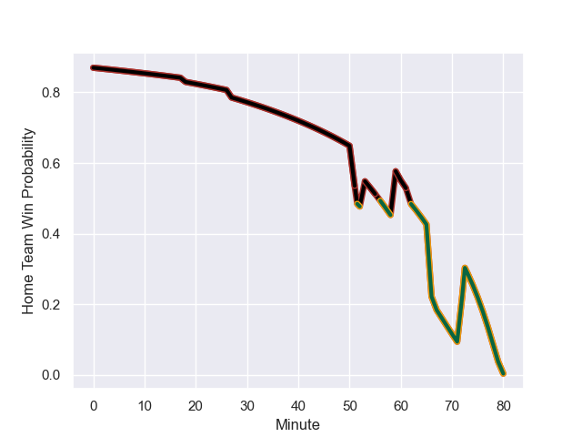

---  
layout: page  
title: Northampton Saints at Saracens; 18-12  
date: 2023-12-02 18:00:00 -0500  
categories: "Gallagher Premiership 2023" match review  
---
# Northampton Saints at Saracens; 18-12

# Club Level Predictions

The first set of predictions treats a club as the smallest object, as the club develops its members, organizes a gameplan, and deploys its players as needed for each match. This club model has a prediction of 0.74, which translates to predicting Saracens to win by 9.2.

Each club has a rating and a rating deviation (similar to a Glicko rating), and expected performances can be generated. This allows for simulated matches and spreads like the ones below.
## Projected Performances - Club Model

## Projected Spreads - Club Model

## Projected Results - Club Model

# Player Level Predictions - Version 2

Treating teams instead as an entity made up of the currently active players, I have ratings for each player in an altogether different system. These can be combined to form team ratings once teamsheets are announced, weighting starters a bit higher than the reserves. After the match is played, players can be weighted by their minutes on the field, allowing for an accurate measure of the team's composition. With these compiled team ratings, we can make predictions, measure inaccuracy, and update the individual player ratings.
## Prediction with Player Minutes: Saracens by 20.9

Saracens by 16.2 on a neutral field
## Prediction without Player Minutes: Saracens by 19.8

Saracens by 15.1 on a neutral pitch

## Projected Performances - Player Model

## Projected Spreads - Player Model

## Projected Results - Player Model

## Scores over Time

## Win Probability over Time

There were 17 large changes in win probability in this match

|   Away Minutes | Away Player         |   Away elo |   Number |   Home elo | Home Player          |   Home Minutes |
|---------------:|:--------------------|-----------:|---------:|-----------:|:---------------------|---------------:|
|             53 | Ethan Waller        |      64.31 |        1 |      47.94 | Tom West             |             46 |
|             53 | Sam Matavesi        |      56.96 |        2 |      51.54 | Theo Dan             |             46 |
|             66 | Trevor Davison      |      11.79 |        3 |      43.78 | Alec Clarey          |             46 |
|             40 | Chunya Munga        |      48.58 |        4 |     113.34 | Maro Itoje           |             80 |
|             60 | Alex Coles          |      17.33 |        5 |      47.92 | Theo McFarland       |             53 |
|             80 | Courtney Lawes      |      89.01 |        6 |      93.08 | Juan Martin Gonzalez |             80 |
|             80 | Tom Pearson         |      81.04 |        7 |      50.92 | Andy Christie        |             67 |
|             80 | Sam Graham          |      81.12 |        8 |     130.66 | Billy Vunipola       |             80 |
|             53 | Tom James           |      11.75 |        9 |      72.57 | Ivan van Zyl         |             61 |
|             80 | Fin Smith           |      43.7  |       10 |      52.68 | Manu Vunipola        |             80 |
|             80 | Ollie Sleightholme  |      74    |       11 |      96.06 | Tom Parton           |             80 |
|             80 | Fraser Dingwall     |      48.03 |       12 |     115.07 | Nick Tompkins        |             80 |
|             80 | Tommy Freeman       |      66.06 |       13 |      59.7  | Lucio Cinti          |             60 |
|             62 | Tom Seabrook        |      -2.58 |       14 |      95.61 | Sean Maitland        |             67 |
|             80 | George Furbank      |      62.29 |       15 |      87.79 | Alex Goode           |             80 |
|             27 | Alex Waller         |      93.28 |       16 |     122.75 | Mako Vunipola        |             34 |
|             27 | Curtis Langdon      |      55.89 |       17 |     115.1  | Jamie George         |             34 |
|             14 | Elliot Millar-Mills |      42.57 |       18 |      63.84 | Christian Judge      |             34 |
|             40 | Temo Mayanavanua    |      66.02 |       19 |      48.29 | Hugh Tizard          |             27 |
|             20 | Angus Scott-Young   |      39.24 |       20 |      32.62 | Toby Knight          |             13 |
|             27 | Alex Mitchell       |      67.93 |       21 |      61.33 | Aled Davies          |             19 |
|             18 | George Hendy        |      61.34 |       22 |      32.57 | Olly Hartley         |             20 |
|            nan | nan                 |     nan    |       23 |      55.72 | Alex Lewington       |             13 |

