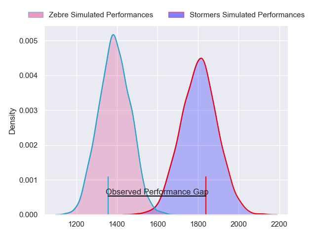
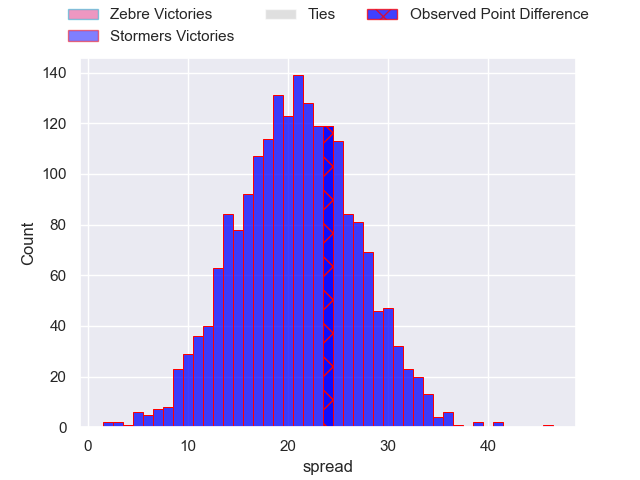
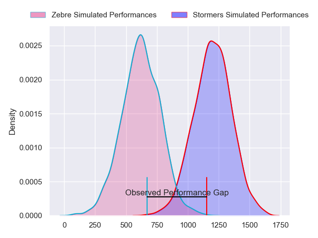
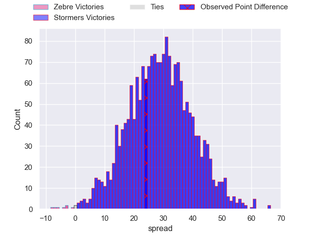
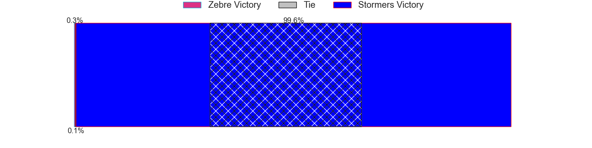
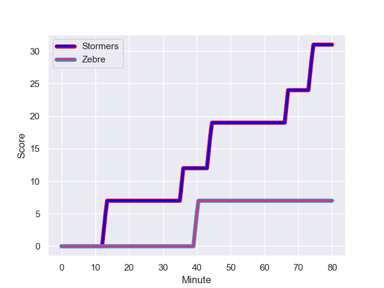
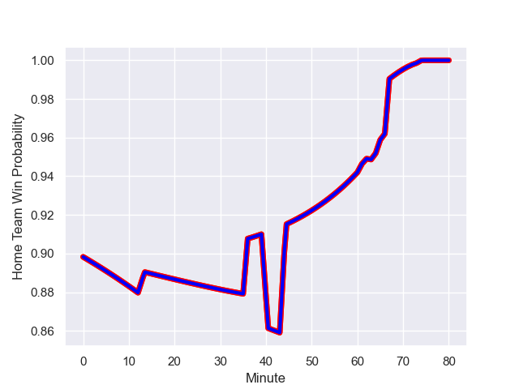

---  
layout: page  
title: Zebre at Stormers; 7-31  
date: 2023-12-02 18:00:00 -0500  
categories: "United Rugby Championship 2023" match review  
---
# Zebre at Stormers; 7-31

# Club Level Predictions

The first set of predictions treats a club as the smallest object, as the club develops its members, organizes a gameplan, and deploys its players as needed for each match. This club model has a prediction of 0.911, which translates to predicting Stormers to win by 20.8.

Each club has a rating and a rating deviation (similar to a Glicko rating), and expected performances can be generated. This allows for simulated matches and spreads like the ones below.
## Projected Performances - Club Model

## Projected Spreads - Club Model

## Projected Results - Club Model

# Player Level Predictions - Version 2

Treating teams instead as an entity made up of the currently active players, I have ratings for each player in an altogether different system. These can be combined to form team ratings once teamsheets are announced, weighting starters a bit higher than the reserves. After the match is played, players can be weighted by their minutes on the field, allowing for an accurate measure of the team's composition. With these compiled team ratings, we can make predictions, measure inaccuracy, and update the individual player ratings.
## Prediction with Player Minutes: Stormers by 24.0

Stormers by 20.2 on a neutral field
## Prediction without Player Minutes: Stormers by 23.9

Stormers by 20.1 on a neutral pitch

## Projected Performances - Player Model

## Projected Spreads - Player Model

## Projected Results - Player Model

## Scores over Time

## Win Probability over Time

There were 4 large changes in win probability in this match

|   Away Minutes | Away Player             |   Away elo |   Number |   Home elo | Home Player               |   Home Minutes |
|---------------:|:------------------------|-----------:|---------:|-----------:|:--------------------------|---------------:|
|             61 | Danilo Fischetti        |      47.93 |        1 |      46.26 | Kwenzokuhle Ndumiso Blose |             46 |
|             61 | Luca Bigi               |      49.77 |        2 |      50.82 | Joseph Dweba              |             50 |
|             52 | Matteo Nocera           |       6.56 |        3 |      54.7  | Neethling Fouche          |             63 |
|             61 | Matteo Canali           |      66.07 |        4 |      71.33 | Adre Smith                |             63 |
|             80 | Andrea Zambonin         |      36.58 |        5 |      47.12 | Ruben van Heerden         |             80 |
|             80 | Guido Volpi             |      52.94 |        6 |      88.67 | Deon Fourie               |             46 |
|             80 | Bautista Stavile Bravin |      42.54 |        7 |      96.38 | Hacjivah Dayimani         |             80 |
|             61 | Taina Fox-Matamua       |      55.16 |        8 |      71.36 | Evan Roos                 |             80 |
|             61 | Alessandro Fusco        |      30.6  |        9 |      85.21 | Herschel Jantjies         |             56 |
|             80 | Giovanni Montemauri     |       5.99 |       10 |      73.85 | Manie Libbok              |             80 |
|             80 | Simone Gesi             |      15.06 |       11 |      75.9  | Leolin Zas                |             76 |
|             80 | Franco Smith            |      41.97 |       12 |     108.29 | Damian Willemse           |             80 |
|             65 | Luca Morisi             |      89.89 |       13 |      45.2  | Ruhan Nel                 |             80 |
|             80 | Jacopo Trulla           |      19.32 |       14 |      95.99 | Courtnall Skosan          |             61 |
|             80 | Geronimo Prisciantelli  |      73.76 |       15 |     110.61 | Warrick Gelant            |             80 |
|             28 | Muhamed Hasa            |      47.36 |       16 |      72.92 | Alistair Vermaak          |             34 |
|             19 | Giampietro Ribaldi      |      36.97 |       17 |      38.52 | Marcel Theunissen         |             34 |
|             19 | Thomas Dominguez        |      46.38 |       18 |      53.47 | Andre-Hugo Venter         |             30 |
|             19 | Luca Rizzoli            |      32.36 |       19 |      69.51 | Paul de Wet               |             24 |
|             19 | Giovanni Licata         |      43.26 |       20 |      55.06 | Suleiman  Hartzenberg     |             19 |
|             19 | Leonard Krumov          |      -3.81 |       21 |     121.98 | Brok Harris               |             17 |
|             15 | Scott Gregory           |      49.3  |       22 |      41.21 | Connor Evans              |             17 |
|            nan | nan                     |     nan    |       23 |      86.68 | Clayton Blommetjies       |              4 |

