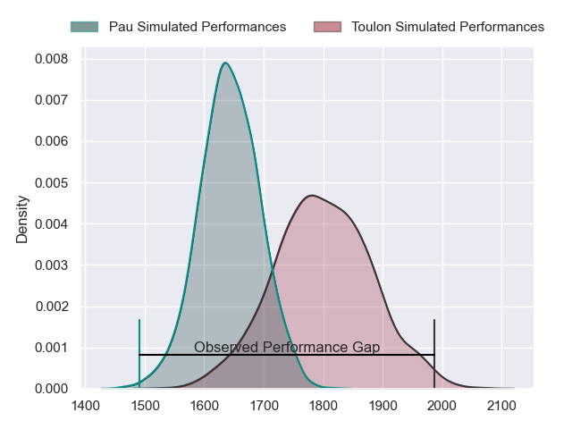
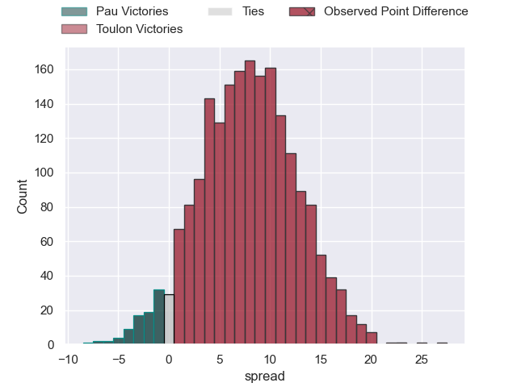
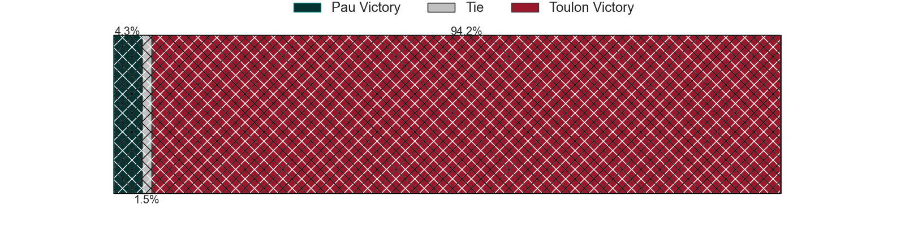
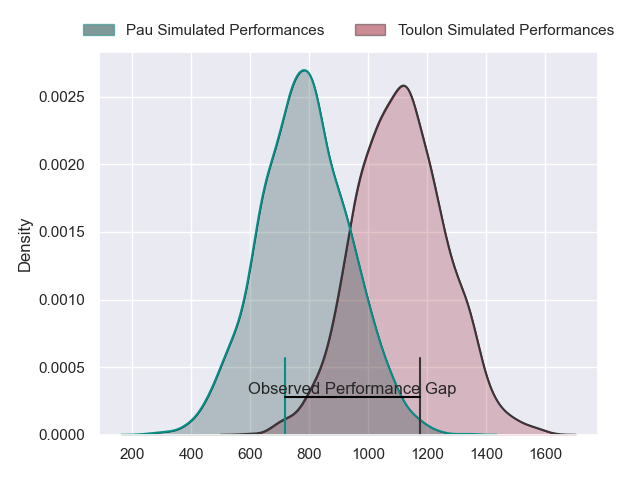
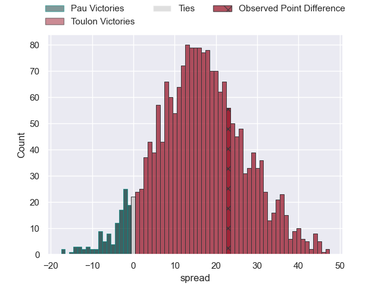
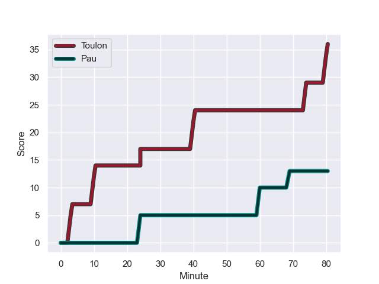
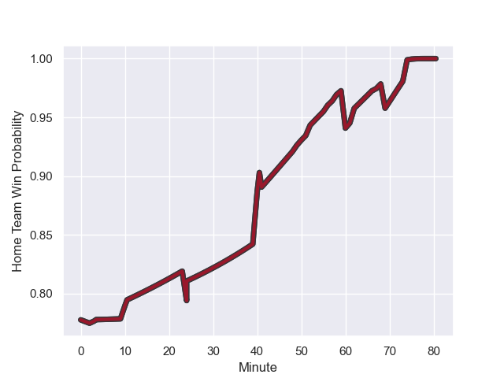

---  
layout: page  
title: Pau at Toulon; 13-36  
date: 2023-12-02 18:00:00 -0500  
categories: "Top 14 Orange 2023" match review  
---
# Pau at Toulon; 13-36

# Club Level Predictions

The first set of predictions treats a club as the smallest object, as the club develops its members, organizes a gameplan, and deploys its players as needed for each match. This club model has a prediction of 0.705, which translates to predicting Toulon to win by 7.7.

Each club has a rating and a rating deviation (similar to a Glicko rating), and expected performances can be generated. This allows for simulated matches and spreads like the ones below.
## Projected Performances - Club Model

## Projected Spreads - Club Model

## Projected Results - Club Model

# Player Level Predictions - Version 2

Treating teams instead as an entity made up of the currently active players, I have ratings for each player in an altogether different system. These can be combined to form team ratings once teamsheets are announced, weighting starters a bit higher than the reserves. After the match is played, players can be weighted by their minutes on the field, allowing for an accurate measure of the team's composition. With these compiled team ratings, we can make predictions, measure inaccuracy, and update the individual player ratings.
## Prediction with Player Minutes: Toulon by 13.7

Toulon by 9.0 on a neutral field
## Prediction without Player Minutes: Toulon by 13.5

Toulon by 8.7 on a neutral pitch

## Projected Performances - Player Model

## Projected Spreads - Player Model

## Projected Results - Player Model

## Scores over Time

## Win Probability over Time

There were 3 large changes in win probability in this match

|   Away Minutes | Away Player         |   Away elo |   Number |   Home elo | Home Player                    |   Home Minutes |
|---------------:|:--------------------|-----------:|---------:|-----------:|:-------------------------------|---------------:|
|             49 | Siegfried Fisi'ihoi |      49    |        1 |      75.06 | Dany Priso                     |             51 |
|             49 | Lucas Rey           |      44.49 |        2 |      83.78 | Christopher Tolofua            |             56 |
|             49 | Guram Papidze       |      32.32 |        3 |      54.87 | Beka Gigashvili                |             56 |
|             52 | Guillaume Ducat     |      35.44 |        4 |      45.95 | Matthias Halagahu              |             51 |
|             58 | Fabrice Metz        |      68.81 |        5 |      75.53 | David Ribbans                  |             80 |
|             80 | Sacha Zegueur       |      30.07 |        6 |      46.74 | Mattéo Le Corvec               |             51 |
|             80 | Thibault Hamonou    |      29.37 |        7 |      42.53 | Esteban Abadie                 |             80 |
|             80 | Beka Gorgadze       |      63.18 |        8 |      76.06 | Cornell du Preez               |             62 |
|             52 | Dan Robson          |     112.95 |        9 |      94.76 | Baptiste Serin                 |             67 |
|             41 | Axel Desperes       |      46.71 |       10 |      66.3  | Enzo Herve                     |             80 |
|             80 | Théo Attissogbe     |      46.5  |       11 |      76.91 | Gabin Villiere                 |             80 |
|             80 | Nathan Decron       |      58.91 |       12 |      25.33 | Mathieu Smaili                 |             62 |
|             80 | Emilien Gailleton   |      65.85 |       13 |     125.92 | Waisea Nayacalevu Vuidravuwalu |             80 |
|             80 | Samuel Ezeala       |      24.4  |       14 |      47.12 | Seta Tuicuvu                   |             80 |
|             80 | Jack Maddocks       |      62.92 |       15 |      46.45 | Marius Domon                   |             80 |
|             39 | Joe Simmonds        |      95.23 |       16 |      43.11 | Bruce Devaux                   |             29 |
|             31 | Nicolas Corato      |      32.43 |       17 |      52.78 | Jules Coulon                   |             29 |
|             31 | Remi Seneca         |      61.26 |       18 |      69.49 | Brian Alainu'uese              |             29 |
|             31 | Romain Ruffenach    |      39.2  |       19 |      70.4  | Emerick Setiano                |             24 |
|             28 | Hugo Auradou        |      31.45 |       20 |      76.75 | Jiuta Wainiqolo                |             18 |
|             28 | Thibault Daubagna   |      89.19 |       21 |      82.86 | Jack Singleton                 |             24 |
|             22 | Brent Liufau        |      46.15 |       22 |      99.06 | Facundo Isa                    |             18 |
|            nan | nan                 |     nan    |       23 |      64.98 | Ben White                      |             13 |

