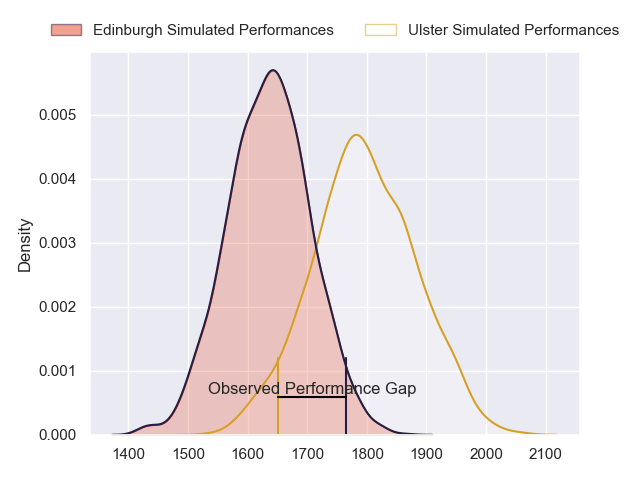
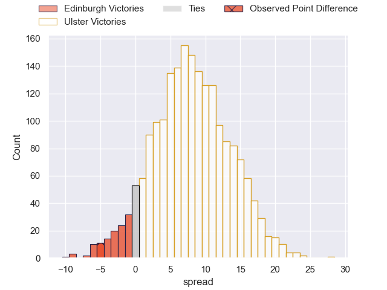
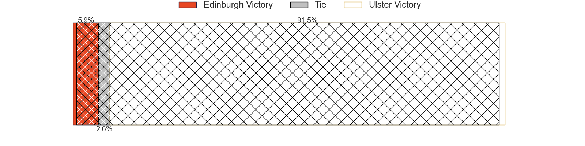
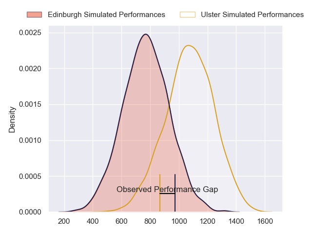
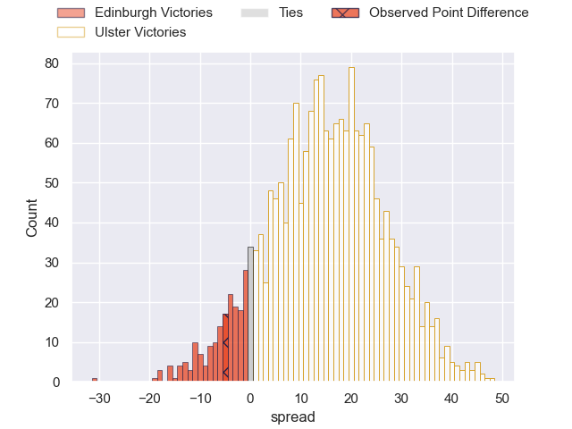
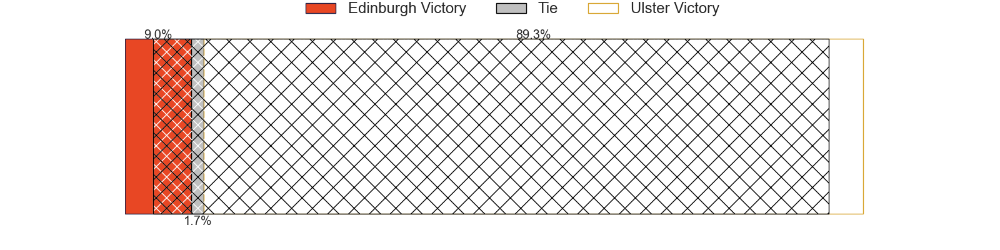
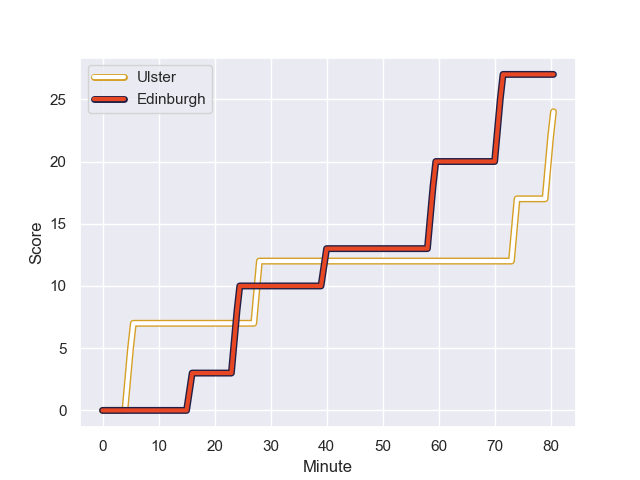
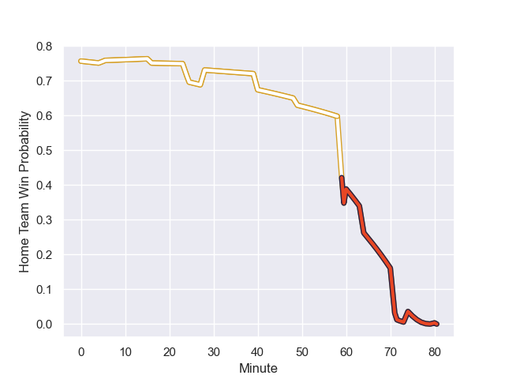

---  
layout: page  
title: Edinburgh at Ulster; 27-22  
date: 2023-12-02 18:00:00 -0500  
categories: "United Rugby Championship 2023" match review  
---
# Edinburgh at Ulster; 27-22

# Club Level Predictions

The first set of predictions treats a club as the smallest object, as the club develops its members, organizes a gameplan, and deploys its players as needed for each match. This club model has a prediction of 0.711, which translates to predicting Ulster to win by 8.0.

Each club has a rating and a rating deviation (similar to a Glicko rating), and expected performances can be generated. This allows for simulated matches and spreads like the ones below.
## Projected Performances - Club Model

## Projected Spreads - Club Model

## Projected Results - Club Model

# Player Level Predictions - Version 2

Treating teams instead as an entity made up of the currently active players, I have ratings for each player in an altogether different system. These can be combined to form team ratings once teamsheets are announced, weighting starters a bit higher than the reserves. After the match is played, players can be weighted by their minutes on the field, allowing for an accurate measure of the team's composition. With these compiled team ratings, we can make predictions, measure inaccuracy, and update the individual player ratings.
## Prediction with Player Minutes: Ulster by 12.6

Ulster by 8.3 on a neutral field
## Prediction without Player Minutes: Ulster by 11.9

Ulster by 7.6 on a neutral pitch

## Projected Performances - Player Model

## Projected Spreads - Player Model

## Projected Results - Player Model

## Scores over Time

## Win Probability over Time

There were 9 large changes in win probability in this match

|   Away Minutes | Away Player     |   Away elo |   Number |   Home elo | Home Player       |   Home Minutes |
|---------------:|:----------------|-----------:|---------:|-----------:|:------------------|---------------:|
|             64 | Pierre Schoeman |      44.5  |        1 |      93.14 | Steven Kitshoff   |             60 |
|             64 | Ewan Ashman     |      36.85 |        2 |      39.21 | Tom Stewart       |             74 |
|             64 | WP Nel          |      90.99 |        3 |      49.31 | Tom O'Toole       |             55 |
|             80 | Marshall Sykes  |      38.22 |        4 |      86.99 | Alan O'Connor     |             80 |
|             55 | Jamie Hodgson   |      52.57 |        5 |      58.42 | Kieran Treadwell  |             74 |
|             55 | Luke Crosbie    |      69.29 |        6 |      53.26 | Matthew Rea       |             80 |
|             80 | Jamie Ritchie   |     120    |        7 |      69.08 | Nick Timoney      |             80 |
|             80 | Viliame Mata    |      36.88 |        8 |      45.16 | James  McNabney   |             49 |
|             60 | Ben Vellacott   |      48.15 |        9 |      75.14 | John Cooney       |             49 |
|             80 | Ben Healy       |      45.52 |       10 |      70.08 | Billy Burns       |             80 |
|             80 | Wes Goosen      |      65.06 |       11 |      58.76 | Jacob Stockdale   |             65 |
|             80 | James Lang      |      55.21 |       12 |      76.07 | Stuart McCloskey  |             80 |
|             80 | Matt Currie     |      44.39 |       13 |      55.44 | James Hume        |             80 |
|             80 | Harry Paterson  |      29.92 |       14 |      48.18 | Robert Baloucoune |             80 |
|             80 | Tim Swiel       |      16.34 |       15 |      82.82 | Will Addison      |             80 |
|             25 | Hamish Watson   |      49.86 |       16 |      46.72 | Nathan Doak       |             31 |
|             25 | Glen Young      |       5.69 |       17 |     100.63 | Dave Ewers        |             31 |
|             20 | Ali Price       |      68.07 |       18 |      76.67 | Marty Moore       |             25 |
|             16 | Javan Sebastian |      42.43 |       19 |      47.44 | Andrew Warwick    |             20 |
|             16 | Adam McBurney   |      41.49 |       20 |      56.87 | Ben Moxham        |             15 |
|             16 | Robin Hislop    |      31.67 |       21 |      47.21 | Cormac Izuchukwu  |              6 |
|            nan | nan             |     nan    |       22 |      47.04 | John Andrew       |              6 |

