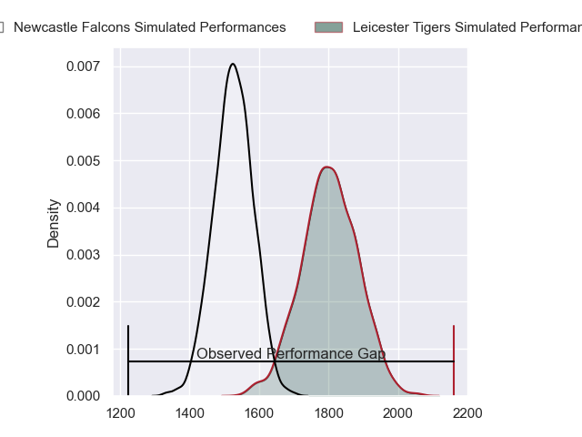
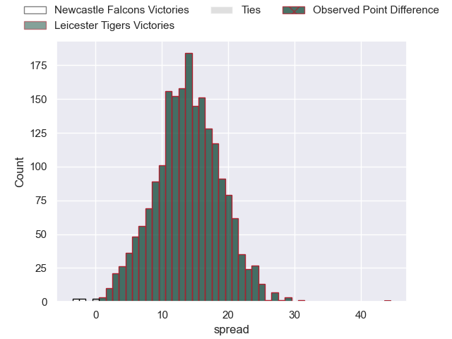
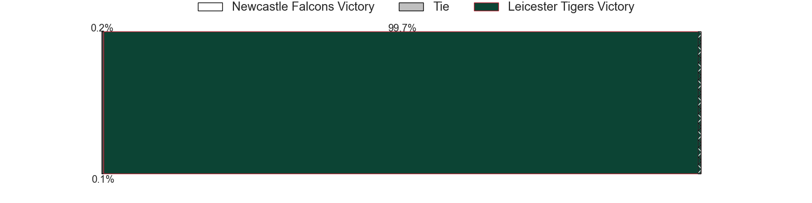
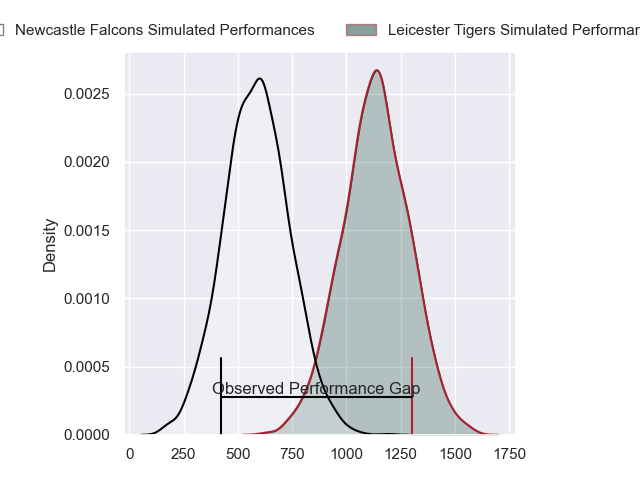
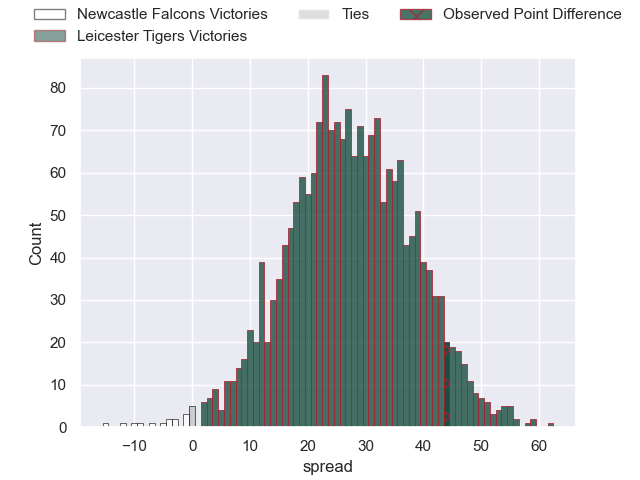
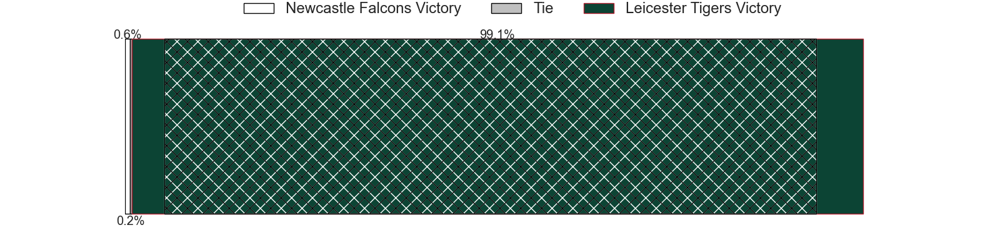
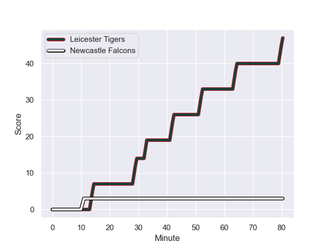
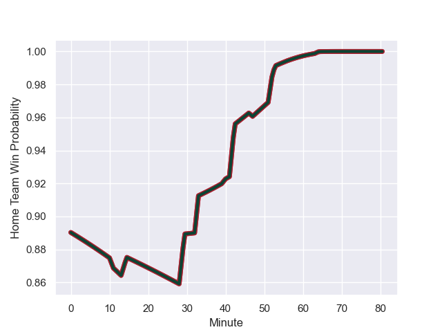

---  
layout: page  
title: Newcastle Falcons at Leicester Tigers; 3-47  
date: 2023-12-03 18:00:00 -0500  
categories: "Gallagher Premiership 2023" match review  
---
# Newcastle Falcons at Leicester Tigers; 3-47

# Club Level Predictions

The first set of predictions treats a club as the smallest object, as the club develops its members, organizes a gameplan, and deploys its players as needed for each match. This club model has a prediction of 0.827, which translates to predicting Leicester Tigers to win by 13.8.

Each club has a rating and a rating deviation (similar to a Glicko rating), and expected performances can be generated. This allows for simulated matches and spreads like the ones below.
## Projected Performances - Club Model

## Projected Spreads - Club Model

## Projected Results - Club Model

# Player Level Predictions - Version 2

Treating teams instead as an entity made up of the currently active players, I have ratings for each player in an altogether different system. These can be combined to form team ratings once teamsheets are announced, weighting starters a bit higher than the reserves. After the match is played, players can be weighted by their minutes on the field, allowing for an accurate measure of the team's composition. With these compiled team ratings, we can make predictions, measure inaccuracy, and update the individual player ratings.
## Prediction with Player Minutes: Leicester Tigers by 22.9

Leicester Tigers by 17.8 on a neutral field
## Prediction without Player Minutes: Leicester Tigers by 23.6

Leicester Tigers by 18.5 on a neutral pitch

## Projected Performances - Player Model

## Projected Spreads - Player Model

## Projected Results - Player Model

## Scores over Time

## Win Probability over Time

|   Away Minutes | Away Player         |   Away elo |   Number |   Home elo | Home Player           |   Home Minutes |
|---------------:|:--------------------|-----------:|---------:|-----------:|:----------------------|---------------:|
|             47 | Adam Brocklebank    |      14.79 |        1 |      54.92 | Francois van Wyk      |             62 |
|             62 | Jamie Blamire       |      27.26 |        2 |      91.54 | Julian Montoya        |             62 |
|             63 | Eduardo Bello       |       8.82 |        3 |      47.99 | Dan Cole              |             57 |
|             47 | John Hawkins        |      24.97 |        4 |      63.23 | Harry Wells           |             80 |
|             80 | Sebastian de Chaves |      14.53 |        5 |      59.34 | Ollie Chessum         |             53 |
|             80 | Pedro Rubiolo       |      42.18 |        6 |      76.6  | Hanro Liebenberg      |             80 |
|             53 | Sam Cross           |      39.34 |        7 |      66.27 | Tommy Reffell         |             80 |
|             80 | Callum Chick        |      31.27 |        8 |      80.2  | Jasper Wiese          |             62 |
|             56 | James Elliott       |     -10.92 |        9 |      68.96 | Ben Youngs            |             53 |
|             80 | Louie Johnson       |      46.16 |       10 |     100.13 | Handre Pollard        |             53 |
|             40 | Louis Brown         |      55.36 |       11 |      67.87 | Ollie Hassell-Collins |             80 |
|             53 | Matias Moroni       |     111.78 |       12 |      70.39 | Dan Kelly             |             80 |
|             80 | Tom Penny           |      77.94 |       13 |      71.3  | Matt Scott            |             53 |
|             80 | Adam Radwan         |      65.64 |       14 |      56.99 | Freddie Steward       |             80 |
|             80 | Elliott Obatoyinbo  |      28.54 |       15 |      90.3  | Mike Brown            |             80 |
|             33 | Phil Brantingham    |      35.65 |       16 |      45.7  | James Whitcombe       |             18 |
|             18 | Bryan Byrne         |      57.29 |       17 |      20.94 | Charlie Clare         |             18 |
|             17 | Murray McCallum     |      54.16 |       18 |      43.62 | Will Hurd             |             23 |
|             33 | Tim Cardall         |      40.52 |       19 |      99.08 | Sam Carter            |             27 |
|             27 | Freddie Lockwood    |      40.75 |       20 |      76.72 | Matt Rogerson         |             18 |
|             24 | Sam Stuart          |      -8    |       21 |      36.32 | Tom Whiteley          |             27 |
|             40 | Rory Jennings       |      47.89 |       22 |      28.58 | James Shillcock       |             27 |
|             27 | Oliver Spencer      |      46.12 |       23 |      45.66 | Solomone Kata         |             27 |

