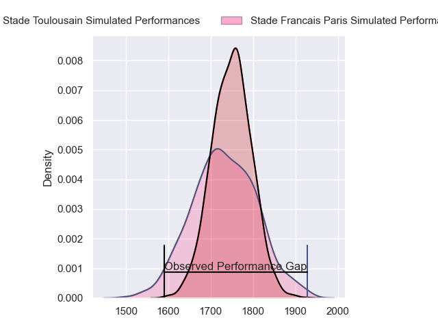
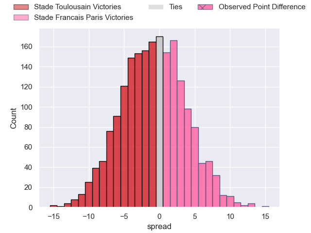
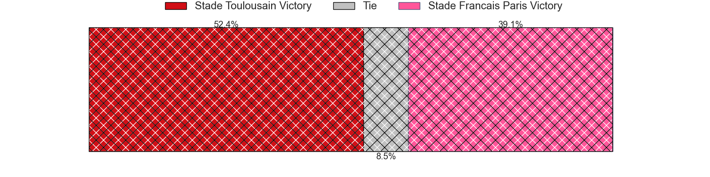
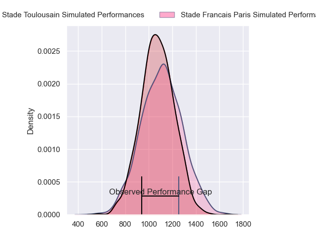
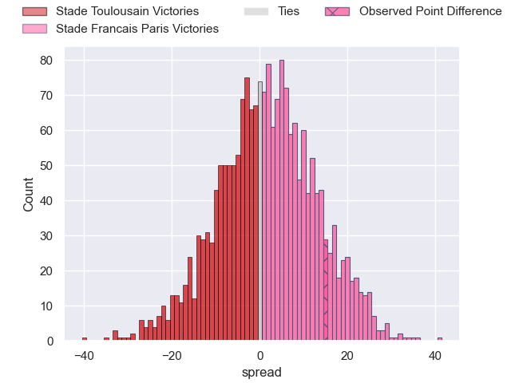
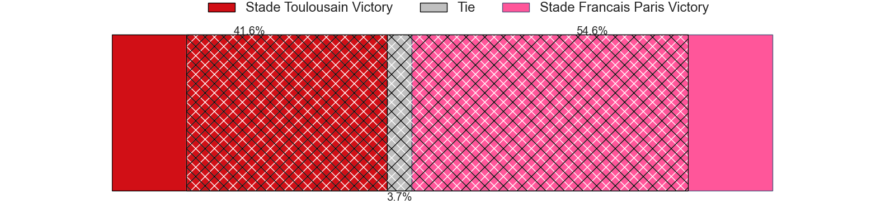
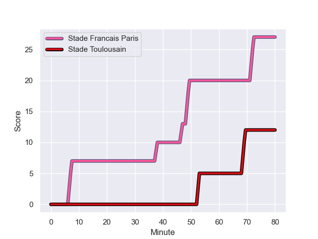
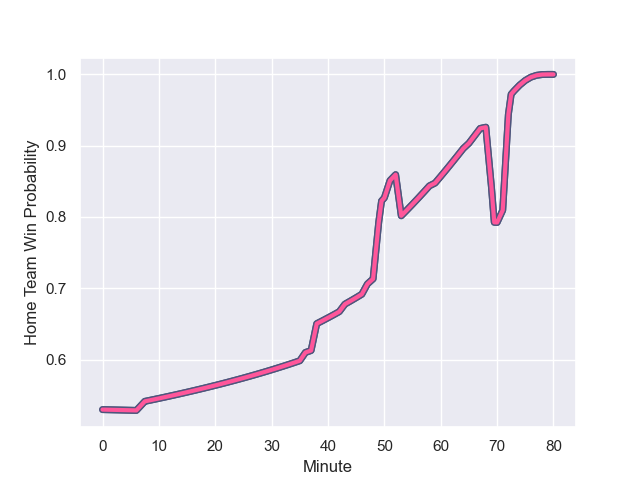

---  
layout: page  
title: Stade Toulousain at Stade Francais Paris; 12-27  
date: 2023-12-03 18:00:00 -0500  
categories: "Top 14 Orange 2023" match review  
---
# Stade Toulousain at Stade Francais Paris; 12-27

# Club Level Predictions

The first set of predictions treats a club as the smallest object, as the club develops its members, organizes a gameplan, and deploys its players as needed for each match. This club model has a prediction of 0.481, which translates to predicting Stade Toulousain to win by 0.7.

Each club has a rating and a rating deviation (similar to a Glicko rating), and expected performances can be generated. This allows for simulated matches and spreads like the ones below.
## Projected Performances - Club Model

## Projected Spreads - Club Model

## Projected Results - Club Model

# Player Level Predictions - Version 2

Treating teams instead as an entity made up of the currently active players, I have ratings for each player in an altogether different system. These can be combined to form team ratings once teamsheets are announced, weighting starters a bit higher than the reserves. After the match is played, players can be weighted by their minutes on the field, allowing for an accurate measure of the team's composition. With these compiled team ratings, we can make predictions, measure inaccuracy, and update the individual player ratings.
## Prediction with Player Minutes: Stade Francais Paris by 1.3

Stade Toulousain by 3.8 on a neutral field
## Prediction without Player Minutes: Stade Francais Paris by 1.0

Stade Toulousain by 4.0 on a neutral pitch

## Projected Performances - Player Model

## Projected Spreads - Player Model

## Projected Results - Player Model

## Scores over Time

## Win Probability over Time

There were 8 large changes in win probability in this match

|   Away Minutes | Away Player          |   Away elo |   Number |   Home elo | Home Player            |   Home Minutes |
|---------------:|:---------------------|-----------:|---------:|-----------:|:-----------------------|---------------:|
|             51 | Cyril Baille         |      92.95 |        1 |      61.85 | Sergo Abramishvili     |             74 |
|             51 | Guillaume Cramont    |      50.47 |        2 |      95.35 | Mickael Ivaldi         |             74 |
|             51 | Dorian Aldegheri     |      99.97 |        3 |      84.03 | Francisco Gomez Kodela |             70 |
|             80 | Richie Arnold        |      39.73 |        4 |      66.02 | Paul Gabrillagues      |             68 |
|             47 | Thibaud Flament      |      74.51 |        5 |      69.77 | Baptiste Pesenti       |             59 |
|             80 | Alban Placines       |      35.51 |        6 |      24.98 | Tanginoa Halaifonua    |             74 |
|             36 | Francois Cros        |     117.79 |        7 |      45.55 | Romain Briatte         |             80 |
|             80 | Alexandre Roumat     |      85.67 |        8 |      31.05 | Mathieu Hirigoyen      |             80 |
|             47 | Paul Graou           |      36.97 |        9 |     105.67 | Brad Weber             |             43 |
|             80 | Thomas Ramos         |     117.73 |       10 |      59.56 | Joris Segonds          |             77 |
|             67 | Arthur Retiere       |      79.37 |       11 |      63.23 | Lester Etien           |             80 |
|             80 | Pita Ahki            |      42.37 |       12 |      90.23 | Jeremy Ward            |             80 |
|             65 | Santiago Chocobares  |      40.5  |       13 |      78.62 | Joe Marchant           |             80 |
|             80 | Lucas Tauzin         |      61.95 |       14 |      52.31 | Charles Laloi          |             80 |
|             80 | Matthis Lebel        |     101.29 |       15 |      63.78 | Leo Barre              |             80 |
|             29 | Rodrigue Neti        |      39.93 |       16 |      37.94 | Vasil Kakovin          |              6 |
|             29 | Peato Mauvaka        |      88.61 |       17 |      29.87 | Mamoudou Meite         |              6 |
|             29 | David Ainu'u         |      62.11 |       18 |      45.48 | Hugo Ndiaye            |             10 |
|             33 | Emmanuel Meafou      |      57.64 |       19 |      74.9  | JJ van der Mescht      |             12 |
|             44 | Anthony Jelonch      |     102.2  |       20 |      49.14 | Pierre-Henri Azagoh    |             21 |
|             33 | Antoine Dupont       |     132.7  |       21 |      47.67 | Julien Ory             |              6 |
|             13 | Baptiste Germain     |      14.63 |       22 |     117.98 | Rory Kockott           |             37 |
|             15 | Pierre-Louis Barassi |      58.35 |       23 |      54.17 | Pierre Boudehent       |              3 |

