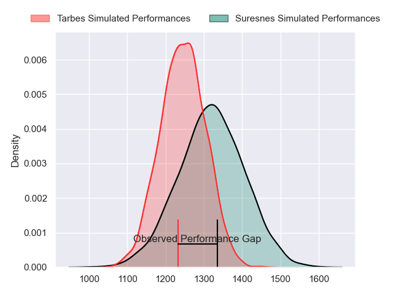
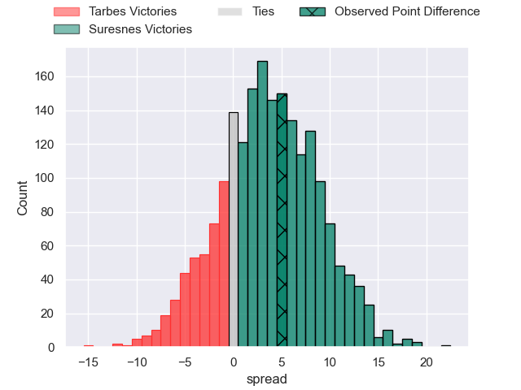
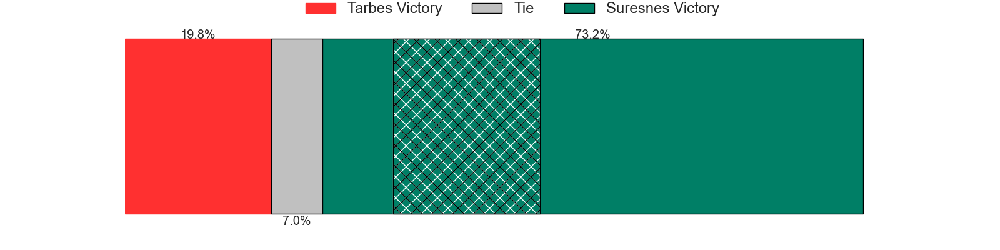
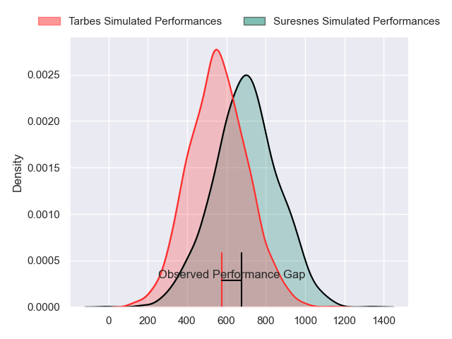
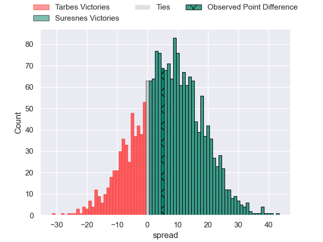
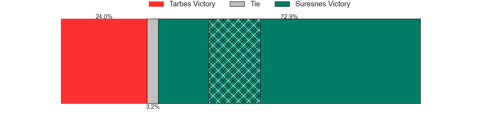
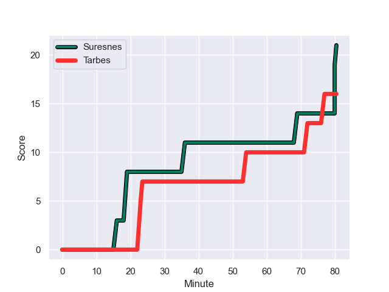
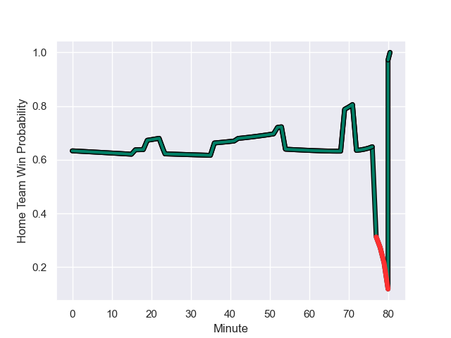

---  
layout: page  
title: Tarbes at Suresnes; 16-21  
date: 2023-12-03 18:00:00 -0500  
categories: "Nationale 2023" match review  
---
# Tarbes at Suresnes; 16-21

# Club Level Predictions

The first set of predictions treats a club as the smallest object, as the club develops its members, organizes a gameplan, and deploys its players as needed for each match. This club model has a prediction of 0.603, which translates to predicting Suresnes to win by 3.7.

Each club has a rating and a rating deviation (similar to a Glicko rating), and expected performances can be generated. This allows for simulated matches and spreads like the ones below.
## Projected Performances - Club Model

## Projected Spreads - Club Model

## Projected Results - Club Model

# Player Level Predictions - Version 2

Treating teams instead as an entity made up of the currently active players, I have ratings for each player in an altogether different system. These can be combined to form team ratings once teamsheets are announced, weighting starters a bit higher than the reserves. After the match is played, players can be weighted by their minutes on the field, allowing for an accurate measure of the team's composition. With these compiled team ratings, we can make predictions, measure inaccuracy, and update the individual player ratings.
## Prediction with Player Minutes: Suresnes by 6.0

Suresnes by 2.8 on a neutral field
## Prediction without Player Minutes: Suresnes by 6.4

Suresnes by 3.1 on a neutral pitch

## Projected Performances - Player Model

## Projected Spreads - Player Model

## Projected Results - Player Model

## Scores over Time

## Win Probability over Time

There were 12 large changes in win probability in this match

|   Away Minutes | Away Player        |   Away elo |   Number |   Home elo | Home Player           |   Home Minutes |
|---------------:|:-------------------|-----------:|---------:|-----------:|:----------------------|---------------:|
|             52 | Johan Mees Erasmus |      38.6  |        1 |      56.74 | Elias Coulibaly       |             61 |
|             54 | Florian Lamothe    |      48.13 |        2 |      47.21 | Hayam El Bibouji      |             61 |
|             52 | Toma Taufa         |      45.49 |        3 |      44.02 | Leandro Mario Assi    |             61 |
|             52 | Francis Rolland    |      43.22 |        4 |      51.01 | Sacha Yahi            |             80 |
|             80 | Baptiste Peytavi   |      42.82 |        5 |      64.29 | Marvin Woki           |             61 |
|             80 | Alexis Armary      |      62.67 |        6 |      36.83 | Florian Desbordes     |             80 |
|             80 | Léo Saint-Guilhem  |      38.94 |        7 |      36.39 | Wian Vosloo           |             80 |
|             44 | Len Massyn         |      31.5  |        8 |      59.99 | Lakisipone Lee        |             70 |
|             70 | Thibaut Dulucq     |      32.91 |        9 |      38.06 | Thomas Lacroix        |             70 |
|             80 | Mathieu Berbizier  |      30.95 |       10 |      54.27 | Tanguy Lacoste        |             70 |
|             42 | Johan Paulet       |      21.29 |       11 |      25.58 | Alexis Clement        |             80 |
|             78 | Savenaca Rawaca    |      31.59 |       12 |      52.56 | Petero Tuwai          |             80 |
|             80 | Clement Latorre    |      36.8  |       13 |       7.93 | JJ Taulagi            |             70 |
|             80 | Yon Camou          |      43.1  |       14 |      27.21 | Thomas Baudy          |             80 |
|             80 | Thibaut Trotta     |      32.46 |       15 |      18.51 | Goulwen Gueho         |             80 |
|             28 | Antoine Palisse    |      44.32 |       16 |      57.53 | Sébastien Lafrancesca |             19 |
|             26 | Enzo Mondon        |      36.94 |       17 |      38.68 | Anthony Bajart        |             19 |
|             28 | Alexandre Duny     |      31.25 |       18 |      38.17 | Victor Damian Arias   |             19 |
|             28 | Jone Trevor Seuvou |      30.68 |       19 |      30.66 | Yakine Djebarri       |             19 |
|             36 | Filipe Manu        |       1.4  |       20 |      53.09 | Damien Bozic          |             10 |
|             10 | Mickael Thébault   |      50.03 |       21 |      59.8  | Jean Chezeau          |             10 |
|             38 | Jone Tuva          |      10.12 |       22 |      74.81 | Victor Barnier        |             10 |
|              2 | Julien Cantan      |      27.2  |       23 |      52.63 | Peïo Etchebest        |             10 |

