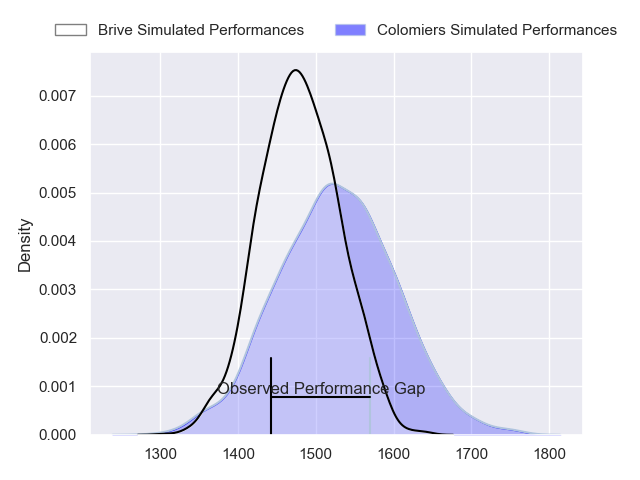
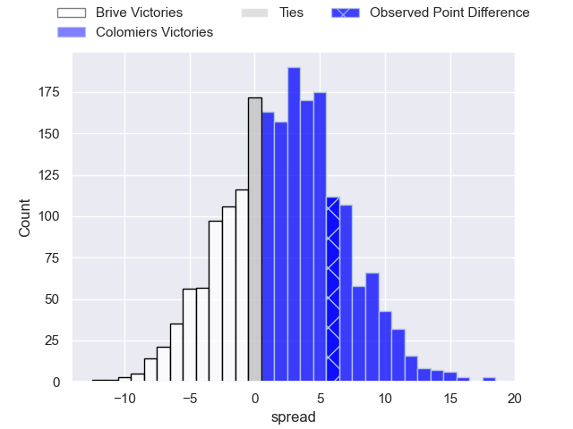
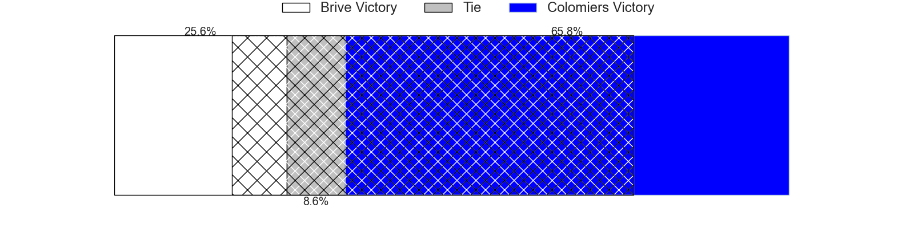
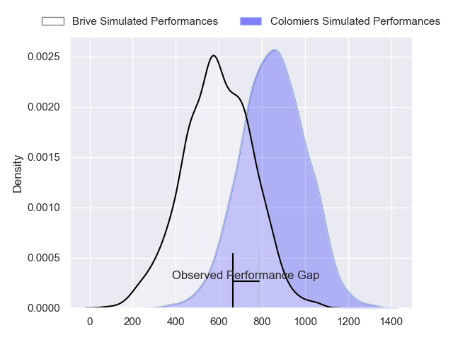
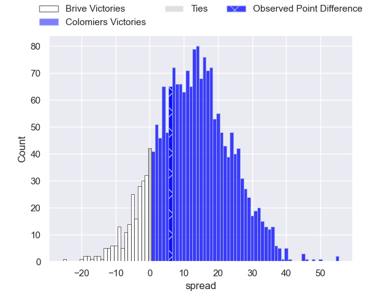
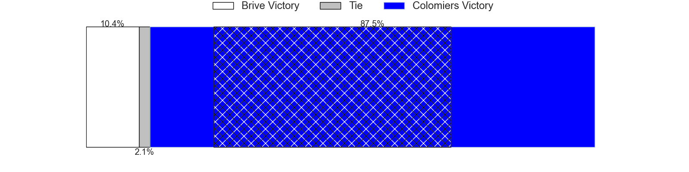
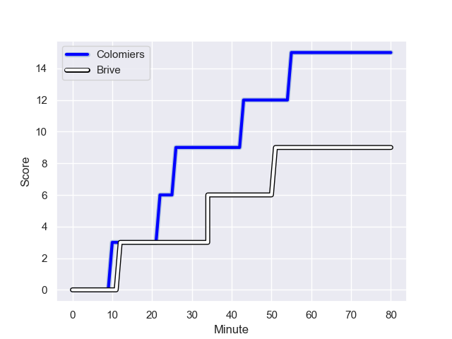
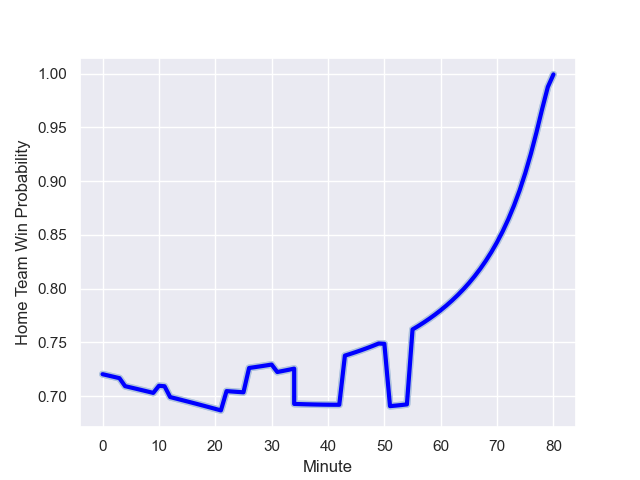

---  
layout: page  
title: Brive at Colomiers; 9-15  
date: 2023-12-07 18:00:00 -0500  
categories: "Pro D2 2023" match review  
---
# Brive at Colomiers; 9-15

# Club Level Predictions

The first set of predictions treats a club as the smallest object, as the club develops its members, organizes a gameplan, and deploys its players as needed for each match. This club model has a prediction of 0.565, which translates to predicting Colomiers to win by 2.3.

Each club has a rating and a rating deviation (similar to a Glicko rating), and expected performances can be generated. This allows for simulated matches and spreads like the ones below.
## Projected Performances - Club Model

## Projected Spreads - Club Model

## Projected Results - Club Model

# Player Level Predictions - Version 2

Treating teams instead as an entity made up of the currently active players, I have ratings for each player in an altogether different system. These can be combined to form team ratings once teamsheets are announced, weighting starters a bit higher than the reserves. After the match is played, players can be weighted by their minutes on the field, allowing for an accurate measure of the team's composition. With these compiled team ratings, we can make predictions, measure inaccuracy, and update the individual player ratings.
## Prediction with Player Minutes: Colomiers by 10.4

Colomiers by 5.9 on a neutral field
## Prediction without Player Minutes: Colomiers by 9.6

Colomiers by 5.1 on a neutral pitch

## Projected Performances - Player Model

## Projected Spreads - Player Model

## Projected Results - Player Model

## Scores over Time

## Win Probability over Time

There were 4 large changes in win probability in this match

|   Away Minutes | Away Player               |   Away elo |   Number |   Home elo | Home Player        |   Home Minutes |
|---------------:|:--------------------------|-----------:|---------:|-----------:|:-------------------|---------------:|
|             50 | Hugo Reilhes              |      45.96 |        1 |      51.06 | Hugo Djehi         |             52 |
|             10 | Adrien Pelissie           |      53.49 |        2 |       5.48 | Thomas Larrieu     |             52 |
|             50 | Marcel van der Merwe      |      22.69 |        3 |      65.92 | Michael Simutoga   |             52 |
|             61 | Renger Van Eerten         |      33.64 |        4 |      74.83 | Maxime Granouillet |             80 |
|              4 | Julien Delannoy           |      32.11 |        5 |      39.05 | Janse Roux         |             59 |
|             80 | Retief Marais             |      36.68 |        6 |      32.22 | Anthony Coletta    |             80 |
|             50 | Said Hireche              |      77.29 |        7 |      64.82 | Aldric Lescure     |             65 |
|             80 | Ross Moriarty             |      74.15 |        8 |      52.52 | Joseva Tamani      |             55 |
|             68 | Leo Carbonneau            |       2.09 |        9 |      42.4  | Ugo Seguela        |             60 |
|             80 | Stuart Olding             |      60.05 |       10 |      28.62 | Maxime Javaux      |             31 |
|             80 | Asaeli Tuivuaka           |      34.95 |       11 |      92.76 | Rodrigo Marta      |             80 |
|             80 | Sammy Arnold              |      23.05 |       12 |      51.55 | Ray Nu'u           |             80 |
|             65 | Mathis Ferté              |      24.63 |       13 |      53.31 | Paul Pimienta      |             80 |
|             80 | Arthur Bonneval           |      37.5  |       14 |      72.71 | Vincent Pinto      |             80 |
|             80 | Thomas Laranjeira         |      71.93 |       15 |      36.21 | Thomas Girard      |             80 |
|             76 | Oskar Rixen               |      39.88 |       16 |      16.13 | Martin Dulon       |             49 |
|             70 | Lucas da Silva            |      25.72 |       17 |      48.62 | Hugo Pirlet        |             28 |
|             30 | Francisco Coria Marchetti |      30.73 |       18 |      14.43 | Marco Fepulea'i    |             28 |
|             30 | Nathan Fraissenon         |      43.27 |       19 |      38.74 | Pablo Dimcheff     |             28 |
|             30 | Sasha Gue                 |      22.9  |       20 |      41.1  | Waël Ponpon        |             25 |
|             19 | Taniela Sadrugu           |      41.14 |       21 |      49.28 | Jean Thomas        |             21 |
|             15 | Tom Raffy                 |      22.87 |       22 |      52.5  | Mathis Galthié     |             20 |
|             12 | Julien Blanc              |      46.11 |       23 |      36.54 | Jorick Dastugue    |             15 |

