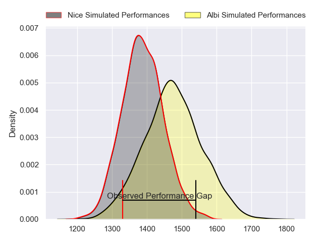
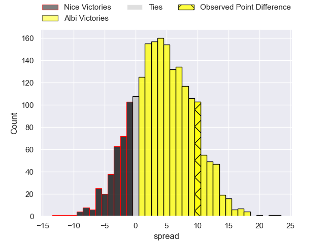
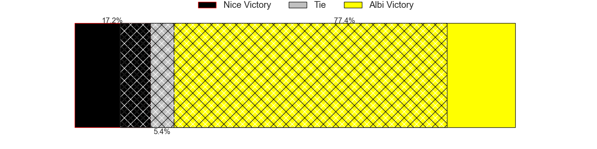
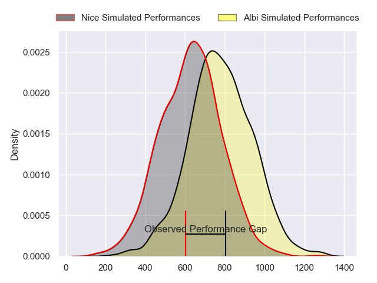
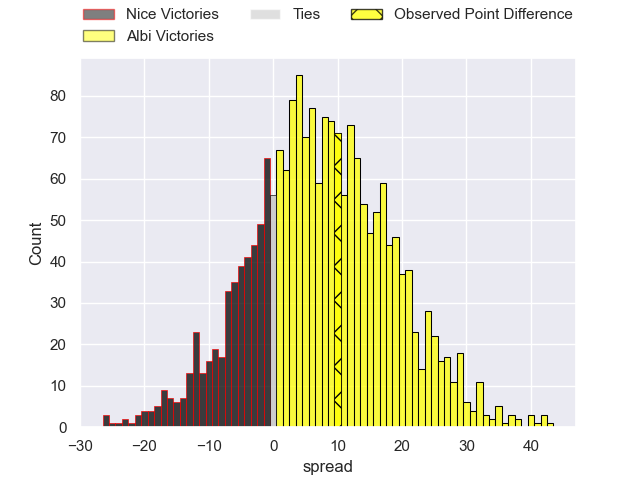
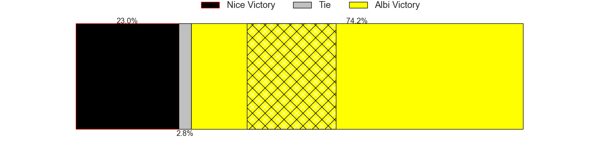
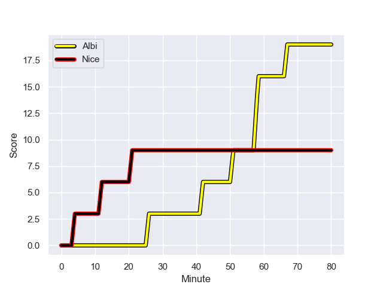
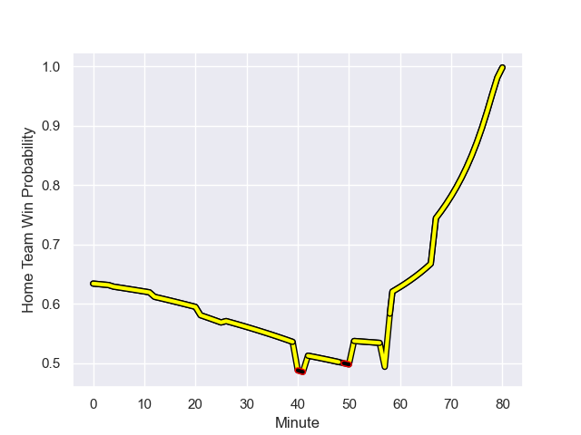

---  
layout: page  
title: Nice at Albi; 9-19  
date: 2023-12-08 18:00:00 -0500  
categories: "Nationale 2023" match review  
---
# Nice at Albi; 9-19

# Club Level Predictions

The first set of predictions treats a club as the smallest object, as the club develops its members, organizes a gameplan, and deploys its players as needed for each match. This club model has a prediction of 0.622, which translates to predicting Albi to win by 4.4.

Each club has a rating and a rating deviation (similar to a Glicko rating), and expected performances can be generated. This allows for simulated matches and spreads like the ones below.
## Projected Performances - Club Model

## Projected Spreads - Club Model

## Projected Results - Club Model

# Player Level Predictions - Version 2

Treating teams instead as an entity made up of the currently active players, I have ratings for each player in an altogether different system. These can be combined to form team ratings once teamsheets are announced, weighting starters a bit higher than the reserves. After the match is played, players can be weighted by their minutes on the field, allowing for an accurate measure of the team's composition. With these compiled team ratings, we can make predictions, measure inaccuracy, and update the individual player ratings.
## Prediction with Player Minutes: Albi by 6.1

Albi by 1.6 on a neutral field
## Prediction without Player Minutes: Albi by 8.1

Albi by 3.7 on a neutral pitch

## Projected Performances - Player Model

## Projected Spreads - Player Model

## Projected Results - Player Model

## Scores over Time

## Win Probability over Time

There were 10 large changes in win probability in this match

|   Away Minutes | Away Player               |   Away elo |   Number |   Home elo | Home Player             |   Home Minutes |
|---------------:|:--------------------------|-----------:|---------:|-----------:|:------------------------|---------------:|
|             67 | Jules Martinez            |      31.22 |        1 |      51.59 | Thibaud Sebire          |             47 |
|             57 | Pierre Strippoli          |      41.17 |        2 |      54.92 | Arthur Castant          |             67 |
|             67 | Nicolas Ciancio           |      47.86 |        3 |      63.11 | Dimitri Tchapnga        |             47 |
|             80 | Thibault Rey              |       3.54 |        4 |      65.34 | Mohsen Essid            |             80 |
|             57 | Adrien Vigne              |      66.24 |        5 |       7.38 | Jacques Engelbrecht     |             67 |
|             80 | Arthur Vignolles          |      58.51 |        6 |      15.89 | Pierre Roussel          |             80 |
|             80 | Bastien Berenguel         |      17.43 |        7 |      56.56 | Simon Meka              |             56 |
|             26 | Ramiha Tarrel Tia Smiler  |      52.46 |        8 |      55.99 | Camille Jarreau         |             80 |
|             67 | Matéo Jeune-Joly          |      23.03 |        9 |      62.01 | Gilen Queheille         |             80 |
|             80 | Mathis Viard              |      56.48 |       10 |      79.14 | Théo Vidal              |             40 |
|             70 | Andrzej Charlat           |      73.66 |       11 |      66.51 | Tim Giresse             |             80 |
|             57 | Alban Conduche            |      -3.45 |       12 |      23.83 | Jarrod Poi              |             80 |
|             80 | Baptiste Lafond           |      18.3  |       13 |      67.07 | Baptiste Couchinave     |             40 |
|             80 | Gautier Lacointa          |      43.16 |       14 |      18.38 | Sean Robinson           |             80 |
|             80 | David Odiete              |      69.58 |       15 |      50.82 | Enzo Marzocca           |             80 |
|             54 | Laijiasa Bolenaivalu      |      74.53 |       16 |      56.64 | Romain Maurice          |             13 |
|             23 | Romain Riguet             |      53.28 |       17 |       3.2  | Téo Dospital            |             40 |
|             23 | Martin Freytes            |      56.79 |       18 |      28.98 | James Haydn Tedder      |             40 |
|             23 | Santiago Benjamin Ovejero |      43.74 |       19 |      49.45 | Jean Baptiste De Clercq |             33 |
|             13 | Kevin Yameogo             |      29.6  |       20 |      49.45 | Antoine Soave           |             33 |
|             13 | Julien Beaufils           |      53.19 |       21 |      36.48 | Mattéo Coustalat        |             24 |
|             13 | Jules Solinas             |      55.49 |       22 |      17.42 | Dion Evrard Oulai       |             13 |
|             10 | Luca Cutayar              |      49.67 |       23 |     nan    | nan                     |            nan |

