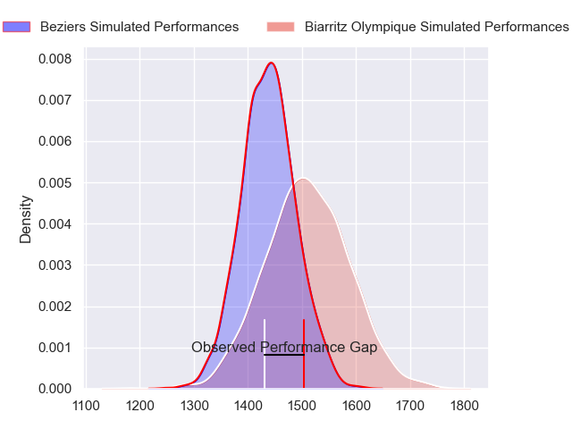
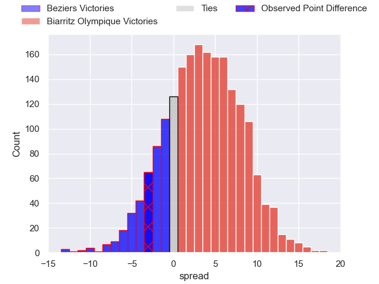
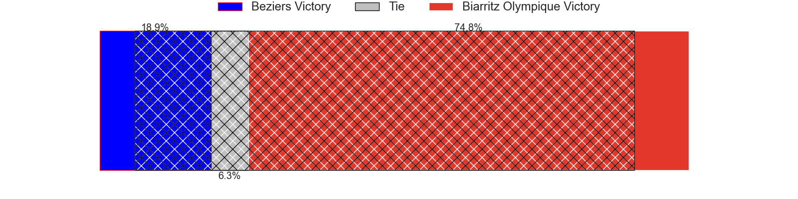
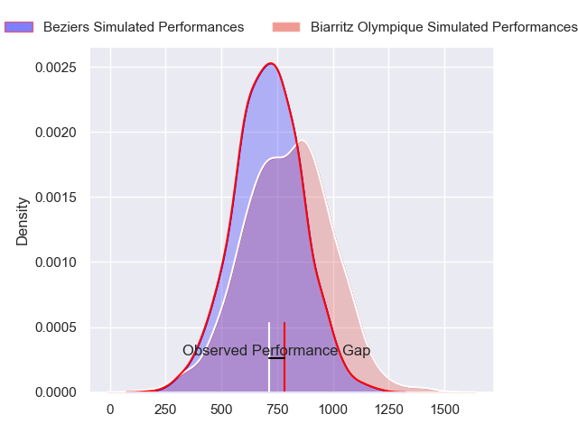
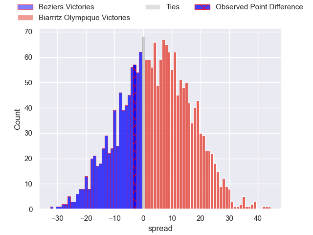
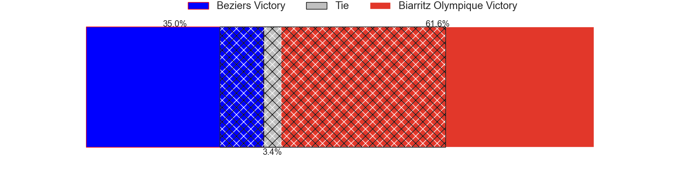
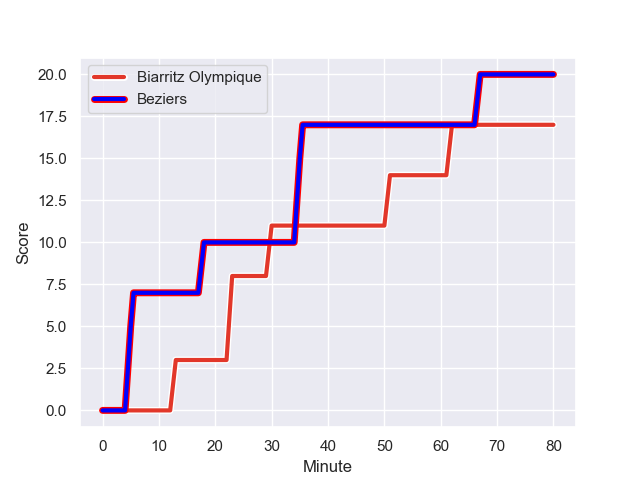
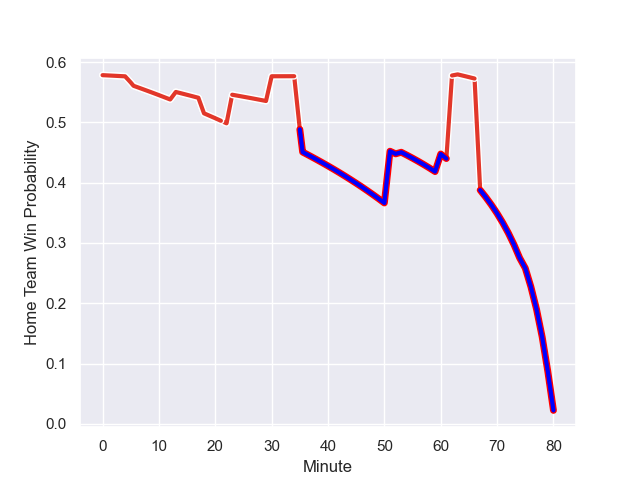

---  
layout: page  
title: Beziers at Biarritz Olympique; 20-17  
date: 2023-12-08 18:00:00 -0500  
categories: "Pro D2 2023" match review  
---
# Beziers at Biarritz Olympique; 20-17

# Club Level Predictions

The first set of predictions treats a club as the smallest object, as the club develops its members, organizes a gameplan, and deploys its players as needed for each match. This club model has a prediction of 0.598, which translates to predicting Biarritz Olympique to win by 3.5.

Each club has a rating and a rating deviation (similar to a Glicko rating), and expected performances can be generated. This allows for simulated matches and spreads like the ones below.
## Projected Performances - Club Model

## Projected Spreads - Club Model

## Projected Results - Club Model

# Player Level Predictions - Version 2

Treating teams instead as an entity made up of the currently active players, I have ratings for each player in an altogether different system. These can be combined to form team ratings once teamsheets are announced, weighting starters a bit higher than the reserves. After the match is played, players can be weighted by their minutes on the field, allowing for an accurate measure of the team's composition. With these compiled team ratings, we can make predictions, measure inaccuracy, and update the individual player ratings.
## Prediction with Player Minutes: Biarritz Olympique by 3.5

Beziers by 1.6 on a neutral field
## Prediction without Player Minutes: Biarritz Olympique by 3.4

Beziers by 1.7 on a neutral pitch

## Projected Performances - Player Model

## Projected Spreads - Player Model

## Projected Results - Player Model

## Scores over Time

## Win Probability over Time

There were 14 large changes in win probability in this match

|   Away Minutes | Away Player         |   Away elo |   Number |   Home elo | Home Player       |   Home Minutes |
|---------------:|:--------------------|-----------:|---------:|-----------:|:------------------|---------------:|
|             60 | Francisco Fernandes |      33.08 |        1 |      34.72 | Giorgi Nutsubidze |             80 |
|             60 | Yvann Lalevee       |      56.4  |        2 |      57.74 | Bastien Soury     |             80 |
|             53 | Yannick Arroyo      |      50.66 |        3 |      32.35 | Alfie Petch       |             80 |
|             80 | Hans N'kinsi        |       6    |        4 |      67.8  | Charlie Matthews  |             80 |
|             80 | John Madigan        |      21.71 |        5 |       1.3  | Adrian Motoc      |             80 |
|             53 | William van Bost    |      43.14 |        6 |      41.26 | Simon Augry       |             80 |
|             54 | Clement Ancely      |      34.57 |        7 |      26.75 | Charlie Francoz   |             80 |
|             60 | Sias Koen           |      56.94 |        8 |      46.75 | Temo Matiu        |             80 |
|             75 | Samuel Marques      |      66.87 |        9 |      39.53 | Pierre Pages      |             80 |
|             80 | Charly Malie        |      54.73 |       10 |      18.64 | Billy Searle      |             80 |
|             63 | Nicolas Plazy       |      61.78 |       11 |      49.9  | Steeve Barry      |             80 |
|             80 | Watisoni Votu       |      78.13 |       12 |      81.76 | Yann David        |             80 |
|             80 | Paul Recor          |      58.63 |       13 |      68.79 | Tyler Morgan      |             80 |
|             80 | Maxime Espeut       |      40.34 |       14 |      50.13 | Baptiste Fariscot |             80 |
|             80 | Gabin Lorre         |      73.58 |       15 |      57.26 | Joe Jonas         |             80 |
|             27 | Jon Zabala Arrieta  |      61.49 |       16 |     nan    | nan               |            nan |
|             27 | Gillian Benoy       |      22.8  |       17 |     nan    | nan               |            nan |
|             26 | Pierrick Gunther    |     -11.33 |       18 |     nan    | nan               |            nan |
|             20 | Marco Trauth        |      52.75 |       19 |     nan    | nan               |            nan |
|             20 | Wilmar Arnoldi      |      49.71 |       20 |     nan    | nan               |            nan |
|             20 | Otonuku Jr Pauta    |      55.22 |       21 |     nan    | nan               |            nan |
|             17 | Victor Dreuille     |      36.97 |       22 |     nan    | nan               |            nan |
|              5 | Jean Victor Goillot |      38.81 |       23 |     nan    | nan               |            nan |

