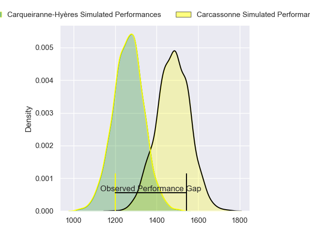
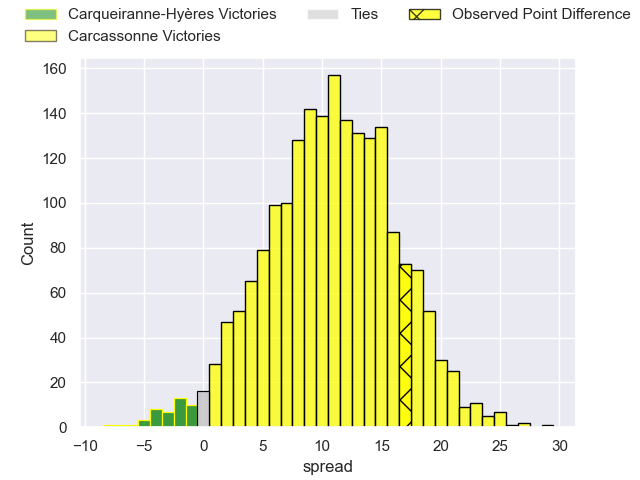
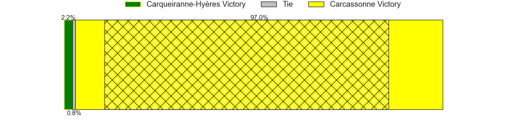
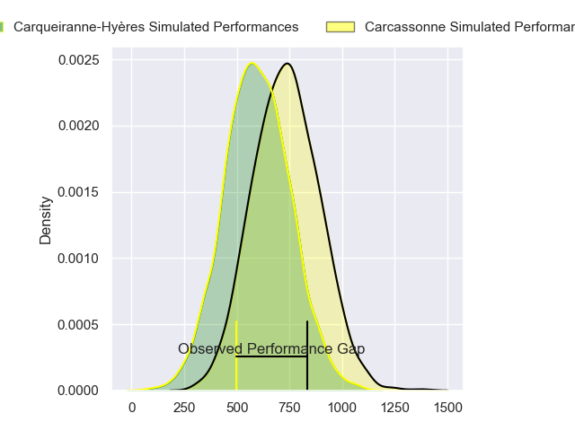
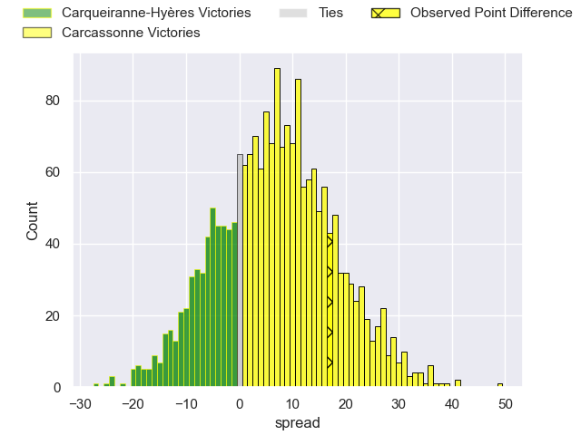
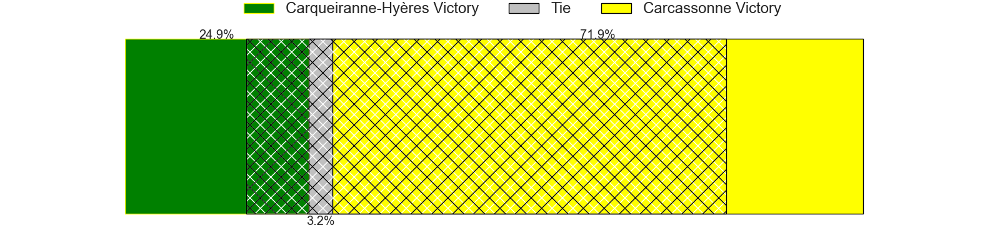
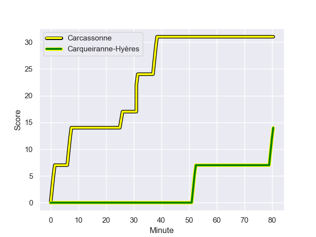
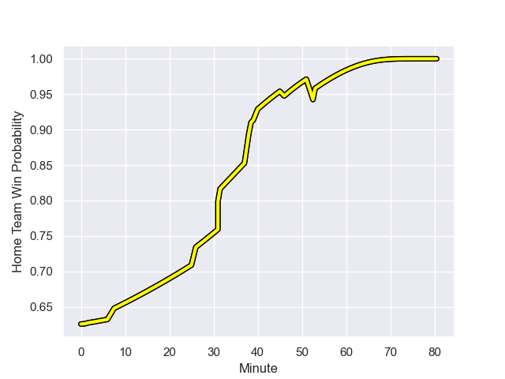

---  
layout: page  
title: Carqueiranne-Hyeres at Carcassonne; 14-31  
date: 2023-12-08 18:00:00 -0500  
categories: "Nationale 2023" match review  
---
# Carqueiranne-Hyeres at Carcassonne; 14-31

# Club Level Predictions

The first set of predictions treats a club as the smallest object, as the club develops its members, organizes a gameplan, and deploys its players as needed for each match. This club model has a prediction of 0.777, which translates to predicting Carcassonne to win by 11.1.

Each club has a rating and a rating deviation (similar to a Glicko rating), and expected performances can be generated. This allows for simulated matches and spreads like the ones below.
## Projected Performances - Club Model

## Projected Spreads - Club Model

## Projected Results - Club Model

# Player Level Predictions - Version 2

Treating teams instead as an entity made up of the currently active players, I have ratings for each player in an altogether different system. These can be combined to form team ratings once teamsheets are announced, weighting starters a bit higher than the reserves. After the match is played, players can be weighted by their minutes on the field, allowing for an accurate measure of the team's composition. With these compiled team ratings, we can make predictions, measure inaccuracy, and update the individual player ratings.
## Prediction with Player Minutes: Carcassonne by 5.7

Carcassonne by 1.4 on a neutral field
## Prediction without Player Minutes: Carcassonne by 5.5

Carcassonne by 1.3 on a neutral pitch

## Projected Performances - Player Model

## Projected Spreads - Player Model

## Projected Results - Player Model

## Scores over Time

## Win Probability over Time

There were 3 large changes in win probability in this match

|   Away Minutes | Away Player         |   Away elo |   Number |   Home elo | Home Player           |   Home Minutes |
|---------------:|:--------------------|-----------:|---------:|-----------:|:----------------------|---------------:|
|             60 | Nassim Aanikid      |      46.51 |        1 |      44.22 | Florent Lorenzon      |             64 |
|             64 | Michael Tyumenev    |      25.76 |        2 |      51.83 | Luka Petriashvili     |             67 |
|             67 | Miguel Mathieu      |      39.14 |        3 |      22.21 | Vakhtangi Akhobadze   |             60 |
|             64 | Nathan Gendre       |      31.39 |        4 |      28.59 | Romain Manchia        |             46 |
|             80 | Shade Barkallah     |      46.51 |        5 |      24.81 | Marius Iftimiciuc     |             80 |
|             64 | Nicolas Baquer      |      36.49 |        6 |      51.16 | Bilal Fadli           |             80 |
|             80 | Spike Salman        |      39.11 |        7 |      47.72 | Etienne Herjean       |             53 |
|             80 | Adam Peters         |      30.84 |        8 |      46.39 | Romain Guyot          |             64 |
|             53 | Thomas Sonetti      |      60.55 |        9 |      32.81 | Gaetan Pichon         |             40 |
|             40 | Enzo Miot           |      42.92 |       10 |      62.28 | Gabin Michet          |             80 |
|             80 | Vincent Alessi      |      20.56 |       11 |      61.68 | Clement Egiziano      |             80 |
|             80 | Theo Moitrier       |      51.08 |       12 |      27    | Jordan Puletua        |             80 |
|             60 | Dylan Sage          |      42.76 |       13 |      48.71 | Tutuila Vaea          |             80 |
|             80 | Josselyn Bouchon    |      39.19 |       14 |      35.82 | Sakiusa Bureitakiyaca |             64 |
|             80 | Théo Defrance       |      36.73 |       15 |      43.42 | Damien Añon           |             80 |
|             27 | Jérémy Fleury       |      46.18 |       16 |      -2.18 | Martin Landajo        |             40 |
|             40 | Théo Greco          |      46.65 |       17 |      37.97 | Clément Fontaine      |             34 |
|             20 | Quentin Bourdieu    |      51.28 |       18 |      49.88 | Valentin Sese         |             27 |
|             20 | Eli Serra-Miglietti |      45.4  |       19 |      53.71 | Nikoloz Narmania      |             20 |
|             16 | Lucas Cazac         |      24.44 |       20 |      47.48 | Mesake Kurisaru       |             16 |
|             16 | Joachim Beaumont    |      58.68 |       21 |      57.66 | Andrei Ursache        |             16 |
|             16 | Yan Tabarot         |      46.24 |       22 |      55.13 | Raphael Carbou        |             13 |
|             13 | Thomas Lithaud      |      51.04 |       23 |      57.03 | Carl Fearns           |             16 |

