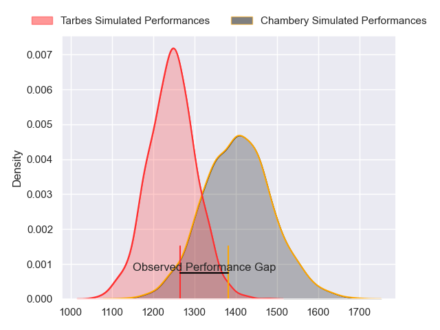
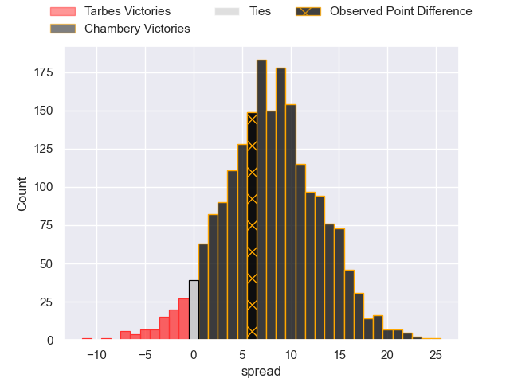
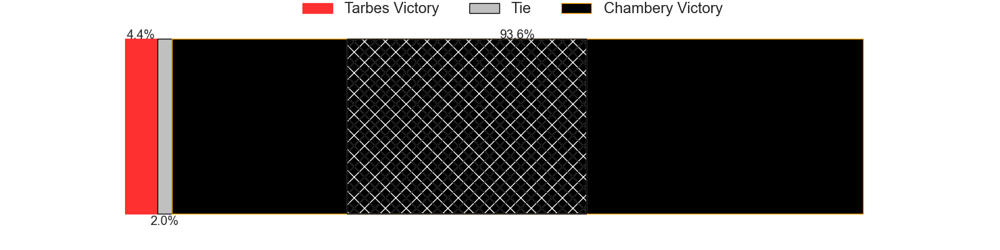
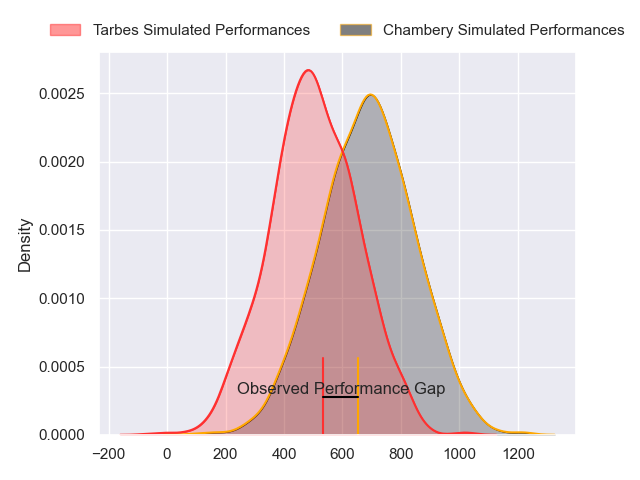
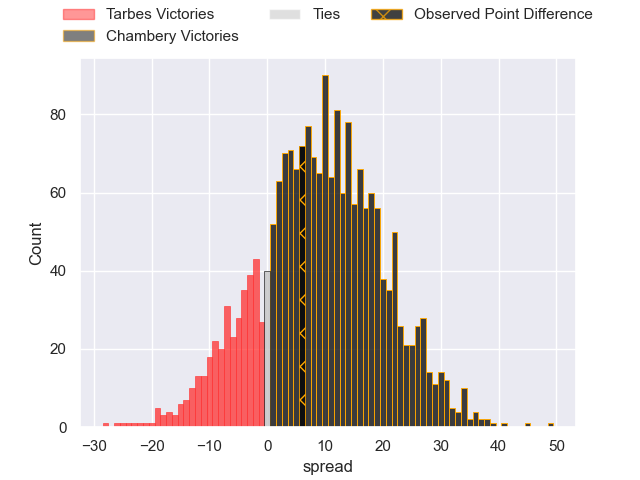
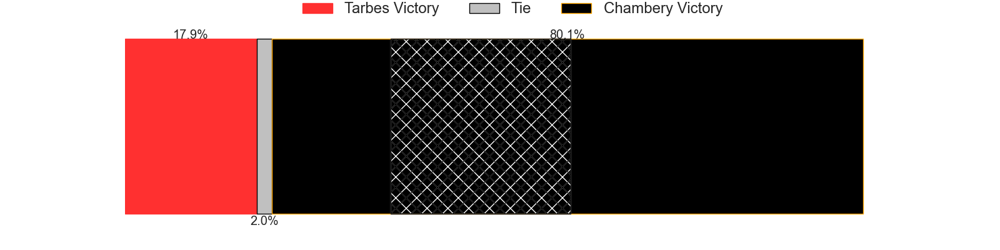
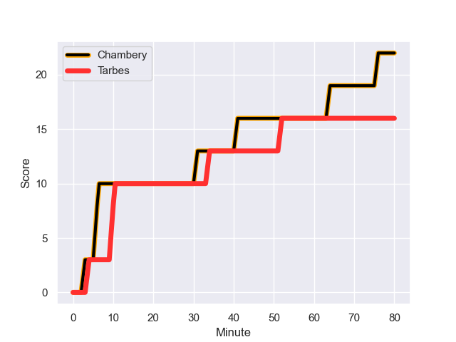
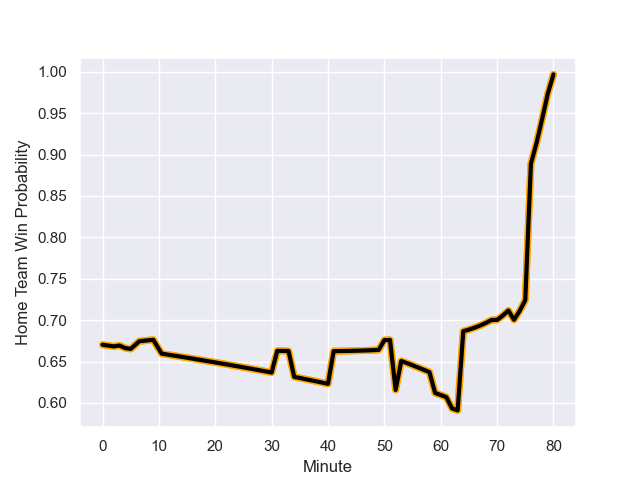

---  
layout: page  
title: Tarbes at Chambery; 16-22  
date: 2023-12-08 18:00:00 -0500  
categories: "Nationale 2023" match review  
---
# Tarbes at Chambery; 16-22

# Club Level Predictions

The first set of predictions treats a club as the smallest object, as the club develops its members, organizes a gameplan, and deploys its players as needed for each match. This club model has a prediction of 0.712, which translates to predicting Chambery to win by 8.0.

Each club has a rating and a rating deviation (similar to a Glicko rating), and expected performances can be generated. This allows for simulated matches and spreads like the ones below.
## Projected Performances - Club Model

## Projected Spreads - Club Model

## Projected Results - Club Model

# Player Level Predictions - Version 2

Treating teams instead as an entity made up of the currently active players, I have ratings for each player in an altogether different system. These can be combined to form team ratings once teamsheets are announced, weighting starters a bit higher than the reserves. After the match is played, players can be weighted by their minutes on the field, allowing for an accurate measure of the team's composition. With these compiled team ratings, we can make predictions, measure inaccuracy, and update the individual player ratings.
## Prediction with Player Minutes: Chambery by 7.8

Chambery by 4.6 on a neutral field
## Prediction without Player Minutes: Chambery by 7.9

Chambery by 4.7 on a neutral pitch

## Projected Performances - Player Model

## Projected Spreads - Player Model

## Projected Results - Player Model

## Scores over Time

## Win Probability over Time

There were 11 large changes in win probability in this match

|   Away Minutes | Away Player            |   Away elo |   Number |   Home elo | Home Player                  |   Home Minutes |
|---------------:|:-----------------------|-----------:|---------:|-----------:|:-----------------------------|---------------:|
|             53 | Antoine Palisse        |      44.32 |        1 |      52.61 | Nugzar Somkhishvili          |             50 |
|             62 | Enzo Mondon            |      36.94 |        2 |      42.91 | Julien Primault              |             50 |
|             53 | Alexandre Duny         |      31.25 |        3 |      47.75 | Giorgi Pertaia               |             80 |
|             80 | Antoine Bousquet       |      37.21 |        4 |      40.29 | Fabien Witz                  |             80 |
|             59 | Jone Trevor Seuvou     |      30.68 |        5 |      45.17 | Steyl Barnard                |             50 |
|             80 | Aurelien Ricart        |      40.41 |        6 |      40.58 | Thomas Coignat               |             50 |
|             55 | Jean Guicherd          |      46.65 |        7 |      43.59 | Taniela Matakaiongo          |             80 |
|             62 | Filipe Manu            |       1.4  |        8 |      52.01 | Tui Uru                      |             78 |
|             70 | Thibaut Dulucq         |      32.91 |        9 |      28.46 | Thibault Dufau               |             78 |
|             80 | Anthony Fuertes        |      19.58 |       10 |      32.26 | Victor Pisano                |             73 |
|             80 | Jone Tuva              |      10.12 |       11 |      26.92 | Paul Baptiste Florent Altier |             80 |
|             80 | Savenaca Rawaca        |      31.59 |       12 |      48.18 | Bastien Reymond              |             55 |
|             80 | Pierre Descoubet       |      46.59 |       13 |      45.57 | Emmanuel Vaitulukina         |             80 |
|             80 | Clement Latorre        |      36.8  |       14 |      36.46 | Maewen Sao                   |             80 |
|             50 | Yon Camou              |      43.1  |       15 |      38.51 | Jean-Luc Alewyn Cilliers     |             80 |
|             27 | Alexandre Combier      |      30.96 |       16 |      44.5  | Enzo Segui                   |             30 |
|             18 | Florian Lamothe        |      48.13 |       17 |      48.63 | Gauthier Brute de Remur      |             30 |
|             27 | Aleksi Tchitchiashvili |      36.11 |       18 |      49.21 | Ahmed Tidiane Kane           |             30 |
|             21 | Léo Saint-Guilhem      |      38.94 |       19 |      34.87 | Colin Lebian                 |             30 |
|             25 | Alexis Armary          |      62.67 |       20 |      32.86 | Hugo Deschaux                |              2 |
|             18 | Julien Cantan          |      27.2  |       21 |      43.84 | Mateo Guerret                |              7 |
|             10 | Mickael Thébault       |      50.03 |       22 |      16.07 | Vereniki Goneva              |             25 |
|             30 | Thibaut Trotta         |      32.46 |       23 |      46.65 | Théo Lavoine                 |              2 |

