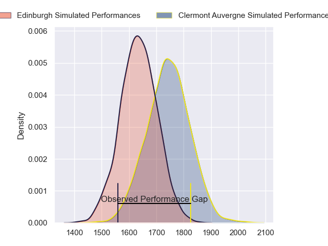
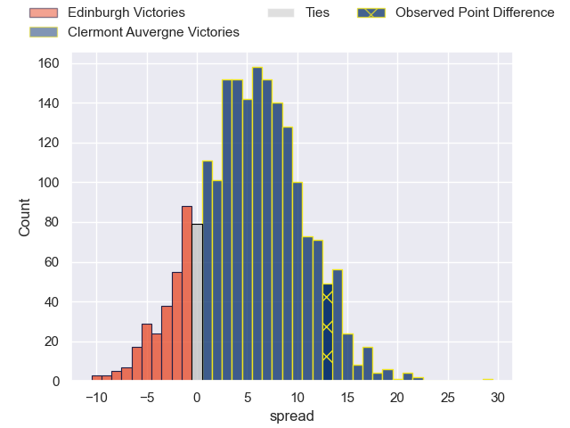
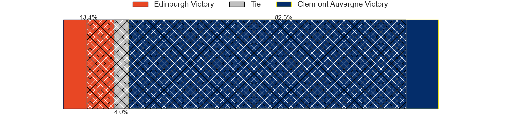
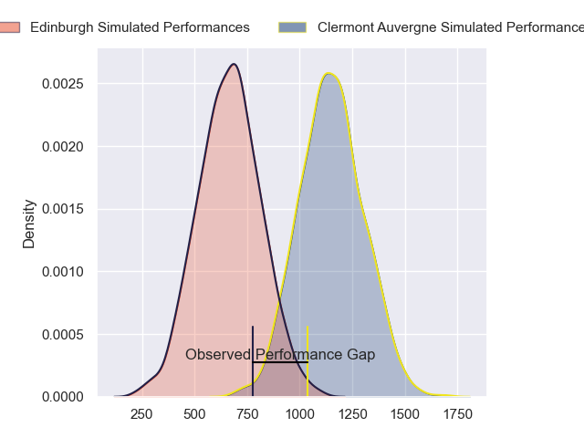
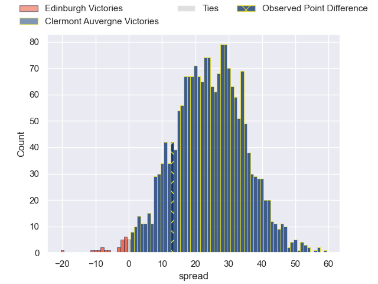
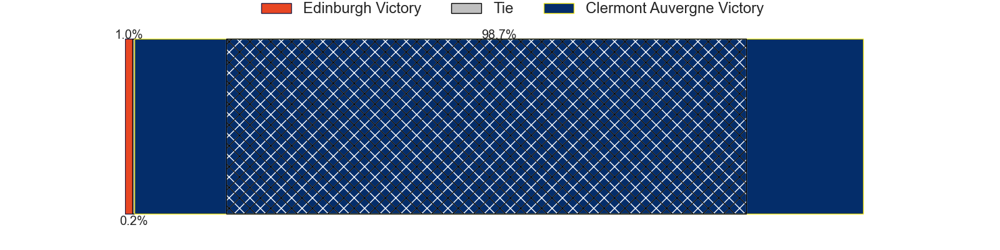
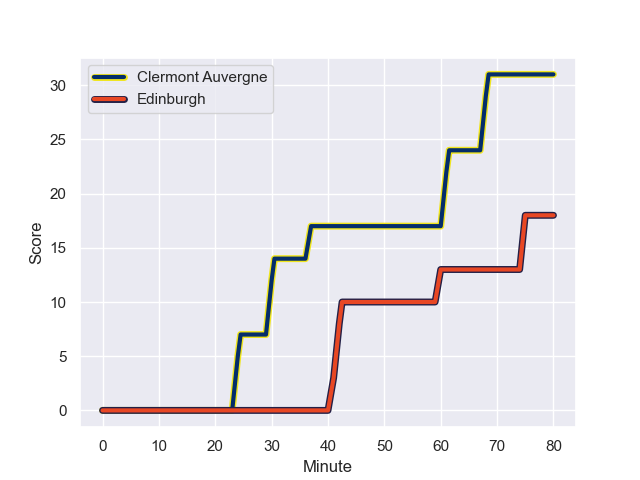
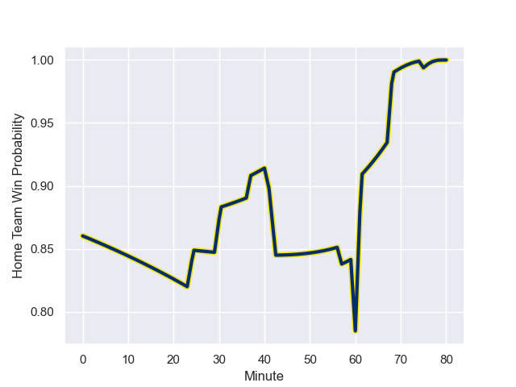

---  
layout: page  
title: Edinburgh at Clermont Auvergne; 18-31  
date: 2023-12-08 18:00:00 -0500  
categories: "European Rugby Challenge Cup 2023" match review  
---
# Edinburgh at Clermont Auvergne; 18-31

# Club Level Predictions

The first set of predictions treats a club as the smallest object, as the club develops its members, organizes a gameplan, and deploys its players as needed for each match. This club model has a prediction of 0.649, which translates to predicting Clermont Auvergne to win by 5.5.

Each club has a rating and a rating deviation (similar to a Glicko rating), and expected performances can be generated. This allows for simulated matches and spreads like the ones below.
## Projected Performances - Club Model

## Projected Spreads - Club Model

## Projected Results - Club Model

# Player Level Predictions - Version 2

Treating teams instead as an entity made up of the currently active players, I have ratings for each player in an altogether different system. These can be combined to form team ratings once teamsheets are announced, weighting starters a bit higher than the reserves. After the match is played, players can be weighted by their minutes on the field, allowing for an accurate measure of the team's composition. With these compiled team ratings, we can make predictions, measure inaccuracy, and update the individual player ratings.
## Prediction with Player Minutes: Clermont Auvergne by 20.0

Clermont Auvergne by 15.1 on a neutral field
## Prediction without Player Minutes: Clermont Auvergne by 20.3

Clermont Auvergne by 15.4 on a neutral pitch

## Projected Performances - Player Model

## Projected Spreads - Player Model

## Projected Results - Player Model

## Scores over Time

## Win Probability over Time

There were 6 large changes in win probability in this match

|   Away Minutes | Away Player         |   Away elo |   Number |   Home elo | Home Player          |   Home Minutes |
|---------------:|:--------------------|-----------:|---------:|-----------:|:---------------------|---------------:|
|             46 | Robin Hislop        |      31.67 |        1 |      59.2  | Etienne Falgoux      |             60 |
|             46 | Ewan Ashman         |      36.85 |        2 |      79.22 | Folau Fainga'a       |             60 |
|             46 | Javan Sebastian     |      42.43 |        3 |      57.41 | Cristian Ojovan      |             60 |
|             80 | Marshall Sykes      |      38.22 |        4 |      90.69 | Rob Simmons          |             80 |
|             80 | Jamie Hodgson       |      52.57 |        5 |      69.36 | Tomas Lavanini       |             80 |
|             80 | Luke Crosbie        |      69.29 |        6 |      63.62 | Lucas Dessaigne      |             60 |
|             67 | Hamish Watson       |      49.86 |        7 |      87.78 | Peceli Yato Senibitu |             60 |
|             67 | Viliame Mata        |      36.88 |        8 |      86.23 | Pita Gus Sowakula    |             80 |
|             46 | Ben Vellacott       |      48.15 |        9 |      79.42 | Sebastien Bezy       |             60 |
|             72 | Cameron Scott       |      48.94 |       10 |      68.5  | Anthony Belleau      |             80 |
|             80 | Duhan van der Merwe |      66.52 |       11 |      31.67 | Thomas Roziere       |             60 |
|             80 | Chris Dean          |      34.11 |       12 |      93.53 | George Moala         |             80 |
|             80 | Mark Bennett        |      60.71 |       13 |      56.42 | Julien Heriteau      |             57 |
|             80 | Harry Paterson      |      29.92 |       14 |      70.91 | Bautista Delguy      |             80 |
|             57 | Tim Swiel           |      16.34 |       15 |      66.95 | Alex Newsome         |             80 |
|             34 | Boan Venter         |      33.54 |       16 |      45.35 | Daniel Bibi Biziwu   |             20 |
|             34 | Adam McBurney       |      41.49 |       17 |      44.81 | Yohan Beheregaray    |             20 |
|             34 | Angus Williams      |      44.3  |       18 |      37.4  | Henzo Kiteau         |             20 |
|             13 | Connor Boyle        |      30.51 |       19 |      82.34 | Fritz Lee            |             20 |
|             13 | Glen Young          |       5.69 |       20 |      46.6  | Killian Tixeront     |             20 |
|             34 | Charlie Shiel       |      42.19 |       21 |      33.87 | Baptiste Jauneau     |             20 |
|              8 | Matt Currie         |      44.39 |       22 |      79.4  | Jules Plisson        |             20 |
|             23 | Wes Goosen          |      65.06 |       23 |      37.24 | Pierre Fouyssac      |             23 |

