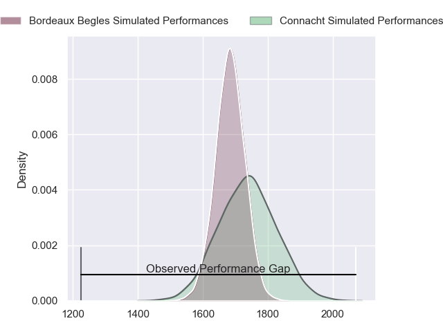
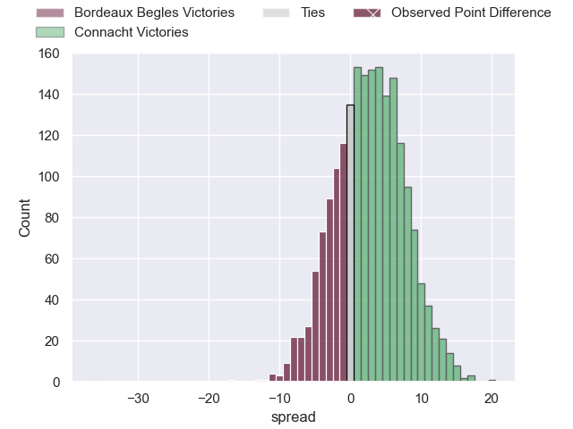
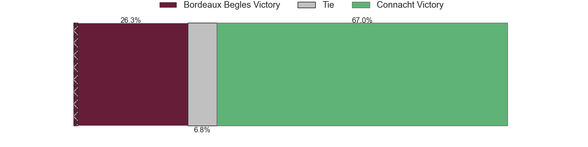
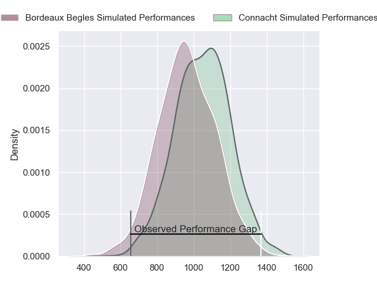
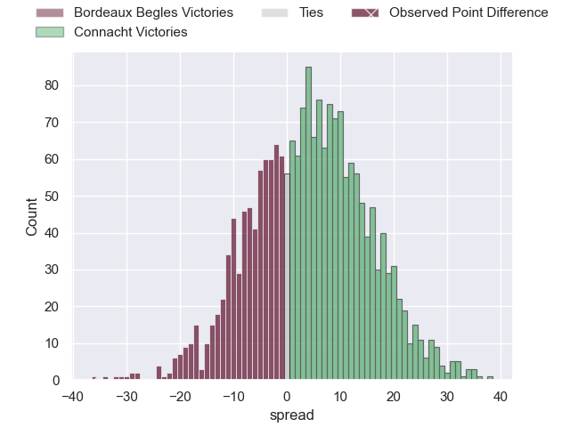
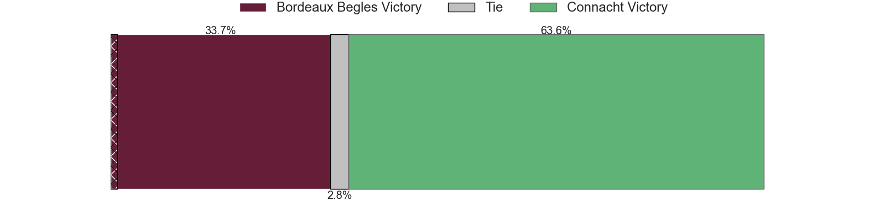
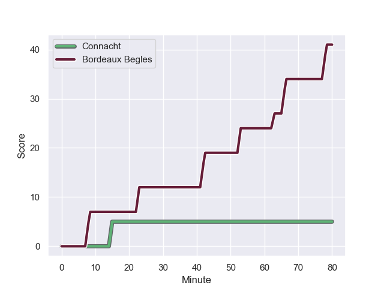
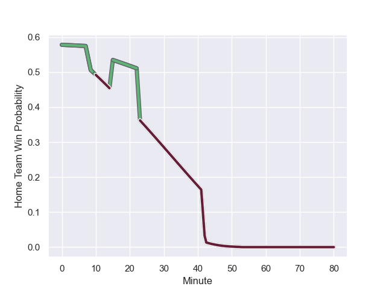

---  
layout: page  
title: Bordeaux Begles at Connacht; 41-5  
date: 2023-12-08 18:00:00 -0500  
categories: "European Rugby Champions Cup 2023" match review  
---
# Bordeaux Begles at Connacht; 41-5

# Club Level Predictions

The first set of predictions treats a club as the smallest object, as the club develops its members, organizes a gameplan, and deploys its players as needed for each match. This club model has a prediction of 0.575, which translates to predicting Connacht to win by 2.7.

Each club has a rating and a rating deviation (similar to a Glicko rating), and expected performances can be generated. This allows for simulated matches and spreads like the ones below.
## Projected Performances - Club Model

## Projected Spreads - Club Model

## Projected Results - Club Model

# Player Level Predictions - Version 2

Treating teams instead as an entity made up of the currently active players, I have ratings for each player in an altogether different system. These can be combined to form team ratings once teamsheets are announced, weighting starters a bit higher than the reserves. After the match is played, players can be weighted by their minutes on the field, allowing for an accurate measure of the team's composition. With these compiled team ratings, we can make predictions, measure inaccuracy, and update the individual player ratings.
## Prediction with Player Minutes: Connacht by 3.5

Bordeaux Begles by 0.6 on a neutral field
## Prediction without Player Minutes: Connacht by 2.2

Bordeaux Begles by 1.9 on a neutral pitch

## Projected Performances - Player Model

## Projected Spreads - Player Model

## Projected Results - Player Model

## Scores over Time

## Win Probability over Time

There were 4 large changes in win probability in this match

|   Away Minutes | Away Player               |   Away elo |   Number |   Home elo | Home Player           |   Home Minutes |
|---------------:|:--------------------------|-----------:|---------:|-----------:|:----------------------|---------------:|
|             50 | Ugo Boniface              |      63.76 |        1 |      64.75 | Denis Buckley         |             40 |
|             47 | Clement Maynadier         |      60.74 |        2 |      44.78 | Dave Heffernan        |             58 |
|             59 | Sipili Falatea            |      54.44 |        3 |      86.74 | Finlay Bealham        |             40 |
|             59 | Guido Petti               |      68.87 |        4 |      50.56 | Darragh Murray        |             58 |
|             80 | Thomas Jolmes             |      25.76 |        5 |      95.1  | Joe Joyce             |             80 |
|             71 | Pierre Bochaton           |      66.07 |        6 |      47.44 | Cian Prendergast      |             80 |
|             47 | Pete Samu                 |      80.01 |        7 |      45.4  | Shamus Hurley-Langton |             80 |
|             80 | Tevita Tatafu             |      63.02 |        8 |      41.15 | Sean Jansen           |             54 |
|             65 | Maxime Lucu               |     112.81 |        9 |      50.92 | Caolin Blade          |             64 |
|             71 | Matthieu Jalibert         |     102.41 |       10 |      84.77 | JJ Hanrahan           |             80 |
|             80 | Pablo Uberti              |      28    |       11 |      33.3  | Andrew Smith          |             80 |
|             80 | Ben Tapuai                |      33.27 |       12 |     116.97 | Bundee Aki            |             80 |
|             80 | Nicolas Depoortere        |      57.26 |       13 |      46.21 | Cathal Forde          |             58 |
|             80 | Damian Penaud             |      90.32 |       14 |      39.17 | Byron Ralston         |             80 |
|             80 | Romain Buros              |      91.02 |       15 |      73.58 | Mack Hansen           |             21 |
|             30 | Ben Tameifuna             |      85.81 |       16 |      96.49 | Peter Dooley          |             40 |
|             33 | Maxime Lamothe            |      52.07 |       17 |      43.14 | Tadgh McElroy         |             22 |
|             21 | Carlu Sadie               |      33.1  |       18 |      59.69 | Jack Aungier          |             40 |
|             21 | Antoine Miquel            |      57.02 |       19 |      65.86 | Niall Murray          |             22 |
|              9 | Alexandre Ricard          |      44.2  |       20 |      62.24 | Conor Oliver          |             26 |
|             33 | Bastien Vergnes Taillefer |      66.03 |       21 |      43.64 | Michael McDonald      |             16 |
|             15 | Paul Abadie               |      17.54 |       22 |      55.05 | David Hawkshaw        |             22 |
|              9 | Nans Ducuing              |      68.38 |       23 |      93.34 | John Porch            |             59 |

