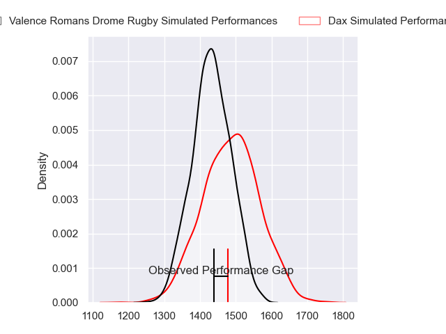
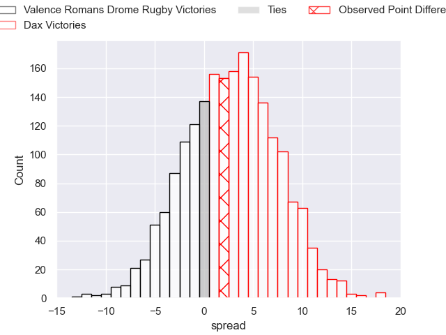
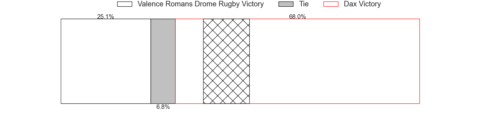
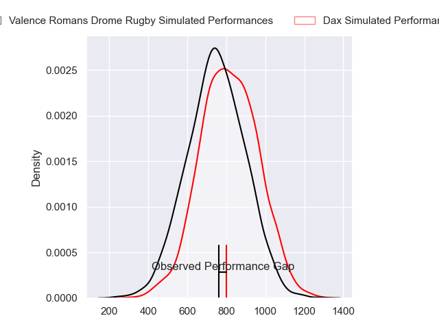
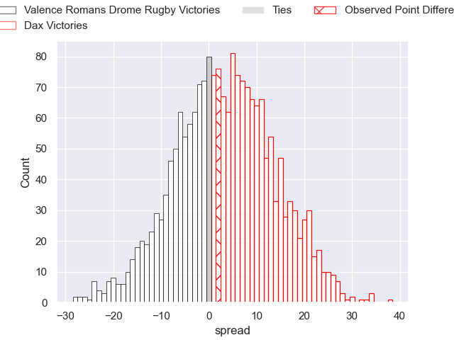
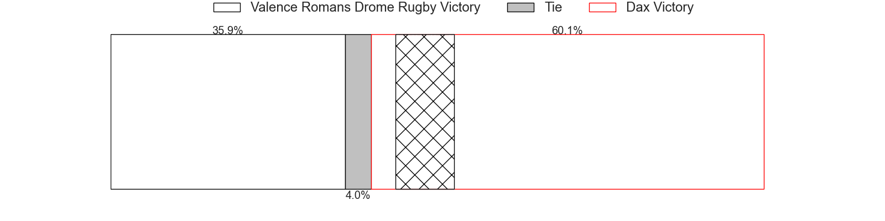
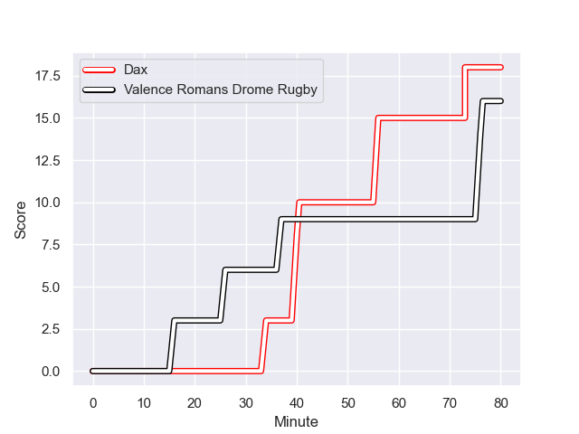
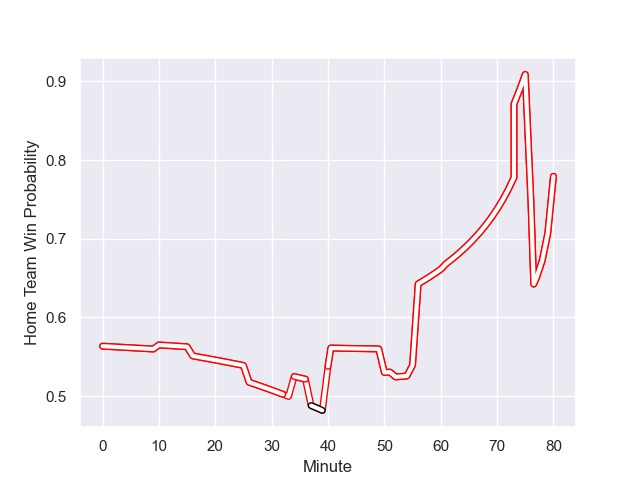

---  
layout: page  
title: Valence Romans Drome Rugby at Dax; 16-18  
date: 2023-12-08 18:00:00 -0500  
categories: "Pro D2 2023" match review  
---
# Valence Romans Drome Rugby at Dax; 16-18

# Club Level Predictions

The first set of predictions treats a club as the smallest object, as the club develops its members, organizes a gameplan, and deploys its players as needed for each match. This club model has a prediction of 0.574, which translates to predicting Dax to win by 2.6.

Each club has a rating and a rating deviation (similar to a Glicko rating), and expected performances can be generated. This allows for simulated matches and spreads like the ones below.
## Projected Performances - Club Model

## Projected Spreads - Club Model

## Projected Results - Club Model

# Player Level Predictions - Version 2

Treating teams instead as an entity made up of the currently active players, I have ratings for each player in an altogether different system. These can be combined to form team ratings once teamsheets are announced, weighting starters a bit higher than the reserves. After the match is played, players can be weighted by their minutes on the field, allowing for an accurate measure of the team's composition. With these compiled team ratings, we can make predictions, measure inaccuracy, and update the individual player ratings.
## Prediction with Player Minutes: Dax by 2.8

Valence Romans Drome Rugby by 1.7 on a neutral field
## Prediction without Player Minutes: Dax by 3.6

Valence Romans Drome Rugby by 0.9 on a neutral pitch

## Projected Performances - Player Model

## Projected Spreads - Player Model

## Projected Results - Player Model

## Scores over Time

## Win Probability over Time

There were 10 large changes in win probability in this match

|   Away Minutes | Away Player         |   Away elo |   Number |   Home elo | Home Player           |   Home Minutes |
|---------------:|:--------------------|-----------:|---------:|-----------:|:----------------------|---------------:|
|             50 | Andrea Pontanier    |      51.56 |        1 |      26.63 | Asa Faitotoa          |             50 |
|             50 | Cyril Deligny       |       0.16 |        2 |      31.55 | Louis Barrere         |             50 |
|             55 | Chris Talakai       |      38.11 |        3 |      30.09 | Diogo Hasse Ferreira  |             50 |
|             80 | Ryan McCauley       |      24.32 |        4 |      46.53 | Mattieu Bidau         |             50 |
|             50 | Florian Goumat      |      49.91 |        5 |      49.77 | Mat Luamanu           |             50 |
|             55 | Axel Bruchet        |      23.62 |        6 |      35.09 | Jean-Baptiste Barrère |             80 |
|             61 | Thembelani Bholi    |      48.43 |        7 |      63.44 | Paul Arnaud Ausset    |             80 |
|             80 | Ioane Iashagashvili |      64.59 |        8 |      82.45 | Genesis Mamea Lemalu  |             50 |
|             80 | Tim Menzel          |      65.47 |        9 |      64.54 | Simon Garrouteigt     |             52 |
|             10 | Joris Moura         |      72.09 |       10 |      40.19 | Romuald Séguy         |             80 |
|             54 | Mosese Mawalu       |      59.86 |       11 |      54.78 | Guillaume Bouche      |             80 |
|             80 | Ben Neiceru         |      55.15 |       12 |      71.31 | Alex McHenry          |             80 |
|             80 | Isaac Te Tamaki     |      17.28 |       13 |      24.71 | Benjamin Puntous      |             80 |
|             80 | Adam Vargas         |      87.96 |       14 |      49.07 | Théo Gatelier         |             80 |
|             80 | Charles Bouldoire   |      83.8  |       15 |      53.21 | Hugo Cerisier         |             55 |
|             70 | Thomas Lhusero      |      63.51 |       16 |      48.2  | Maxime Delonca        |             30 |
|             30 | Anthony Aléo        |      35.59 |       17 |      55.67 | Louis Mary            |             30 |
|             30 | Dorian Marco Pena   |      52.68 |       18 |      20.9  | Josh Furno            |             30 |
|             30 | Darrell Dyer        |      63.55 |       19 |      17.25 | Jean-Baptiste Singer  |             30 |
|             26 | Gauthier Minguillon |      38.79 |       20 |      46.31 | Brice Ferrer          |             30 |
|             25 | Éloi Massot         |      12.08 |       21 |      31.04 | Nephi Leatigaga       |             30 |
|             25 | Gareth Milasinovich |      42.74 |       22 |      49.03 | Paul Ravier           |             28 |
|             19 | Loan Real           |      41.96 |       23 |      57.48 | Bastien Daguerre      |             25 |

