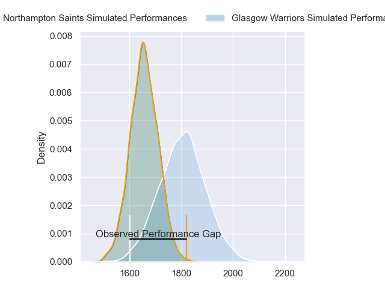
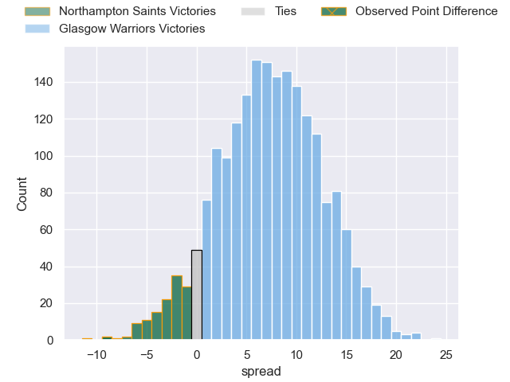
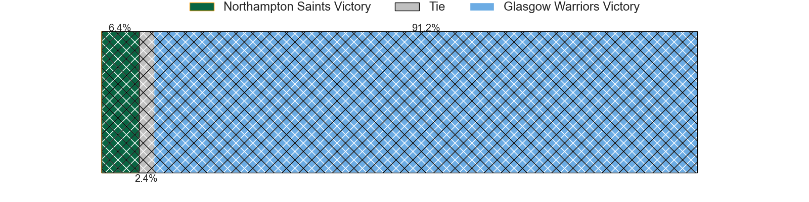
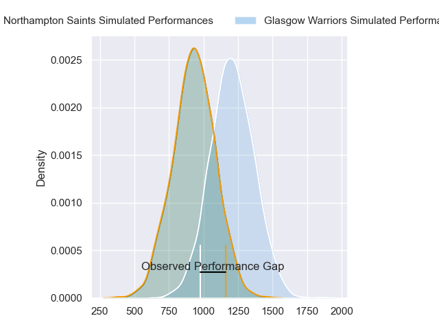
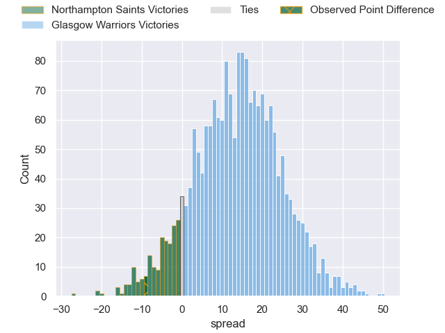
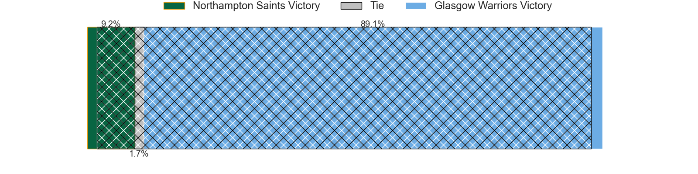
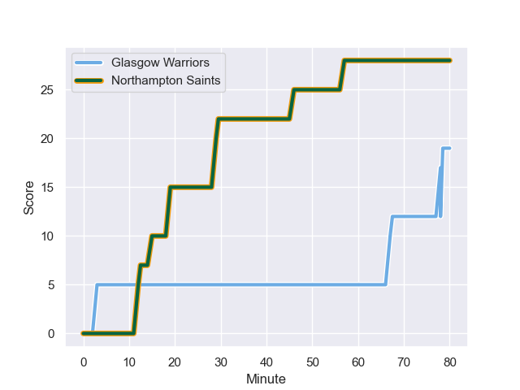
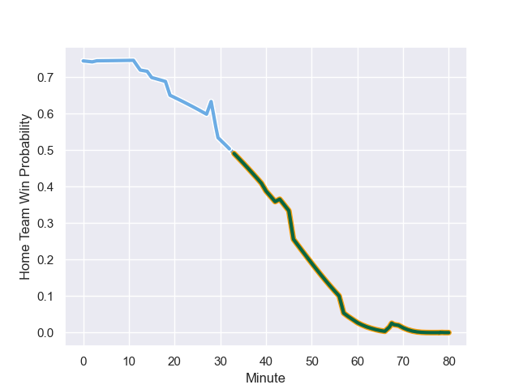

---  
layout: page  
title: Northampton Saints at Glasgow Warriors; 28-19  
date: 2023-12-08 18:00:00 -0500  
categories: "European Rugby Champions Cup 2023" match review  
---
# Northampton Saints at Glasgow Warriors; 28-19

# Club Level Predictions

The first set of predictions treats a club as the smallest object, as the club develops its members, organizes a gameplan, and deploys its players as needed for each match. This club model has a prediction of 0.704, which translates to predicting Glasgow Warriors to win by 7.6.

Each club has a rating and a rating deviation (similar to a Glicko rating), and expected performances can be generated. This allows for simulated matches and spreads like the ones below.
## Projected Performances - Club Model

## Projected Spreads - Club Model

## Projected Results - Club Model

# Player Level Predictions - Version 2

Treating teams instead as an entity made up of the currently active players, I have ratings for each player in an altogether different system. These can be combined to form team ratings once teamsheets are announced, weighting starters a bit higher than the reserves. After the match is played, players can be weighted by their minutes on the field, allowing for an accurate measure of the team's composition. With these compiled team ratings, we can make predictions, measure inaccuracy, and update the individual player ratings.
## Prediction with Player Minutes: Glasgow Warriors by 11.8

Glasgow Warriors by 7.5 on a neutral field
## Prediction without Player Minutes: Glasgow Warriors by 9.9

Glasgow Warriors by 5.7 on a neutral pitch

## Projected Performances - Player Model

## Projected Spreads - Player Model

## Projected Results - Player Model

## Scores over Time

## Win Probability over Time

There were 6 large changes in win probability in this match

|   Away Minutes | Away Player        |   Away elo |   Number |   Home elo | Home Player           |   Home Minutes |
|---------------:|:-------------------|-----------:|---------:|-----------:|:----------------------|---------------:|
|             28 | Alex Waller        |      93.28 |        1 |      89.12 | Jamie Bhatti          |             43 |
|             57 | Curtis Langdon     |      55.89 |        2 |      41.4  | Johnny Matthews       |             43 |
|             69 | Paul Hill          |      91.08 |        3 |     113.07 | Zander Fagerson       |             60 |
|             80 | Tom Lockett        |      47.11 |        4 |      52.02 | Sintu Manjezi         |             43 |
|             69 | Alex Moon          |      77.22 |        5 |      63.68 | Richie Gray           |             60 |
|             80 | Courtney Lawes     |      89.01 |        6 |     110.62 | Scott Cummings        |             80 |
|             80 | Angus Scott-Young  |      39.24 |        7 |      68.9  | Rory Darge            |             80 |
|             43 | Sam Graham         |      81.12 |        8 |     110.06 | Matt Fagerson         |             76 |
|             60 | Alex Mitchell      |      67.93 |        9 |      55.32 | Sean Kennedy          |             40 |
|             80 | Fin Smith          |      43.7  |       10 |      50.46 | Tom Jordan            |             80 |
|             80 | George Hendy       |      61.34 |       11 |      79.6  | Ollie Smith           |             80 |
|             60 | Fraser Dingwall    |      48.03 |       12 |      81.27 | Stafford McDowall     |             80 |
|             80 | Tommy Freeman      |      66.06 |       13 |      42.7  | Huw Jones             |             63 |
|             69 | Ollie Sleightholme |      74    |       14 |     115.92 | Sebastian Cancelliere |             80 |
|             80 | George Furbank     |      62.29 |       15 |      45.79 | Josh McKay            |             80 |
|             52 | Tarek Haffar       |      46.65 |       16 |      47.92 | Nathan McBeth         |             37 |
|             23 | Robbie Smith       |      45.31 |       17 |     116.1  | George Turner         |             37 |
|             11 | Trevor Davison     |      11.79 |       18 |      73.11 | Lucio Sordoni         |             20 |
|             11 | Temo Mayanavanua   |      66.02 |       19 |      47.62 | Sione Vailanu         |             37 |
|             37 | Tom Pearson        |      81.04 |       20 |      40.63 | Max Williamson        |             20 |
|             20 | Tom James          |      11.75 |       21 |      20.36 | Ally Miller           |              4 |
|             20 | Tom Litchfield     |      52.96 |       22 |      47.13 | Ross Thompson         |             17 |
|             11 | Tom Seabrook       |      -2.58 |       23 |      46.73 | Ben Afshar            |             40 |

