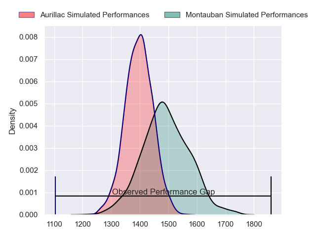
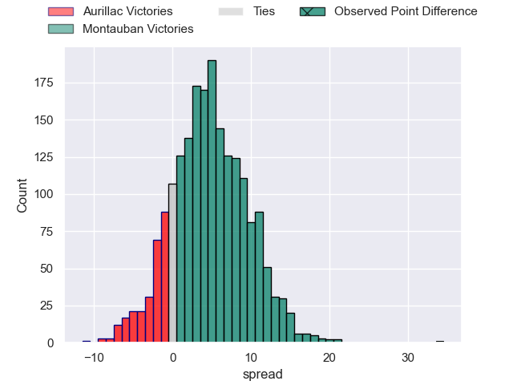
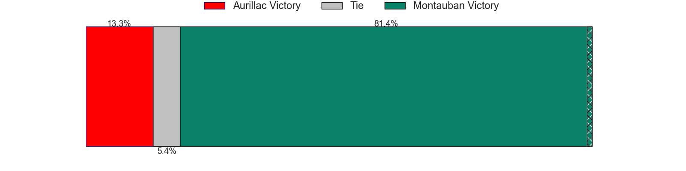
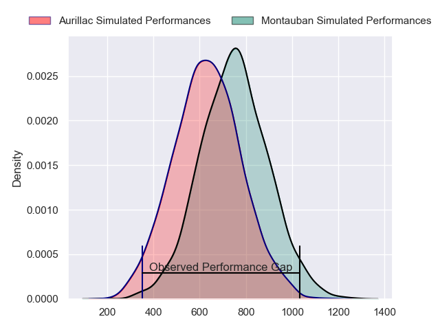
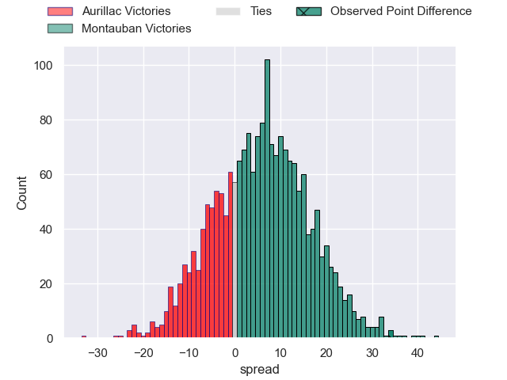
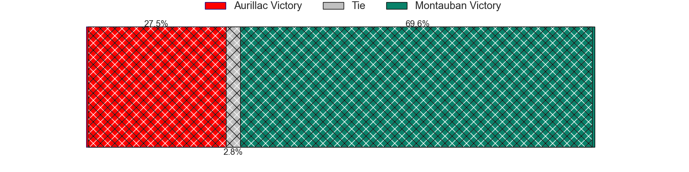
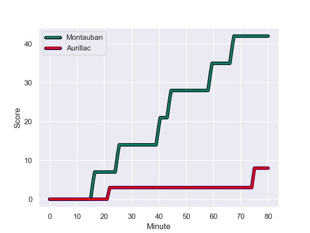
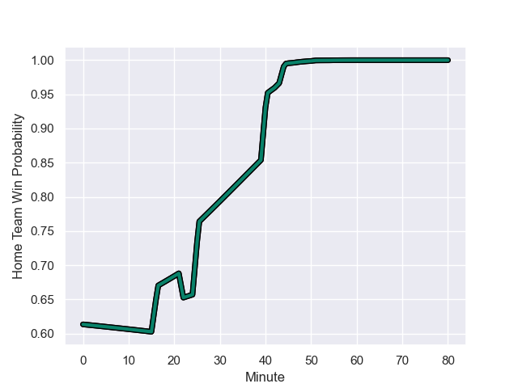

---  
layout: page  
title: Aurillac at Montauban; 8-42  
date: 2023-12-08 18:00:00 -0500  
categories: "Pro D2 2023" match review  
---
# Aurillac at Montauban; 8-42

# Club Level Predictions

The first set of predictions treats a club as the smallest object, as the club develops its members, organizes a gameplan, and deploys its players as needed for each match. This club model has a prediction of 0.628, which translates to predicting Montauban to win by 4.6.

Each club has a rating and a rating deviation (similar to a Glicko rating), and expected performances can be generated. This allows for simulated matches and spreads like the ones below.
## Projected Performances - Club Model

## Projected Spreads - Club Model

## Projected Results - Club Model

# Player Level Predictions - Version 2

Treating teams instead as an entity made up of the currently active players, I have ratings for each player in an altogether different system. These can be combined to form team ratings once teamsheets are announced, weighting starters a bit higher than the reserves. After the match is played, players can be weighted by their minutes on the field, allowing for an accurate measure of the team's composition. With these compiled team ratings, we can make predictions, measure inaccuracy, and update the individual player ratings.
## Prediction with Player Minutes: Montauban by 5.1

Aurillac by 0.8 on a neutral field
## Prediction without Player Minutes: Montauban by 3.8

Aurillac by 0.5 on a neutral pitch

## Projected Performances - Player Model

## Projected Spreads - Player Model

## Projected Results - Player Model

## Scores over Time

## Win Probability over Time

There were 5 large changes in win probability in this match

|   Away Minutes | Away Player         |   Away elo |   Number |   Home elo | Home Player       |   Home Minutes |
|---------------:|:--------------------|-----------:|---------:|-----------:|:------------------|---------------:|
|             53 | Robert Rodgers      |      28.05 |        1 |      33.63 | Lucas Seyrolle    |             51 |
|             52 | Luka Nioradze       |      28.95 |        2 |      23.51 | Kevin Firmin      |             55 |
|             46 | Tim Daniel-Meissen  |      37.38 |        3 |       8.81 | Mirian Burduli    |             54 |
|             52 | Heath Backhouse     |      63.13 |        4 |      61.61 | Frank Bradshaw    |             80 |
|             54 | Mehdi Slamani       |      44.98 |        5 |      44.6  | Lewis Bean        |             80 |
|             80 | Théo Cambon         |      31.09 |        6 |      52.59 | Karl Wilkins      |             55 |
|             80 | Beka Shvangiradze   |      54.87 |        7 |      45.6  | Noa Kanika        |             80 |
|             52 | Didier Tison        |      49.63 |        8 |      21.17 | Tyrone Viiga      |             51 |
|             60 | Boris Hadinegoro    |      49.38 |        9 |      60.21 | Alexis Bernadet   |             51 |
|             80 | Antoine Aucagne     |      34.76 |       10 |      76.73 | Jérôme Bosviel    |             80 |
|             80 | Simeli Yabaki       |      27.33 |       11 |      30.98 | Bastien Guillemin |             62 |
|             43 | Ofa Manuofetoa      |      57.16 |       12 |      36.1  | Maxime Mathy      |             51 |
|             80 | Juun Pieters        |      50.87 |       13 |      54.48 | Yvan Reilhac      |             80 |
|             80 | Dachi Papunashvili  |      38.9  |       14 |      11.88 | Josua Vici        |             80 |
|             80 | Marc Palmier        |      35.67 |       15 |      26.95 | Segundo Tuculet   |             80 |
|             37 | Hugo Bastard        |      48.45 |       16 |      48.32 | Thomas Bue        |             29 |
|             34 | Thomas Cretu        |      49.38 |       17 |      38.88 | Quentin Witt      |             29 |
|             28 | Martial Rolland     |      38.93 |       18 |      58.93 | Yoan Cottin       |             29 |
|             28 | Lilian Djomboue     |      43.96 |       19 |      76.4  | Dan Goggin        |             29 |
|             28 | Yohann Gbizie       |      63.46 |       20 |      52.08 | WillGriff John    |             26 |
|             27 | Jean-Jacques Gymael |      37.43 |       21 |      55.5  | Dimitri Vaotoa    |             25 |
|             26 | Mosa'ati Moala      |      32.66 |       22 |      42.99 | Ru-Hann Greyling  |             25 |
|             20 | Mikheil Alania      |      35.44 |       23 |      88.91 | Semesa Rokoduguni |             18 |

