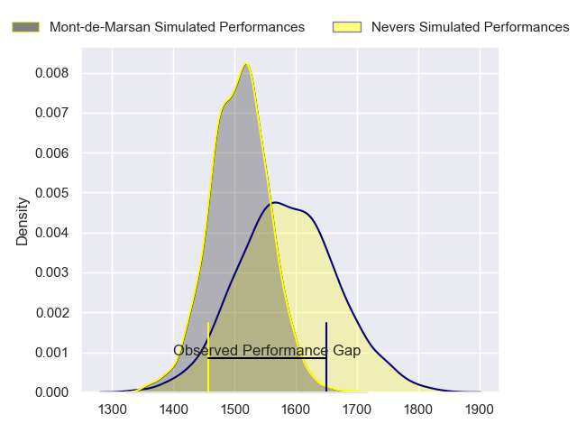
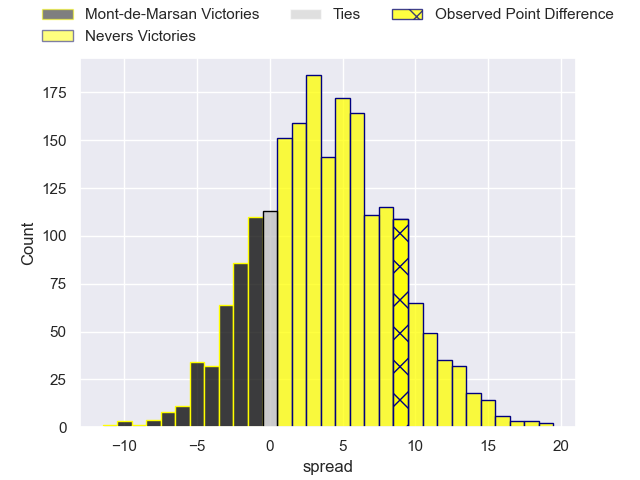
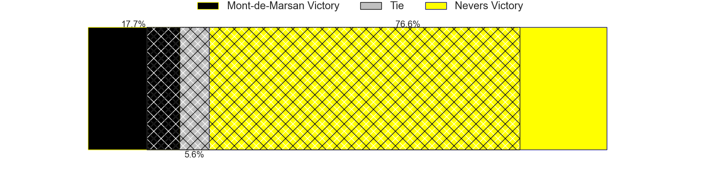
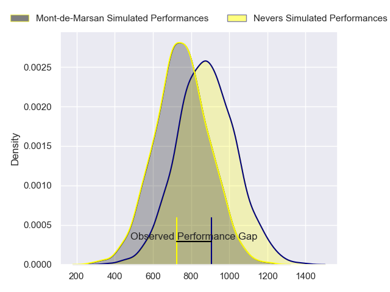
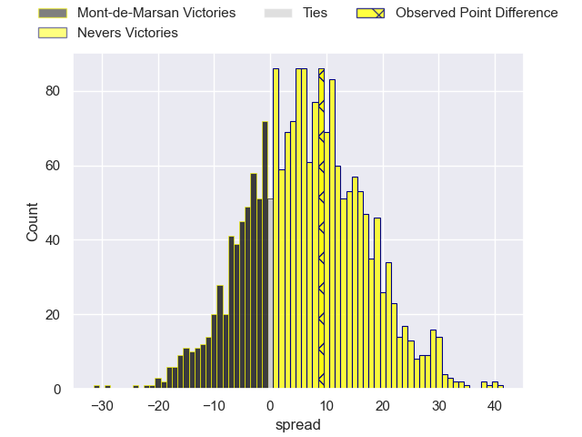
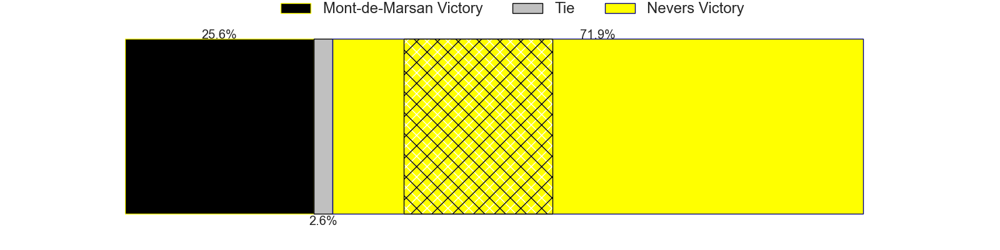
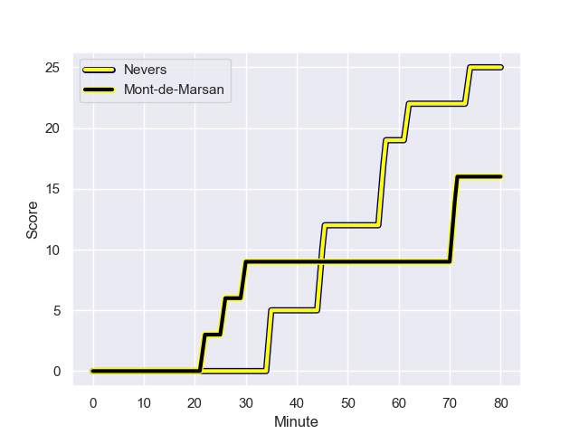
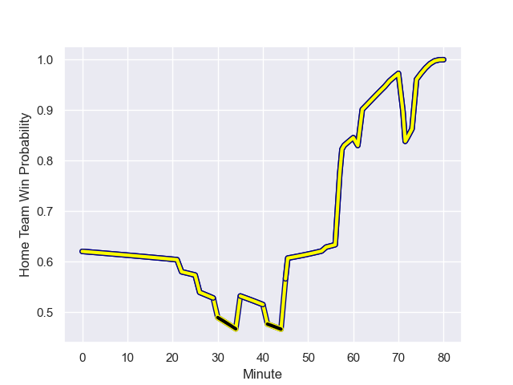

---  
layout: page  
title: Mont-de-Marsan at Nevers; 16-25  
date: 2023-12-08 18:00:00 -0500  
categories: "Pro D2 2023" match review  
---
# Mont-de-Marsan at Nevers; 16-25

# Club Level Predictions

The first set of predictions treats a club as the smallest object, as the club develops its members, organizes a gameplan, and deploys its players as needed for each match. This club model has a prediction of 0.611, which translates to predicting Nevers to win by 4.0.

Each club has a rating and a rating deviation (similar to a Glicko rating), and expected performances can be generated. This allows for simulated matches and spreads like the ones below.
## Projected Performances - Club Model

## Projected Spreads - Club Model

## Projected Results - Club Model

# Player Level Predictions - Version 2

Treating teams instead as an entity made up of the currently active players, I have ratings for each player in an altogether different system. These can be combined to form team ratings once teamsheets are announced, weighting starters a bit higher than the reserves. After the match is played, players can be weighted by their minutes on the field, allowing for an accurate measure of the team's composition. With these compiled team ratings, we can make predictions, measure inaccuracy, and update the individual player ratings.
## Prediction with Player Minutes: Nevers by 5.4

Nevers by 1.8 on a neutral field
## Prediction without Player Minutes: Nevers by 5.3

Nevers by 1.8 on a neutral pitch

## Projected Performances - Player Model

## Projected Spreads - Player Model

## Projected Results - Player Model

## Scores over Time

## Win Probability over Time

There were 12 large changes in win probability in this match

|   Away Minutes | Away Player           |   Away elo |   Number |   Home elo | Home Player              |   Home Minutes |
|---------------:|:----------------------|-----------:|---------:|-----------:|:-------------------------|---------------:|
|             41 | Dino Casadei          |      49.79 |        1 |      50    | Jordan Seneca            |             53 |
|             41 | Simon Labouyrie       |      41.53 |        2 |      47.12 | Elia Elia                |             68 |
|             41 | Anthony Alves         |      33.22 |        3 |      42.72 | Cleopas Kundiona         |             53 |
|             80 | Nicolas Garrault      |      50.56 |        4 |       7.31 | Christiaan van der Merwe |             80 |
|             41 | Romain Durand         |      58.1  |        5 |      34.83 | Makatuki Polutele        |             49 |
|             80 | Aurélien Lisena       |      49.37 |        6 |      49.4  | Luka Plataret            |             80 |
|             80 | Léo Banos             |      73.42 |        7 |      50.87 | Steven David             |             63 |
|             49 | Mike Faleafa          |      45.33 |        8 |      86.55 | Jason-Colin Fraser       |             80 |
|             58 | Christophe Loustalot  |      38.11 |        9 |      24.02 | Hugo Bouyssou            |             61 |
|             80 | Joris Pialot          |      36.32 |       10 |      55.51 | Tanguy Ménoret           |             26 |
|             80 | Pierre Sayerse        |      57.95 |       11 |      54.02 | Arthur Mathiron          |             80 |
|             54 | Jules Even            |      58.66 |       12 |      60.22 | Rudy Derrieux            |             63 |
|             80 | Gatien Masse          |      47.59 |       13 |      70.37 | Alifereti Loaloa         |             80 |
|             60 | Simao Broeiro Bento   |      46.09 |       14 |      58.89 | Christian Ambadiang      |             80 |
|             80 | Yoann Laousse Azpiazu |      43.12 |       15 |      70.61 | Kylian Jaminet           |             80 |
|             39 | Jean-Luc Innocente    |      35.24 |       16 |      51.67 | Yohan Le Bourhis         |             54 |
|             39 | Torsten van Jaarsveld |     101.65 |       17 |      93.44 | Will Skelton             |             31 |
|             39 | Jules Dussutour       |      47    |       18 |      46.98 | Kamaliele Tufele         |             27 |
|             39 | Mattéo Lalanne        |      47.25 |       19 |      50.48 | Ilia Kaikatsishvili      |             27 |
|             31 | Raphaël Robic         |      53.57 |       20 |      34.61 | Guillaume Manevy         |             19 |
|             26 | Simon Desaubies       |      27.38 |       21 |      75.77 | Hugues Bastide           |             17 |
|             22 | Baptiste Canut        |      47.57 |       22 |      67.79 | Leonard Paris            |             17 |
|             20 | Harrison Obatoyinbo   |      52.79 |       23 |      51.46 | Quentin Beaudaux         |             12 |

