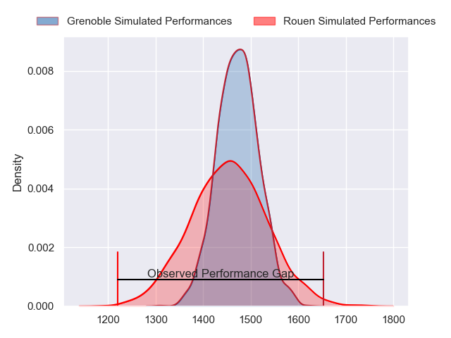
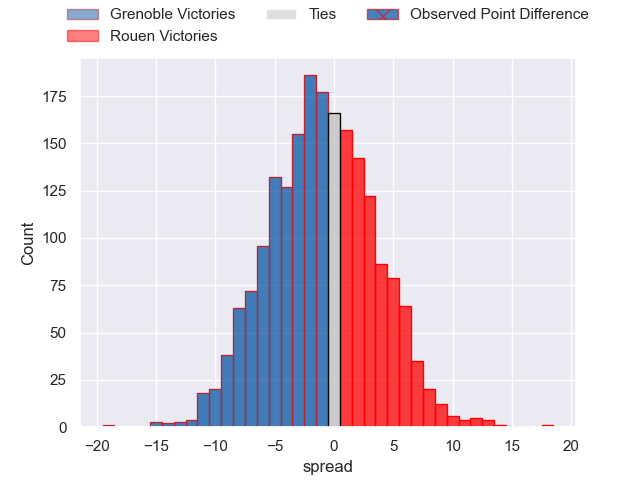
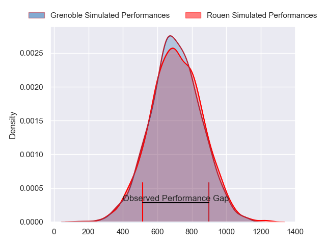
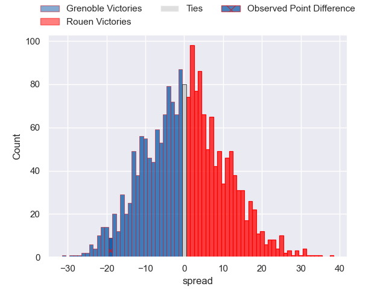
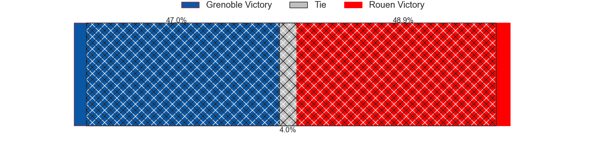
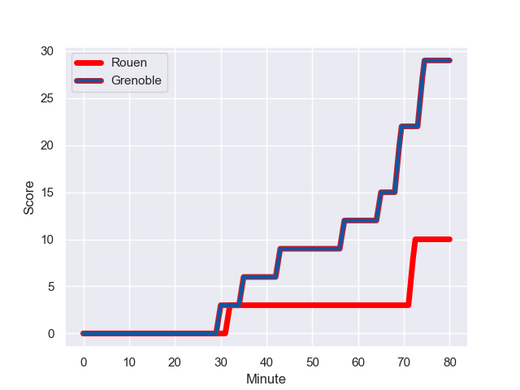
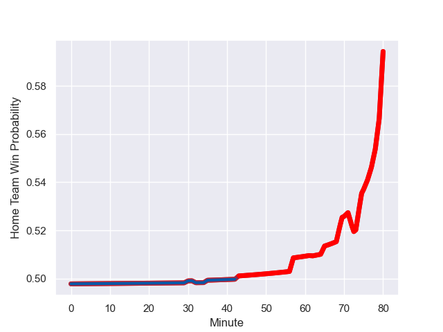

---  
layout: page  
title: Grenoble at Rouen; 29-10  
date: 2023-12-08 18:00:00 -0500  
categories: "Pro D2 2023" match review  
---
# Grenoble at Rouen; 29-10

# Club Level Predictions

The first set of predictions treats a club as the smallest object, as the club develops its members, organizes a gameplan, and deploys its players as needed for each match. This club model has a prediction of 0.47, which translates to predicting Grenoble to win by 1.1.

Each club has a rating and a rating deviation (similar to a Glicko rating), and expected performances can be generated. This allows for simulated matches and spreads like the ones below.
## Projected Performances - Club Model

## Projected Spreads - Club Model

## Projected Results - Club Model

# Player Level Predictions - Version 2

Treating teams instead as an entity made up of the currently active players, I have ratings for each player in an altogether different system. These can be combined to form team ratings once teamsheets are announced, weighting starters a bit higher than the reserves. After the match is played, players can be weighted by their minutes on the field, allowing for an accurate measure of the team's composition. With these compiled team ratings, we can make predictions, measure inaccuracy, and update the individual player ratings.
## Prediction with Player Minutes: Grenoble by 0.1

Grenoble by 3.5 on a neutral field
## Prediction without Player Minutes: Rouen by 2.3

Grenoble by 1.1 on a neutral pitch

## Projected Performances - Player Model

## Projected Spreads - Player Model

## Projected Results - Player Model

## Scores over Time

## Win Probability over Time

There were 1 large changes in win probability in this match

|   Away Minutes | Away Player                 |   Away elo |   Number |   Home elo | Home Player        |   Home Minutes |
|---------------:|:----------------------------|-----------:|---------:|-----------:|:-------------------|---------------:|
|             56 | Luka Goginava               |      42.04 |        1 |      27.91 | Elias El Ansari    |             62 |
|             56 | Barnabé Massa               |      50.34 |        2 |      48.36 | Mathieu Bonnot     |             52 |
|             56 | Regis Montagne              |      52.13 |        3 |      57.83 | Soso Bekoshvili    |             72 |
|             80 | Jose Madeira                |      77.46 |        4 |      21.5  | Will Witty         |             80 |
|             57 | Georgi Javakhia             |      52.97 |        5 |      58.77 | Toby Salmon        |             16 |
|             80 | Antonin Berruyer            |      25.55 |        6 |      46.66 | Tienie Burger      |             80 |
|             80 | Steeve Blanc-Mappaz         |      32.85 |        7 |      25.8  | Samuel Maximin     |             80 |
|             52 | Tala Gray                   |      37.53 |        8 |      67.76 | Julien Ruaud       |             47 |
|             48 | Barnabe Couilloud           |      21.2  |        9 |      58.8  | Maxime Sidobre     |             53 |
|             80 | Romain Barthelemy           |      29.03 |       10 |      58.57 | Franck Pourteau    |             53 |
|             80 | Karim Qadiri                |      46.55 |       11 |      45.48 | Paul Vallee        |             80 |
|             80 | Romain Trouilloud           |      51.78 |       12 |      80.85 | Kevin Bly          |             80 |
|             62 | Romain Fusier               |      33.98 |       13 |      21.8  | JT Jackson         |             80 |
|             48 | Atunaisa Taulanga Vaka Manu |      28.7  |       14 |      12.14 | Alex Luatua        |             70 |
|             80 | Julien Farnoux              |      92.32 |       15 |      53.36 | Baptiste Mouchous  |             80 |
|             32 | Eric Escande                |      58.3  |       16 |      17.31 | John-Charles Astle |             64 |
|             32 | Geoffrey Cros               |      39.39 |       17 |      55.63 | Lucas Costa        |             33 |
|             28 | Pio Muarua                  |      39.2  |       18 |       3.1  | Jeremie Maurouard  |             28 |
|             24 | Zack Gauthier               |      56.18 |       19 |      36.89 | Quentin Delord     |             27 |
|             24 | Lilian Rossi                |      43.1  |       20 |      44.18 | Hugo Aubry         |             27 |
|             24 | Irakli Aptsiauri            |      54.15 |       21 |      39.19 | Cody Thomas        |             18 |
|             23 | Pierce Phillips             |      45.4  |       22 |      48.08 | Pablo Patilla      |             10 |
|             18 | Bautista Ezcurra            |      91.93 |       23 |      30.97 | Antoine Fournier   |              8 |

