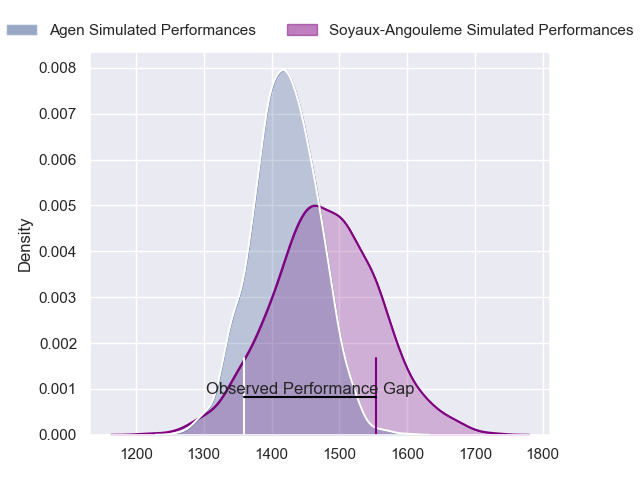
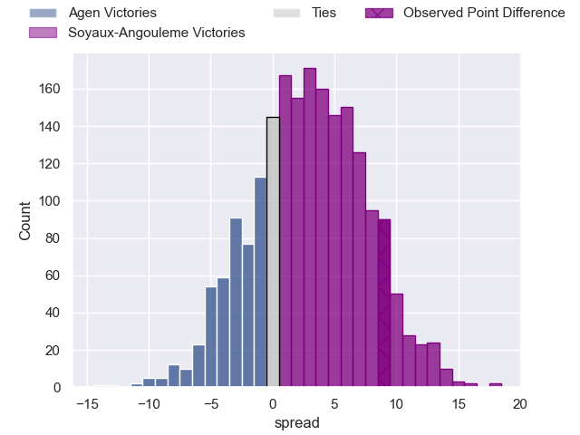
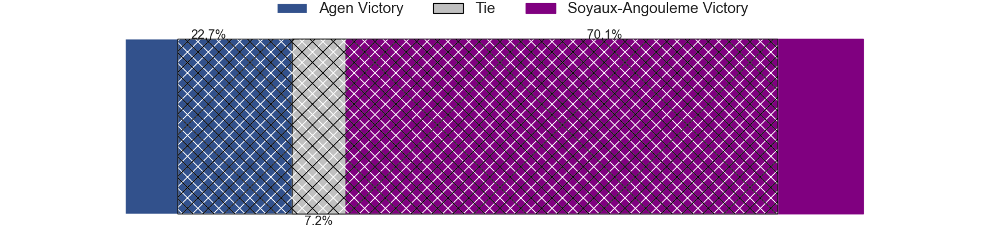
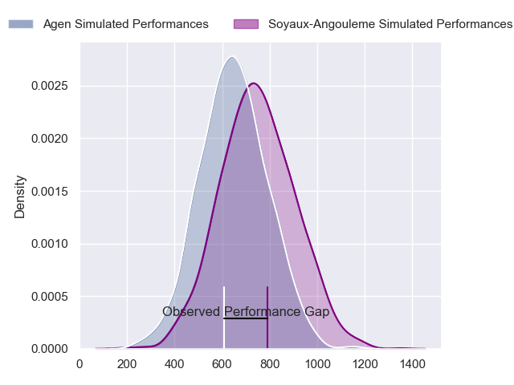
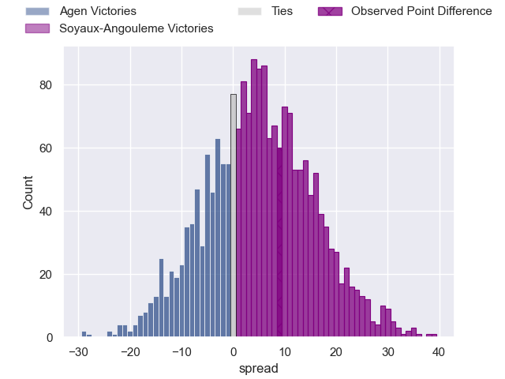
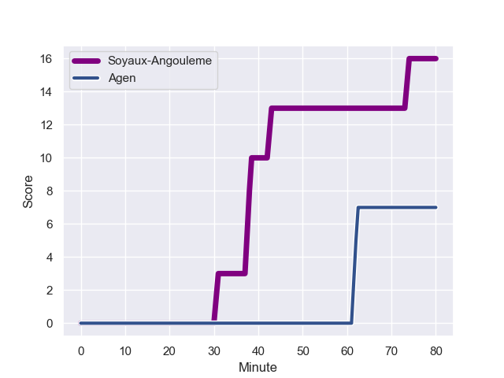
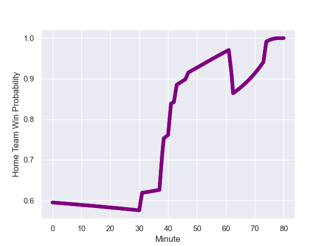

---  
layout: page  
title: Agen at Soyaux-Angouleme; 7-16  
date: 2023-12-08 18:00:00 -0500  
categories: "Pro D2 2023" match review  
---
# Agen at Soyaux-Angouleme; 7-16

# Club Level Predictions

The first set of predictions treats a club as the smallest object, as the club develops its members, organizes a gameplan, and deploys its players as needed for each match. This club model has a prediction of 0.588, which translates to predicting Soyaux-Angouleme to win by 3.1.

Each club has a rating and a rating deviation (similar to a Glicko rating), and expected performances can be generated. This allows for simulated matches and spreads like the ones below.
## Projected Performances - Club Model

## Projected Spreads - Club Model

## Projected Results - Club Model

# Player Level Predictions - Version 2

Treating teams instead as an entity made up of the currently active players, I have ratings for each player in an altogether different system. These can be combined to form team ratings once teamsheets are announced, weighting starters a bit higher than the reserves. After the match is played, players can be weighted by their minutes on the field, allowing for an accurate measure of the team's composition. With these compiled team ratings, we can make predictions, measure inaccuracy, and update the individual player ratings.
## Prediction with Player Minutes: Soyaux-Angouleme by 4.2

Agen by 0.5 on a neutral field
## Prediction without Player Minutes: Soyaux-Angouleme by 3.4

Agen by 0.3 on a neutral pitch

## Projected Performances - Player Model

## Projected Spreads - Player Model

## Projected Results - Player Model

## Scores over Time

## Win Probability over Time

There were 8 large changes in win probability in this match

|   Away Minutes | Away Player          |   Away elo |   Number |   Home elo | Home Player            |   Home Minutes |
|---------------:|:---------------------|-----------:|---------:|-----------:|:-----------------------|---------------:|
|             58 | Hans Lombard-Buret   |      47.84 |        1 |      27.56 | Khatchik Vartanov      |             35 |
|             58 | Clement Martinez     |      38.38 |        2 |      45.32 | Patxi Bidart           |             47 |
|             58 | Alex Burin           |      50.43 |        3 |      20.26 | Yassine Boutemane      |             55 |
|             41 | Corentin Vernet      |      39.05 |        4 |      46.04 | Ian Kitwanga           |             80 |
|             80 | Evan Olmstead        |      -5.22 |        5 |      52.45 | Sikeli Nabou           |             55 |
|             41 | Matthieu Bonnet      |      47.04 |        6 |      56.97 | Germain Burgaud        |             80 |
|             80 | Valentin Gayraud     |      48.84 |        7 |      48.72 | Hubert Texier          |             55 |
|             80 | Martin Devergie      |      37.75 |        8 |      43.01 | Alexander Masibaka     |             80 |
|             55 | Sonatane Takulua     |      13.29 |        9 |      11.74 | Adrien Bau             |             76 |
|             80 | Thomas Vincent       |      52.4  |       10 |      56.47 | Ben Botica             |             69 |
|             80 | Iban Etcheverry      |      36.08 |       11 |      52.49 | Matthys Gratien        |             80 |
|             80 | Clement Garrigues    |      51.45 |       12 |      33.31 | Mathis Lafon           |             72 |
|             47 | Harry Sloan          |      65.96 |       13 |      61.16 | Akuila Joeli Tabualevu |             80 |
|             80 | Henry Purdy          |      73.59 |       14 |      34.51 | Pierre Lafitte         |             80 |
|             55 | Jean-Marcelin Buttin |      52.19 |       15 |      45.1  | Rémi Brosset           |             80 |
|             39 | Joe Maksymiw         |      20.4  |       16 |      49.39 | Luca Tabarot           |             45 |
|             39 | Julien Lebian        |      33.34 |       17 |      48.22 | German Kessler         |             33 |
|             33 | George Tilsley       |      78.91 |       18 |      59.4  | Nicolas Martins        |             25 |
|             25 | Emile Dayral         |      43.46 |       19 |      32.29 | Matt Beukeboom         |             25 |
|             25 | Theo Idjellidaine    |      37.91 |       20 |      48.32 | Omar Dahir             |             25 |
|             22 | Pierre Jouvin        |      40.52 |       21 |      34.94 | Corentin Glenat        |             11 |
|             22 | Mamuka Mstoiani      |      46.65 |       22 |      58.79 | Nasoni Naqiri Kunavore |              8 |
|             22 | Théo Sauzaret        |      43.7  |       23 |      34.53 | Alexis Levron          |              4 |

