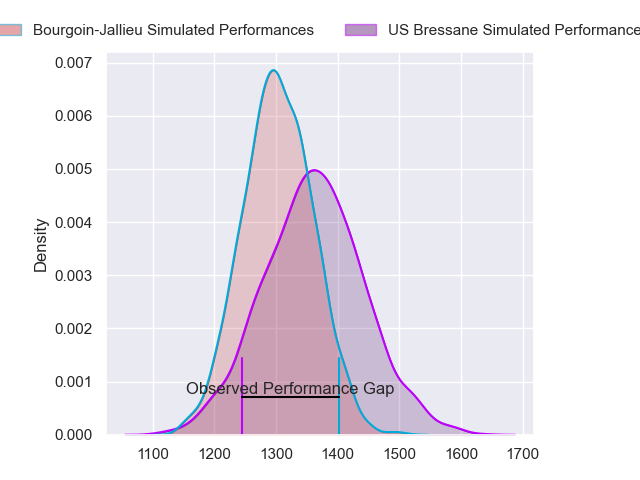
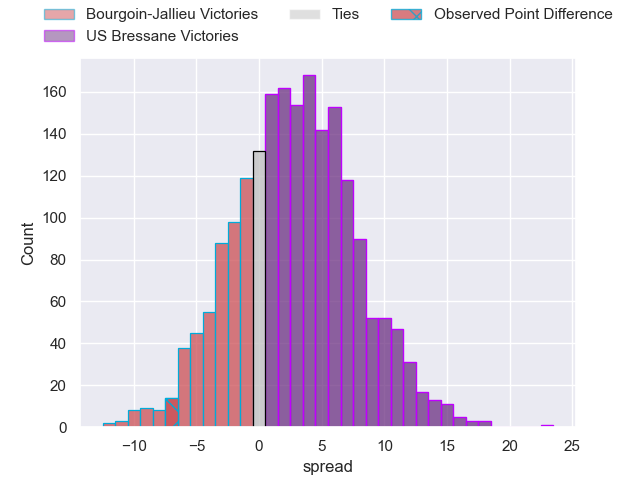
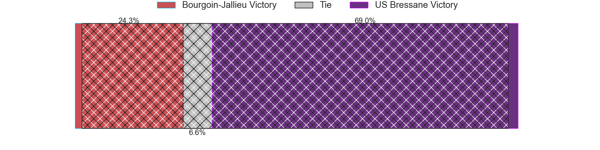
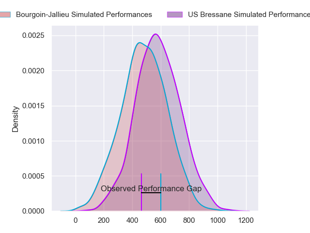
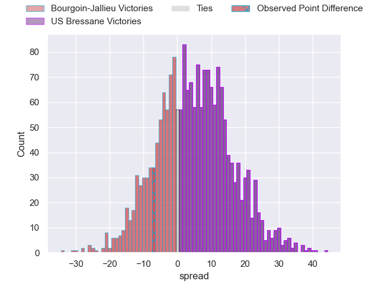
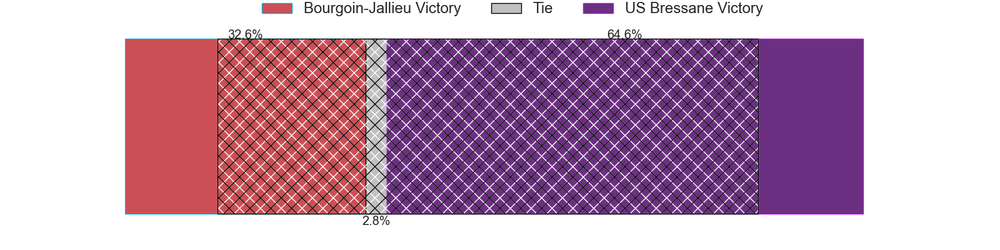
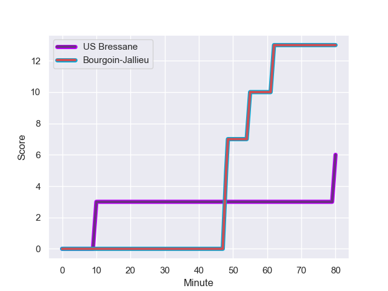
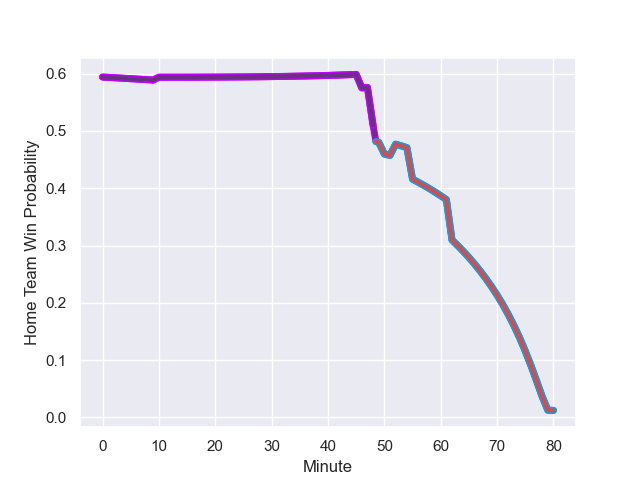

---  
layout: page  
title: Bourgoin-Jallieu at US Bressane; 13-6  
date: 2023-12-08 18:00:00 -0500  
categories: "Nationale 2023" match review  
---
# Bourgoin-Jallieu at US Bressane; 13-6

# Club Level Predictions

The first set of predictions treats a club as the smallest object, as the club develops its members, organizes a gameplan, and deploys its players as needed for each match. This club model has a prediction of 0.583, which translates to predicting US Bressane to win by 3.0.

Each club has a rating and a rating deviation (similar to a Glicko rating), and expected performances can be generated. This allows for simulated matches and spreads like the ones below.
## Projected Performances - Club Model

## Projected Spreads - Club Model

## Projected Results - Club Model

# Player Level Predictions - Version 2

Treating teams instead as an entity made up of the currently active players, I have ratings for each player in an altogether different system. These can be combined to form team ratings once teamsheets are announced, weighting starters a bit higher than the reserves. After the match is played, players can be weighted by their minutes on the field, allowing for an accurate measure of the team's composition. With these compiled team ratings, we can make predictions, measure inaccuracy, and update the individual player ratings.
## Prediction with Player Minutes: US Bressane by 4.2

US Bressane by 0.7 on a neutral field
## Prediction without Player Minutes: US Bressane by 5.5

US Bressane by 1.9 on a neutral pitch

## Projected Performances - Player Model

## Projected Spreads - Player Model

## Projected Results - Player Model

## Scores over Time

## Win Probability over Time

There were 7 large changes in win probability in this match

|   Away Minutes | Away Player              |   Away elo |   Number |   Home elo | Home Player               |   Home Minutes |
|---------------:|:-------------------------|-----------:|---------:|-----------:|:--------------------------|---------------:|
|             52 | Zhorzhi (Jorji) Saldadze |      31.47 |        1 |      43.22 | Vazha Kapanadze           |             54 |
|             52 | Mohamed Khribache        |      21.88 |        2 |      41.59 | Arnaud Feltrin            |             57 |
|             52 | Rossouw De Klerk         |      37.98 |        3 |      22.76 | Atonio Ulutuipalelei      |             54 |
|             80 | Léandre Cotte            |       3.67 |        4 |      27.69 | Louis Bruinsma            |             80 |
|             46 | Morgan Eames             |     -19.03 |        5 |      37.26 | Josh Peters               |             50 |
|             67 | Theophile Cotte          |      34.59 |        6 |      41.92 | Pierre Reynaud            |             80 |
|             80 | Kevin Chaudouard         |      37.35 |        7 |      49.08 | Nicolas Tachat            |             71 |
|             73 | Poutasi Luafutu          |      33.81 |        8 |      41.6  | Loic Baradel              |             64 |
|             80 | Tomas Munilla lo Duca    |      56.08 |        9 |      40.53 | Jeremy Valencot           |             50 |
|             78 | Nicolas Vuillemin        |      49.55 |       10 |      -5.77 | Nicolas Faure             |             80 |
|             80 | Remi Bouet               |      17.59 |       11 |      37.11 | Élie De Fleurian          |             80 |
|             65 | Pieter Morton            |      47.22 |       12 |       8.24 | Parataiso Silafai-Lea'ana |             80 |
|             80 | Christopher Bosch        |      27.03 |       13 |      47.46 | Benjamin Doy              |             71 |
|             80 | Paul-Hugo Champ          |      33.84 |       14 |      28.57 | Thibaut Perrette          |             80 |
|             80 | Aviata Silago            |      26.76 |       15 |      50.74 | Florent Massip            |             80 |
|             34 | Jonathan Kpoku           |      43.15 |       16 |     -10.84 | Maselino Paulino          |             30 |
|             28 | Romain Favaretto         |      38.03 |       17 |      46.4  | François Grange           |             30 |
|             28 | Killian Tripier          |      51.73 |       18 |      33.29 | Erich de Jager            |             26 |
|             28 | Osman Dimen              |      37.58 |       19 |      38.4  | Quentin Drancourt         |             26 |
|             15 | Isaiah Leota             |      51.95 |       20 |      40.51 | Louis Dasalmartini        |             23 |
|             13 | Matteo Broeders          |      43.44 |       21 |      53.79 | Joseph Penitito           |             16 |
|              7 | Kevin Rivoire            |      57.71 |       22 |      27.44 | Maile Mamao               |              9 |
|              2 | Adrien Pontarollo        |      30.57 |       23 |      56.24 | Lucas Lyons               |              9 |

