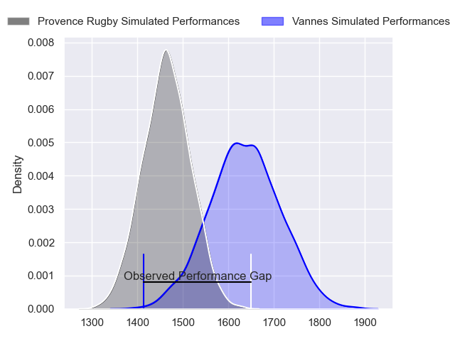
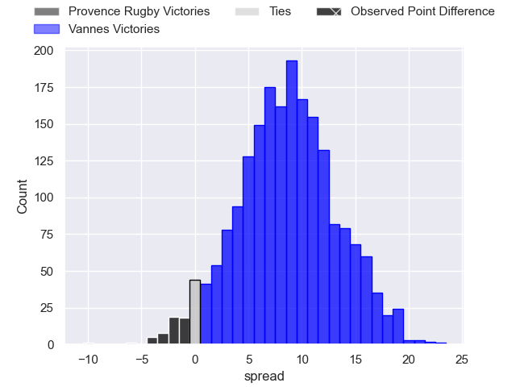
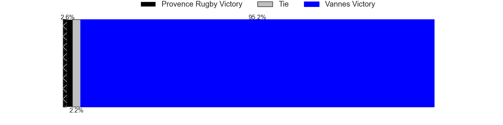
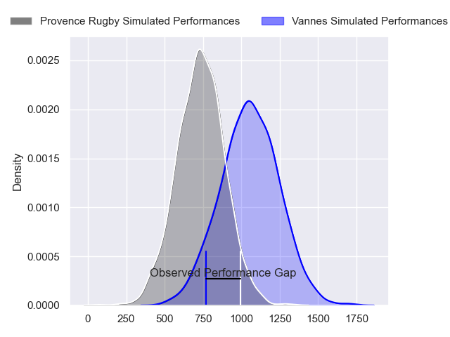
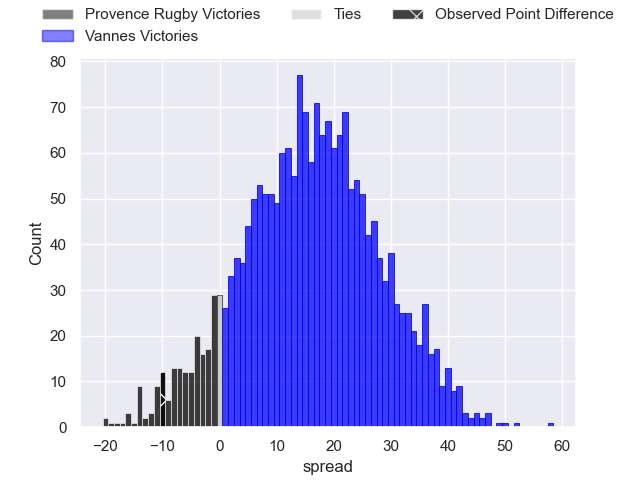
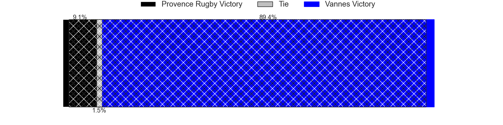
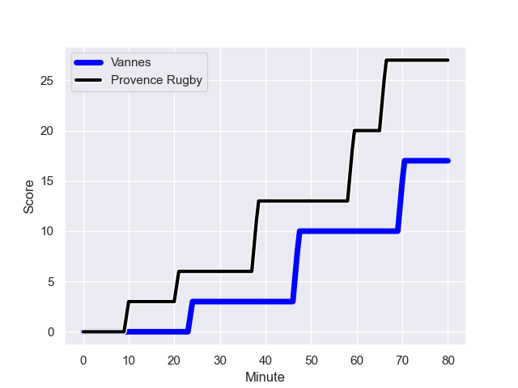
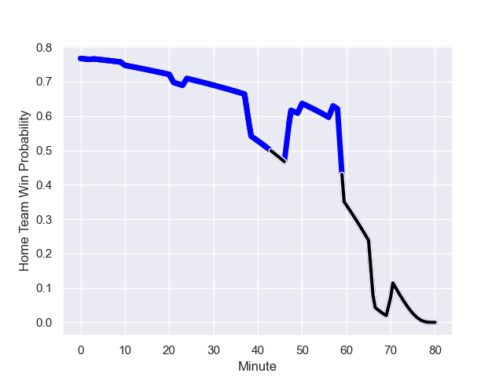

---  
layout: page  
title: Provence Rugby at Vannes; 27-17  
date: 2023-12-08 18:00:00 -0500  
categories: "Pro D2 2023" match review  
---
# Provence Rugby at Vannes; 27-17

# Club Level Predictions

The first set of predictions treats a club as the smallest object, as the club develops its members, organizes a gameplan, and deploys its players as needed for each match. This club model has a prediction of 0.728, which translates to predicting Vannes to win by 8.6.

Each club has a rating and a rating deviation (similar to a Glicko rating), and expected performances can be generated. This allows for simulated matches and spreads like the ones below.
## Projected Performances - Club Model

## Projected Spreads - Club Model

## Projected Results - Club Model

# Player Level Predictions - Version 2

Treating teams instead as an entity made up of the currently active players, I have ratings for each player in an altogether different system. These can be combined to form team ratings once teamsheets are announced, weighting starters a bit higher than the reserves. After the match is played, players can be weighted by their minutes on the field, allowing for an accurate measure of the team's composition. With these compiled team ratings, we can make predictions, measure inaccuracy, and update the individual player ratings.
## Prediction with Player Minutes: Vannes by 13.1

Vannes by 9.5 on a neutral field
## Prediction without Player Minutes: Vannes by 11.7

Vannes by 8.0 on a neutral pitch

## Projected Performances - Player Model

## Projected Spreads - Player Model

## Projected Results - Player Model

## Scores over Time

## Win Probability over Time

There were 12 large changes in win probability in this match

|   Away Minutes | Away Player           |   Away elo |   Number |   Home elo | Home Player             |   Home Minutes |
|---------------:|:----------------------|-----------:|---------:|-----------:|:------------------------|---------------:|
|             50 | Julius Nostadt        |      44.48 |        1 |      66.35 | Andy Bordelai           |             80 |
|             60 | Lucas Martin          |      65.7  |        2 |      44.05 | Cyril Blanchard         |             80 |
|             57 | Tomas Francis         |     105.19 |        3 |      69.18 | Phil Kite               |             80 |
|             50 | Clément Chartier      |      54.83 |        4 |      17.36 | Eric Marks              |             80 |
|             80 | Theo Hannoyer         |      15.82 |        5 |      42    | Mattéo Desjeux          |             80 |
|             50 | Teimana Harrison      |      64.76 |        6 |      42.79 | Juan Bautista Pedemonte |             80 |
|             50 | Bilel Taieb           |      74.39 |        7 |     116.04 | Francisco Gorrissen     |             80 |
|             80 | Carl Axtens           |      41.17 |        8 |      46.28 | Léon Boulier            |             80 |
|             57 | Arthur Coville        |      48.66 |        9 |      89.2  | Michael Ruru            |             80 |
|             80 | Jimmy Gopperth        |      64.69 |       10 |      98.79 | Maxime Lafage           |             80 |
|             80 | Hugo Navizet          |      46.88 |       11 |      69.72 | Théo Bastardie          |             80 |
|             80 | Dorian Lavernhe       |      28.11 |       12 |      17.8  | Andres Vilaseca         |             80 |
|             80 | Louis Marrou          |      48.36 |       13 |      77.07 | Sacha Valleau           |             80 |
|             80 | Adrien Lapegue-Lafaye |      29.78 |       14 |      48.17 | Paul Surano             |             80 |
|              3 | Mathias Colombet      |      53.51 |       15 |     122.02 | Gwenaël Duplenne        |             80 |
|             77 | Enzo Selponi          |      50.1  |       16 |     nan    | nan                     |            nan |
|             30 | Federico Wegrzyn      |      47.41 |       17 |     nan    | nan                     |            nan |
|             30 | Josh Tyrell           |      52.46 |       18 |     nan    | nan                     |            nan |
|             30 | Nicolas Mousties      |      41.63 |       19 |     nan    | nan                     |            nan |
|             30 | Malohi Suta           |      44.43 |       20 |     nan    | nan                     |            nan |
|             23 | Thomas Vernet         |      44.22 |       21 |     nan    | nan                     |            nan |
|             23 | Joris Cazenave        |      38.99 |       22 |     nan    | nan                     |            nan |
|             20 | Jean Charles Orioli   |      43.91 |       23 |     nan    | nan                     |            nan |

