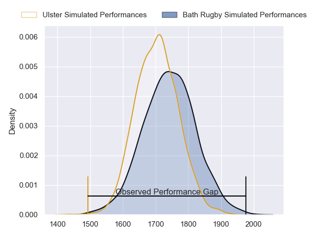
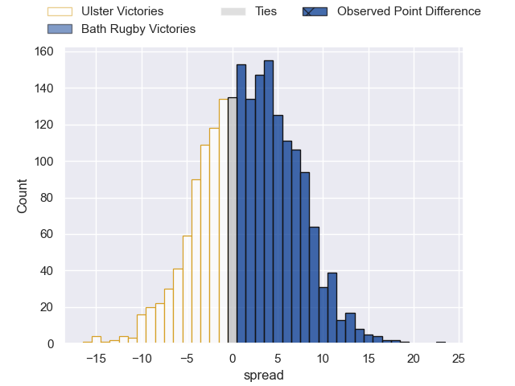
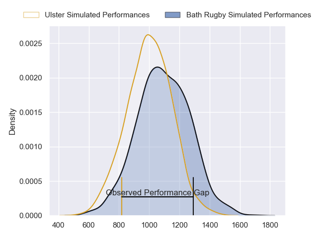
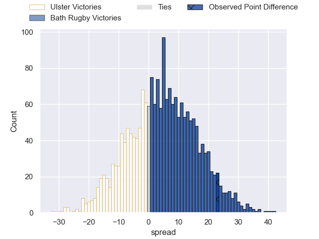
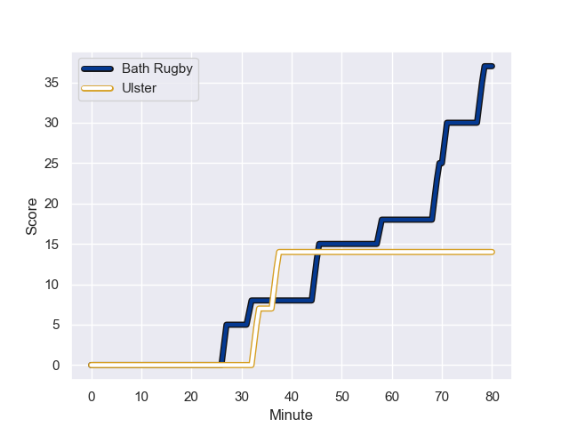
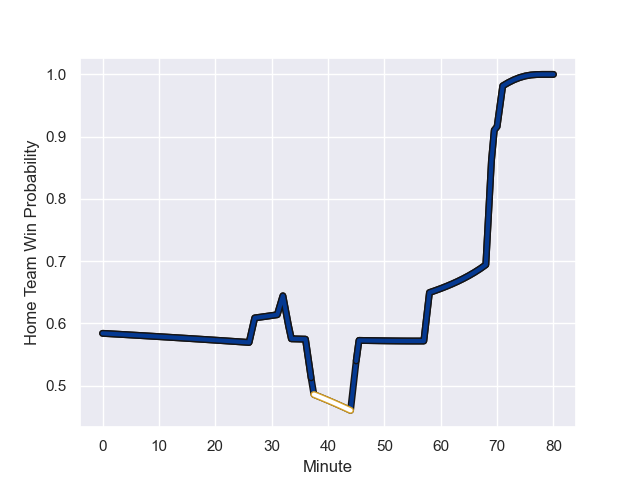

---  
layout: page  
title: Ulster at Bath Rugby; 14-37  
date: 2023-12-09 18:00:00 -0500  
categories: "European Rugby Champions Cup 2023" match review  
---
# Ulster at Bath Rugby; 14-37

# Club Level Predictions

The first set of predictions treats a club as the smallest object, as the club develops its members, organizes a gameplan, and deploys its players as needed for each match. This club model has a prediction of 0.555, which translates to predicting Bath Rugby to win by 2.0.

Each club has a rating and a rating deviation (similar to a Glicko rating), and expected performances can be generated. This allows for simulated matches and spreads like the ones below.
## Projected Performances - Club Model

## Projected Spreads - Club Model

## Projected Results - Club Model

# Player Level Predictions - Version 2

Treating teams instead as an entity made up of the currently active players, I have ratings for each player in an altogether different system. These can be combined to form team ratings once teamsheets are announced, weighting starters a bit higher than the reserves. After the match is played, players can be weighted by their minutes on the field, allowing for an accurate measure of the team's composition. With these compiled team ratings, we can make predictions, measure inaccuracy, and update the individual player ratings.
## Prediction with Player Minutes: Bath Rugby by 3.7

Ulster by 1.1 on a neutral field
## Prediction without Player Minutes: Bath Rugby by 3.5

Ulster by 1.3 on a neutral pitch

## Projected Performances - Player Model

## Projected Spreads - Player Model

## Projected Results - Player Model

## Scores over Time

## Win Probability over Time

There were 11 large changes in win probability in this match

|   Away Minutes | Away Player       |   Away elo |   Number |   Home elo | Home Player     |   Home Minutes |
|---------------:|:------------------|-----------:|---------:|-----------:|:----------------|---------------:|
|             71 | Steven Kitshoff   |      93.14 |        1 |      53    | Beno Obano      |             70 |
|             46 | Tom Stewart       |      39.21 |        2 |      86.69 | Tom Dunn        |             70 |
|             46 | Tom O'Toole       |      49.31 |        3 |      32.1  | Will Stuart     |             51 |
|             49 | Alan O'Connor     |      86.99 |        4 |      67.71 | Elliott Stooke  |             80 |
|             80 | Iain Henderson    |      66.64 |        5 |      33.55 | Charlie Ewels   |             80 |
|             80 | Dave Ewers        |     100.63 |        6 |      86.57 | Miles Reid      |             70 |
|             80 | Nick Timoney      |      69.08 |        7 |      67.01 | Sam Underhill   |             80 |
|             59 | James  McNabney   |      45.16 |        8 |      48.22 | Alfie Barbeary  |             73 |
|             51 | Nathan Doak       |      46.72 |        9 |      49.65 | Ben Spencer     |             76 |
|             59 | Billy Burns       |      70.08 |       10 |     135.86 | Finn Russell    |             76 |
|             80 | Jacob Stockdale   |      58.76 |       11 |      10.62 | Will Muir       |             80 |
|             80 | Stuart McCloskey  |      76.07 |       12 |      56.38 | Cameron Redpath |             80 |
|             80 | James Hume        |      55.44 |       13 |      61.64 | Ollie Lawrence  |             76 |
|             80 | Robert Baloucoune |      48.18 |       14 |      85.4  | Joe Cokanasiga  |             80 |
|             70 | Stewart Moore     |      83.59 |       15 |      98.67 | Matt Gallagher  |             80 |
|              9 | Andrew Warwick    |      47.44 |       16 |      45.04 | Juan Schoeman   |             10 |
|             34 | Rob Herring       |      72.37 |       17 |      42.85 | Niall Annett    |             10 |
|             34 | Marty Moore       |      76.67 |       18 |      78.57 | Thomas du Toit  |             29 |
|             31 | Kieran Treadwell  |      58.42 |       19 |      35.53 | GJ van Velze    |             10 |
|             21 | Matthew Rea       |      53.26 |       20 |      46.86 | Jaco Coetzee    |              7 |
|             29 | John Cooney       |      75.14 |       21 |      59.26 | Louis Schreuder |              4 |
|             21 | Jake Flannery     |      44.97 |       22 |      36.77 | Orlando Bailey  |              4 |
|             10 | Michael Lowry     |      44.14 |       23 |      51.02 | Will Butt       |              4 |

