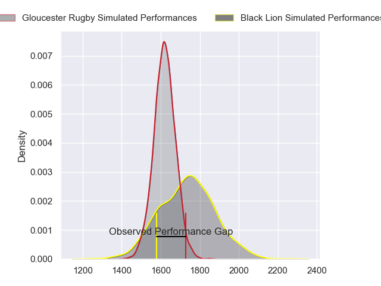
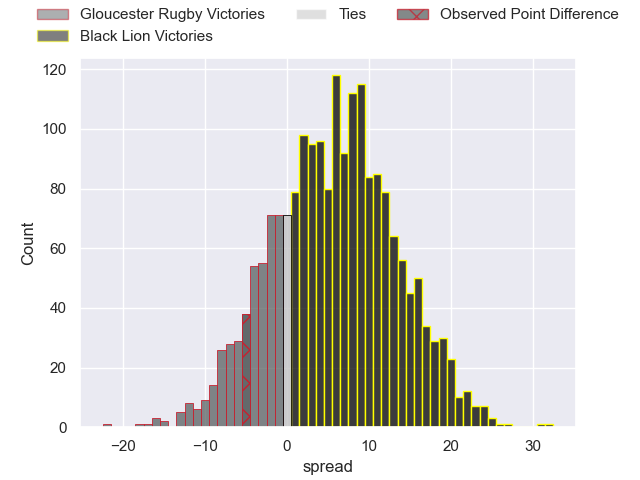
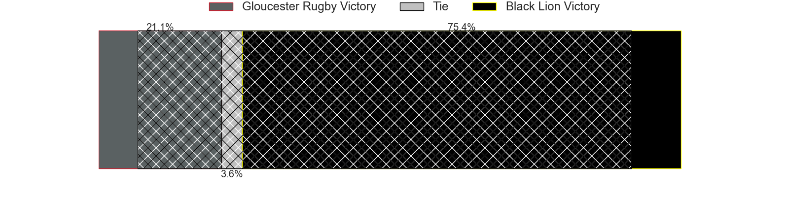
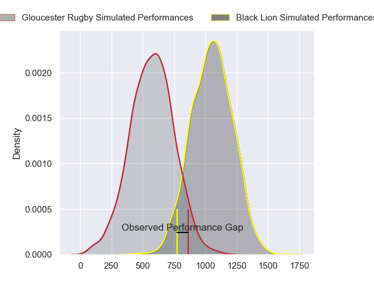
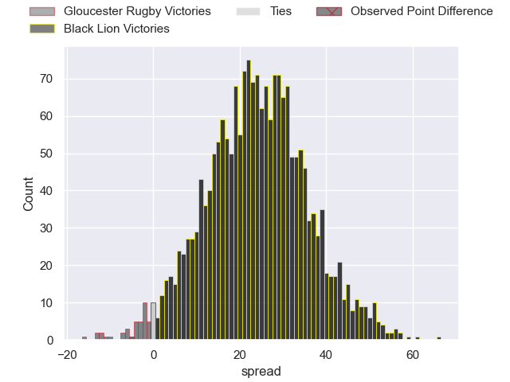
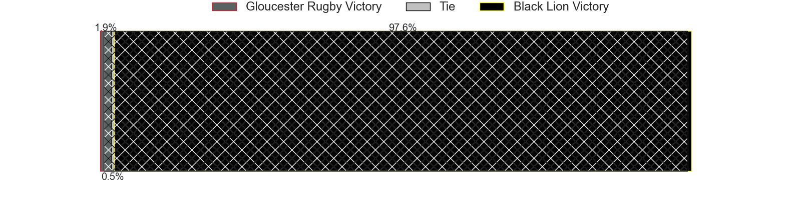
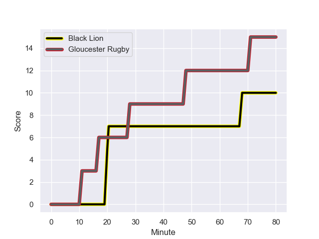
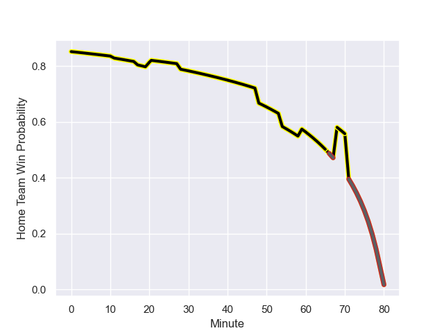

---  
layout: page  
title: Gloucester Rugby at Black Lion; 15-10  
date: 2023-12-09 18:00:00 -0500  
categories: "European Rugby Challenge Cup 2023" match review  
---
# Gloucester Rugby at Black Lion; 15-10

# Club Level Predictions

The first set of predictions treats a club as the smallest object, as the club develops its members, organizes a gameplan, and deploys its players as needed for each match. This club model has a prediction of 0.65, which translates to predicting Black Lion to win by 5.5.

Each club has a rating and a rating deviation (similar to a Glicko rating), and expected performances can be generated. This allows for simulated matches and spreads like the ones below.
## Projected Performances - Club Model

## Projected Spreads - Club Model

## Projected Results - Club Model

# Player Level Predictions - Version 2

Treating teams instead as an entity made up of the currently active players, I have ratings for each player in an altogether different system. These can be combined to form team ratings once teamsheets are announced, weighting starters a bit higher than the reserves. After the match is played, players can be weighted by their minutes on the field, allowing for an accurate measure of the team's composition. With these compiled team ratings, we can make predictions, measure inaccuracy, and update the individual player ratings.
## Prediction with Player Minutes: Black Lion by 19.6

Black Lion by 16.5 on a neutral field
## Prediction without Player Minutes: Black Lion by 20.0

Black Lion by 16.9 on a neutral pitch

## Projected Performances - Player Model

## Projected Spreads - Player Model

## Projected Results - Player Model

## Scores over Time

## Win Probability over Time

There were 12 large changes in win probability in this match

|   Away Minutes | Away Player          |   Away elo |   Number |   Home elo | Home Player             |   Home Minutes |
|---------------:|:---------------------|-----------:|---------:|-----------:|:------------------------|---------------:|
|             80 | Jamal Ford-Robinson  |      11.07 |        1 |      52.51 | Dato Abdushelishvili    |             60 |
|             62 | Sebastian Blake      |      32.8  |        2 |      46.65 | Irakli Kvatadze         |             54 |
|             80 | Kirill Gotovtsev     |      50.46 |        3 |      50.14 | Giorgi Chkhartishvili   |             54 |
|             80 | Freddie Clarke       |      24.57 |        4 |     114.29 | Nodar Cheishvili        |             68 |
|             80 | Freddie Clarke       |      24.57 |        4 |     114.29 | Nodar Cheishvili        |             68 |
|             80 | Cameron Jordan       |      59.35 |        5 |      72.58 | Mikheili Babunashvili   |             80 |
|             59 | Freddie Thomas       |      33.38 |        6 |      65.84 | Luka Ivanishvili        |             80 |
|             80 | Harry Taylor         |      43.26 |        7 |      73.4  | Sandro Mamamtavrishvili |             80 |
|             68 | Ben Donnell          |      48.51 |        8 |      21.94 | Ilia Spanderashvili     |             60 |
|             59 | Michael Young        |      63.87 |        9 |      64.92 | Tengiz Peranidze        |             70 |
|             80 | George Barton        |      39.94 |       10 |      77.76 | Luka Matkava            |             80 |
|             80 | Jonny May            |      36.5  |       11 |      93.12 | Sandro Todua            |             60 |
|             80 | Sebastien Atkinson   |      14.03 |       12 |      62.25 | Merab Sharikadze        |             80 |
|             59 | Louis Hillman-Cooper |      44.74 |       13 |      76.72 | Giorgi Kveseladze       |             54 |
|             80 | Alex Hearle          |      35.95 |       14 |      78.6  | Aka Tabutsadze          |             80 |
|             80 | Jake Morris          |       7.83 |       15 |      46.65 | Luka Tsirekidze         |             80 |
|             18 | George McGuigan      |      47.95 |       16 |      46.65 | Aliko Shamilishvili     |             20 |
|             21 | Lewis Ludlow         |      33.73 |       17 |      36.4  | Beka Mamrikishvili      |             26 |
|             12 | Freddie Clarke       |      24.57 |       18 |      46.65 | Bachuki Tchumbadze      |             26 |
|             12 | Freddie Clarke       |      24.57 |       18 |      46.65 | Bachuki Tchumbadze      |             26 |
|             21 | Charlie Chapman      |      37.91 |       19 |      46.65 | Demuri Epremidze        |             12 |
|             21 | Max Llewellyn        |      73.47 |       20 |      44.67 | Giorgi Kervalishvili    |             20 |
|            nan | nan                  |     nan    |       21 |      52.19 | Giorgi Margalitadze     |             10 |
|            nan | nan                  |     nan    |       22 |      81.06 | Mirian Modebadze        |             20 |
|            nan | nan                  |     nan    |       23 |      53.25 | Tornike Kakhoidze       |             26 |

