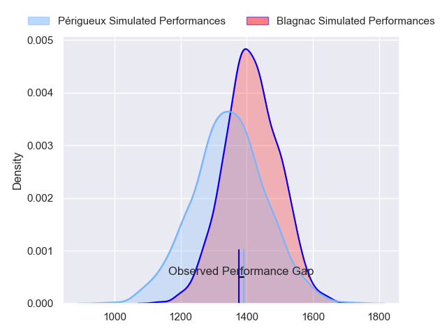
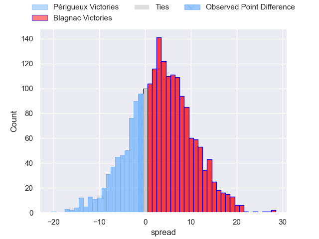
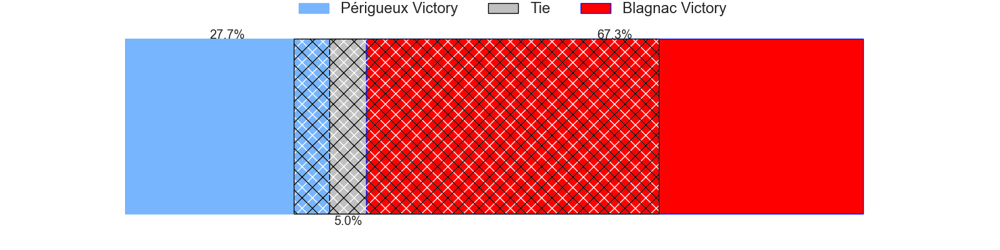
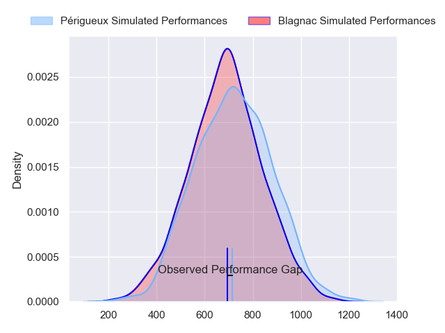
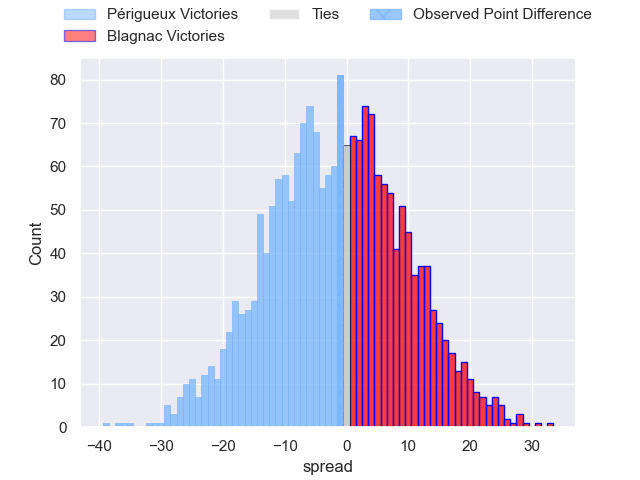
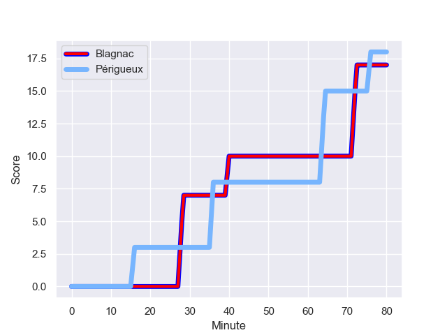
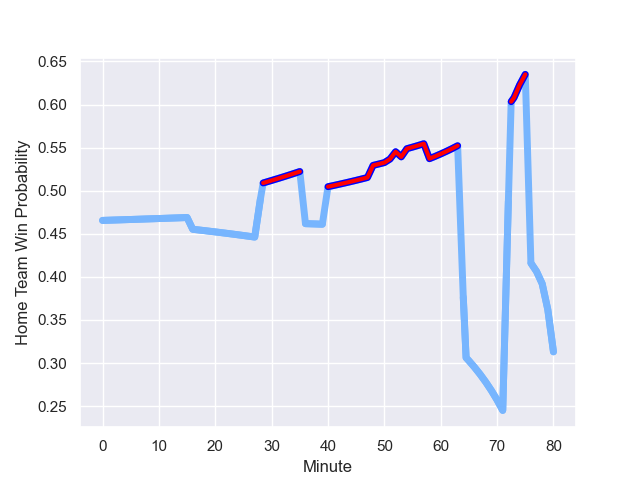

---  
layout: page  
title: Perigueux at Blagnac; 18-17  
date: 2023-12-09 18:00:00 -0500  
categories: "Nationale 2023" match review  
---
# Perigueux at Blagnac; 18-17

# Club Level Predictions

The first set of predictions treats a club as the smallest object, as the club develops its members, organizes a gameplan, and deploys its players as needed for each match. This club model has a prediction of 0.588, which translates to predicting Blagnac to win by 3.3.

Each club has a rating and a rating deviation (similar to a Glicko rating), and expected performances can be generated. This allows for simulated matches and spreads like the ones below.
## Projected Performances - Club Model

## Projected Spreads - Club Model

## Projected Results - Club Model

# Player Level Predictions - Version 2

Treating teams instead as an entity made up of the currently active players, I have ratings for each player in an altogether different system. These can be combined to form team ratings once teamsheets are announced, weighting starters a bit higher than the reserves. After the match is played, players can be weighted by their minutes on the field, allowing for an accurate measure of the team's composition. With these compiled team ratings, we can make predictions, measure inaccuracy, and update the individual player ratings.
## Prediction with Player Minutes: Périgueux by 1.5

Périgueux by 4.8 on a neutral field
## Prediction without Player Minutes: Périgueux by 1.4

Périgueux by 4.7 on a neutral pitch

## Projected Performances - Player Model

## Projected Spreads - Player Model

## Projected Results - Player Model

## Scores over Time

## Win Probability over Time

There were 10 large changes in win probability in this match

|   Away Minutes | Away Player        |   Away elo |   Number |   Home elo | Home Player         |   Home Minutes |
|---------------:|:-------------------|-----------:|---------:|-----------:|:--------------------|---------------:|
|             58 | Thomas Vidal       |      54.69 |        1 |      55.64 | Alexis Decaux       |             53 |
|             52 | Louis Martin       |      56.37 |        2 |      42.65 | Antoine Marty-Rybak |             54 |
|             58 | Kalaveti Tawake    |      37.01 |        3 |      52.7  | Baptiste Collet     |             54 |
|             54 | Richard Fourcade   |      37.02 |        4 |      68.71 | Nikita Bekov        |             58 |
|             54 | Damien Lavergne    |      48.44 |        5 |      42.71 | Vincent Mutel       |             80 |
|             80 | Hendri Storm       |      43.41 |        6 |      21.14 | Matthieu Thomas     |             80 |
|             80 | Afaesetiti Amosa   |      75.45 |        7 |      39.24 | Lucas Lecomte       |             48 |
|             74 | Karl Lambert       |      45.13 |        8 |      38.74 | Nekolo Tolofua      |             48 |
|             80 | Matteo Bordenave   |      46.65 |        9 |      36.48 | William Beaudon     |             51 |
|             80 | Yann Caillat       |      40.74 |       10 |      60.76 | Valentin Delpy      |             80 |
|             80 | Benjamin Yarde     |      36.68 |       11 |       5.08 | Francois Tardieu    |             79 |
|             74 | Fred Hickes        |      72.23 |       12 |      54.36 | Aurelien Labau      |             80 |
|             58 | Cyril Couturier    |      62.25 |       13 |      46.77 | Baptiste Serrano    |             80 |
|             80 | Paul Piveteau      |      49.13 |       14 |      36.74 | Thibault Moleana    |             80 |
|             80 | Thibault Rabourdin |      35.61 |       15 |      19.01 | Antoine Renaud      |             80 |
|             22 | Anthony Pelmard    |      48.39 |       16 |      40.68 | Romain Fricou       |             27 |
|             28 | Baptiste Arvouet   |      43.3  |       17 |      44.51 | Gabin Villerouge    |             26 |
|             22 | Jason Tindiliere   |      42.75 |       18 |      50.32 | Victor Delmas       |             26 |
|             26 | Madioke Konate     |      34.2  |       19 |       0.62 | Victor Fromenteze   |             22 |
|             26 | Jaco Willemse      |      35.52 |       20 |      44.91 | Bastien Gest        |             32 |
|              6 | Nicolas Labattut   |      53.89 |       21 |      55.35 | Simon Veyrac        |             32 |
|              6 | Joffrey Tallet     |      46.65 |       22 |      41.13 | Gérald Augustin     |             29 |
|             22 | Gaëtan Chapon      |      45.2  |       23 |      36.4  | Dorian Terrou       |              1 |

