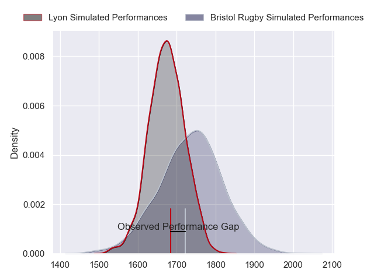
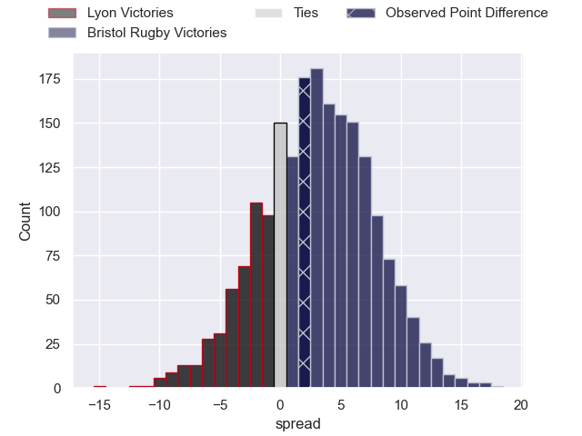
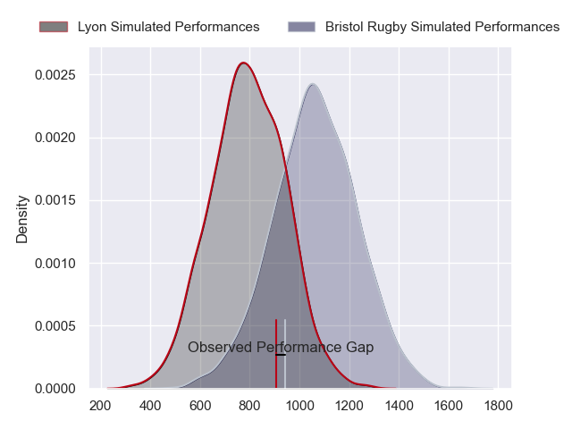
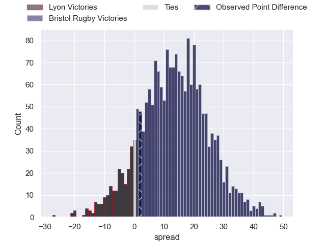
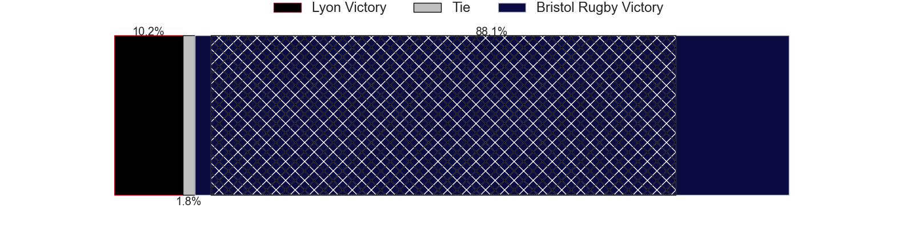
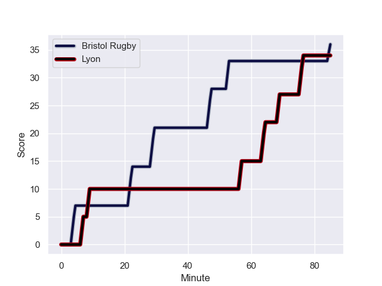
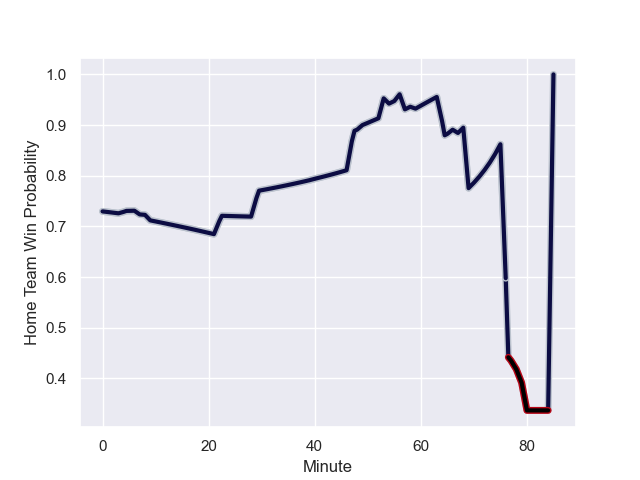

---  
layout: page  
title: Lyon at Bristol Rugby; 34-36  
date: 2023-12-09 18:00:00 -0500  
categories: "European Rugby Champions Cup 2023" match review  
---
# Lyon at Bristol Rugby; 34-36

# Club Level Predictions

The first set of predictions treats a club as the smallest object, as the club develops its members, organizes a gameplan, and deploys its players as needed for each match. This club model has a prediction of 0.583, which translates to predicting Bristol Rugby to win by 3.0.

Each club has a rating and a rating deviation (similar to a Glicko rating), and expected performances can be generated. This allows for simulated matches and spreads like the ones below.
## Projected Performances - Club Model

## Projected Spreads - Club Model

## Projected Results - Club Model

# Player Level Predictions - Version 2

Treating teams instead as an entity made up of the currently active players, I have ratings for each player in an altogether different system. These can be combined to form team ratings once teamsheets are announced, weighting starters a bit higher than the reserves. After the match is played, players can be weighted by their minutes on the field, allowing for an accurate measure of the team's composition. With these compiled team ratings, we can make predictions, measure inaccuracy, and update the individual player ratings.
## Prediction with Player Minutes: Bristol Rugby by 10.9

Bristol Rugby by 7.1 on a neutral field
## Prediction without Player Minutes: Bristol Rugby by 11.6

Bristol Rugby by 7.8 on a neutral pitch

## Projected Performances - Player Model

## Projected Spreads - Player Model

## Projected Results - Player Model

## Scores over Time

## Win Probability over Time

There were 13 large changes in win probability in this match

|   Away Minutes | Away Player                  |   Away elo |   Number |   Home elo | Home Player                 |   Home Minutes |
|---------------:|:-----------------------------|-----------:|---------:|-----------:|:----------------------------|---------------:|
|             49 | Sebastien Taofifenua         |      36.66 |        1 |      54.68 | Jake Woolmore               |             67 |
|             49 | Yanis Charcosset             |      46.37 |        2 |      63.67 | Harry Thacker               |             67 |
|             65 | Paulo Tafili                 |      35.61 |        3 |      59.75 | Kyle Sinckler               |             54 |
|             40 | Joel Kpoku                   |      45.91 |        4 |      59.49 | James Dun                   |             67 |
|             56 | Killian Geraci               |      35.18 |        5 |      52.59 | Joe Batley                  |             80 |
|             80 | Marvin Okuya                 |      46.64 |        6 |      99.41 | Steven Luatua               |             59 |
|             80 | Pierre-Samuel Pacheco        |      43.56 |        7 |      58    | Fitz Harding                |             80 |
|             80 | Mickael Guillard             |      46.76 |        8 |      41.09 | Magnus Bradbury             |             80 |
|             65 | Martin Page-Relo             |      56.23 |        9 |      70.05 | Harry Randall               |             80 |
|             59 | Fletcher Smith               |      28.94 |       10 |      69.59 | Callum Sheedy               |             80 |
|             80 | Monty Ioane                  |      96.38 |       11 |      61.85 | Richard Lane                |             59 |
|             80 | Semi Radradra                |     125.87 |       12 |      66.21 | Benhard Janse van Rensburg  |             80 |
|             80 | Alfred Parisien              |      45.65 |       13 |      93.78 | Virimi Vakatawa             |             77 |
|             59 | Ethan Dumortier              |      48.2  |       14 |      69.57 | Gabriel Ibitoye             |             80 |
|             80 | Thaakir Abrahams             |      27.84 |       15 |      47.52 | Max Malins                  |             80 |
|             36 | Jerome Rey                   |      27.32 |       16 |      74.87 | Samuel Alexander Grahamslaw |             18 |
|             36 | Liam Coltman                 |      55.5  |       17 |      44.18 | Gabriel Oghre               |             18 |
|             20 | Feao Fotuaika                |      49.85 |       18 |      42.75 | Max Lahiff                  |             31 |
|             45 | Alban Roussel                |      45.33 |       19 |      59.39 | Josh Caulfield              |             18 |
|             29 | Ugo Vignolles                |      46.67 |       20 |      51.06 | Daniel Thomas               |             26 |
|             20 | Liam Rimet                   |      44.88 |       21 |      59.24 | Kalaveti Ravouvou           |             26 |
|             26 | Kyle Godwin                  |      53.07 |       22 |      35.01 | James Williams              |              8 |
|             26 | Alexandre Tchaptchet Noutcha |      45.34 |       23 |     nan    | nan                         |            nan |

