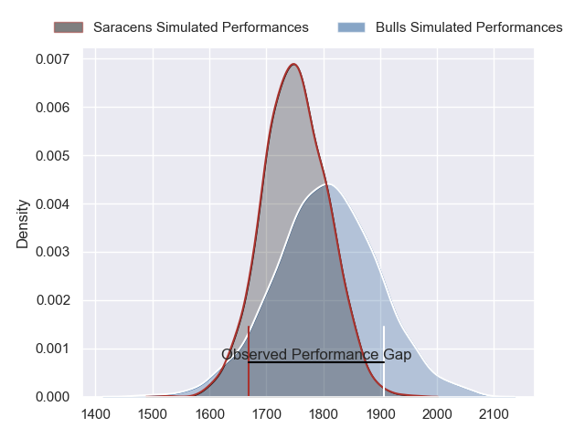
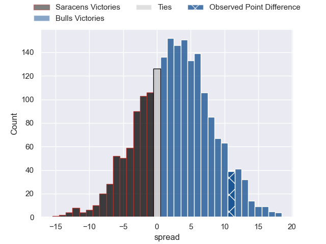
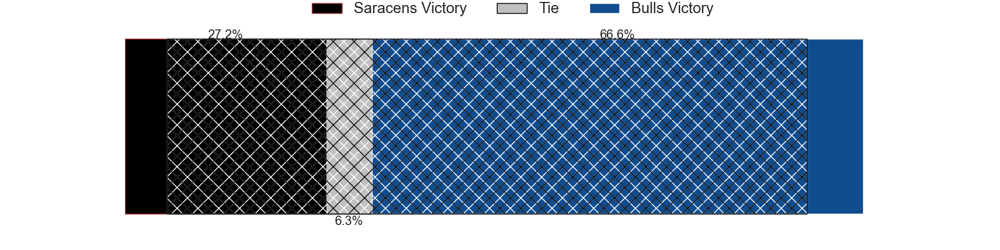
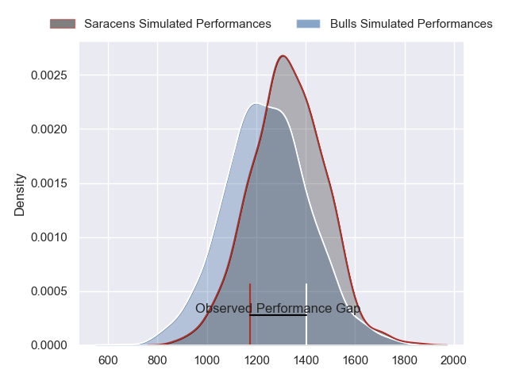
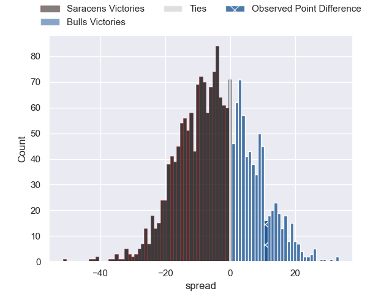
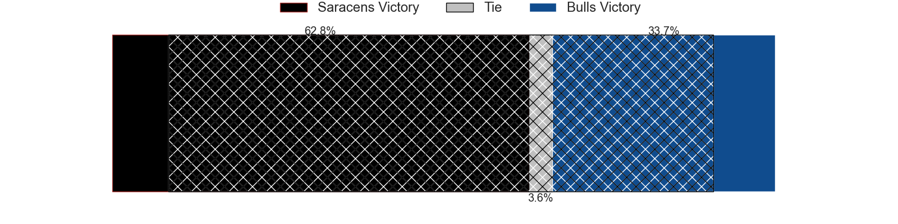
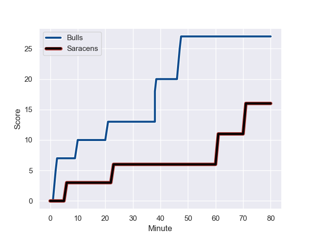
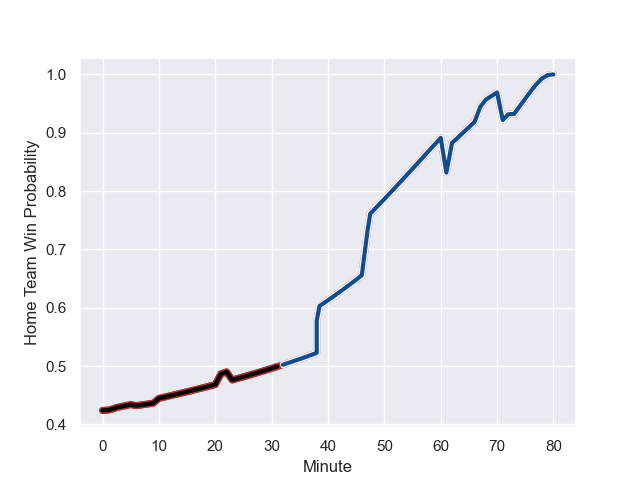

---  
layout: page  
title: Saracens at Bulls; 16-27  
date: 2023-12-09 18:00:00 -0500  
categories: "European Rugby Champions Cup 2023" match review  
---
# Saracens at Bulls; 16-27

# Club Level Predictions

The first set of predictions treats a club as the smallest object, as the club develops its members, organizes a gameplan, and deploys its players as needed for each match. This club model has a prediction of 0.574, which translates to predicting Bulls to win by 2.6.

Each club has a rating and a rating deviation (similar to a Glicko rating), and expected performances can be generated. This allows for simulated matches and spreads like the ones below.
## Projected Performances - Club Model

## Projected Spreads - Club Model

## Projected Results - Club Model

# Player Level Predictions - Version 2

Treating teams instead as an entity made up of the currently active players, I have ratings for each player in an altogether different system. These can be combined to form team ratings once teamsheets are announced, weighting starters a bit higher than the reserves. After the match is played, players can be weighted by their minutes on the field, allowing for an accurate measure of the team's composition. With these compiled team ratings, we can make predictions, measure inaccuracy, and update the individual player ratings.
## Prediction with Player Minutes: Saracens by 3.4

Saracens by 7.2 on a neutral field
## Prediction without Player Minutes: Saracens by 2.6

Saracens by 6.4 on a neutral pitch

## Projected Performances - Player Model

## Projected Spreads - Player Model

## Projected Results - Player Model

## Scores over Time

## Win Probability over Time

There were 8 large changes in win probability in this match

|   Away Minutes | Away Player          |   Away elo |   Number |   Home elo | Home Player             |   Home Minutes |
|---------------:|:---------------------|-----------:|---------:|-----------:|:------------------------|---------------:|
|             62 | Mako Vunipola        |     122.75 |        1 |      64.53 | Gerhard Steenekamp      |             67 |
|             62 | Jamie George         |     115.1  |        2 |     101.31 | Akker van der Merwe     |             68 |
|             62 | Alec Clarey          |      43.78 |        3 |     108.8  | Wilco Louw              |             73 |
|             80 | Maro Itoje           |     113.34 |        4 |      61.34 | Janko Swanepoel         |             80 |
|             48 | Hugh Tizard          |      48.29 |        5 |      38.38 | Reinhardt Ludwig        |             80 |
|             80 | Juan Martin Gonzalez |      93.08 |        6 |      73.76 | Marco van Staden        |             56 |
|             68 | Andy Christie        |      50.92 |        7 |      68.33 | Elrigh Louw             |             80 |
|             80 | Billy Vunipola       |     130.66 |        8 |      50.65 | Cameron Hanekom         |             80 |
|             53 | Ivan van Zyl         |      72.57 |        9 |      79.83 | Embrose Papier          |             67 |
|             80 | Owen Farrell         |     138.75 |       10 |      54.16 | Johan Goosen            |             80 |
|             80 | Sean Maitland        |      95.61 |       11 |     122.75 | Canan Moodie            |             80 |
|             73 | Nick Tompkins        |     115.07 |       12 |      67.85 | David Kriel             |             80 |
|             80 | Elliot Daly          |      80.34 |       13 |      59.59 | Stedman-Gee Rivett Gans |             80 |
|             48 | Alex Lewington       |      55.72 |       14 |     104.11 | Kurt-Lee Arendse        |             80 |
|             80 | Alex Goode           |      87.79 |       15 |     109.21 | Willie le Roux          |             80 |
|             18 | Tom West             |      47.94 |       16 |      58.73 | Simphiwe Matanzima      |             13 |
|             18 | Theo Dan             |      51.54 |       17 |      27.44 | Jan Hendrik Wessels     |             12 |
|             18 | Christian Judge      |      63.84 |       18 |      53.44 | Mornay Smith            |              7 |
|             32 | Theo McFarland       |      47.92 |       19 |      86.89 | Marcell Coetzee         |             24 |
|             12 | Toby Knight          |      32.62 |       20 |      73.52 | Zak Burger              |             13 |
|             27 | Aled Davies          |      61.33 |       21 |     nan    | nan                     |            nan |
|              7 | Olly Hartley         |      32.57 |       22 |     nan    | nan                     |            nan |
|             32 | Lucio Cinti          |      59.7  |       23 |     nan    | nan                     |            nan |

